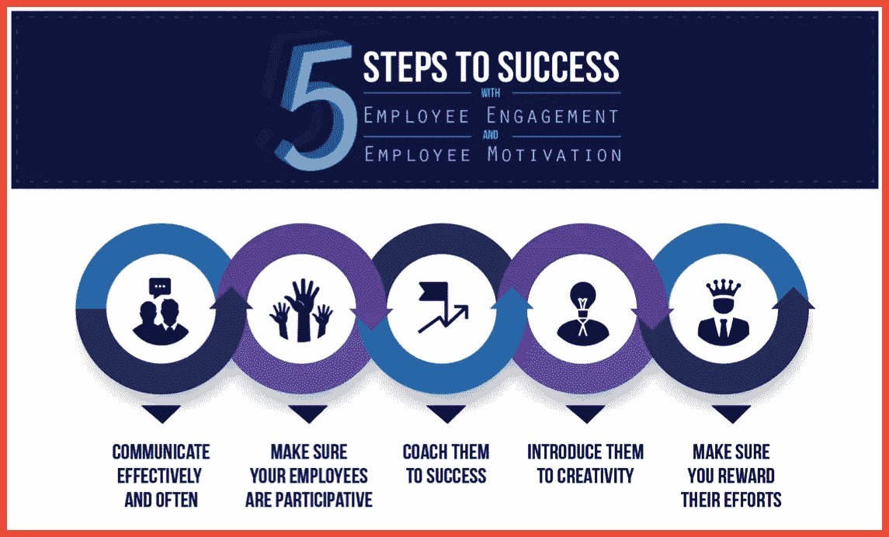

# 如何利用人工智能建立更强大的商业网络

> 原文：<https://medium.com/hackernoon/how-to-use-artificial-intelligence-to-build-a-stronger-business-network-59f55d7da8be>

## 强大的商业网络对企业家的成功至关重要。

[Image source](https://unsplash.com/photos/t1PaIbMTJIM)

虽然有些人可能会认为社交媒体和其他技术使我们的社会在个人层面上的联系比过去少了，但研究[实际上发现](https://www.sciencedaily.com/releases/2018/03/180301103658.htm)社交媒体不会降低人们与同龄人面对面互动的可能性。

对许多人来说——包括我自己——社交媒体是现实生活中人际关系的有益补充。在许多方面，人工智能和商业网络之间的关系也是如此。与过去相比，科技让人们可以在人际关系中做更多的事情。

[人工智能](https://hackernoon.com/tagged/artificial-intelligence)能做的远不止[所写的](https://hackernoon.com/how-ai-changes-media-landscape-and-news-delivery-adb024a519e3#59b8973f458d)，这些应用程序可以通过分析行为进行更深入的研究，因此雇主可以更好地激励他们的团队。

[Image source](https://www.questionpro.com/blog/difference-employee-engagement-employee-motivation/)

她解释说，“例如，人工智能可以分析包括电子邮件通信和生物数据在内的数据，并预测具体的行动，以提高团队成员的归属感或与活动的联系。例如，情绪分析也可以用来预测员工何时对工作感到厌倦；然后，人工智能可以提供基于数据的行动建议，以提高员工的敬业度。”

# **用人工智能打造更好的网络**

建立一个强大的商业网络是你永远无法用技术完全自动化的事情。毕竟，那些与你的客户和[员工](https://hackernoon.com/how-to-build-out-your-growth-team-for-sustained-success-2f13a2f2e7c5?source=user_profile---------6---------------------)的个人互动是牢固关系的基础。

然而，使用正确的人工智能工具，你可以简化这些交互，并减少一些与建立和维护业务网络相关的负担。我今天提到的几点只是人工智能如何改变你与客户、商业伙伴和员工联系方式的一小部分例子。

通过自动化平凡的网络相关任务，你将有更多的时间进行一对一的互动，留下深刻持久的印象。