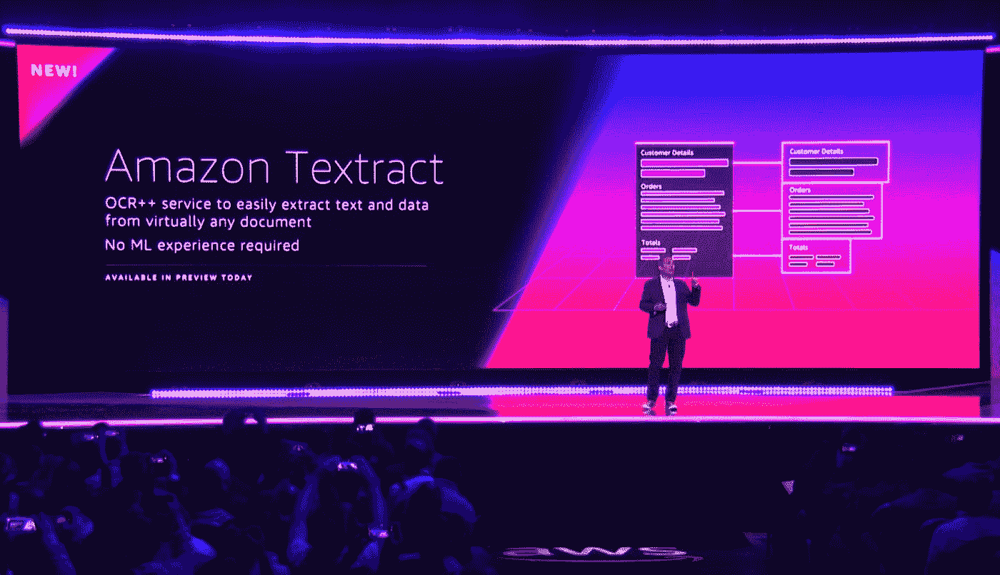

# 如何与 S3 一起使用 AWS Textract

> 原文：<https://medium.com/hackernoon/how-to-use-aws-textract-to-extract-text-from-scanned-documents-in-s3-buckets-5f85e8ba0a37>

## [【阅读 HackerNoon.com 没有付费墙的故事】](https://hackernoon.com/how-to-use-aws-textract-to-extract-text-from-scanned-documents-in-s3-buckets-5f85e8ba0a37)

AWS recently released [Textract](https://aws.amazon.com/textract/) for general use on [May 29, 2019](https://docs.aws.amazon.com/textract/latest/dg/document-history.html).

## 使用 Python SDK Boto3 的亚马逊新 OCR 服务的快速入门指南。

本文演示了如何使用 AWS Textract 从 S3 桶中的扫描文档中提取文本。