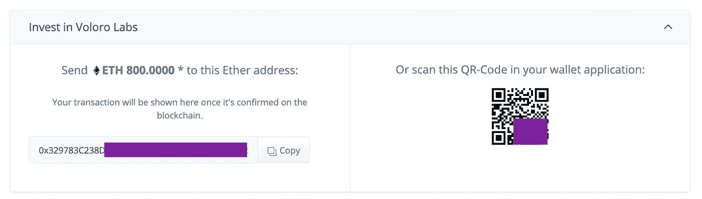
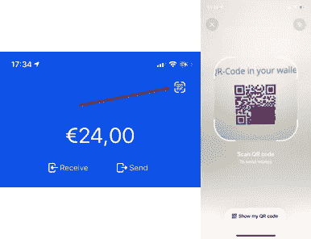
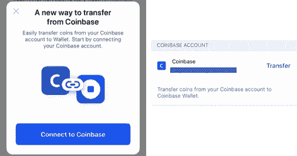
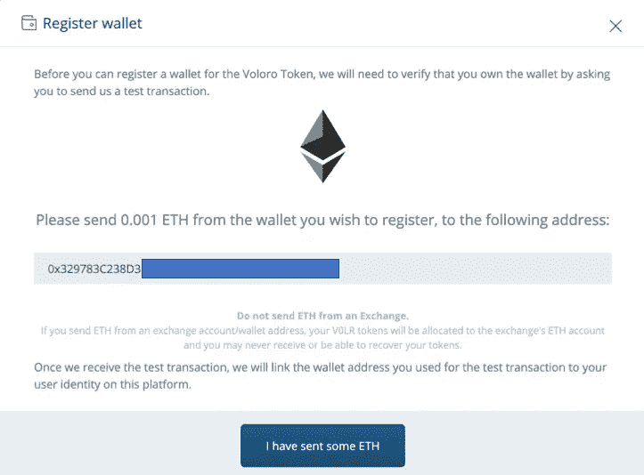
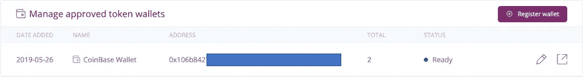
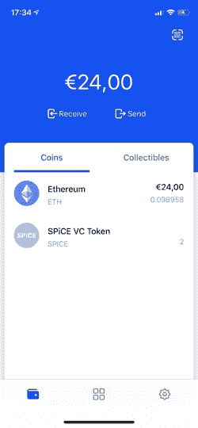

# 如何使用比特币基地钱包证券化数字证券

> 原文：<https://medium.com/hackernoon/how-to-use-coinbase-wallet-for-securitizes-digital-securities-e3591c2324f7>

## 比特币基地钱包应用程序为投资数字证券产品和持有购买的证券作为代币提供了良好的体验

[证券化平台](https://securitize.io)为投资者提供了一种简单便捷的方式来访问数字证券产品，并跟踪其投资的整个生命周期。投资者可以上船并提供他们的信息，决定他们想要投资多少和使用哪种货币，并注册他们的钱包以接收反映他们数字证券投资的令牌。

一些更传统的投资者，不太熟悉加密投资及其工具，可能会对该过程的某些方面感到困惑，比如如何设置一个钱包来存放他们的代币。

有很多选项可供选择:自我管理的软件钱包(如 [MyEtherWallet](https://www.myetherwallet.com/) )，硬件钱包(如 [Ledger](https://www.ledger.com/) 设备)，或托管提供商。例如，在最后一个类别中， [BitGo](https://www.bitgo.com/) 已经支持[区块链资本](https://blockchain.capital/)令牌 [BCAP](https://etherscan.io/token/0x1f41e42d0a9e3c0dd3ba15b527342783b43200a9) ，一个通过 Securitize 的平台发行的 [DS 令牌](/securitize/introducing-ds-digital-securities-protocol-securitizes-digital-ownership-architecture-for-4bcb6a9c4a16):

 [## BitGo 为区块链资本的安全令牌 BCAP 启动托管

### 区块链安全公司和钱包服务 BitGo 宣布支持区块链资本的 ERC-20 令牌…

cointelegraph.com](https://cointelegraph.com/news/bitgo-launches-custody-for-blockchain-capitals-security-token-bcap) 

比特币基地托管组织上周宣布他们现在也支持它:

但对于许多投资者来说，他们正在寻找一种解决方案，用他们已经拥有的东西(他们的手机)来持有他们的代币，而不必处理复杂的地址和私钥，[比特币基地钱包](https://wallet.coinbase.com)提供了免费的、用户控制的加密货币钱包应用程序，可以满足他们的需求。

比特币基地钱包提供了一种将智能手机变成钱包的便捷方式，利用了设备中的安全元素(如 iPhone 的 Secure Enclave 和 FaceID 等生物识别安全)以及 iCloud backup(独立于比特币基地存储)等恢复机制，这可能会为许多用户提供安全性和易用性之间的正确平衡。与 Coinbase.com 不同，比特币基地看不到也不持有存储在比特币基地钱包应用中的令牌的私钥。(注: [*比特币基地创投是证券化*](https://techcrunch.com/2018/11/26/securitize-raises-12-75-million-digital-security-offering/) 的投资者)。

# 用比特币基地钱包投资数字证券

证券化平台允许希望接受 BTC 或 ETH 等加密货币作为投资手段的发行者向投资者提供这种选择。

作为该过程的一部分，将向投资者显示一条消息以方便他们汇款，如下所示(出于安全考虑，地址已被更改):

Invest with crypto in a Securitize opportunity

Scanning QR-codes with Coinbase Wallet

使用比特币基地钱包应用程序发送这些资金非常简单。你只需要使用应用程序中直接提供的二维码扫描仪，就可以扫描地址并直接向其汇款。

一旦代码被扫描，应用程序允许你确认多少以太网(或 BTC)你想要发送。此外，如果您在比特币基地钱包中没有足够的资金，由于与比特币基地的集成，您可以轻松地从那里转移资金。

Coinbase Wallet allows to easily get funds from your existing Coinbase account

# 在你的比特币基地钱包里持有数字证券

比特币基地钱包应用程序还允许你直接在手机中持有你的数字证券。

要让钱包能够保存数字证券，你首先需要通过证券化平台中的投资者仪表板进行注册。这非常重要，因为由于数字证券是受监管的工具，它们需要放在与投资者身份相关联的钱包中，投资者需要证明他们控制着钱包。

当使用“注册钱包”选项时，您可以通过向投资者仪表板提供的地址发送少量 ETH 来完成此操作:

Securitize requires sending a small amount of ETH to demonstrate ownership of your wallet

从比特币基地钱包 app 发送 0.001 ETH 非常简单！一旦你这样做了，过一会儿(证券化平台跟踪以太坊区块链的交易所需的时间)你的比特币基地钱包将被注册并准备接收数字证券:

一旦你的钱包显示“就绪”状态，你就可以直接向你的比特币基地钱包应用程序发放代币，或者从其他钱包接收代币。

例如，这是比特币基地钱包应用程序如何显示它已收到 2 个 [SPICE 令牌](https://etherscan.io/token/0x0324dd195d0cd53f9f07bee6a48ee7a20bad738f)，代表来自 [SPiCE VC](https://spicevc.com) 的数字证券:

Coinbase Wallet holding to SPICE tokens (and some ETH)

遵循这个简单的过程，你的比特币基地钱包将能够保存 Securitize 使用其[数字证券协议](/securitize/introducing-ds-digital-securities-protocol-securitizes-digital-ownership-architecture-for-4bcb6a9c4a16)帮助发行的不同数字证券。

我们确信，您持有和管理您的数字证券的新的、更灵活的方式将不断出现，因此，请关注此空间以了解更多信息并保持最新状态。

[*证券化*](http://www.securitize.io) *为创建合规的数字证券提供可信的全球解决方案。证券化法规遵从性平台和协议为发行和管理数字证券(安全令牌)提供了一个成熟的全栈解决方案。Securitize 创新的 DS 协议拥有业内最高的采用率，能够同时在多个市场进行无缝、完全合规的交易。多种证券化驱动的数字证券已经在全球公开市场交易，还有更多正在筹备中。*

*您可以在我们的网站上了解更多关于证券化的信息:*[*www . Securitize . io*](http://www.securitize.io)

*您可以在我们的* [*电报频道*](https://t.me/securitize) *加入关于数字证券革命的对话。*