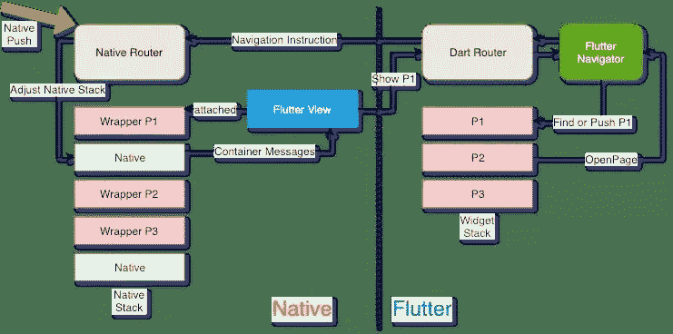
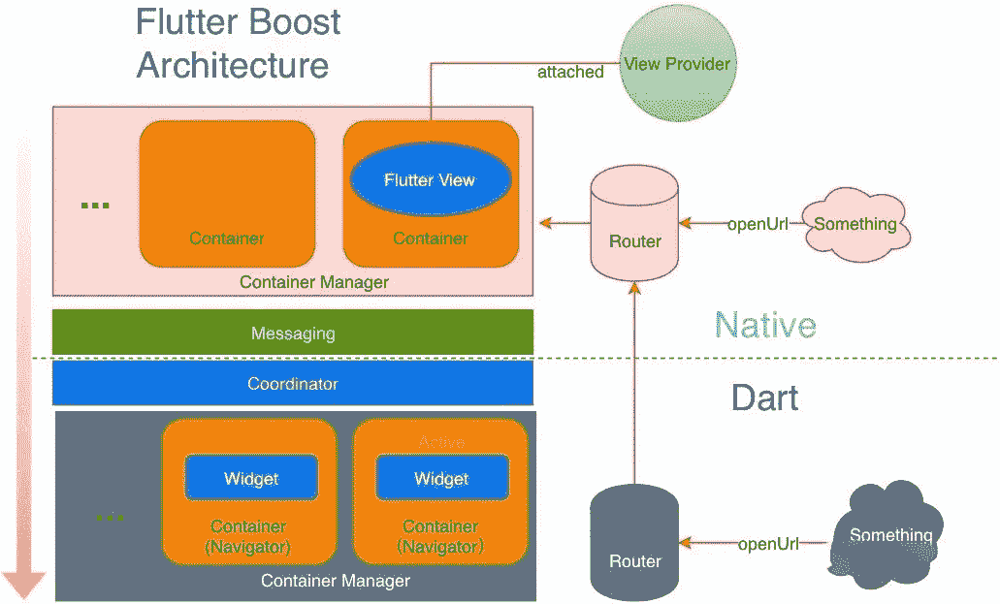

# 如何使用 Flutter 进行混合开发:阿里巴巴的开源代码实例

> 原文：<https://medium.com/hackernoon/how-to-use-flutter-for-hybrid-development-alibabas-open-source-code-instance-302bf2273485>

## 阿里巴巴的先宇如何通过使用 Flutter Boost 的增量迁移将 Flutter 混合集成到现有的原生应用中

*本文是阿里巴巴* [***利用旋舞***](/@alitech_2017/utilizing-flutter-best-practice-from-alibaba-236a53aa32c8) *系列的一部分。*

一定规模的 app 通常都有一套成熟的、通用的基础库，尤其是阿里巴巴体系内的 app，一般都依赖于体系内的很多基础库。使用 Flutter 从零开始重新开发一个 app 的成本和风险都很高。因此，原生应用中的增量迁移是 Flutter 技术应用于现有原生应用的一种健壮方式。

The tech team from Xianyu (闲鱼), Alibaba’s second-hand trading platform, has developed a unique hybrid technology solution in this practice.

# 现状与思考

仙宇目前采用的混动方案是共用同一个发动机。这个解决方案是基于在任何时候最多只能看到一个页面的事实。在一些特定的场景中可以看到几个 ViewControllers，但是这里不讨论这些场景。

我们可以这样简单地理解这个解决方案:我们把共享的 Flutter 视图看作一个画布，然后用一个原生容器作为逻辑页面。我们每次打开一个容器，就用通讯机制通知 Flutter 视图渲染当前逻辑页面，然后把 Flutter 视图放到当前容器中。

这种解决方案不能同时支持多个水平逻辑页面，因为页面切换时必须从栈顶执行操作，不能在保持状态的同时执行水平切换。例如，对于两个页面 A 和 B，B 当前位于堆栈的顶部。要切换到 A，需要从栈顶弹出 B。这时候 B 的地位就丧失了。如果要切换回 B，只能重新打开 B，页面状态无法维持。

并且，在 pop 过程中，官方的 Flutter 对话框可能会被误杀。此外，基于堆栈的操作依赖于对 Flutter 框架的属性修改，这使得该解决方案具有侵入性。

# FlutterBoost:新一代混合动力技术解决方案

颤振推进项目已经在 GitHub 中开源。通过此链接查看:[https://github.com/alibaba/flutter_boost](https://github.com/alibaba/flutter_boost)

# 重构计划

在仙域推广 Flutter 的时候，更复杂的页面场景已经逐渐暴露了旧解决方案的局限性和问题。因此，我们推出了一个新的混合技术解决方案，代号为 FlutterBoost(向 C++ Boost 库致敬)。新混合解决方案的主要目标如下:

*   可重用通用混合解决方案
*   支持更复杂的混合模式，比如支持主页标签
*   非侵入性解决方案:不再依赖修改颤振的解决方案
*   支持通用页面生命周期
*   统一清晰的设计理念

与旧方案类似，新方案依然采用共享引擎模式。主要思想是原生容器用消息驱动 Flutter 页面容器，从而实现原生容器和 Flutter 容器的同步。我们希望 Flutter 呈现的内容是由 Naitve 容器驱动的。

简单来说，我们想把 Flutter 容器做成浏览器。我们输入一个页面地址，然后容器管理页面呈现。在原生端，我们只需要考虑如何初始化容器，然后设置容器对应的页面标志。

# 主要概念

# 原生层

*   容器:本机容器、平台控制器、活动和视图控制器
*   集装箱经理:集装箱的经理
*   适配器:Flutter 是适配层
*   消息传递:基于通道的消息通信

# 省道层

*   容器:Flutter 用来存放小部件的容器，具体实现为 Navigator 的派生类。
*   容器管理器:管理 Flutter 容器并提供 API，比如 Show 和 Remove。
*   协调器:接收消息传递消息并负责调用容器管理器的状态管理的协调器。
*   消息传递:基于通道的消息通信

# 对页面的理解

Native 和 Flutter 表达的页面的对象和概念是不一致的。在 Native 中，页面通常表示为 ViewController 和 Activity。然而，在 Flutter 中，页面被表示为一个小部件。我们希望统一页面的概念，或者弱化和抽象掉与 Flutter 中的小部件相对应的页面的概念。换句话说，当本地页面容器存在时，FlutterBoost 确保将小部件用作容器内容。因此，当我们理解和执行路由操作时，应该以原生容器为准。Flutter 小部件取决于本地页面容器的状态。

然后，当谈到 FlutterBoost 中的页面时，我们指的是原生容器及其附属的小部件。所有的页面路由操作，以及打开或关闭页面，实际上都是对原生页面容器的直接操作。无论路由请求来自哪里，最终都会转发给 Native 来实现路由操作。这也是 FlutterBoost 接入时需要实现平台协议的原因。

另一方面，我们无法控制服务代码通过 Flutter 本身的导航器推送新的小部件。如果服务直接使用 Navigator 操作小部件而不使用 FlutterBoost，包括非全屏小部件，比如 Dialog，我们建议服务自己管理其状态。这种类型的小部件不属于 FlutterBoost 定义的页面。

理解这里的页面概念对于理解和使用 FlutterBoost 至关重要。

# 与旧解决方案的主要区别

我们前面提到过，旧的解决方案在 Dart 层为小部件切换维护一个单一的导航器堆栈结构。新的解决方案在 Dart 端引入了容器概念。不是使用栈结构来维护现有页面，而是以平面键-值映射的形式维护所有当前页面，并且每个页面都有一个唯一的 ID。这种结构自然支持页面的搜索和切换，不再受制于栈顶操作。所以可以解决一些之前 pop 带来的问题。此外，页面堆栈操作不需要通过修改 Flutter 源代码来执行，消除了实现的侵入性。

其实我们介绍的容器就是导航器，也就是一个原生容器对应一个导航器。这是如何工作的？

# 多导航器的实现

Flutter 提供了在底层定制导航器的接口，我们实现了一个管理多个导航器的对象。目前，最多只有一个可见的颤振导航仪可用。此导航器中包含的页面是对应于当前可见容器的页面。

原生容器和 Flutter 容器(导航器)一一对应，它们的生命周期也是同步的。当一个本地容器被创建时，一个 Flutter 容器也被创建，并且它们通过相同的 ID 链接。当本机容器被销毁时，Flutter 容器也被销毁。Flutter 容器的状态依赖于原生容器，也就是我们所说的原生驱动。管理器集中管理和切换当前显示在屏幕上的容器。

让我们用一个简单的例子来描述创建新页面的过程:

1.  创建一个原生容器(iOS ViewController、Android Activity 或 Fragment)。
2.  本地容器通过消息机制通知 Flutter 协调器新的容器被创建。
3.  然后通知 Flutter 容器管理器创建相应的 Flutter 容器，并在其中加载相应的小部件页面。
4.  当本地容器显示在屏幕上时，容器向 Flutter Coordinator 发送一条消息，通知要显示的页面的 ID。
5.  Flutter 容器管理器找到相应 ID 的 Flutter 容器，并将其设置为前台可见容器。

这是创建新页面的主要逻辑。销毁和进入后台等操作也是由原生容器事件驱动的。

# 官方提出的混合解决方案

# 它是如何工作的

颤振技术链主要由 C++实现的颤振引擎和 Dart 实现的框架组成(这里不讨论编译和构造工具)。Flutter 引擎负责线程管理、Dart VM 状态管理和 Dart 代码加载。Dart 代码实现的框架是服务暴露的主要 API。概念，比如小部件，是 Dart 级别的框架内容。

一个进程中最多只能初始化一个 Dart 虚拟机。然而，一个流程可以有多个 Flutter 引擎，并且多个引擎实例共享同一个 Dart VM。

我们来看看具体的实现。每次在 iOS 上初始化 FlutterViewController 时，都会初始化一个引擎，这意味着会有一个新的线程(理论上线程可以重用)运行 Dart 代码。对于像 Android 这样的活动也可以达到类似的效果。如果启动了多个引擎实例，请注意，Dart 虚拟机仍然是共享的，但是由不同引擎实例加载的代码在其独立的隔离区中运行。

# 官方建议

## 深度引擎共享

在混合解决方案方面，我们已经与谷歌进行了讨论，并提出了一些可能的解决方案。官方对 Flutter 的建议是，从长远来看，应该支持在同一个引擎中支持多窗口渲染的能力。至少在逻辑上，FlutterViewController 共享同一个引擎的资源。换句话说，我们希望所有的渲染窗口共享同一个主隔离。

然而，官方的长期建议目前没有得到很好的支持。

## 多引擎模式

混合解决方案中要解决的主要问题是如何处理交替的 Flutter 和 Native 页面。Google 工程师提供了一个 Keep It Simple 的解决方案:对于连续的 FlutterViewController(小部件)，只需要打开当前的 FlutterViewController。对于备用颤振页面，初始化一个新的发动机。

例如，让我们执行以下导航操作:

颤动第 1 页->颤动第 2 页->原生第 1 页->颤动第 3 页

我们只需要在颤振页面 1 和颤振页面 3 中创建不同的颤振实例。

这种解决方案的优点是容易理解，逻辑上合理，但也存在潜在的问题。如果一个原生页面和一个颤振页面一直交替，颤振引擎的数量是线性增加的，颤振引擎本身就是一个重物。

## 多引擎模式的问题

*   冗余资源:在多引擎模式下，每个引擎之间的隔离是相互独立的。从逻辑上讲，这不会造成任何伤害，但是引擎的底层实际上维护了图像缓存和其他消耗内存的对象。想象一下，每个引擎都维护自己的图像缓存，这可能非常占用内存。
*   插件注册:插件依靠 Messenger 传递消息，而 Messenger 目前是由 FlutterViewController (Activity)实现的。如果你有多个 FlutterViewControllers，那么插件的注册和通信就会变得混乱和难以维护，消息传输的来源和目标也会变得不可控。
*   Flutter Widget 和 Native 的页面区别:Flutter 页面是 Widget，Native 页面是 VC。从逻辑上讲，我们希望消除抖动页面和本机页面之间的差异。否则，当我们执行页面跟踪和其他统一操作时，就会出现不必要的复杂性。
*   页面间通信的复杂性增加:如果所有的 Dart 代码运行在同一个引擎实例中，并且它们共享一个隔离区，那么就可以使用一个统一的编程框架来进行小部件间的通信。并且，多引擎实例也使得这种情况更加复杂。

因此，综合考虑，我们没有采用多发动机混合动力方案。

# 摘要

目前，FlutterBoost 已经在生产环境中支持仙游客户端上所有基于 Flutter 的开发服务，为更复杂的混合场景提供支持，稳定为数亿用户提供服务。

从项目一开始，我们就希望 FlutterBoost 能够解决 Native App 混合模式访问 Flutter 的一般性问题。所以我们把它做成一个可复用的 Flutter 插件，希望能吸引更多感兴趣的人参与到 Flutter 社区的建设中来。在这有限的篇幅里，我们分享了先宇在颤振混合技术解决方案上积累的经验和代码。欢迎有兴趣的人积极与我们交流。

# 扩展和补充

## 表演

在两个 Flutter 页面之间切换时，我们只有一个 Flutter 视图，所以需要保存上一个页面的截图。如果颤振页面包含多张截图，会占用大量内存。这里，我们采用文件内存 L2 缓存策略，其中最多只保存 2–3 个截图，其余的写入文件按需加载。这样就可以在保证用户体验的同时，在内存上保持一个稳定的水平。

在页面渲染性能方面，AOT 的优势是显而易见的。在快速页面切换时，Flutter 可以灵敏地切换对应的页面，逻辑上营造出多页飘动感。

## 支持 1.0 版

项目之初，我们基于仙宇目前使用的 Flutter 版本进行开发，然后进行了 1.0 版本的兼容性升级测试。目前为止没有发现问题。

## 接近

任何集成了 Flutter 的项目都可以很容易地以官方依赖的方式引入 FlutterBoost 作为插件，项目只需要少量的代码访问就可以完成访问。有关详细的访问文档，请参见 GitHub 主页上的官方项目文档。

颤振推进项目已经在 GitHub 中开源。通过此链接查看:[https://github.com/alibaba/flutter_boost](https://github.com/alibaba/flutter_boost)

**(Original article by Chen Jidong 陈纪栋)**

# 阿里巴巴科技

关于阿里巴巴最新技术的第一手深入资料→脸书: [**【阿里巴巴科技】**](http://www.facebook.com/AlibabaTechnology) 。Twitter:[**“AlibabaTech”**](https://twitter.com/AliTech2017)。