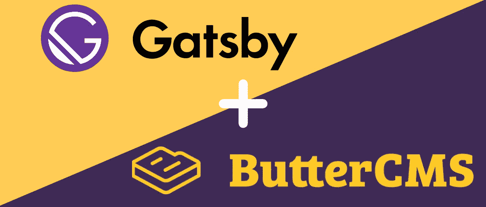

# 如何在无头 CMS 上使用盖茨比

> 原文：<https://medium.com/hackernoon/how-to-use-gatsby-with-a-headless-cms-ba365bb77733>



学习如何使用 [ButterCMS](https://buttercms.com/) 建立一个盖茨比的博客。无论您是初学者还是专家，本文中的代码示例都可以让您在几分钟内将 Gatsby 和 ButterCMS 结合起来。

# 为什么是盖茨比和巴特姆斯？

[Gatsby](https://www.gatsbyjs.org/) 是一个基于 React 和 GraphQL 的静态站点生成器。ButterCMS 是一个无头 CMS 和博客平台。这意味着什么，为什么你应该使用它们？

静态站点(HTML、CSS 和 JavaScript)快速、安全且灵活。没有攻击者可以利用的数据库或服务器端代码。静态站点生成器从 API、数据库或文件中提取数据，并使用模板生成页面。

作为一名开发人员，您可能希望将您的内容写成 Markdown 文件。然而，如果你的静态网站的内容必须由非开发人员管理，他们会更喜欢 CMS。无头 CMS 提供了一个只读 API，可以被静态站点生成器读取。

Gatsby 结合了 React、[、GraphQL](https://graphql.org/) 、webpack 等前端技术，提供了非常棒的开发者体验。如果你已经熟悉了[反应](https://reactjs.org/)和 JSX，这是一个很好的选择。ButterCMS 允许您将 CMS 添加到 Gatsby 站点，而不必担心托管、安全性或性能。您可以专注于实现您的前端。

既然知道了盖茨比和 ButterCMS 的好处，那就开始吧！

# 设置

首先，创建一个 [ButterCMS 账户](https://buttercms.com/)。您将获得一个 API 令牌和一个示例博客帖子。在本教程中，您需要这两者。

接下来，安装 Gatsby CLI。

```
npm install --global gatsby-cli
```

然后，您可以从正式的起始模板创建一个新站点。如果您导航到该目录并运行`gatsby develop`，Gatsby 将在`[http://localhost:8000/](http://localhost:8000/.)` [启动一个热重装服务器。](http://localhost:8000/.)

这样，当 Gatsby 注入您在运行时编辑的文件的新版本时，您不必刷新页面。

```
gatsby new gatsby-site https://github.com/gatsbyjs/gatsby-starter-default
cd gatsby-site
gatsby develop
```

# 邮件

当使用 Gatsby 构建时，您通过查询语言 [GraphQL](https://graphql.org/) 访问您的数据。有许多官方和社区插件从远程或本地位置获取数据，并通过 GraphQL 提供。这些插件被称为“源插件”,已经有一个 ButterCMS 的 [Gatsby 源插件可以安装。](https://www.gatsbyjs.org/packages/gatsby-source-buttercms/?=buttercms)

```
npm install --save gatsby-source-buttercms
```

将插件添加到您的`gatsby-config.js`中，复制并粘贴您的 ButterCMS API 令牌。

```
module.exports = {
  plugins: [
    {
      resolve: 'gatsby-source-buttercms',
      options: {
        authToken: 'your_api_token'
      }
    }
  ]
}
```

更改之后，在测试插件提供的 GraphQL 字段和类型之前，您可能需要重新启动热重装服务器(`gatsby develop`)。

在`http://localhost:8000/___graphql`访问 GraphiQL，这是一个用于探索 GraphiQL 的浏览器内集成开发环境，并探索`butterPost`和`allButterPost`字段。

```
{
  allButterPost {
    edges {
      node {
        title
        body
      }
    }
  }
}
```

该插件将 [Butter CMS API 参考](https://buttercms.com/docs/api/#blog-engine)中记录的所有 JSON 字段映射到 GraphQL 字段。

## 添加您的博客文章列表

您的 ButterCMS 数据现在可以在任何 Gatsby 页面或模板中查询。你可以从创建一个`src/pages/blog.js`开始，并添加你的博客文章列表。

```
import React from 'react'
import { graphql, Link } from 'gatsby'
import Layout from '../components/layout'

const BlogPage = ({ data }) => {
  const posts = data.allButterPost.edges
    .map(({ node }) => {
      return <Link key={node.id} to={`/${node.slug}`}>{node.title}</Link>
    })

  return <Layout>{posts}</Layout>
}

export default BlogPage

export const pageQuery = graphql`
  query {
    allButterPost {
      edges {
        node {
          id
          slug
          title
        }
      }
    }
  }
```

该页面现已在`/blog`可用。如果您想在主页上显示列表，也可以编辑现有的`src/pages/index.js`。

## 为您的博客文章添加页面

为你的每篇文章生成一个页面需要你在`src/template/post.js`创建一个模板。然后，您将在项目的根文件夹中编辑`gatsby-node.js`，并使用 [Gatsby 的节点 API](https://www.gatsbyjs.org/docs/node-apis/)，特别是 [createPages API](https://www.gatsbyjs.org/docs/node-apis/#createPages) 及其 [createPage 动作](https://www.gatsbyjs.org/docs/actions/#createPage)。

`**src/templates/post.js**`

```
import React from 'react'
import { graphql } from 'gatsby'
import Layout from '../components/layout'

export default function Template({ data }) {
  const { title, date, body } = data.butterPost
  return (
    <Layout>
      <h1>{title}</h1>
      <h2>{date}</h2>
      <div dangerouslySetInnerHTML={{ __html: body }} />
    </Layout>
  )
}

export const pageQuery = graphql`
  query($slug: String!) {
    butterPost(slug: { eq: $slug }) {
      title
      date
      body
    }
  }
```

`**gatsby-node.js**`

```
const path = require('path')exports.createPages = ({ actions, graphql }) => {
  const { createPage } = actions const template = path.resolve(`src/templates/post.js`) return graphql(`
    {
      allButterPost {
        edges {
          node {
            slug
          }
        }
      }
    }
  `).then(result => {
    if (result.errors) {
      return Promise.reject(result.errors)
    } result.data.allButterPost.edges.forEach(({ node }) => {
      console.log(node);
      createPage({
        path: `/blog/${node.slug}`,
        component: template,
        context: {
          slug: node.slug
        }
      })
    })
  })
}
```

## 类别、标签和作者

针对 ButterCMS 类别、标签和作者使用`filter`参数来突出和过滤您博客的内容。

```
{
  allButterPost(filter: {
    tags: {
      elemMatch: {
        slug: { in: "example-tag" }
      }
    }
  }) {
    edges {
      node {
        id
        title
      }
    }
  }
}
```

# 页

如果你想在你的博客中添加 ButterCMS 页面，在你的`gatsby-config.js`中添加一个页面 slugs 列表，使用`butterPage`和`allButterPage` GraphQL 字段，遵循与你的博客文章相同的步骤。

当你创建一个新页面时，ButterCMS 会自动生成一个 slug:一个标题为`Example Page`的页面会得到一个`example-page` slug，显示在 ButterCMS 编辑器中页面标题的下方。您可以将这些 slugs 添加到您的`gatsby-config.js`:

```
module.exports = {
  plugins: [
    {
      resolve: 'gatsby-source-buttercms',
      options: {
        authToken: 'your_api_token',
        pages: [
          'homepage'
        ]
      }
    }
  ]
}{
  allButterPage(filter: {slug: {eq: "homepage"}}) {
    edges {
      node {
        slug
      }
    }
  }
}
```

您还可以在`gatsby-config.js`中指定页面类型:

```
module.exports = {
  plugins: [
    {
      resolve: 'gatsby-source-buttercms',
      options: {
        authToken: 'your_api_token',
        pageTypes: [
          'products'
        ]
      }
    }
  ]
}
```

要获取给定类型的所有页面，您可以使用以下 GraphQL 查询:

```
{
  allButterPage(filter: {page_type: {eq: "products"}}) {
    edges {
      node {
        slug
      }
    }
  }
}
```

# 结论

我们已经学习了如何使用 Gatsby 源代码插件将 headless CMS 数据转换为 Gatsby 节点，如何使用 GraphQL 查询这些节点，以及如何创建页面。当你用 ButterCMS 建立一个 Gatsby 博客时，这会给你一个好的开始。

从这里去哪里？你可以利用你所学到的知识，添加一个列出你的类别和标签的页面。如果你已经有了很多内容，你可能想在你的博客文章列表中添加分页。

您可以通过使用 GraphQL 中的`allButterPost`和`allButterPage`字段的`limit`和`skip`参数来实现。

如果您在阅读本文后需要帮助，请通过[电子邮件](mailto:support@buttercms.com)或 livechat 联系 ButterCMS 的支持人员。

ButterCMS 的 [Gatsby 源代码插件](https://www.gatsbyjs.org/packages/gatsby-source-buttercms/?=buttercms)是 Gatsby 的开源社区插件。如果你想贡献源码插件，打开一个 [GitHub pull 请求](https://github.com/ButterCMS/gatsby-source-buttercms)。如果你发现了一个 bug，打开一个 [GitHub 问题](https://github.com/ButterCMS/gatsby-source-buttercms)。

如果你喜欢这篇文章，请在下面鼓掌帮助它传播！更多类似的内容，请关注我们的 [*推特*](https://twitter.com/ButterCMS) *和* [*订阅我们的博客*](https://buttercms.com/blog/) *。*

如果你想在你的网站上添加一个博客或者内容管理系统，而又不想在 Wordpress、 [*上浪费时间，你应该试试黄油内容管理系统*](https://buttercms.com/) *。* [ButterCMS](https://buttercms.com/) 是一个无头的 CMS，让你使用任何编程语言构建 CMS 驱动的应用，包括 [Ruby](https://buttercms.com/ruby-cms/) 、 [Rails](https://buttercms.com/rails-cms/) 、 [Node.js](https://buttercms.com/nodejs-cms/) 、 [Python](https://buttercms.com/python-cms/) 、[ASP.NET](https://buttercms.com/asp-net-cms/)、[烧瓶](https://buttercms.com/flask-cms/)、 [Django](https://buttercms.com/django-cms/) 、 [Go](https://buttercms.com/golang-cms/) 、 [PHP](https://buttercms.com/php-cms/) 、