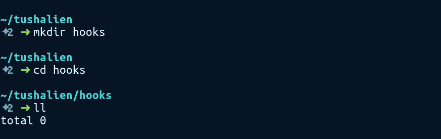
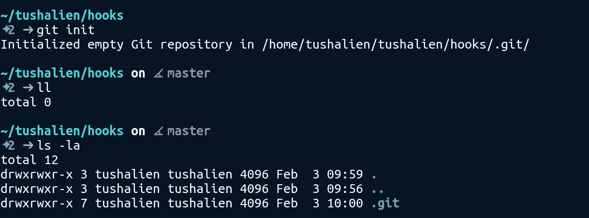
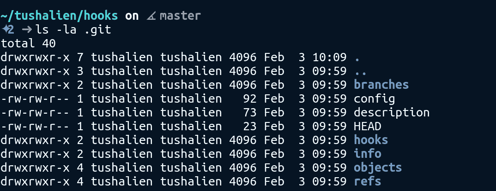
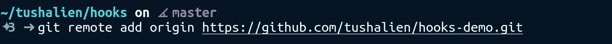
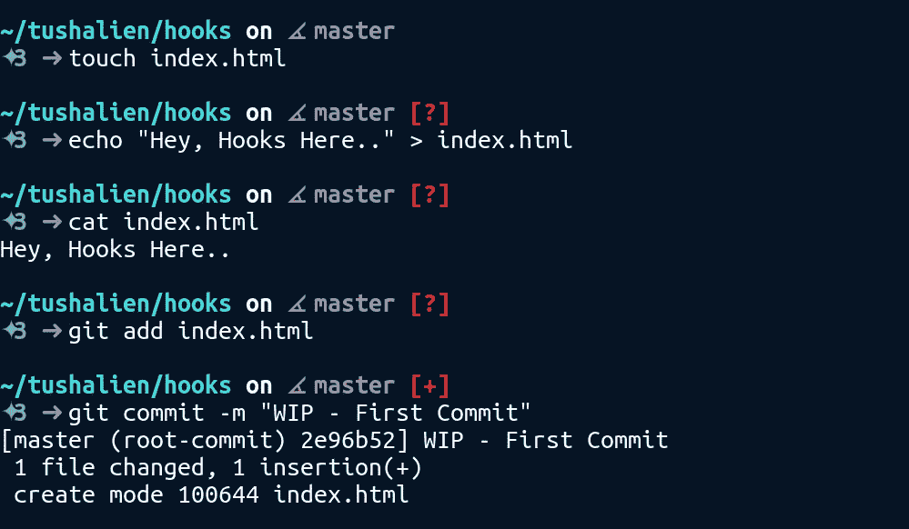
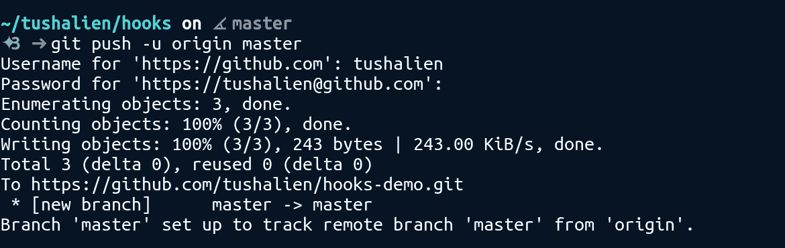
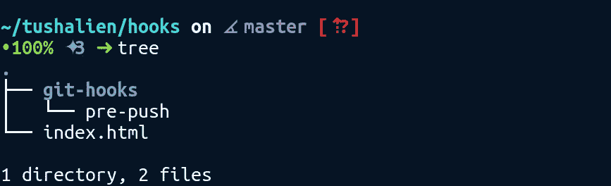

# 如何在开发工作流程中使用 Git 挂钩

> 原文：<https://medium.com/hackernoon/how-to-use-git-hooks-in-your-development-workflow-a94e66a0f3eb>

> 迷上了！！


Photo by [Alvaro Reyes](https://unsplash.com/photos/fSWOVc3e06w?utm_source=unsplash&utm_medium=referral&utm_content=creditCopyText) on [Unsplash](https://unsplash.com/search/photos/code?utm_source=unsplash&utm_medium=referral&utm_content=creditCopyText)

# 概观

如果您曾经从事过开源项目，或者您正在一个团队中工作，那么您很可能正在使用某种版本控制。版本控制系统( *VCS* )已经成为任何项目的主要需求之一，Git 是最流行的一个。然而，随着团队人数的增长，处理不同的代码风格和在所有贡献者之间强制执行某些规则变得很困难。这些问题不会被贡献者注意到，直到他提交了他的变更，这导致了核心维护团队的开销。为了执行这些规则并验证被推送的代码，Git 有一个很棒的特性，叫做 Git Hooks。

# 什么是 Git 挂钩？

这些是定制脚本，在某些特定的 git 事件上触发。钩子允许定义的脚本在某些 Git 事件发生之前或之后运行。有两种类型的挂钩:

*   客户端挂钩
*   服务器端挂钩

服务器端钩子，顾名思义，安装在服务器上，只有在网络运行的情况下才会触发。例如- Post-Receive 是一种在成功推送后触发的服务器端挂钩。这使它成为向所有其他贡献者发送通知的绝佳位置。

客户端钩子驻留在本地存储库中，当 git 事件被触发时执行。这里，git 事件可以是*提交*、*推送*、*重置*等。当我们运行某些 git 命令时，git 会在 git 存储库中查找挂钩，以查看是否有相关的脚本要运行。例如，可以使用一个*预推送*钩子来验证代码在被推送到远程存储库之前是否执行了某些规则。由于在服务器端钩子的情况下我们不能做太多，所以在本文的剩余部分我们将只讨论客户端钩子。

# 执行你的钩子！！😎

在这一节中，我们将更深入地了解钩子，看看其中一个钩子是如何工作的。我们将执行一个简单的钩子来验证被推送的代码在提交消息中没有任何带有' WIP '的提交。(WIP —正在进行的工作)。我们开始吧！！

首先，让我们创建一个新目录。



Create a new folder — ‘hooks’

现在，用`git init`初始化同一个文件夹中的 git 存储库。我们可以看到，初始化一个 repo 创建了一个隐藏文件夹`.git`。使用`-a`标志可以查看隐藏的文件和文件夹。`-l`标志显示了文件的基本细节。因此，结合这两个标志，我们可以让`ls -la`查看目录中所有文件的详细信息。因为我们将大量使用隐藏文件，所以我们将在整篇文章中使用`ls -la`。



git init

但是，神秘的`.git folder`里面有什么？让我们看一看。简而言之，它包含了与 git 存储库相关的所有元数据，包括提交、远程存储库地址等。它还包含所有提交的日志。仔细看可以看到一个`hooks`文件夹。这是所有奇迹发生的地方！



Content of .git folder

那么，让我们看看`hooks`文件夹。它有一个各种钩子的样本脚本。因为这些文件以`.sample`扩展名结尾，所以它们不会在指定的 git 事件上执行。例如，`pre-commit.sample`文件将在任何提交之前执行，如果我们将其重命名为`pre-commit`。这正是我们要做的😂！


Hooks folder

首先，我们来了解一下现有的钩子之一，`pre-push.sample`。

如果看起来太多了，你可以看看文件顶部的注释。基本上，它会在本地 repo 中查找所有最新的提交，并检查新的提交消息中是否包含字符串“WIP”。为了查找提交，它考虑了远程存储库散列和当前本地存储库散列，并查找两者之间的所有提交。如果找到了字符串，它打印出`Found WIP commit in...`并中止推送。注意，如果脚本以非零退出代码结束，它不会推送到远程 repo。

让我们快速测试一下。到目前为止，我们已经在本地初始化了我们的 git repo，但是它需要一个远程 repo 来推送。因此，在 GitHub(或 BitBucket)上创建一个新的存储库，并复制远程 git url。我创建了一个名为`hooks-demo`的。

现在，我们需要使用`git remote add origin "url"`将这个远程引用添加到我们的本地 git 存储库中。



Adding reference

现在，让我们用一些文本创建一个新文件`index.html`。提交文件，然后推它，它应该没有问题。



Push successful

现在，让我们施展魔法，让钩子变得可执行。重命名 pre-push.sample 文件:`mv .git/hooks/pre-push.sample .git/hooks/pre-push`。只要确保文件是可执行的。万一不是，`chmod +x filename`会有帮助。


Renamed the file

完成所有这些后，更改文件的内容，并使用“WIP”单词进行一次新的提交。


pre-push hook in action

**哒哒！！😍**推送失败。因为我们删除了文件的扩展名，所以文件被执行了，因此推送没有通过。

类似地，基于您的需求，您可以编写自己的钩子来执行某些规则。在上面的例子中，我们检查了提交消息中的特定字符串，但是如果，我们想要确保提交的代码中不存在特定的字符串。好吧，我们可以使用预提交钩子来实现。

上面的预提交挂钩将在您的提交中查找“TODO”字符串。如果找到一个，提交将被拒绝。

## 如果你想用' TODO '提交呢？

因为这些钩子安装在本地机器上，所以总是可以绕过它们。

```
git commit --no-verify
```

> 使用标志`*--no-verify*`不会触发钩子。

我们在上面的例子中使用了 bash 脚本。但是，它支持您的系统可以执行的任何脚本语言。

# 如何让团队步调一致？

比方说，你写了一个“预推送”钩子，如果代码中有*“TODO”*单词，它就不允许任何人推送代码。这很酷，而且对你很有帮助。现在，你将如何把这个脚本分发给从事同一项目的其他人呢？正如我提到的，钩子出现在 ***。git*** 文件夹以及所有其他 git 元数据。由于数据可以是用户特定的，**，*。git*** 文件夹没有版本控制，这意味着该文件夹的内容不会被推送到远程存储库。

最简单的方法是将钩子存储在 repo 中的一个普通文件夹中，并将它们复制到 ***。每个用户机器上的 git/hooks*** 。然而，我们不能依赖用户手动将脚本复制到 hooks 文件夹。我们需要一些脚本或工具，可以在没有任何用户干预的情况下安装挂钩。让我们假设钩子出现在 ***git-hooks 中。***



如果您使用的是 Git 2.9 或更高版本，您可以简单地运行下面的命令，将 hooks 文件夹更改为 ***git-hooks*** 而不是 ***。git/hooks。***

```
git config core.hooksPath *git-hooks*
```

你也可以把上面的命令放在一个设置文件中自动执行，比如 Makefile，pom.xml，package.json 等等。 *Husky* 是在 node 项目中安装 git 钩子的最佳选择之一。但是，如果您使用的是 git 的早期版本，您需要通过执行以下命令来创建一个符号链接

```
ln -s -f ../../git-hooks/pre-push .git/hooks/pre-push
```

# 结论

Git 挂钩非常酷，是改进团队开发工作流程的好方法。这些例子只是为了展示钩子的能力。您可以使用这些来检查 lint 问题，或者在推送代码之前运行单元测试，或者您能想到的任何事情。我确信你们可以找到大量的用例来利用 git 钩子的能力，如果还没有使用的话。

希望你学到了新的东西！！

请鼓掌👏 👏如果你觉得这有用！！

感谢阅读。