# 如何使用 Google API 将你的猫的照片保存在云上

> 原文：<https://medium.com/hackernoon/how-to-use-google-api-to-save-your-cats-photo-on-cloud-711b330fbdcd>

为什么是 API？牛顿说“如果我看得更远，那是因为我站在巨人的肩膀上。”API 是将计算资源或数据与您自己的平台集成的最简单的方法之一。如果开发人员想将生产力提升到一个新的水平，API 是他们应该站在的肩膀上。

本文将提供使用 Google 云存储 JSON/REST API 在云上保存本地文件的分步指南。您可以了解 GCP API、API 架构、云外壳以及 API 认证和授权。

打开 GCP 控制台。使用**导航菜单**，选择**API&服务** > **库:**

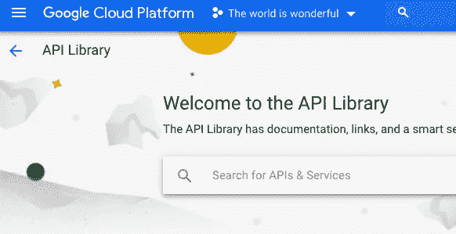

搜索**谷歌云存储 API** ，然后启用该 API

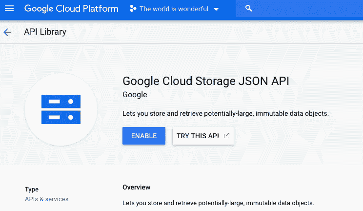

通过按右上方的按钮打开**云外壳会话**


运行以下命令创建并编辑名为 *skyline.json* 的文件:

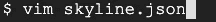

在 vim 文本编辑器中，复制并粘贴下面的代码，创建一个具有三个键值对的对象:`name`、`location`和`storageClass`

```
{  "name": "skyline",    
   "location": "us",    
   "storageClass": "multi_regional" 
}
```

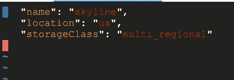

按 ESC 键保存并退出 json 文件，然后键入:wq，再按 ENTER 键。

# 认证和授权

认证告诉服务器你是谁，而授权决定你能做什么。

Google APIs 使用三种类型的认证/授权服务:API 密钥、服务帐户和 OAuth。这里我们将使用 OAuth。

在新标签中打开 [OAuth 2.0 游乐场](https://developers.google.com/oauthplayground/)。选择**云存储 JSON API V1** 完全控制，然后点击蓝色按钮**授权 API**。

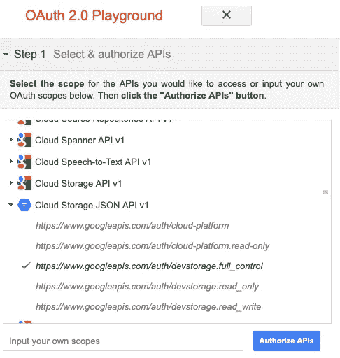

使用您的 google 用户名登录后，您将看到以下页面。

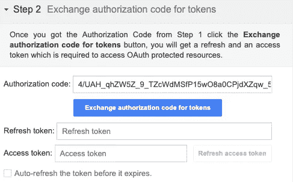

点击**交换令牌授权码，**然后复制访问令牌。

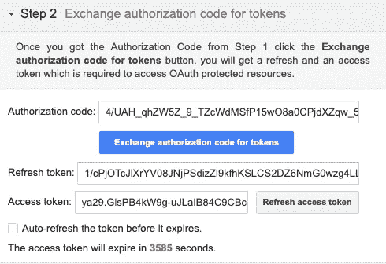

返回到 Cloud Shell，输入并运行以下命令，通过粘贴刚刚生成的访问令牌，将 OAuth2 令牌设置为环境变量:

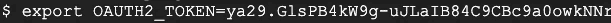

将您的 GCP 项目 ID 设置为环境变量，如下所示:

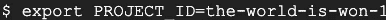

# 创建云存储桶来存储你的猫的照片

许多 API 使用客户机-服务器模型，并遵循 HTTP 协议。最常用的 HTTP 请求方法是 GET、POST、PUT 和 DELETE。

*   **GET** 请求方法从服务器获取数据
*   **放**方法更新现有数据
*   **POST** 方法创建新资源
*   **删除**方法删除数据或资源

我们在示例中使用 POST 来创建新资源:

```
curl -X POST — data-binary @skyline.json \ 
-H “Authorization: Bearer $OAUTH2_TOKEN” \ 
-H “Content-Type: application/json” \ “https://www.googleapis.com/storage/v1/b?project=$PROJECT_ID"
```

Curl 文档可以在这个[链接](https://curl.haxx.se/docs/manpage.html)找到。

从**导航菜单**中查看新创建的桶，选择**存储** > **浏览器**:

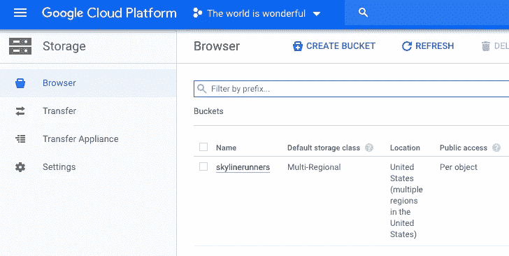

点击 3 点按钮上传你的猫的照片到云壳目录

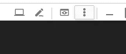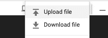

获取图像文件的真实路径，然后将路径和您的桶名 *skyline* 设置为环境变量

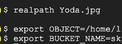

检查您的云存储空间。

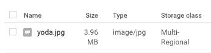

点击图片“yoda.jpg ”,这将在一个新的标签中打开。

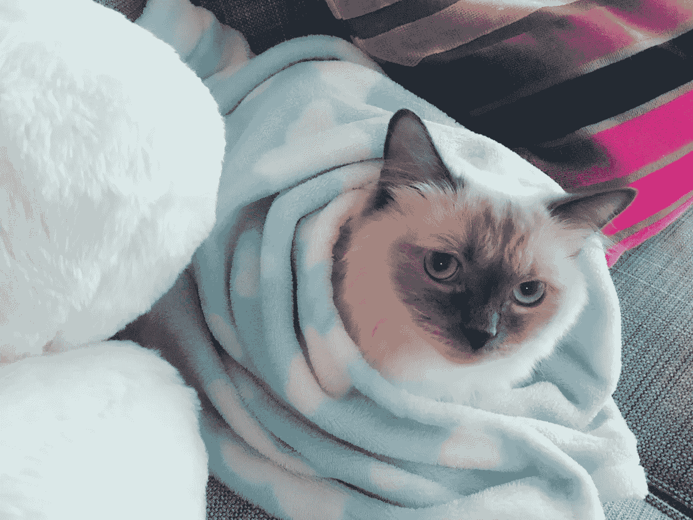

yoda.jpg

# 恭喜你！

您刚刚了解了如何使用云存储 JSON/REST API 将本地文件上传到云存储。简单回顾一下，您了解了 and API、HTTP 协议和方法，以及 API 认证实践。

**轮到你了**:上传你家猫咪的照片到云端。如果没有养猫，上传狗狗的照片。如果你没有养狗，上传你的自拍。如果你没有自拍，嗯，别编码了！和朋友出去玩:)