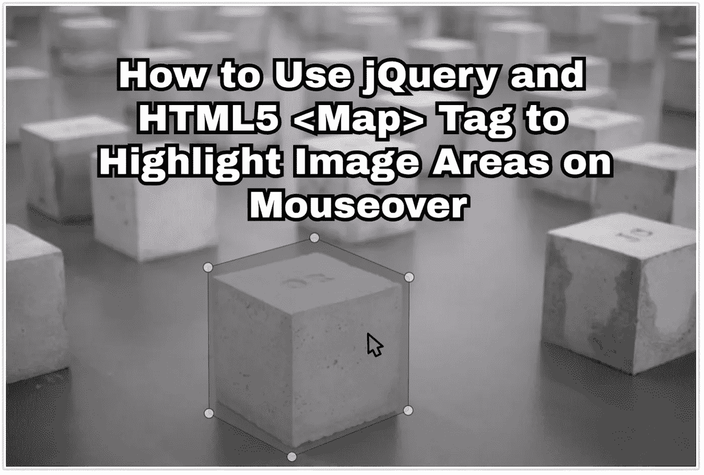

# 如何用 jQuery 和 HTML5 高亮鼠标悬停时的图像区域

> 原文：<https://medium.com/hackernoon/how-to-use-jquery-and-html5-map-tag-to-highlight-image-areas-on-mouseover-b7c728947ed3>

## 改进 UX/用户界面的简单响应图像技术

这是一篇循序渐进的文章，我将演示如何使用 jQuery 和 HTML5 <map>标记来突出鼠标悬停时的图像区域。</map>

# 第一步:找一张图片