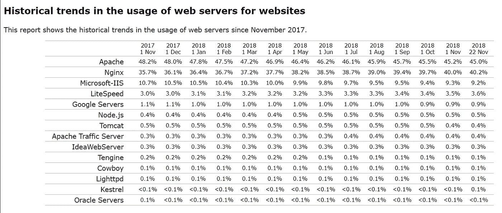
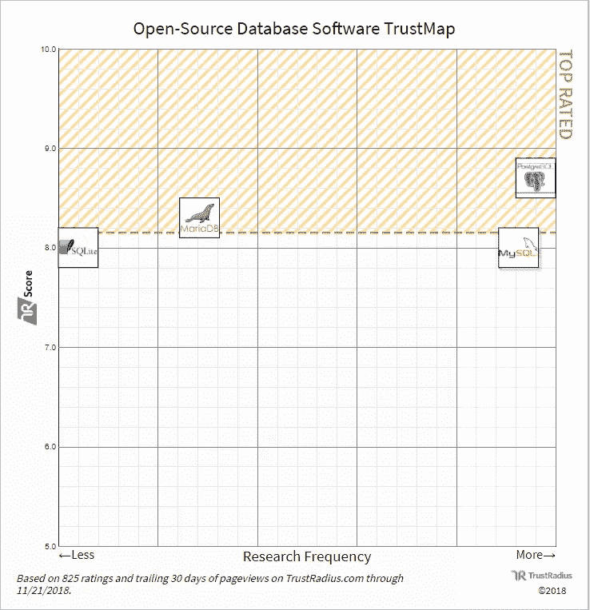
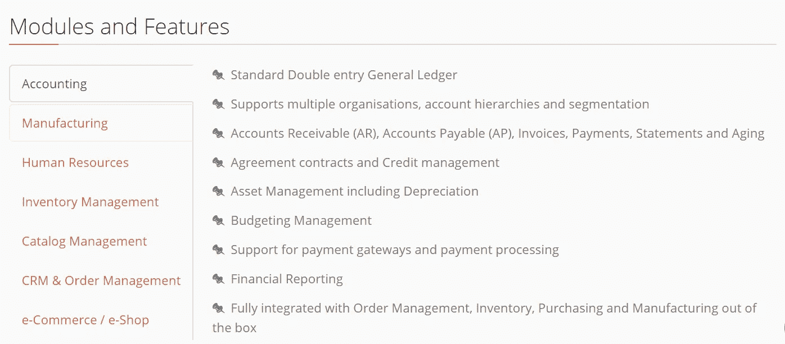
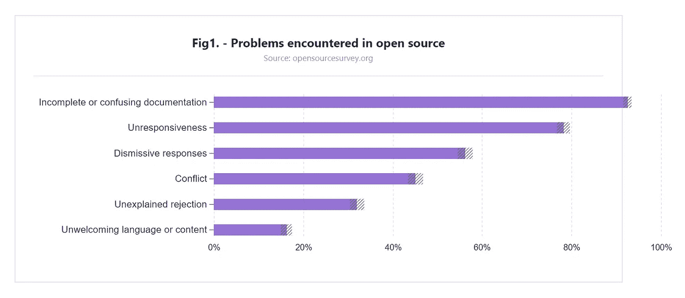

# 如何使用开源软件:功能、主要软件类型和选择建议

> 原文：<https://medium.com/hackernoon/how-to-use-open-source-software-features-main-software-types-and-selection-advice-80fbdb0d0f60>

1998 年 2 月成为软件开发社区中值得注意的月份之一:开放源码倡议(OSI)公司成立，开放源码标签被引入。这个术语代表了一种基于协作改进和源代码共享的软件开发方法。在这些事件之前， [Netscape 分享了其网络浏览器的源代码](https://blog.lizardwrangler.com/2008/01/22/january-22-1998-the-beginning-of-mozilla/),鼓励世界各地的工程师联合起来改进该产品的新版本。

从那以后，员工和创业者一直在使用像 [SourceForge](https://sourceforge.net/) 、 [Tigris](http://www.tigris.org/) ，以及后来的 [GitHub](https://github.com/) 或 [Bitbucket](https://bitbucket.org/) 这样的网站进行软件下载、分发和协作工作。

# 什么是开源软件？

开放源代码软件(OSS)是根据许可证提供的，允许用户根据自己的目的访问、更改和改进其源代码。[开源倡议](https://opensource.org/osd)用十个简洁的段落解释了这种软件类型的特性。

更简单地说，这种软件必须包含源代码，并允许以源代码和编译形式分发(即使是在初始产品的相同名称和许可下)。一个程序可以被任何人修改并在衍生作品中使用，不管是哪个行业或项目。例如，工程师可以使用部分源代码来扩展程序的功能、修复程序错误或创建新软件。在后一种情况下，专家可以节省大量开发时间。然后开发者可以免费分享一个产品，或者出售。但是有一个限制:开发者必须在同样的条款下发布开源程序的修改部分，并提供源代码。

## 开源与专有软件

开源软件是专有软件的对立面。专有软件用户第一次运行该软件时，必须签署一份最终用户许可协议(EULA)。与开源软件许可不同，这些协议限制用户共享和修改产品。

那些使用开源软件和专有解决方案的人必须只保留以前的开源软件。此外，许可证禁止用户将开放源代码作为专有代码包含在专有解决方案中。

## 开源是指免费吗？

嗯，没有。这是对开源软件最常见的误解之一。*免费*是指为了自己的目的使用源代码，同时注明软件作者。软件可能是免费的，可以按月、按年或一次性付款(价格通常根据用户而定)。许多供应商倾向于收取咨询和技术支持费用，而不是软件下载费用。他们还可以出售产品许可条款的豁免条款，或者欢迎产品用户捐赠。开发人员的另一个盈利选择是推荐补充其开源软件的解决方案，并从他们推广的供应商那里收取一定比例的费用。

## 开源许可证

此类软件的使用、修改和分发条款在*开源许可*中定义。

开源倡议[已经批准了数百个现有许可证中的 80 多个](https://opensource.org/licenses)。这些被批准的许可证可以分为*许可*和*版权所有*许可证。前者允许您出于任何目的使用代码，风险自负，同时注明其作者或贡献者。许可许可证的例子有 [MIT](https://opensource.org/licenses/MIT) 、[Berkeley Source Distribution(BSD)](https://whatis.techtarget.com/definition/BSD-licenses)、 [BSD 3-Clause](https://tldrlegal.com/license/bsd-3-clause-license-(revised)) 和 [Apache 2.0](https://opensource.org/licenses/Apache-2.0) 。

后者，左版权许可证，对许可许可证有额外的要求。它要求共享分布式二进制文件的源代码，并且不允许对被许可方行使许可施加额外的限制。此外，您不能更改源代码的 copyleft 条款。一些版权所有的许可证是 [GNU 通用公共许可证](https://opensource.org/licenses/gpl-license)(版本 2.0 和 3.0)、 [GNU 次要通用公共许可证](https://opensource.org/licenses/lgpl-license)(有三个版本:2、2.1 和 3)、 [Mozilla 公共许可证 2.0 (MPL-2.0)](https://opensource.org/licenses/MPL-2.0) 、 [GNU Affero 通用公共许可证 v3 (AGPL-3.0)](https://tldrlegal.com/license/gnu-affero-general-public-license-v3-(agpl-3.0)) 。

## 使用开源软件的好处

开源许可不涉及版权限制。相对自由的使用给这些产品带来了好处，吸引了许多用户。公开源代码软件的主要好处是:

*   **灵活性。**可以定制软件以满足特定的业务需求。工程师可以编写更多的代码来添加额外的功能，反之亦然——删除不必要的部分。
*   **稳定。**您可以放心地将该产品用于长期项目，因为即使其作者停止工作，它也不会从市场上消失或过时。用户社区将会关注开源软件。
*   **安全可靠。不同技能水平的许多人可能在同一个软件上工作，这可能导致代码不一致。这就是开源文化有益的时候。来自世界各地的其他开发人员可以检查、修复和更新这些代码。代码审查越快，软件就越安全可靠。作者和用户改进一个解决方案，因为他们需要它表现良好。**
*   **更容易评估。**你(或你的开发者)所见即所得。源代码的完全透明允许您的团队检查和评估产品，了解其功能和缺陷。
*   **更好的支持。作为一个 OSS 用户，你有更多的方法获得技术建议和支持:从一个供应商，一个专门从事这种产品的咨询公司，或者从其他愿意在论坛或邮件列表上分享他们的经验和知识的用户那里。**
*   **可能的节约。**此类产品可能有下载价格，通常需要付费的客户支持。但是让我们记住，购买开源软件的成本通常低于商业软件，而且免费的开源程序也是存在的。

此外，初级开发人员或学生可以使用开源代码来学习如何更好地编码。至少在某些生活领域，人们可以从别人的错误中吸取教训，对吗？

# 小型企业和企业的开源软件类型

互联网上有很多开放源代码的解决方案。我们描述的软件组允许构建组织的 IT 基础设施，管理跨部门的数据和内容，应用程序开发和测试，以及管理与客户的交互。

## 操作系统

Linux 操作系统有各种版本，也称为发行版，适合不同计算机水平的用户。最流行的 Linux 发行版有 [Ubuntu Linux](http://www.ubuntu.com/) 、 [Arch Linux](https://www.archlinux.org/) 、 [Fedora](http://fedoraproject.org/) 、 [Linux Mint](http://www.linuxmint.com/) 、 [Debian](https://www.debian.org/) 和 [openSUSE](https://www.opensuse.org/) 。

[FreeBSD](https://www.freebsd.org/) 是一个免费的开源操作系统，一个基于 [Berkeley 软件分发(BSD)](https://searchdatacenter.techtarget.com/definition/BSD-Berkeley-Software-Distribution) Unix 的类 Unix 操作系统。它是最流行的 BSD 操作系统:网飞、黑客新闻、雅虎等巨头的网站，而 Netcraft 使用它。

Android 是谷歌的移动操作系统。你可以在我们的专题文章中找到更多关于[安卓应用开发](https://www.altexsoft.com/blog/engineering/pros-and-cons-of-android-app-development/?utm_source=MediumCom&utm_medium=referral)的信息。

ReactOS 是一个免费的开源操作系统，与 Windows 兼容。

## Web 服务器

Web 服务器是一种计算机系统，它使用超文本传输协议(HTTP)通过互联网将数据从网页分发到最终用户。

根据 W3Techs 的数据，截至 2018 年 11 月，Apache HTTP Server 是最受欢迎的网络服务器，有 45%的网站使用它。BuiltWith 互联网服务公司统计了 [62，624，313 个使用 Apache 的直播网站](https://trends.builtwith.com/websitelist/Apache)。

NGINX 在服务器流行度竞赛中排名第二，拥有 40.2%的运行网站(W3Techs 11 月份的统计数据)，根据 BuiltWith 的数据，共有 43，190，053 个网站。web 服务器是在类似 BSD 的许可下发布的。

*Two open source web servers are at the top most popular servers. Source:* [*W3Techs*](https://w3techs.com/technologies/history_overview/web_server)

[Node.js](https://nodejs.org/en/) 是一个服务器端跨平台 JavaScript 环境，专为构建和运行 web 服务器之类的网络应用而设计。Node.js 可以在多种许可下使用。11 月，0.5%的人在 Node.js 上运行。

[Apache Tomcat](http://tomcat.apache.org/) 用于运行 Java 应用程序。更具体地说，它是一个 Java servlet——一个扩展 web 服务器功能的 Java 软件组件。Apache Tomcat 是在 Apache 许可证版本 2 下发布的，为 0.4%的网站提供支持。

Lighttpd 是一个针对高性能环境优化的 web 服务器。它是在 BSD 许可下发布的，只有 0.1%的网站使用它。

## 数据库系统

由于越来越多的公司将开源数据库用于大型项目，开源数据库的能力已经达到了专有解决方案的水平。

[TrustRadius](https://www.trustradius.com/open-source-database) 审查平台在专用的 TrustMap 图表中展示了开源数据库在不同规模的公司中的受欢迎程度。结果基于潜在买家的满意度和调查频率。该图表包括在其网站上有 10 条或更多评论的产品。

先说一下现在流行的开源的数据库。

MySQL 是应用最广泛的嵌入式关系数据库之一。2010 年，Oracle 收购了它，因此它是寻求支持的公司。

[PostgreSQL](https://www.postgresql.org/) 是一个对象关系数据库(ORD ),支持 macOS Server、大多数 Linux 发行版和 Microsoft Windows。

[MariaDB](https://mariadb.com/) 是 MySQL 数据库的一个分支，所以访问数据的接口和 SQL 中的一样。

[Apache Hive](https://hive.apache.org/) 允许快速编写类似 SQL 的查询，从 Hadoop 分布式文件系统(HDFS)和其他兼容系统中提取数据。Apache Hive 既可以用作数据库，也可以用作数据仓库。

SQLite 是一个独立的、无服务器的、零配置的事务数据库引擎。

## 移动开发框架

[Ionic](https://ionicframework.com/framework) 是一款免费开源的 SDK(软件开发工具包)，用于混合跨平台移动 app 开发。除了本地应用，Ionic 还允许构建[渐进式网络应用](https://www.altexsoft.com/blog/engineering/progressive-web-apps/?utm_source=MediumCom&utm_medium=referral)。

[React Native](https://www.altexsoft.com/blog/engineering/the-good-and-the-bad-of-reactjs-and-react-native/?utm_source=MediumCom&utm_medium=referral) 是一个使用 JavaScript 和 React(脸书用于 UI 开发的 JavaScript 库)快速构建原生应用的开源框架。用 React Native 写的代码，安卓和 iOS 都可以用。

[Flutter](https://www.altexsoft.com/blog/engineering/pros-and-cons-of-flutter-app-development/?utm_source=MediumCom&utm_medium=referral) 是 Google 开源的多平台 SDK。想用 Flutter 的一定要懂 Dart 编程语言。

[Xamarin](https://www.altexsoft.com/blog/mobile/pros-and-cons-of-xamarin-vs-native/?utm_source=MediumCom&utm_medium=referral) 是微软的跨平台移动应用开发工具，允许工程师共享近 90%的编写代码。Xamarin 使用 C#编程语言，并基于。NET 框架。

## QA 自动化工具

Selenium 是一套开源软件测试自动化工具。该工具支持移动测试、多种编程语言、操作系统和浏览器。

Watir(Ruby 中的 Web 应用测试)是一个开源的 Ruby 库，用于执行简单的自动化测试。它可以与 Edge、Internet Explorer、Firefox、Chrome 和 Safari 兼容。RubyGems 上也有。

[Robot Framework](http://robotframework.org/) 是一个用于关键字驱动测试的开源自动化框架。可用于 web 和移动(Android 和 iOS)测试。

## 大数据分析工具

[Apache Hadoop](https://hadoop.apache.org/) 是最受欢迎的大数据框架，用于为计算机集群中运行的应用程序分布式处理大量数据和存储。

[Apache SAMOA](https://samoa.incubator.apache.org/) (可扩展高级海量在线分析)平台在不使用分布式流处理引擎(如 Apache Storm 或 Apache Samza)的情况下，分析流数据并开发 ML 算法。

[HPCC](https://risk.lexisnexis.com/our-technology/hpcc-systems) (高性能计算集群)系统是由 LexisNexis Risk Solutions 提供的开源大数据分析平台。

## 办公软件套件

Apache OpenOffice 是在 Apache 2.0 许可下发布的免费办公软件包。它的用例包括文字处理、演示、图形、电子表格、数据库等。该套件以 OpenDocument (ODF)格式存储数据，能够读写其他常用办公软件包中的文件。

LibreOffice 是另一个免费的开源办公套件。LibreOffice 用户可以处理文本文档、数据库、电子表格、绘制流程图和矢量图形、创建演示文稿以及编辑公式。该软件还允许输出和工作是不同的文件格式，包括 PDF 格式。

[NeoOffice](http://www.neooffice.org/neojava/en/index.php) 是基于 OpenOffice 和 LibreOffice 的面向 Mac 用户的软件套件。该套件有三个版本，其中一个版本是免费的，但不能保存文档。

## 内容管理系统

内容管理软件允许用户创建、管理、编辑和发布数字内容。

WordPress 是一个最流行的开源 CMSs，基于 PHP 脚本语言和 MySQL 数据库系统来构建动态博客、网站和应用。可以扩展超过 45000 个插件。

[Django](https://www.django-cms.org/en/) 是一个在互联网和内部网(组织的私有网络)上发布内容的平台。该平台用 Django 和 Python 编写，适合不同背景和技能的用户:营销人员、开发人员和商业领袖。

[Joomla！](https://www.joomla.org/)是一个免费的开源 CMS，支持 MySQL、MySQLi 或 PostgreSQL 数据库。该平台让用户可以更好地控制显示网页内容的方式，并拥有数以千计的模板和扩展。专家还[注意](https://www.datamation.com/applications/the-best-open-source-content-management-systems.html) Joomla！是开发电子商务网站的好选择。

*Joomla! in brief*

[Drupal](http://www.drupal.com/) 是一个高度可扩展的免费开源 CMS，被全球超过一百万个网站使用。其内容管理功能包括移动编辑、编辑工作流、精细标记和就地内容创建。

DNN 是一个免费的开源内容管理平台。NET 框架，不需要全面的编程知识。DNN 为全球超过 750，000 个网站提供支持。

## 企业资源规划(ERP)工具

企业资源规划是一个综合系统，包括许多模块，能够对一个组织的所有部门进行信息管理。

[ERPNext](https://erpnext.com/) 是一款开源且“可无限扩展”的产品，具有人力资源管理、协作工具、企业资产管理、项目管理和 CRM 功能。该解决方案是为中小型企业，尤其是非技术人员而构建的。在线托管时，五个以上的用户需要付费，如果在内部安装，则完全免费。

MixERP 是一个基于 ASP.net 框架的开源系统。它帮助企业管理库存、销售以及人力资源和会计部门的工作。虽然下载和使用是免费的，但提供商收取支持费(每期 49 美元)。根据 [Capterra 的评论](https://blog.capterra.com/free-open-source-erp-software/)，该解决方案缺乏薪资和制造管理选项。这就是为什么大型企业需要云或内部付费版本。

Apache OFBiz 是一个完全可定制、可扩展的商业软件套件。该软件包带有开箱即用的模块，用于会计、仓储和库存管理，以及制造和制造资源规划(MRP)。电子商务公司也可以使用它来满足他们的需求，如订单管理和 CRM。OFBiz 的 Apache 是用 Java 编写的，在 Apache 2.0 许可下发布。它是免费和开源的。

*Apache OFBiz modules with listed accounting capabilities. Source:* [*Apache OFBiz*](https://ofbiz.apache.org/business-users.html)

对于那些寻找 ERP 工具的人来说，有大量的选择。还可以考虑[奥多奥](https://www.capterra.com/p/135618/Odoo/)、[多利巴尔](http://www.dolibarr.org/)、 [Opentaps](http://www.opentaps.org/) 、 [xTuple PostBooks](https://xtuple.com/) 、 [Openbravo](https://www.capterra.com/p/80882/Openbravo-Commerce-Suite/) 、 [iDempiere](https://www.capterra.com/p/176654/iDempiere/) ，或者[维也纳优势社区版](http://www.viennaadvantage.com/solutions-editions.php)。

企业资源规划系统结合了许多模块，每个模块都有特定的用途。如果您对一个或几个功能感兴趣，可以考虑单独的产品(如会计、人力资源或 CRM 工具)。让我们更深入地了解一下客户关系管理解决方案。

## 客户关系管理(CRM)系统

[SuiteCRM](https://suitecrm.com/) 基于 SugarCRM 社区版。后者曾经是这类开源产品的领导者。该解决方案专为各种类型、规模和行业的企业而设计。使用 SuiteCRM，用户可以生成发票和报价、维护销售线索和合同、生成报告以及管理文档和注释。该解决方案甚至允许客户登录来跟踪他们自己的案例。

[civic CRM](https://civicrm.org/)是一个基于网络的解决方案，主要面向非营利组织。该解决方案的功能包括案例和联系人管理、投稿、通信、事件、成员、宣传活动、点对点筹款和报告。CiviCRM 在 GNU Affero 通用公共许可证版本 3 下可用。

[esposcrm](https://www.espocrm.com/)是一款基于网络的软件，最适合中小型企业。销售自动化、电子邮件管理(个人和群发邮件)或事件和任务规划等标准功能可以通过可购买的扩展包进行扩展。一些额外的功能是 VoIP 集成以及与谷歌日历和 MailChimp 的同步。供应商根据 GPLv3 许可证分发 CRM。

其他值得一试的解决方案还有 [Zurmo](http://zurmo.org/) 、 [Fat Free CRM](http://www.fatfreecrm.com/) 、 [Vtiger](https://www.vtiger.com/) 和 [Oro CRM](http://www.orocrm.com/) 。

# 如何选择一款开源软件？

有许多注意事项需要记住。我们要解决的方面应该可以帮助你回答几个主要问题:*这个产品有需要的功能吗？我们如何扩展它的功能？该产品及其组件安全吗？我们如何使用和维护这个解决方案？我们负担得起吗？让我们开始吧。*

## 功能性和灵活性

首先，软件必须具备您日常运营所需的功能。一个好的做法是列出必要的特性，并将其与程序的功能进行比较。开发者通常会在他们的网站上提供一个简短的解决方案描述。您可以在常见问题部分和文档中找到更多信息。

了解该程序如何与您现有的软件组件集成，它与什么操作系统兼容。确保检查您是否还需要购买额外的硬件来支持解决方案要求。

软件可能不具备所有需要的功能，或者包含非必要的功能。因此，了解如何填补功能空白或定制程序非常重要。一个选择是找到另一个软件，它有缺失的功能。另一种方法是利用开源软件的优势，通过修改代码来扩展其功能。无论这项任务是如何管理的，无论是内部管理还是外包管理，评估组织是否有足够的时间和财务资源来实施这些变革都是至关重要的。

## 安全性

由于源代码对每个人都是公开的，一个易受攻击的开源组件将整个应用程序置于危险之中。测试软件组件的安全漏洞。

开发者可以在[国家漏洞数据库(NVD)](https://nvd.nist.gov/) 美国政府资料库中检查产品是否安全。NVD 提供了安全核对表参考、错误配置、安全相关软件弱点、解决方案名称和影响指标的数据库。

[SecurityFocus](https://www.securityfocus.com/) ，一家在线计算机安全新闻门户和信息安全服务提供商，通过服务和信息源整合开发社区。您可以使用 Bugtraq 邮件列表，与 SecurityFocus 邮件列表上的其他用户讨论问题，或者使用 SecurityFocus 漏洞数据库跨平台和服务监控安全性。

此外，定期检查项目的 bug 追踪器应该成为日常任务。

## 维护和支持

了解如何为您选择的软件获得维护和支持也很重要。大型开源软件开发商通常会雇佣另一家定期咨询用户的公司。如果有几家公司提供客户支持，你可以自己研究他们在客户中的声誉，并检查他们的财务成功，以帮助选择正确的一家。然而，一个提供技术支持的软件供应商是你梦想中的软件供应商。

您可以创建一个内部维护团队。在这种情况下，专家必须找到尽可能多的支持论坛和相关资源，以获取有关软件使用和维护的信息。

不要低估你可以获得的知识，并与活跃用户社区分享。

## 用户社区

足够的用户群体是软件成功的标志之一。更重要的是，这样的产品将保持竞争力，并随着每个新版本的发布、错误报告和修复而改进。高质量的软件必须有一大批有或没有编码技能的人，他们将专注于使其功能更好并提供反馈。确保您能够及时获得关于部署和集成的建议，或者您可能有的任何其他问题的答案。

专家们[建议](http://www.tothenew.com/blog/key-considerations-for-selecting-open-source-software/)查看一个项目邮件列表档案，并在列表中张贴一个问题，看看人们对它的回应有多快。

## 证明文件

专业人士不仅能构建好的软件，还能描述它做什么，如何工作，以及如何使用它。那是理论上的。事实上，2017 年 GitHub 调查的 93%的用户指出，不完整或过时的文档是一个普遍存在的问题。

*Pain points for open source software users. Source:* [*GitHub*](http://opensourcesurvey.org/2017/)

因此，我们的建议是阅读[软件文档](https://www.altexsoft.com/blog/business/software-documentation-types-and-best-practices/?utm_source=MediumCom&utm_medium=referral)，并评估它是否写得很好，是否足以理解解决方案的功能和用途。关心他们的产品和用户社区的作者通常鼓励代码和非代码用户帮助文档变得清晰。开发人员可能会解释贡献的条款，并奖励用户的文档请求。

## 批准

根据前面提到的 GitHub 2017 年开源调查，64%的用户认为开源许可证影响了他们是否使用某个项目的决定。值得澄清的是，当用户计划修改软件而不仅仅是使用软件时，许可证的类型很重要。

因此，您应该仔细检查许可条件，并确保它们适用于您的组织。您还必须确保您使用的所有软件许可证都是在兼容许可证下发布的。

计算机科学家[大卫·a·惠勒建议](https://dwheeler.com/oss_fs_eval.html)核实是否有任何针对某个项目的未决诉讼，评估他们胜诉的可能性，并评估可能的后果。*“简单地采取一些法律行动不一定是一个问题；广受欢迎的开放源码软件/自由软件项目和大型专利供应商有时会招致琐碎的诉讼。在这种情况下，你需要检查证据(或者至少由技术专家对证据进行检查)，以确定问题是否严重，”【David 总结道。*

## 把…编入预算

我们都生活在物质世界中，所以我们不能忽视预算等方面。虽然获得或定制共享源代码的软件比从头开始构建要便宜，但部署和培训等其他方面也需要考虑。

如何估算部署价格？这是 David A. Wheeler 的另一个技巧:计算总拥有成本(在一段时间内部署软件的所有费用)或特定时间内的投资回报率(ROI)。

记住要考虑初始软件许可、产品安装以及许可和产品升级的价格。还应该估计人员配备、技术支持、数据转换(在现有系统和新系统之间)、硬件或额外软件购买。

# 结论

对于各种规模的组织和企业来说，使用开源软件和组件可能是合理的。好处包括发布的自由，修改或扩展软件功能的能力，以及可能的开发成本节约，等等。

好的软件是由一个庞大的用户群体支持的，这个群体会不断更新软件，监控安全漏洞，并不断润色源代码。有了知识分享和互助的文化，你一定可以在需要的时候得到专业的建议和帮助。

同时，开源解决方案的质量和安全性差异很大。这就是为什么根据您自己的技术要求和标准来评估产品很重要，其中一些我们已经在上面描述过了。

乔尔·菲利普在 [Unsplash](https://unsplash.com/photos/Nw3ddCwbUKg?utm_source=unsplash&utm_medium=referral&utm_content=creditCopyText) 上的照片

*原载于 AltexSoft Tech 博客**[***如何使用开源软件:特点、主要软件类型、选择建议***](https://www.altexsoft.com/blog/engineering/how-to-use-open-source-software-features-main-software-types-and-selection-advice/?utm_source=MediumCom&utm_medium=referral)*