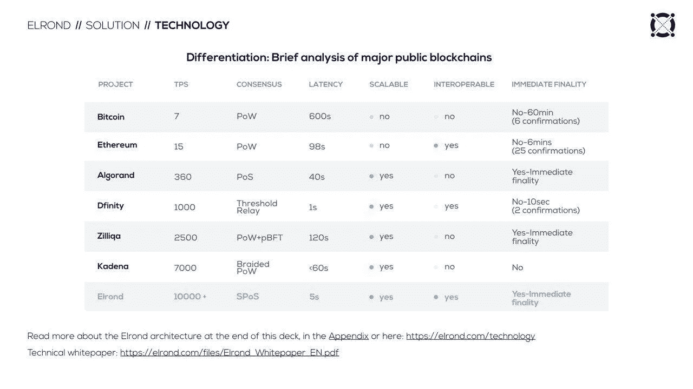
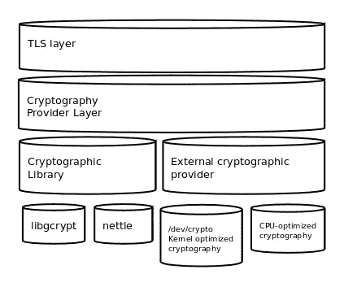
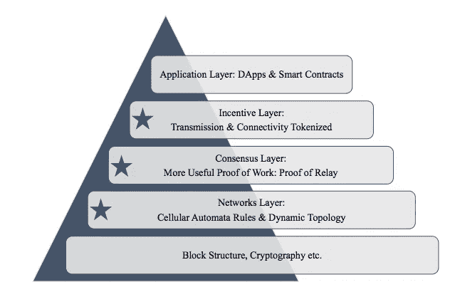
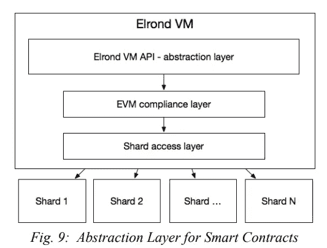

# 如何在不牺牲安全性的情况下使用分片

> 原文：<https://medium.com/hackernoon/how-to-use-sharding-without-sacrificing-security-ccde12ca3e50>

当你把一个大数据库分割成许多更小、更快但更易管理的部分时，通俗地说，这叫做分片。这仅仅意味着您有一个大数据库，您将它分解成许多小数据库，这些小数据库可以分布在许多服务器上。

区块链实施中的验证机制引起了争议。有了分片，这个验证过程只会加强。通过这个过程，只有相当小的一组节点(也称为 shard)而不是整个网络节点将对每个事务进行验证。

就区块链而言，情况并不复杂。区块链网络在逻辑上被分成许多更小的节点或碎片。当用户创建事务时，碎片的验证将由碎片组中的对等体执行。然而，在这个更有潜力的世界里，有比简单的切分更聪明的东西，它被命名为适应性状态切分。

埃尔隆德，第一家引入并应用**自适应状态分片**的区块链公司。这种技术实现的程度可以通过每个碎片每秒能够处理超过 3750 个事务来衡量。

# **但是为什么用适应性这个词呢？**

当吞吐量激增时，新碎片会自动激活，这都要归功于它的自适应特性，实现了区块链的线性可扩展性。

这个网络已经开发了将近两年。与此同时，人们对区块链空间越来越感兴趣，专用资源也随之增加；因此，不可思议的大量发展已经在现有的基础设施上发生，特别是以太坊。网络基础设施的第三个支柱是互操作性。区块链与以太坊虚拟机(EVM)兼容。由于以太坊已经成为许多独立的区块链开发者的基础，这个网络将是对寻求更多可扩展性的现有项目最有吸引力的解决方案。为了进一步简化登机过程，埃尔隆德区块链提供了与以太坊的 ERC-20 令牌标准的反向兼容性。

该网络在一个真正分散的网络中提供可扩展性、安全性和互操作性。区块链的核心功能已经在网络测试中证明是有效的。该项目的测试网将很快上线，开发人员将有机会在迄今为止最先进的区块链上进行早期构建。

这是组成这个区块链的各层的分解图。

**密码层**

任何区块链的基础都是加密层。这本质上是区块链的 DNA，因为这一层是为交易和块验证的条款而设计的。

网络利用 Schnorr 方案进行交易签名和验证；使用 Schnorr 签名创建了一个更小的数据足迹。除了简单高效之外，Schnorr 方案还利用了一种经过充分研究和实战检验的算法。这种创建数字签名的方式已经出现在各种替代硬币中，并且已经有人提出将它集成到比特币网络中。

由于块验证需要来自多个验证者的聚合签名，因此需要多重签名方案。因此，网络将使用 Boneh-Lynn-Shacham (BLS)多重签名方案进行分组签名和验证。

# **核心和执行层**

在区块链中，块、交易和账户都以数据的形式存在；所有这些数据都聚集在区块链的核心。网络核心中的数据模型可以实现临时或永久存储。

交易和地址作为数据存在；通过将数据模型与接入点分离，内核可以在事务被组装成块之前对其进行缓冲。

该层的执行方面是确保一旦数据输入已经过验证，并且区块链履行其事务职责。执行层处理事务，然后将它们组装成块；然后，在所有节点上维护已执行的事务和块，以确保一致性。因此，执行层也在所有分片上并行维持节点同步；碎片之间的同步在元链上完成。

# **通信层**

该网络是一种分散式协议，因此节点之间的有效通信至关重要。通信层是消息传递和广播的设计，也是通信的通道。

出于安全目的，网络随机地从各种碎片中重新定位节点。此外，所有节点在事务吞吐量上保持同步是非常必要的。网络必须能够在一个分片的节点内以及网络中的所有分片内中继通信，而通信层能够实现这一点。片内和跨片通信信道的使用也确保了网络正确地处理复合事务。

简而言之，当核心和执行层处理数据和传输时，通信层在处理完成后提供移动通道。

通信层确保节点连接，中继网络内的来回数据传输，为信息请求提供通道，并处理单个分片的节点内和网络内所有分片之间的块、事务和接收的广播。该通信基于 IPFS 的 libp2p 的高度优化使用。网络分片确保通信被限制在需要的地方。具体来说，片内通信只发生在感兴趣的节点之间。这实现了链之间的互操作性，而不会导致数据流瓶颈。

# **共识层**

区块链能够通过保持共识而作为安全和分散的网络运行。这是任何强大的区块链的一个基本方面。在核心和执行层已经处理了网络功能并且通信层已经将其转发到碎片之后，共识层充当一种机制，以确保吞吐量仅验证诚实的数据。

网络的安全利益证明(SPOS)基于实用的拜占庭容错(pBFT)。拜占庭故障是分散网络上的错误或不诚实的数据。顾名思义，pBFT 的存在是为了确保共识层能够承受所述故障。pBFT 共识假设网络中不超过 1/3 的节点是恶意的。因此，在埃尔隆德网络中，只有当 2/3 + 1 个验证者节点集合了一个签名时，一个块才是有效的。

在 SPOS 机制中，每个碎片由验证者组成，验证者的资格通过智能合同中持有的股份和评级来确定。较低的评级会降低验证器的选择几率。对于每个块，通过轮盘赌选择随机选择一个新的验证器组。随机选择的可证明的分散性质确保了攻击向量永远无法预测验证者是谁，因此它们[无法知道哪些节点将接管攻击。](/elrondnetwork/security-focused-q-a-a829c74caafd)

基于 pBFT 的领导者-追随者模型，SPOS 将验证器组中的第一个节点指定为块提议者。因此，提议者和验证者都是随机选择的，允许共识层为网络提供最佳的安全性。

SPOS 的一个好处是，与工作证明协议不同，它是生态友好的。由于节点是基于股份和评级来选择的，因此无需担心网络哈希会集中在两三个采矿场。相反，任何人都可以成为一个节点，由于这个网络需要最少的资源来允许活跃的节点参与，区块链保持了真正的去中心化。

# **自适应状态分片**

自适应状态分片包括网络/通信、事务/计算和状态/存储的分片。为了深入理解自适应状态分片所包含的内容，理解每种分片形式的目的是很重要的。

**事务/计算分片:**事务分片是许多项目追求的一种机制。它解决了 PoW 的问题，在 PoW 中，每个节点必须批准每一个交易。在事务分片中，节点被分成并行处理不同事务的组(分片)。

**网络/通信分片:**数据(消息)跨分片进行划分。

**阶段/存储分片:**区块链必须存储他们处理的交易的整个历史数据。状态/存储分片将存储负担分散到不同的节点组(分片)，而不是让每个节点都存储所有数据的副本。

埃尔隆德网络集成了所有三种形式的分片，其结果是网络的规模与验证器和分片的数量成比例。元链协调碎片，并确保随着更多节点加入网络，新的碎片被激活。可以无缝地添加碎片，因为钱包通过分层二叉树模型在碎片之间划分。添加碎片会将父碎片的一半地址空间传递给兄弟碎片。同时，移除后续碎片会将地址空间从兄弟碎片合并回父碎片。

# **跨分片交易**

埃尔隆德网络允许事务从一个分片发送到另一个分片。由于网络使用异步模型，验证和处理首先在发送分片中完成，然后在接收分片中完成。当事务被调度时，元链通过创建和提出新的元块(在元链上创建的块)来公证来自发送碎片的块，从而保护事务。

元块包含关于每个分片块的以下信息:发送方分片 ID、接收方分片 ID 和分片块散列。

在跨分片事务中，接收分片从元块中获取事务的相关分片块(在分片中创建的块，而不是元链中创建的块)散列，从发送分片中请求分片块，解析事务列表，请求丢失的事务(如果有的话)，然后最终在自身中执行相同的分片块，并将该分片块发送到元链的结果元块。一旦元链对此进行了公证，交易就完成了。

# 包裹

埃尔隆德网络是高度集中的研究和发展以及各种新颖的区块链基础设施解决方案的实施的结果。每一层都扮演着至关重要的角色—从处理网络吞吐量到传递或验证网络吞吐量。网络能够通过其自适应状态分片的本机使用来添加新分片，从而扩展某些层的容量。安全的利害关系证明(SPOS)共识确保，尽管区块链具有分散化的性质，但是实施了用于块验证候选资格的利害关系和评级系统，以及从候选资格中选择块提议者和验证者的可证明的随机手段，网络仍然是安全的。

埃尔隆德网络基于可伸缩性、分散性和互操作性的原则。凭借每个分片每秒处理 3，750 个事务的能力，并确保即使是简单的笔记本电脑也能运行一个节点，该网络实现了其前两个支柱。埃尔隆德虚拟机与 EVM 的兼容性提供了互操作性，确保区块链在需要更大吞吐量的行业和用例中的应用扩展可以轻松地从其他网络转移到埃尔隆德。在[https://elrond.com](https://elrond.com/)寻找更多信息，并成为我们不断壮大的社区的一员。