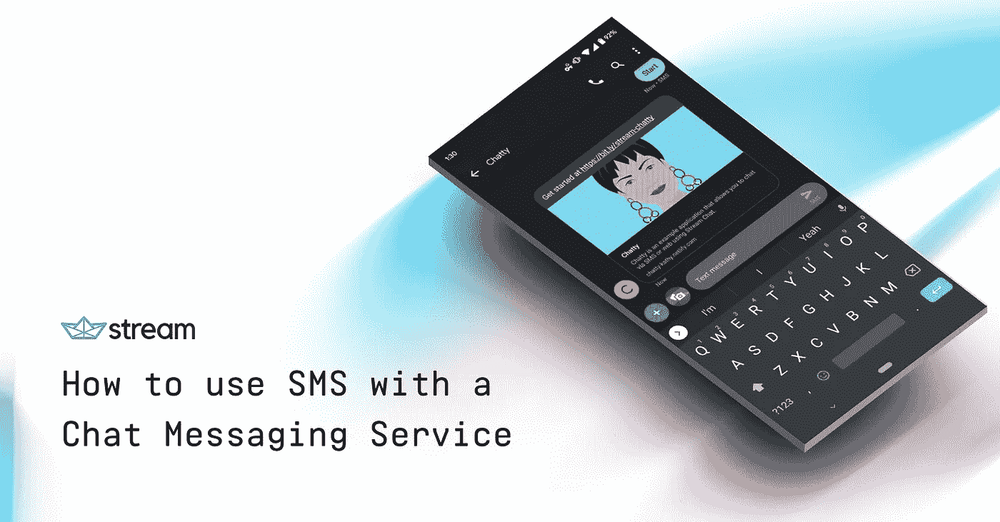

# 如何在聊天信息服务中使用 SMS💬 📲

> 原文：<https://medium.com/hackernoon/how-to-use-sms-with-a-chat-messaging-service-44d29d2ddba2>

How to use SMS with a Chat Messaging Service

我们这个时代的交流是支离破碎的。一些最受欢迎的交流媒介已经朝着迎合非常特定的最终用户的方向发展，并创建了一个“秘密俱乐部”，你可以说，联系正开始变得越来越困难。我们有 [Facebook Messenger](https://messenger.facebook.com) 和 [WhatsApp](https://www.whatsapp.com/) ，苹果专有的 iMessage 和谷歌的 Messages，然后还有 [Slack](https://slack.com) …