# 如何用 Joget 和红帽 OpenShift 容器平台可视化构建 app

> 原文：<https://medium.com/hackernoon/how-to-visually-build-apps-with-joget-and-red-hat-openshift-container-platform-c6e58089b866>

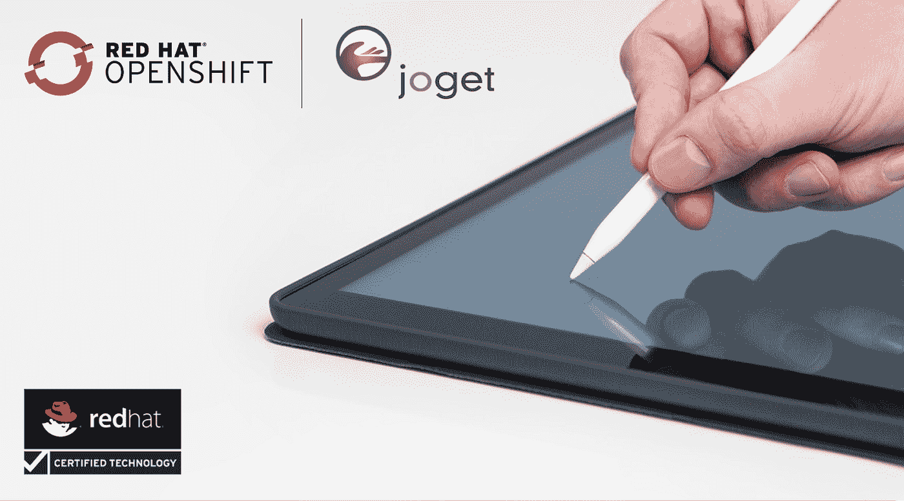

[红帽 OpenShift](https://www.openshift.com/) 是一个[容器](https://www.docker.com/what-container)应用平台，为企业带来 [Docker](https://www.redhat.com/en/containers/what-is-docker) 和 [Kubernetes](https://www.redhat.com/en/containers/what-is-kubernetes) 。作为一个[云本地计算](https://github.com/cncf/toc/blob/master/DEFINITION.md)平台， [OpenShift](https://hackernoon.com/tagged/openshift) 允许团队自动化应用的构建、部署和管理。他们可以专注于开发应用，而无需担心底层基础架构，无论是在物理/虚拟服务器上，还是在公共/私有/混合云环境中。

向云原生计算的迁移是许多组织的[数字化转型](https://searchcio.techtarget.com/definition/digital-transformation)战略的关键部分。然而，这只是等式的一部分，因为必须解决的主要差距是在构建应用程序和自动化业务流程方面。今天，许多应用程序开发仍然利用传统的编码，因此固有的复杂性以及技术专业知识的缺乏是很大的障碍。

作为一个[开源](https://hackernoon.com/tagged/open-source)无代码/低代码平台，为编码人员和非编码人员可视化构建企业 web 应用， [Joget](https://www.joget.com/) 是 OpenShift 的理想补充，填补了空白。Joget 平台现在作为一个 [Red Hat 认证的容器](https://access.redhat.com/containers/#/registry.connect.redhat.com/joget/joget-v6-enterprise)可用，所以它是可信的、安全的，并且在 OpenShift 上得到商业支持。本文描述了部署与 [MySQL](https://dev.mysql.com/) 数据库一起运行的认证 Joget 容器映像的步骤。

# 使用 OpenShift Web 控制台部署 Joget

## 步骤 1:创建 OpenShift 项目

进入 **OpenShift Web 控制台**并登录

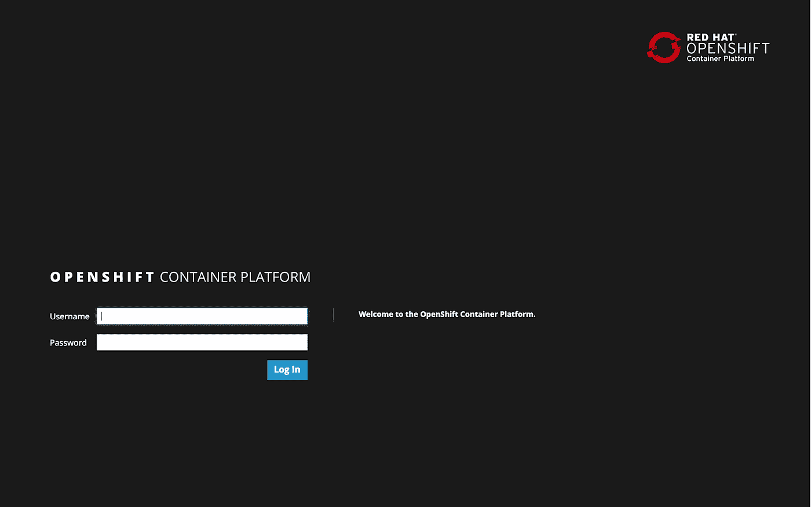

使用**创建项目**按钮创建项目，并输入所需的名称、显示名称和描述。

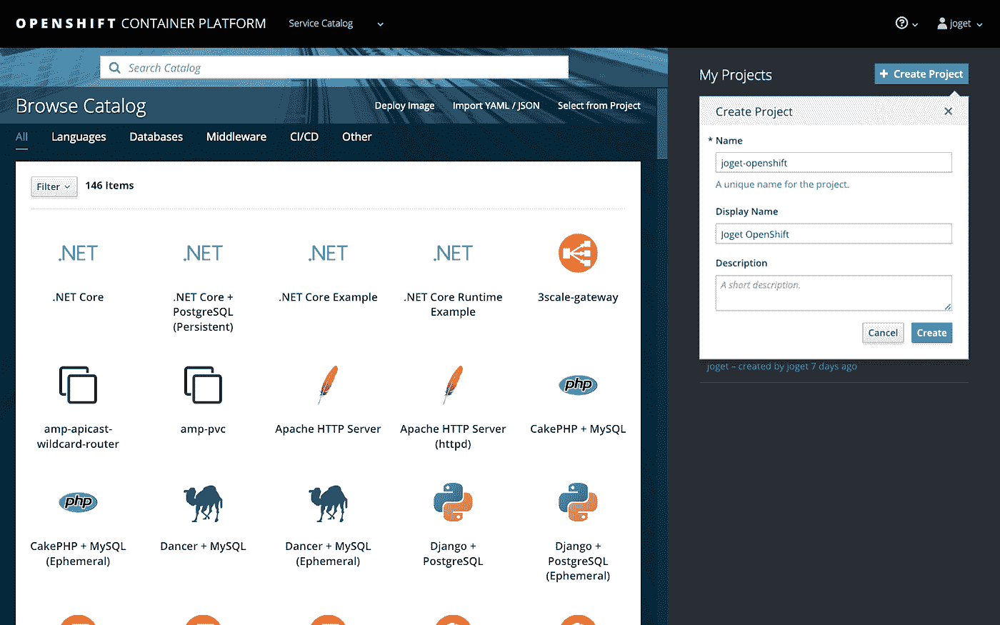

## 步骤 2:部署 MySQL 数据库

在选中的项目下，选择**添加到项目** > **浏览目录**并选择 **MySQL** 图片。

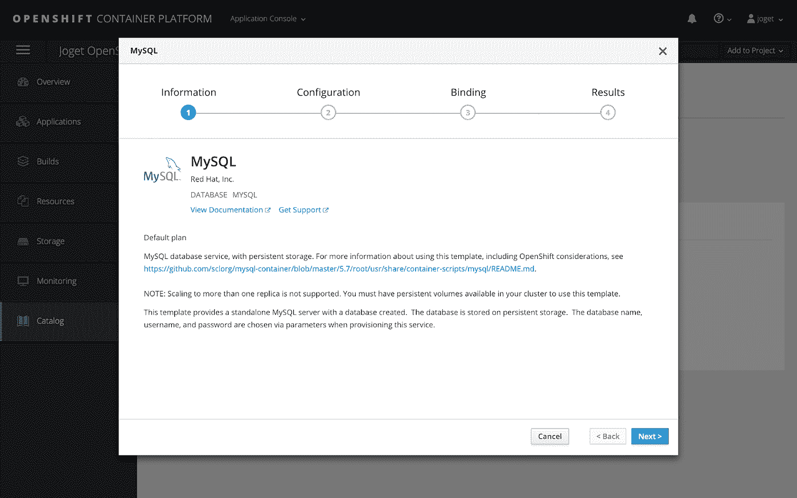

输入适当的设置并点击**创建**，例如

命名空间:openshift

数据库服务名:jogetdb

MySQL 连接用户名:joget

MySQL 连接密码:joget

MySQL 数据库名称:jwdb

## 步骤 3:部署 Joget 平台

要访问 [Red Hat 容器目录](https://access.redhat.com/containers/)，需要用于登录 Red Hat 客户门户网站的有效用户名和密码。

如果您没有帐户，可以通过注册以下选项之一来获得一个帐户:

*   [红帽开发者计划](https://developers.redhat.com/)。此帐户允许您访问开发工具和程序。
*   [30 天试用订阅](https://access.redhat.com/products/red-hat-enterprise-linux/evaluation)。此帐户为您提供 30 天的试用订阅，您可以使用精选的 Red Hat 软件产品。

在所选项目下，选择添加到**项目** > **部署映像**并点击**创建映像拉取秘密链接**。在随后的弹出窗口中，键入注册表的 Red Hat 登录详细信息。

秘密名字:registry.connect.redhat.com

身份验证类型:映像注册表凭据

图像注册服务器地址:registry.connect.redhat.com

用户名:Red Hat 帐户用户名

密码:Red Hat 帐户密码

电子邮件:红帽帐户电子邮件

将机密链接到服务帐户:是

服务帐户:默认

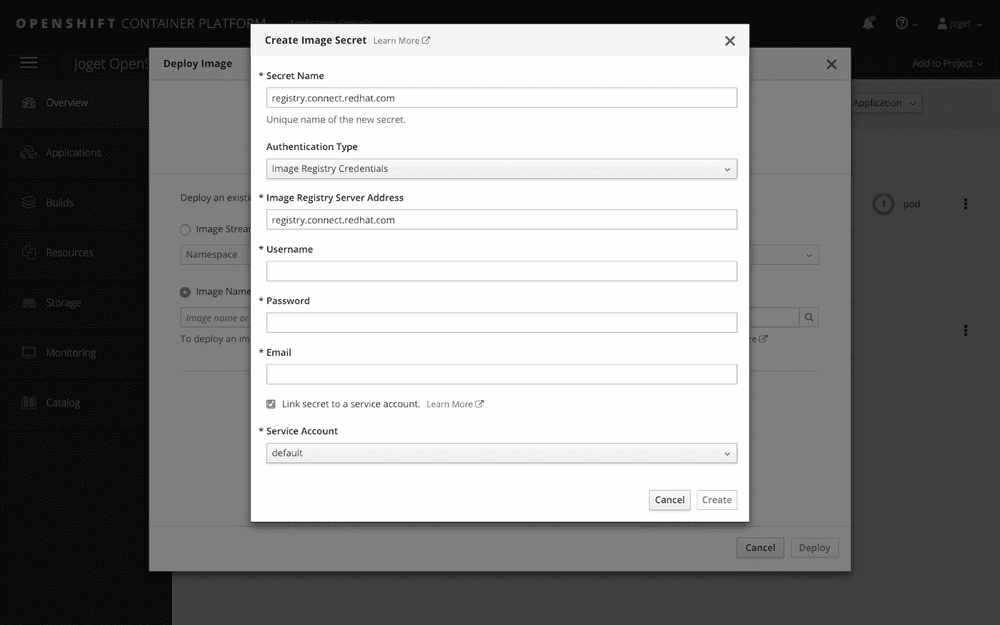

一旦创建了秘密，选择**添加到项目** > **部署图像**，选择**图像名称**选项并键入**registry.connect.redhat.com/joget/joget-v6-enterprise**。点击小搜索图标从注册表加载图像细节，键入所需的**名称**，然后点击**部署**。

图像名称:registry.connect.redhat.com/joget/joget-v6-enterprise

名称:joget-V6-企业

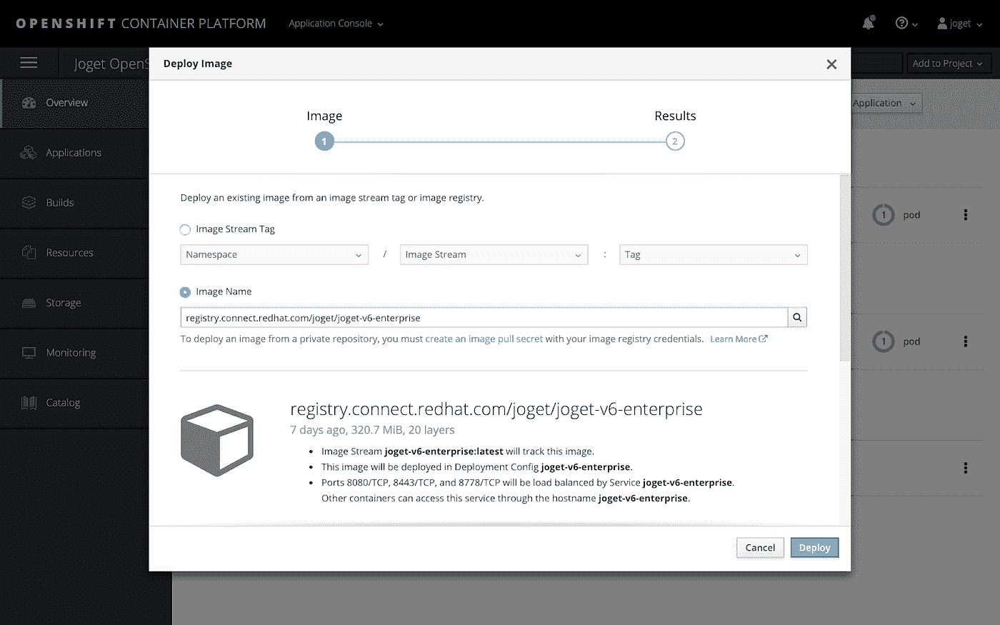

## 步骤 4:添加持久存储

下一步是向容器添加持久存储，用于存储配置文件和持久文件上传。在**应用** > **部署**下，选择应用，然后选择**配置**选项卡。向下滚动到**卷**部分，并单击**添加存储**链接。

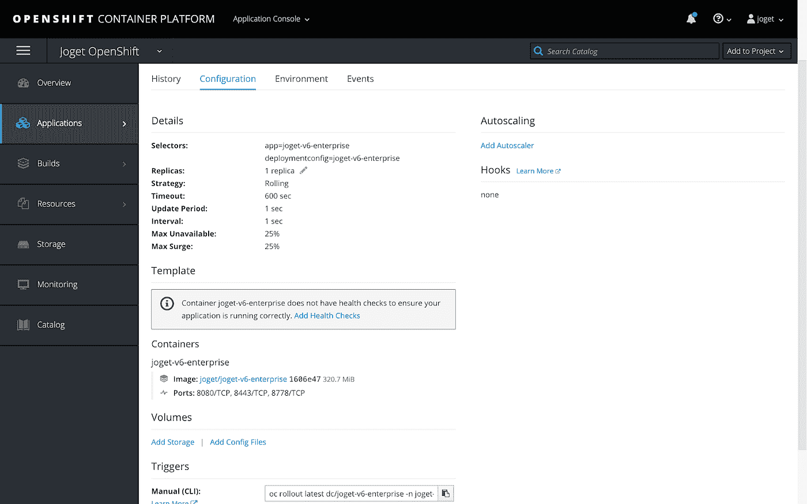

在添加存储页面中，单击小的**创建存储**链接。使用所需的值创建新存储，例如

名称:joget-data

访问模式:共享访问(RWX)

大小:1GB(或根据需要)

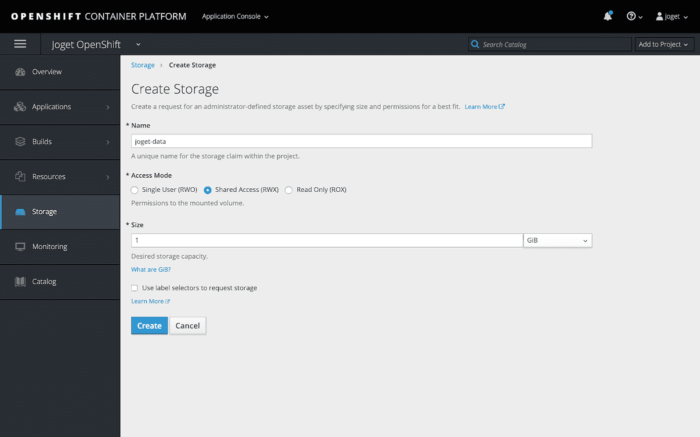

回到**添加存储**页面，选择新创建的存储，将**挂载路径**设置为 **/opt/joget/wflow，**然后**添加**。

挂载路径:/opt/joget/wflow

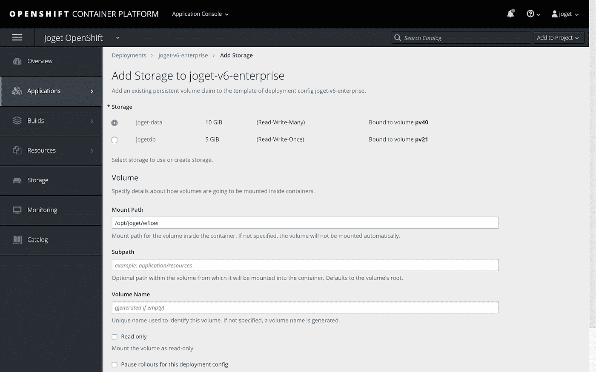

## 步骤 5:为外部访问创建服务路由

此时，无法从外部 web 浏览器访问该服务，因此您需要创建一个[路由](https://docs.openshift.com/online/dev_guide/routes.html)，它在一个主机名处公开一个[服务](https://docs.openshift.com/online/architecture/core_concepts/pods_and_services.html#services)。

点击**应用** > **服务**，选择**joget-V6-企业**。

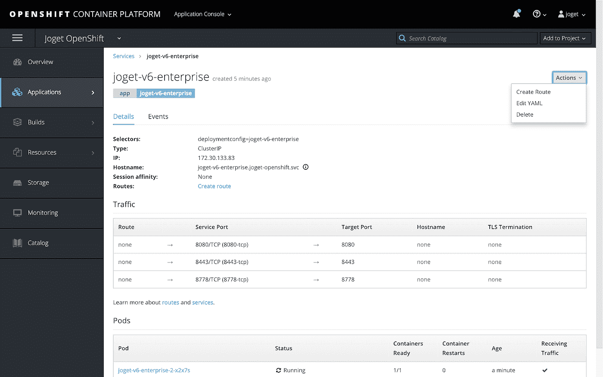

选择**动作** > **创建路线**，将**路径**设置为 **/jw** ，点击**创建**。

路径:/jw

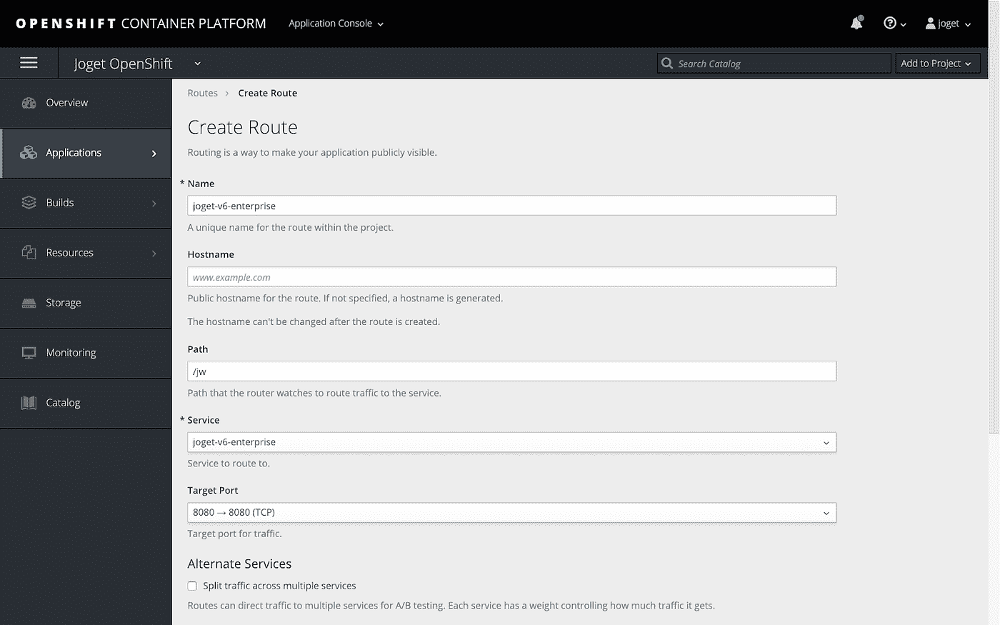

返回到**概述**，点击应用程序名称旁边的 URL，启动 Joget 平台。

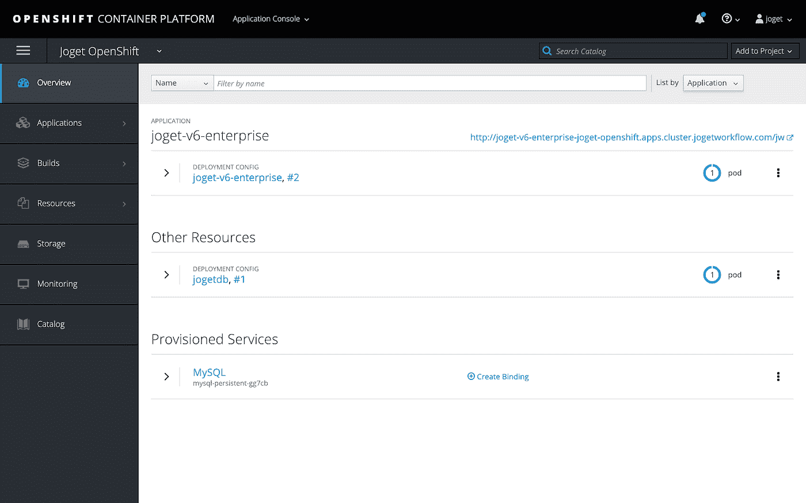

# 设置数据库

首次访问 Joget 平台时，将显示[数据库设置](https://dev.joget.org/community/display/KBv6/Setting+Up+Database)页面。使用之前部署 MySQL 数据库时定义的值配置数据库设置，例如

数据库主机:jogetdb

数据库端口:3306

数据库名称:jwdb

数据库用户:joget

数据库密码:joget

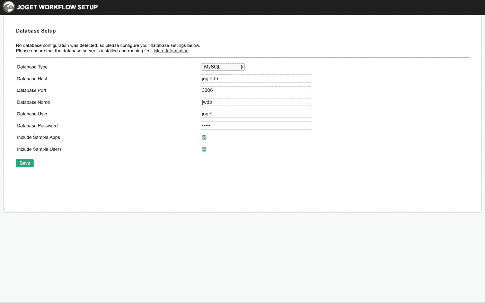

配置成功后，Joget [应用中心](https://dev.joget.org/community/display/KBv6/Apps+and+the+App+Center)将被加载。

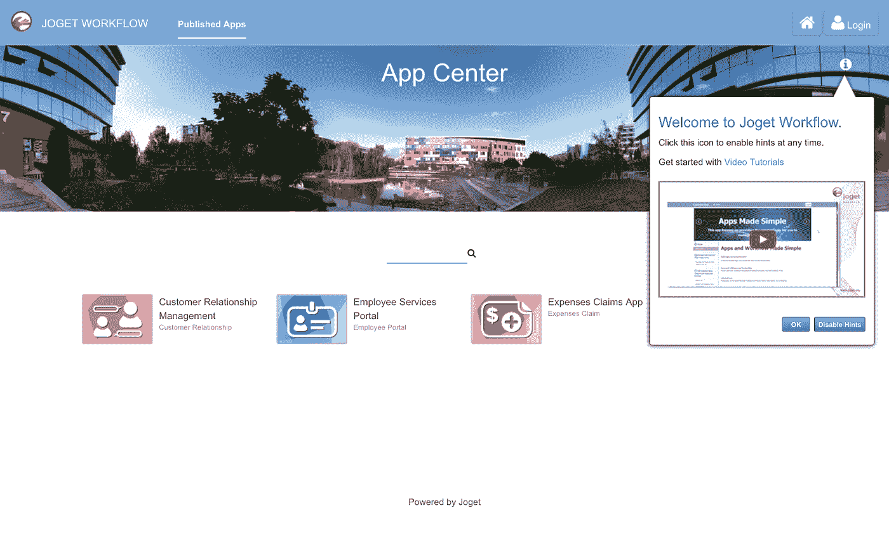

**注意**:如果在数据库设置过程中遇到 **504 网关超时**，这是由于数据库初始化花费的时间比默认的 OpenShift 路由超时长。实际上，您可以忽略该错误，等待几分钟，然后再次从 Overview 页面访问应用程序 URL。

您还可以使用 OpenShift CLI 增加路由超时，即

oc 注释路线$ APP _ NAME 覆盖 haproxy.router.openshift.io/timeout=60s

# 30 分钟搭建一个完整的 App，不用代码！

随着 Joget 平台的准备就绪，现在可以在 30 分钟内构建一个具有仪表盘、日历、审批工作流和数据管理的成熟应用程序。此外，它可以在没有编码的情况下完成，您实际上只需拖放、点击和配置即可。也可以使用一个[触摸设备来构建它](http://blog.joget.org/2016/11/the-future-of-app-development-touch-to.html)。

下面这段 30 分钟的视频展示了一个真实、实时的从头构建应用程序的例子。

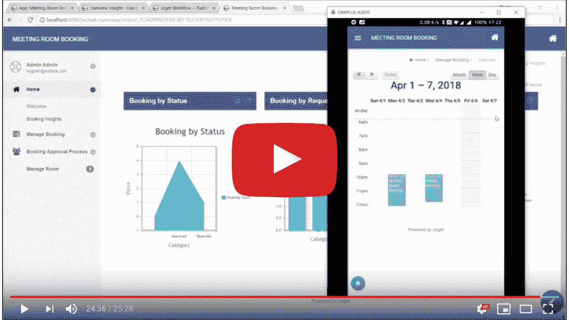

【https://www.youtube.com/watch?v=edqxt9zx_IE 号

用户还可以从[苹果应用商店](https://itunes.apple.com/us/app/joget-workflow-mobile/id1084995640)和[谷歌 Play 商店](https://play.google.com/store/apps/details?id=org.joget.mobile)下载 Joget 移动应用程序，访问完全相同的应用程序，其用户界面自动为移动设备量身定制。

# Joget 入门

要开始使用 Joget 平台:

*   访问 [Joget 工作流产品页面](https://www.joget.com/joget-workflow.html)
*   使用[知识库](https://dev.joget.org/community/display/KBv6/Joget+Workflow+v6+Knowledge+Base)中的[入门指南](https://dev.joget.org/community/display/KBv6/Get+Started)进行学习。
*   通过 [Joget 学院](https://academy.joget.org/)学习。