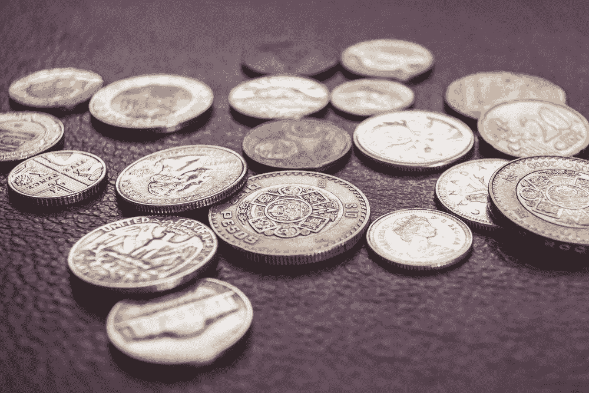

# 代币趋势如何

> 原文：<https://medium.com/hackernoon/how-tokens-are-trending-2c07dab683b1>

## 在我们开始之前，如果你或你的朋友在 5/13 周一下班后在伦敦，并且想听《黑客正午》的作者亲自讲述故事，请在 Huckletree Shoreditch 查看“ [#CrazyTechStories 由《黑客正午》& Indeed Prime 呈现”。](https://www.eventbrite.com/e/crazytechstories-presented-by-hacker-noon-indeed-prime-tickets-60599360318?discount=crazyhackers)

*嘿，*[*ut sav Jaiswal*](https://hackernoon.com/@utsavjaiswal1)*此处，* [*骇客正午的新(-ish)区块链编辑。*](https://hackernoon.com/meet-the-new-hacker-noon-editors-b37508a3e771)

根据 Etherscan 的数据，现有超过 18，000 种加密货币或代币。你能想象一个我们从“有一个应用程序”转变为“有一个 dApp”的世界吗？Hacker Noon 的作者已经检查并剖析了这些[加密货币](https://hackernoon.com/tagged/cryptocurrency)中的几种，它们是从花哨的公关和白皮书中脱颖而出的。我们为您呈现[安全令牌](https://hackernoon.com/tagged/security-token)、[不可替代令牌](https://hackernoon.com/tagged/nonfungible-tokens)、[平台接入令牌](https://hackernoon.com/tagged/platform-access-tokens)、[燃气令牌](https://hackernoon.com/search?q=gas%20tokens)、 [Stablecoins](http://hackernoon.com/stablecoins) 中的二十篇趋势文章。

快乐阅读！！

*在开始之前，我们想提醒您的是* [*任何人都可以在社区*](https://community.hackernoon.com/c/Crypto) *或* [*中发起一个加密讨论主题，提交一个区块链或加密故事以供审核*](https://contribute.hackernoon.com/) *(由我或其他编辑之一)在黑客正午* *上发表* [。](https://contribute.hackernoon.com/)

## [**安全令牌**](https://hackernoon.com/tagged/security-token)

安全令牌曾经被认为是去中心化所代表的一切的祸根，现在它已经找到了自己的位置，成为每个人最喜欢的合规令牌:

1.  [安全令牌选集:2019 年 4 月版](https://hackernoon.com/the-security-token-anthology-april-2019-edition-d56b8719adb0)【7 分钟阅读】作者 [Jesus Rodriguez](https://hackernoon.com/@jrodthoughts) 汇集了互联网上关于安全令牌的一些最佳文章。
2.  [“证券”不应该是一个肮脏的词](https://hackernoon.com/securities-should-not-be-a-dirty-word-c9f2d65640b6)【5 分钟阅读】作者[大卫·韦斯伯格](https://hackernoon.com/@daveweisberger)解释了为什么我们不应该在原则上回避证券，而是接受它们作为开启下一轮加密牛市的钥匙。
3.  [安全令牌产品(sto)](https://hackernoon.com/security-token-offerings-stos-cddf965bd7a6)【7 分钟阅读】作者 [Rahul Yadav](https://hackernoon.com/@rahulmanuwas) 研究代表资产和/或实体的全部或部分所有权利益的安全令牌设计

## [**不可替代令牌**](https://hackernoon.com/tagged/nonfungible-tokens)

俗称 NFTs，由 Cryptokitties 推广，差点打破以太坊区块链的游戏。NFT 被认为是将无价资产(如绘画)标记化的机构:

1.  [NFTs——区块链游戏的无限潜力](https://hackernoon.com/nfts-the-unlimited-potential-for-blockchain-gaming-f5703a9d6bde)【7 分钟阅读】作者 [Alex Libertas](https://hackernoon.com/@alexlibertas) 探讨了让游戏中的贵重物品在外部世界中保持其价值的途径。
2.  [虚拟资产的未来:介绍分数 NFT](https://hackernoon.com/the-future-of-virtual-assets-introducing-the-fractional-nft-84c218da73c9)【10 分钟阅读】作者 [Marc Howard](https://hackernoon.com/@marcbegins) 讲述了区块链技术虚拟资产的组合如何有机会不再局限于传统用例。
3.  [NFTs 和数字纪念品的未来](https://hackernoon.com/nfts-and-the-future-of-digital-memorabilia-ad39dad6b7f3)【7 分钟阅读】作者 [Cuy Sheffield](https://hackernoon.com/@cuysheffield) 通过区块链历史上不可替代的令牌来推断其未来的接受程度。

## [**平台访问令牌**](https://hackernoon.com/tagged/platform-access-tokens)

过去在 2017 年与公用令牌难以区分，但现在表示那些能够访问特定平台的加密货币:

1.  [捷豹路虎和 IOTA 基金会计划奖励司机加密他们的交通数据](https://hackernoon.com/jaguar-and-iota-considers-giving-drivers-crypto-in-return-for-their-traffic-data-864983dbc0bc)【2 分钟阅读】作者 [Han Yoon](https://hackernoon.com/@hanyoon) 报道了汽车重量级捷豹公司支付加密货币的计划，只要驾驶加密货币。
2.  顶级绿色采矿秘密项目【14 分钟阅读】作者 [Eric Bal](https://hackernoon.com/@eric.baleine) 仔细梳理了 5 个最大的秘密采矿项目，并展示了他的发现。
3.  [现在是 2019 年。哪里是我们的全球点对点电子现金系统？](https://hackernoon.com/where-the-f-ck-is-our-peer-to-peer-electronic-cash-system-c8f43f5ad8b0)【15 分钟阅读】作者[汤姆·霍华德](https://hackernoon.com/@_TomHoward)讲述了他的婚姻计划是如何被银行毁掉的，并区分了电子现金和 P2P 现金系统。

## [**气令牌**](https://hackernoon.com/search?q=gas%20tokens)

也被称为加密硬币或简单的硬币，这些是他们自己的区块链的基础货币。多年来，这一类别已经成为最受追捧的加密货币:

1.  [比特币与匿名:什么是比特币混合？为什么人们会使用它？克拉克·韦恩(Clark Wayne)](https://hackernoon.com/anonymity-and-bitcoin-what-is-bitcoin-mixing-and-why-do-people-use-it-84c62ccb20c2)[的【9 分钟阅读】深入研究了匿名和人们保持交易历史隐私的程度。](https://hackernoon.com/@cryptomagis)
2.  币安能超越监管者吗？【10 分钟阅读】作者[伊姆兰·汗](https://hackernoon.com/@lmrankhan)概述了新宣布的币安链及其对监管者的意义。
3.  [不断增长的生态系统推动 EOS 发挥潜力，尽管遇到挫折](https://hackernoon.com/growing-ecosystem-pushes-eos-to-potential-despite-setbacks-ac22a15f8719)【4 分钟阅读】作者[鲁本·杰克逊](https://hackernoon.com/@reubenjackson123)解释了为什么尽管 EOS 被大肆宣传，但它并非没有批评者。

## Stablecoins

是法定货币和类似商品的数字等价物。尽管其他加密货币的价格起伏不定，但正如其名称所示，stablecoins 旨在保持价格稳定:

1.  [系绳、信任以及为什么加密需要可信的银行](https://hackernoon.com/tether-trust-and-why-crypto-needs-trusted-banks-c7d634762303)【6 分钟阅读】作者 [Chance Barnett](https://hackernoon.com/@chancebar) 谈到银行在去中心化中不受欢迎，并认为我们对它们太苛刻了。
2.  [Marcus Tan](https://hackernoon.com/stablecoins-and-the-stability-misnomer-b81623a4536e)的《稳定的硬币和稳定性的误称【9 分钟阅读】研究了那些稳定的硬币失去挂钩并表现出价格波动的事件，无论这种波动可能多么短暂。
3.  [稳定的硬币和加密货币的大规模采用](https://hackernoon.com/stablecoin-cryptocurrency-tron-tether-ff5afe55dcda)【5 分钟阅读】作者 [Mina Down](https://hackernoon.com/@minadown) 指出，另一种稳定硬币产品的出现对整个加密货币行业有利。

总之，尽管几乎每天都在创造新的加密货币，但只有少数几个实现了它们的潜力。随着权力下放的趋势没有停止的迹象，分散投资组合从未如此容易。

*我们在*[*hacker noon*](http://hackernoon.com)*很高兴能为那些参与开发基于区块链的解决方案的人提供一个讨论的平台。您可以通过查看我们的* [*投稿人关于区块链科技*](https://hackernoon.com/blockchain/home) *的故事来成为讨论的一部分，并记住* [*任何人都可以在社区*](https://community.hackernoon.com/c/Crypto) *或* [*中发起一个加密讨论主题，提交一个区块链或加密故事以供审核*](https://contribute.hackernoon.com/) *(由我或其他编辑之一)在黑客正午* [*发表*](https://contribute.hackernoon.com/)