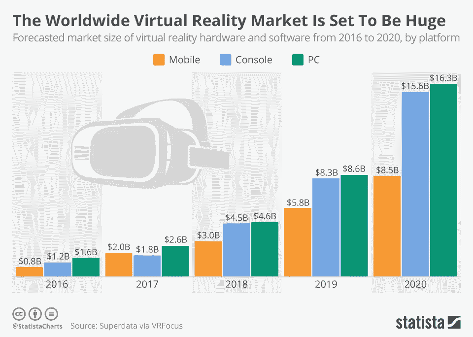
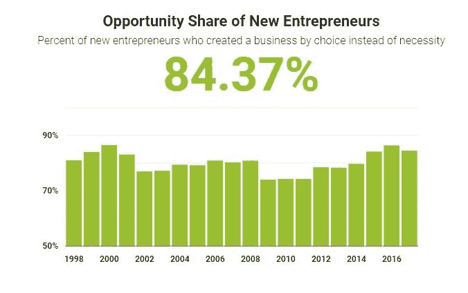

# 虚拟现实如何帮助你从竞争对手那里抢走客户

> 原文：<https://medium.com/hackernoon/how-virtual-reality-can-help-you-take-customers-from-competitors-9c6826863343>

Virtual Reality is like dreaming with your eyes open

虽然[技术](https://hackernoon.com/tagged/technology)最近获得了全球赞誉，但它已经存在很久了。最初由[美国陆军](https://unimersiv.com/military-incorporating-vr-troop-training/)采用，随后有更多的品牌采用，然而，[虚拟现实](https://hackernoon.com/tagged/virtual-reality)从未在用户参与的大规模水平上被接受。

由于技术具有如此大的潜力和范围，主要的专业知识在于理解如何利用它来实现目标。无论是用户参与还是获得新的受众，虚拟现实确实可以成为提升客户体验的关键因素。该技术的早期采用者将在吸引潜在客户的注意力方面具有更大的竞争优势。

The Virtual Reality Market is Set to be Huge

根据 statista 分享的一份[报告](https://www.statista.com/chart/6677/the-worldwide-virtual-reality-market-is-set-to-be-huge/)，虚拟现实市场预计到 2020 年将达到 156 亿美元。话虽如此，但毫无疑问，技术在过去几年里获得了巨大的反响，并已成为发展业务的不可战胜的工具。

## 想知道虚拟现实是如何为品牌服务的吗？

web 成为全球客户首选中心的原因是它提供了便捷和个性化的体验。然而，竞争异常激烈的网络世界需要创新，而这正是虚拟现实所能提供的。唯一需要的是理解以最佳方式利用它的可能方式。

说了这么多，我们在这里与你分享分享你可以利用技术从你的竞争对手那里吸引客户的方法。让我们来看看:

**#1 创建虚拟资产**

如今，在虚拟现实领域获得优势的组织将自己定位为行业先锋。位于华盛顿大学的 CoMotion 总部正在开发这种模式，提供虚拟实验室空间作为其新孵化区的一部分。此举使他们能够吸引开创性的客户，并在购物者的心理中将自己与现代创新联系起来。

思考一下如何通过虚拟资源提升你的形象。为主流娱乐制作局外人附加项目，通过您的便携式应用程序提供虚拟访问，或制作独立的 AR 和 VR 项目。在研究了 AR 和 VR 之后，我们了解到眼球追踪创新可以迅速有力地改变周围的目标，所以我们开始研究这个节目。你能做些什么来让你的形象走向另一条道路？对虚拟资源的兴趣在人类历史上是非同寻常的，所以如果必要的话，利用这个机会改变策略。

#2 **建立产品优势**

由于每个人都将激增分派 AR 和 VR 项目和管理，所以组织现在将自己分开是很重要的。发现你拥有异常有利条件的市场领域，并从中获利。当我们开始与 eye-collaboration 一起工作时，我们观察到市场部门应该已经准备好通过无手输入快速工作，但是，利用头部开发会伤害他们的脖子，并且在他们处于平静区域的机会很小的情况下说话很笨拙。

Opportunity share of new Entrepreneurs

不仅仅是现有的组织专注于 AR 和 VR，尖端的协会也会这样做。超过 [87.37%](http://www.kauffman.org/microsites/kauffman-index) 始终是新企业家，[2700 万适龄工作的美国人](http://www.babson.edu/Academics/centers/blank-center/global-research/gem/Documents/GEM%20USA%202014.pdf)忙于商业企业。有了这些数字，您的企业就不能再依赖这些创新了。陈述你的优势，无论如何都要坚持下去。

**#3 专注于你的核心市场**

与你的目标客户保持一致是进取和发展的基础。当我们创造和推进我们的创新时，我们通常会问它如何服务于我们的目标利益群体个人。它能接受他们的需要吗？它是给他们提供了一个机械的首选立场，还是使他们越来越有效？这是坦诚的满足吗？

同样，在追求 AR 和 VR 模式时，不要失去忠实的客户群。新的资源应该反映本组织的主要目标，并增加其贡献。

**#4 开箱即用**

优秀的组织着眼于未来，为当前市场而改进。例如，许多汽车组织目前正在测试未来的设备和编程要点，这些要点将与他们的推进计划保持一致。因为他们向前看，他们将有能力利用现有的程序和供应链构建新的模型，而不是在没有外部帮助的情况下开始。

我们通过雇佣顶尖人才和展望未来几年的创新来保持想象力。同样，将资源投入到创新工作中，这样你的组织就能领先一步，并在发展新项目的情况下保持可靠。

**#5 做一个讲故事的人**

以前，电影是最生动的叙事媒介。无论如何，这群旁观者仍然只是在观看。目前，虚拟现实提供了另一种“接近”的保证和你是完整的倾向。这使它成为你的图像叙事的惊人资产。确保你在视频中为你的客户的冒险创造了一个坚实的故事。此外，使用智力和视觉和声音信号，使故事逐渐有效。

例如，纽约时报制作了一个[不常见的虚拟现实多功能应用](https://www.nytimes.com/2015/11/08/magazine/virtual-reality-a-new-way-to-tell-stories.html)，讲述生动的故事。通过虚拟现实,《纽约时报》将读者置于新闻焦点，非凡的叙事和引领潮流的创新让个人获得他们通常不会去的地方。

**结论**

毫无疑问，这项技术不仅获得了初创公司的极大关注，也获得了品牌的极大关注。然而，它是完美和无缝的实施，这有助于您的企业获得应有的成功。话虽如此，选择合适的[虚拟现实应用开发](https://www.intelivita.co.uk/virtual-reality-app-development.php)技术合作伙伴至关重要，他们可以指导和帮助你从竞争对手那里吸引客户，并提高你的销售和市场占有率。