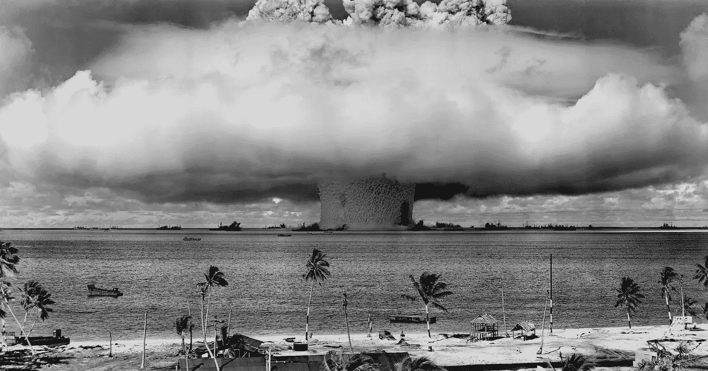

# 地球上的战争如何结束

> 原文：<https://medium.com/hackernoon/how-wars-on-earth-end-4981cf35cab>

来自小说[基地:现实的边缘](https://www.amazon.com/dp/B0B4JN9LK8)

2048 年，地球再次处于核战争的边缘。行星杀手武器在他们的发射井中老化——来自过去的变态礼物。拆除武器的令人沮丧的努力一次又一次地失败了。缺乏政治意愿、缺乏勇气和缺乏智慧是这种顽强的生命力的基石。没有实质性的裁军。

Atomic Bomb on Earth