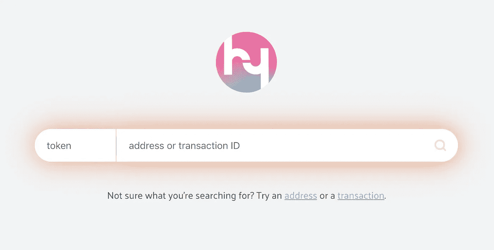
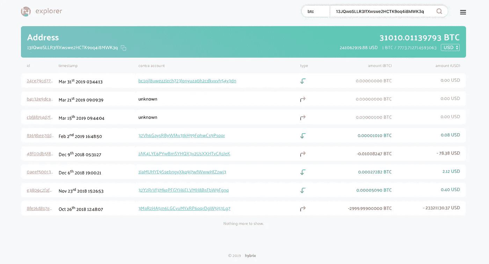

# 我们如何在三周内建造一个多区块链探险者

> 原文：<https://medium.com/hackernoon/how-we-built-a-multi-blockchain-explorer-in-3-weeks-3aadeeea9ca>

今天，我们推出了 hybrix 浏览器，让你可以浏览几乎每个主要区块链的交易历史。目前有 26 个支持区块链！该项目是完全开源的，构建在 hybrix API 之上。在这个博客中，我们想与你分享我们的开发过程，让你了解使用 hybrix API 是多么容易。



# **挑战**

这个项目的故事始于我们营销团队的 Sander 意外地询问是否有可能使用 hybrix 创建一个多分类帐块浏览器。我们的开发人员之一 Rouke 回答说:“当然，一切皆有可能，但是……”

在 hybrix API 上构建一个人类可读界面的想法非常酷，甚至是显而易见的。但是难的部分在于把一个东西做成一个打磨过的产品。第一个 **80%** 很快就做好了，但是最难的是完成最后的 **20%** 。对于一个雄心勃勃的小团队来说，时间是非常宝贵的资源。

但是睡了一夜好觉之后，我们接受了挑战。范围很清楚:在我们的 API 之上的一个非常薄的前端层。没有后端支持的东西是不会被实现的。我们坚定地同意保持较小的范围，为一个很棒的设计保留一些空间。

# **观看我们的团队谈论开发流程**

# **欢迎用户的设计**

我们从分析竞赛的设计开始，希望为用户创造一些更简单、更干净、更易使用的东西。受 DuckDuckGo 的简单性的启发，我们将我们的 frontpage 设计成不受干扰的，并继续设计具有清晰元素的交易页面，以指导用户并解释交易。总的来说，我们想创建一个区块链浏览器，任何人都可以使用他们拥有的所有加密货币和代币。



# **连接前端和后端**

我们的 API 已经有了必要的端点来检索关于地址余额、历史和事务的信息。

```
[*https://api.hybrix.io/asset/eth/transaction/0x5496d381d8b2c6ae028c69f90a643f1c453bbfd0381df9d0af0e20b09a04dadd*](https://api.hybrix.io/asset/eth/transaction/0x5496d381d8b2c6ae028c69f90a643f1c453bbfd0381df9d0af0e20b09a04dadd)
```

会给你以太坊交易的细节

```
[*https://api.hybrix.io/asset/lsk/history/5920921428156130553L/10/0*](https://api.hybrix.io/asset/lsk/history/5920921428156130553L/10/0)
```

会给你一个 lisk 地址的最近 10 笔交易

```
[*https://api.hybrix.io/asset/btc/balance/13JQwoSLLR3ffXwswe2HCTK9oq4i8MWK3q*](https://api.hybrix.io/asset/btc/balance/13JQwoSLLR3ffXwswe2HCTK9oq4i8MWK3q)
```

会给你一个比特币地址的余额。

就这么简单。在几个小时内，第一个原型就建立并运行起来，并集成到我们的 CI/CD 自动部署管道中。

如果你想了解更多关于 hybrix API 的知识，在 [API 文档](http://api.hybrix.io)中有更多的例子。

 [## 帮助| hybrix -构建灵活的区块链解决方案

### 这个应用程序编程接口可用于从 hybrixd 检索信息。请求的格式为…

api.hybrix.io](https://api.hybrix.io/) 

# **进入后端的小跳水**

为了了解这些调用在后端是如何处理的，这里有一个我们代码的小例子。用 qrtz (Quartz)脚本语言编写:

```
 poke count $2 12poke offset $3 0curl asset://$symbol /api/transactions?recipientId=$1&offset=$offset&limit=$count GET {Accept:’application/json’,’Content-Type’:’application/json’}tran .data 2 1fail ‘Cannot get transaction history!’sort [‘.height’,num,desc]tran [].iddone
```

这个代码示例来自 Lisk recipe 并处理调用:

```
[*https://api.hybrix.io/asset/lsk/history/5920921428156130553L/10/0*](https://api.hybrix.io/asset/lsk/history/5920921428156130553L/10/0)
```

其中$1 是地址，$2 是计数，$3 是偏移量。数据是从 lisk 区块链节点检索的。结果数据被转换、排序并返回，或者如果失败，则抛出一个错误。

qrtz 的强大之处在于它的简单性、错误处理的健壮性以及许多 qrtz 过程可以同时运行、自省和管理的事实。用 Javascript 几乎不可能做到的事情。

# **探索者的局限**

到目前为止，我们的 API 还没有包含您可能在其他浏览器中找到的特定块的细节。它也不会自动提供某个地址的所有令牌余额。我们意识到了它的局限性，我们自己也有一个很大的改进愿望清单。

我们为我们在如此短的时间内建造的探索者感到非常自豪，并为继续建造提供了基础。

# **与我们一起建设！**

Hybrix 已经支持 26 种不同的区块链和 400 多种令牌。我们将继续增加硬币和功能。通过我们 API 优先的设计方法，所有新添加的硬币将自动进入所有基于 hybrix 的项目和产品。硬币钱包的互联网，全新的 hybrix 浏览器，命令行工具和基本上任何你和其他人用 hybrix 构建的东西。

您想在 hybrix 浏览器中添加对您的令牌的支持吗？这只需要几行代码就可以实现。查看我们的[令牌支持指南](https://internetofcoins.org/blog/easy-steps-to-add-token-support)了解更多信息。

甚至可以下载我们的节点，并托管您自己的多分类帐块浏览器。

您可以在 [Github](http://github.com/hybrix-io) 上找到该项目的开源代码，如果您想为该项目做贡献，也可以通过 Telegram 联系我们。

[](https://github.com/hybrix-io) [## hybrix.io

### 构建灵活的区块链解决方案。仅用一个工具开发 26 个以上的链。利用每个链条的独特之处…

github.com](https://github.com/hybrix-io) 

如果你想试试我们的探索者，我们会很高兴，并让我们知道你的想法！