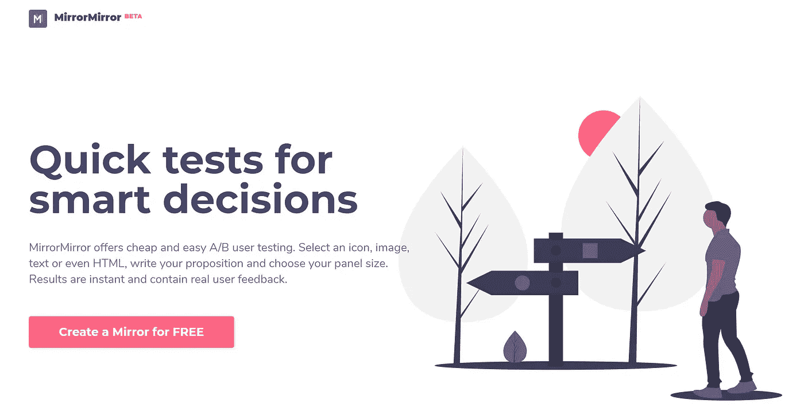
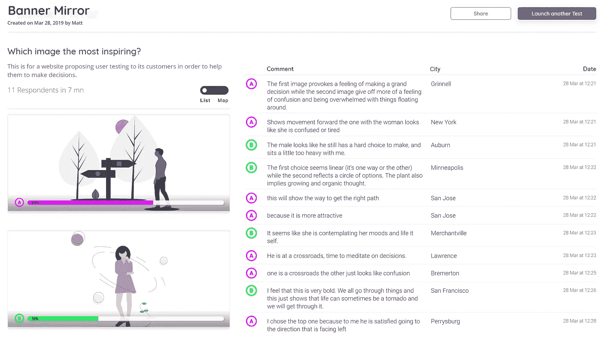
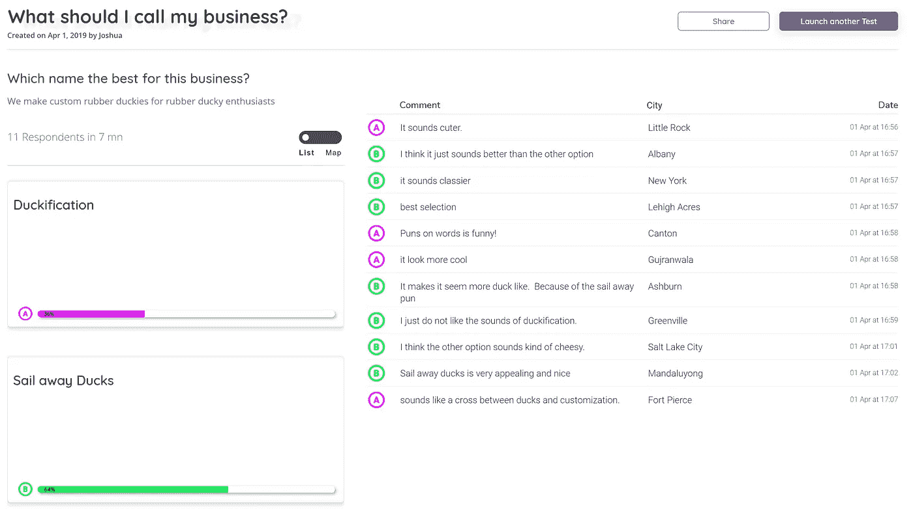

# 我们如何在一周内构建了一个应用程序，并赢得了产品狩猎活动

> 原文：<https://medium.com/hackernoon/how-we-built-an-app-in-a-week-and-won-the-product-hunt-hackaton-5005eb48f3d9>

> 我们在 5 天内创建了一个产品搜索比赛获奖应用程序。在这个系列中，我们分享我们的成功和失败，试图建立一个成功的产品。

注册晚了，我们现在不得不加快工作速度。在一个快速而粗略的范围界定会议之后，我们开始设置 MTurk API 连接并设计接口。使用我们自己的 Base*模板，一个基本的 Bubble 应用程序，具有大多数标准应用程序功能，如基本的前端用户界面、导航、用户管理和后端数据库，我们在周一从头开始开发新应用程序，并在第二个周六早上及时交付了 [MirrorMirror](http://mmirror.io/) 。与此同时，客户工作仍在继续，所以这是一次我们的家庭并不完全欣赏的经历…

The point of no return…

看到你可以用一个清晰的范围和我们自己的预构建元素开发的特性的数量，**很难反对低代码和无代码解决方案的力量。**我们为用户创建了一个界面，用图像或文本甚至 html 来创建测试。每个用户都有自己的仪表板，上面有所有创建的测试的概述和测试结果的详细概述。

我们实施了事务性电子邮件来通知用户他们的测试何时完成，构建了 Turker 界面供回答者进行选择，并创建了一个包含精选公共测试的 feed，显示在登录页面上。最重要的是，我们做了一个管理仪表板，在那里我们可以分配免费信用，并跟踪用户和镜像创建。

> 我和女儿一起上游泳课，突然我的手机死机了。

投票开始时看到的竞争让我们对用 MirrorMirror 获胜的机会充满信心。是的，在我们的类别中有一些非常好的想法，但是*显然*没有什么能与我们的应用程序和功能相提并论。我的意思是，我们甚至有一个很好的登录页面！

作为我们第一个公共应用程序的自豪的父母，我们做了所有自豪的父母一有机会就会做的事情:向任何可能在听的人谈论他们的孩子。我们求助于 [Bubble.is](http://bubble.is) 社区，并创建了[一个帖子](https://forum.bubble.is/t/help-mirrormirror-and-bubble-win-the-no-code-edition-of-product-hunt-makers-festival/53330)来庆祝我们的竞赛提交，试图获得一些投票。此外，我们真的希望从用户那里得到一些好的(或不太好的)反馈。结果是…..不是我们所期望的！

虽然我们感谢来自社区的支持，但在比赛期间的两周内，该应用程序上只创建了一个**免费镜像(我们为每位用户提供了一次免费测试，我们自己支付了费用)。为什么没有人创造一面镜子？**

Our first REAL Mirror

# 请注意，这应该是设计师和企业家验证他们的设计和想法，从而做出更明智的商业决策的工具。

结果告诉了我们一些别的东西。两周内注册的五个人中有一个测试。我们实施了一些快速修复措施，流量有所增加，但我们的信心却降到了历史最低点。

产品搜寻活动获奖名单公布的那天，我正和女儿一起上游泳课，突然我的手机死机了。Hotjar 爆炸了，人们在评论我们的论坛帖子。直到我们回到家，我才意识到我们已经赢得了我们的类别。我不敢相信我们真的赢了。这既令人兴奋又充满希望！

因此，我们在这里，我们赢得了产品狩猎制造商节(好吧，是的，为我们的类别)，有一个相当稳定和无缺陷的产品。现在怎么办？

在接下来的文章中，我们希望开始一段旅程，探索我们如何才能实现这个应用程序的目标，并分享在这个过程中发生了什么。

花费:350 小时

收入:0 美元

## 请告诉我们如何改进这个系列。关于这个项目，你有什么具体想知道的吗？

第一部分:建立一个成功的创业公司。能有多难？