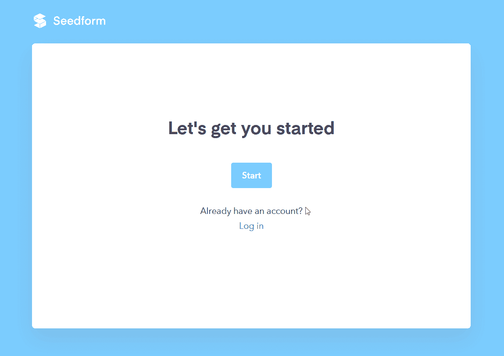
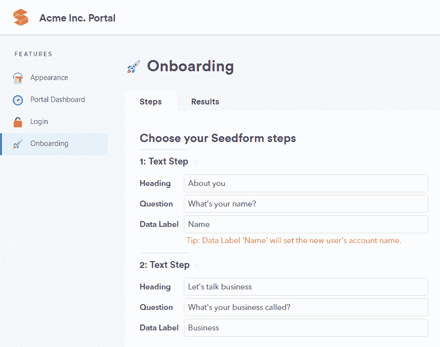
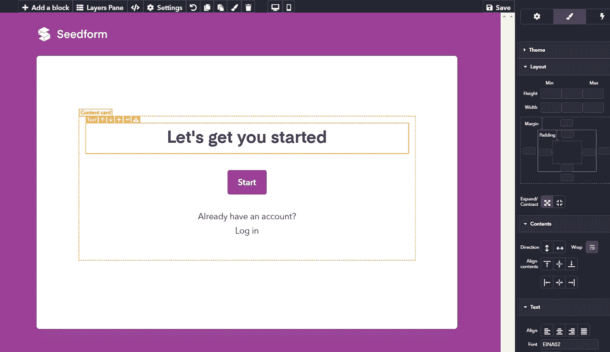

# 我们如何用一个不用代码构建的产品成为产品搜索的第一名

> 原文：<https://medium.com/hackernoon/how-we-got-to-no-1-on-product-hunt-with-a-product-built-without-code-3b1d581837c8>

## [*Seedform*](http://seedform.app/) *表明在一个无代码平台上制作一个成熟的 SaaS app 是可能的*

# 从愿景到战略

Stacker 的大愿景是让任何人都能够不用代码就能构建应用。

有很多可行的策略可以做到这一点。成为一个接地气的 app 建设者(泡泡)。为设计人员创建一个工具，然后他们可以将代码交给开发人员(Webflow)。从普通电子表格的超级版本开始，然后发展成为人们的商业系统(Airtable)。

我们的策略是:销售应用程序，而不是应用程序构建者。

我们认为这让用户在很短的时间内获得大量的价值。用户可以安装他们的应用程序，然后从一个工作的起点定制主题、流程和数据模型，而不是一个不工作的空白画布。

更简单地说，对用户来说，这两个步骤是:

1.  安装
2.  定制

# 一个表单构建器，使用无代码构建器构建

我们对这两个步骤的第一个测试是 Seedform，这是一个建立在我们的无代码平台上的多页表单生成器。

Seedform 允许用户注册，为他们的客户创建问题，更改徽标和主题，然后发布他们的表单，并提供一个区域来查看响应。每个问题都会在入职流程中生成新的一页。填写完表格后，客户注册一个简单的门户网站，在那里他们可以编辑对表格的回复。可以在这里报名[试试。](https://seedform.app/signup/1)

我们在 Stacker 上构建 Seedform 有两个原因，而不是从代码中从头开始。

第一，节省时间。我们中的五个人在不到两周的时间里开发并发布了 Seedform。

第二，也是更重要的，帮助我们的用户完成第二步:定制。Seedform 在两个级别上工作:

*   参见表单设置:制作多页表单的向导(见上面的截图)
*   Stacker builder:成熟的无代码应用程序构建器(见下面的截图)

Seedform 设置级别允许您更改 Seedform 的一些内容，例如问题、徽标和主题。但是对于需要更多灵活性的用户，可以在 Stacker builder 级别进行定制。

例如，如果您想要更改出现在表单开头的标语“让我们开始吧”,您可以在构建器级别进行更改:

事实上，你可以在构建器中修改几乎任何东西:把所有东西都贴在漫画里，放入一个 90 年代的字幕动画，添加一个像这样的象征性的猫 GIF。

# 没有代码会吃掉世界

Seedform 于上周三推出，并于周六在产品搜索上排名第一，有近 200 人注册试用。

我们很高兴我们通过了能否使用我们自己的无代码平台创建 SaaS 产品的测试。但我们更兴奋的是我们认为这意味着什么:我们正处于人们制作软件方式的一场革命的开端。

我们认为，未来 10 年将会看到越来越多的产品以与 Seedform 相同的方式构建，因为没有代码工具不仅能够制作应用程序，还能够制作制作应用程序的应用程序。

我们的目标是成为故事的一部分。

# 下一步是什么

我们正在与 Seedform 用户交谈，根据他们的反馈改进第一个版本，同时构想下一个 SaaS 应用程序，我们可以在 Stacker 上创建没有代码的应用程序。

*敬请关注更新，想聊天也可以在路易[at] stacker [dot] app 联系我！*

*在这里找 Stacker:https://Stacker . app*