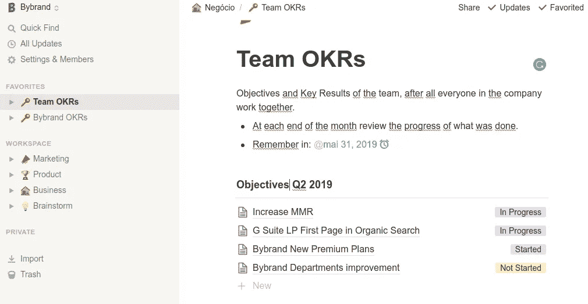
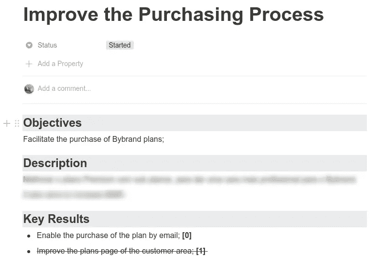
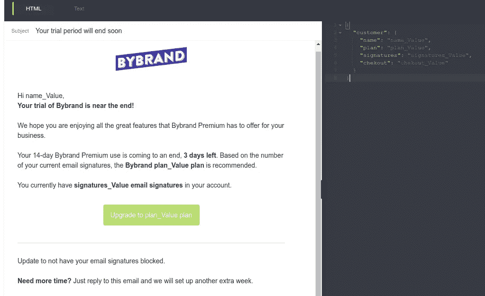
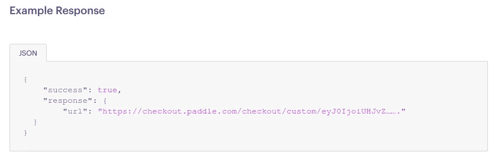
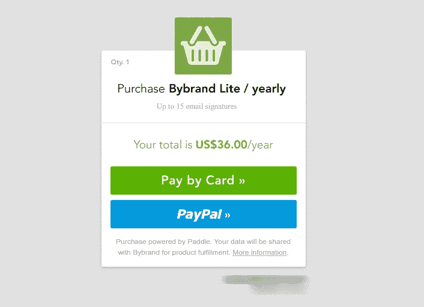

# 因为 OKRs 连同邮戳和 Paddle.com 已经帮助 Bybrand 提高了 MMR

> 原文：<https://medium.com/hackernoon/how-we-increase-purchase-plans-directly-by-email-fd45a3d2278d>

如何快速增加你软件的月销量？

如果你问营销人员这个问题，他可能会建议你在付费广告上投入更多的钱，如果同时要求销售人员，他会问你一些折扣券，如果你问软件工程师同样的问题，他会建议对网站或产品进行改进，并继续下去。

毫无疑问，这些都是增加应用销量的可能方法。我们在 [Bybrand](https://www.bybrand.io) (一名电子邮件签名经理)想到了所有这些选项，但我们所做的主要修改和真正的成本效益结果是消除合同计划过程中的摩擦。

> *销售越多，摩擦就越少。*

在这篇文章中，我打算从技术上演示，我们如何能够增加我们的 MMR(在一个多月的时间里从 400 美元增加到 1.200 美元)，从而更容易通过电子邮件直接购买计划。

我将开始实践，但不会太深入细节，因为您可以将 case 模型与其他工具一起使用。例如，我们使用 Paddle.com 的(支付处理服务)和邮戳(事务性电子邮件)，您可能希望使用 Stripe 连接到 Sendgrid 来发送事务性电子邮件。

# 简史

我用自己的钱创建了一个品牌，你知道，通过自举创建一个企业有它所有的麻烦，但往好的方面想，你有做出所有决定的自由，这通常就像帕累托原则，80%是错误的。从小处着手很酷的一点是，我们有失败无数次的自由，而不会为此付出代价，当我们犯错误时，它总是在一个较小的范围内。

我们利用这些缺陷在未来进行改进。

迈克尔·乔丹被许多人认为是有史以来最好的篮球运动员，他曾经说过，在他的职业运动员生涯中，错误多于成功。

> 在我的职业生涯中，我已经错过了超过 9000 次投篮。我已经输了将近 300 场比赛。有 26 次，我被信任去投决定胜负的一球，但都失败了。我一生中一次又一次地失败。这就是我成功的原因。
> —迈克尔·乔丹

如果你在谷歌上搜索“迈克尔·乔丹语录”，你会发现很多你可以在你的公司或个人生活中使用的短语。我还没有读过你的传记。

# 选择有用的工具

在技术部分之前，这里是它是如何开始的。

我们在 3 个多月前开始使用 OKRs，我们的第一个季度目标之一是简化购买计划的过程。

在关于 OKRs 的书籍中，提到了适应的艰难过程，在日复一日的实践中，也确实如其所写。

在我们的 Bybrand 案例中，第一个目标和关键结果没有正确创建，正如手册所说(这种情况经常发生)。但是使用 OKRs 最酷的地方在于它的适应性。最初几个月的目标和关键结果很糟糕，之后每个月你都在适应和改进，这就是神奇之处。

我们团队在本季度的目标之一是简化购买流程，这与公司的最高目标相关，即提高 MMR。

Notion.so Dashboard

我们使用[idea . so](http://notion.so/)来管理我们的 okr、软件和适应性，以满足我们在 Bybrand 内部的许多需求。

他很快转向迈克尔·乔丹(Michael Jordan)的话，强调设定目标、保持专注和不让自己被恐惧麻痹的重要性，并讲述了他如何一直将失败视为进一步尝试的动力。这听起来很像 OKRs，你不觉得吗？

好了，有了目标和 KRs，下一步就是一直去行动，关键的结果是不会单独行动。

我通过阅读 OKRs 了解到的一件事是，它不是一个任务管理器，你需要在其他地方管理工作，在我的例子中，我们在概念本身中使用另一个工作空间。

# 技术部分

这里我们开始真相的技术部分。

在这一步中，我们将向您展示我们如何让客户直接通过电子邮件签署计划，对于交易电子邮件使用邮戳，对于计划订阅使用【Paddle.com】T2。正如开头提到的，我相信你可以在你的业务中使用类似的软件来完成这个过程。

**邮戳模板**

当然，第一步是要有一个邮戳帐户，并创建一个模板。在你的私人邮戳区域，进入你的“服务器”,点击模板。基本上，您需要创建一个模板，其中设置了变量，还有一个特殊的模板用于购买按钮的结账链接。

请看我们在 Bybrand 中的例子，我们在接近尾声时发布了免费试用信息。

您可以按照邮戳教程来创建一个非常像样的模板。

*   使用一个[邮戳启动模板](https://postmarkapp.com/support/article/786-using-a-postmark-starter-template)。

这些变量由 Bybrand 内部输入到我们的内部 API 中。这些变量中最关键的部分无疑是[Paddle.com](http://paddle.com/)“结帐”链接，以重定向到带有个性化计划的购物车。

发送邮件的最佳方式是使用预定义的模板。你只需要输入自定义变量，通过 API - [用模板](https://postmarkapp.com/developer/api/templates-api#email-with-template)发送邮件。

**创建自定义结账**

[Paddle.com](http://paddle.com/)让创建自定义结账(自定义 URL)变得简单。在您的 API 中，有一个用于此功能的端点方法:

*   https://paddle.com/docs/api-custom-checkout/

您需要添加默认参数来接收客户端结帐的返回 URL

*   ”供应商标识”；
*   ”供应商认证代码”；
*   ”产品标识”；

根据您计划的订阅模式，您可能需要添加更多信息，例如 SaaS，单次购买。

在 Bybrand，我们有产品 ID，这样更方便，而且我们发送的信息很少。我们还推荐一个基于免费试用期内帐户中创建的电子邮件签名数量的计划。

Return 是一个类似于下面例子的结帐 URL

此返回 URL 必须在提交过程中提交到邮戳模板。当客户点击模板按钮中的链接时，如上所述，它将被重定向到自定义结帐。

他不需要登录到他的管理区域，在那里他通常可以找到计划的固定链接。

在某些情况下，这取决于您如何配置软件。您需要配置 webhook 来识别采购订单，以便 Paddle.com 的[能够确认您客户的付款。](http://paddle.com/)

*   使用[桨网钩](https://paddle.com/docs/reference-using-webhooks/)。

# 结论

我不会深入讨论如何通过定制模板变量来发送事务性电子邮件的技术部分。这在邮戳上已经有很好的记录了。这里的想法不是一个彻底的技术教程，而是一种提高你的付费客户率的方法，这对于任何初始 SaaS 都非常重要。

SaaS 免费试用期的结束是一个转折点，在您的*试用结束*或*试用结束*电子邮件中添加一个直接购买按钮是一个通过减少客户工作来增加销售的好方法。

这样，当估价到期时，客户就可以更轻松地登录系统，而不必浪费时间。

虽然这已经是第二个月了，但是这个想法对我们来说很有效。

**另一个案例**

将来自[Paddle.com](http://paddle.com/)的购买按钮插入到您的交易电子邮件中，可以看到邮戳很舒服，您也可以在以下操作中这样做:

*   废弃的大车；
*   账户到期，或者下一个计划到期；

以下是完整电子邮件内容的预览:

最后，这里是我们正在使用的工具列表

*   [opinion . so](http://notion.so/)为 OKRs 经理；
*   邮戳
*   [Paddle.com](http://paddle.com/)