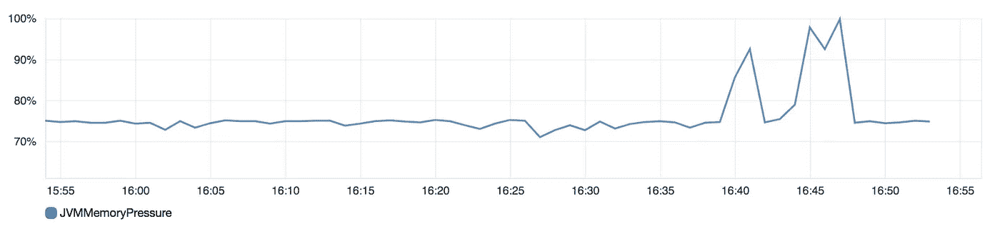
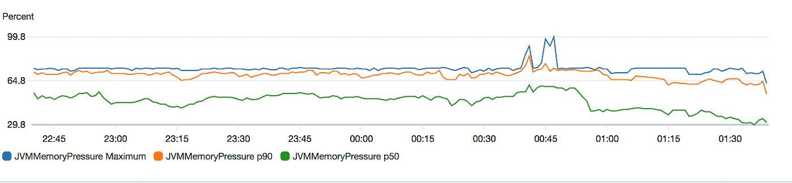
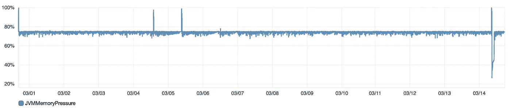

# 我们如何阻止内存密集型查询崩溃弹性搜索

> 原文：<https://medium.com/hackernoon/how-we-stopped-memory-intensive-queries-from-crashing-amazon-elasticsearch-2b6303a4c6bd>

Our team takes dress codes very seriously.

在 [Plaid](https://plaid.com/) ，我们大量使用亚马逊托管的 ElasticSearch 进行实时日志分析——从寻找生产错误的根本原因到分析 API 请求的生命周期。

ElasticSearch 集群是国内使用最广泛的系统之一。如果它不可用，许多团队就无法有效地开展工作。因此，弹性搜索可用性是我们团队(数据科学和基础设施(DSI)团队)负责的首要 SLA 之一。

因此，你可以想象当我们在 2019 年 3 月经历了两周时间的反复弹性搜索中断时的紧迫性和严重性。在此期间，由于数据节点死亡，集群一周会停机多次，我们从监控中看到的只是崩溃的数据节点上的 JVM 内存压力峰值。

这篇博文讲述了我们是如何调查这个问题并最终解决根本原因的。我们希望通过分享这些，我们可以帮助其他可能遇到类似问题的工程师，让他们少承受几周的压力。

# 我们看到了什么？

在停机期间，我们会看到类似这样的情况:

Graph of ElasticSearch node count during one of these outages on 03/04 at 16:43.

实际上，在 10–15 分钟的时间内，我们的数据节点中有相当一部分会崩溃，集群会进入红色状态。

AWS 控制台中的集群健康图表明，这些崩溃之前，数据节点上的 JVMMemoryPressure 会立即出现峰值。

JVMMemoryPressure spiked around 16:40, immediately before nodes started crashing at 16:43.

Breaking down by percentiles, we could infer that only the nodes that crashed experienced high JVMMemoryPressure ([the threshold seemed to be 75%](https://www.elastic.co/blog/found-understanding-memory-pressure-indicator#green-is-good)). Note this graph is unfortunately in UTC time instead of local SF time, but it’s referring to the same outage on 03/04.

In fact, zooming out across multiple outages in March (the spikes in this graph), you can see every incident we encountered then had a corresponding spike in JVMMemoryPressure.

在这些数据节点崩溃后，AWS ElasticSearch 自动恢复机制将开始在集群中创建和初始化新的数据节点。初始化所有这些数据节点可能需要一个小时。在此期间，ElasticSearch 是完全不可质疑的。

初始化数据节点后，ElasticSearch 开始将碎片复制到这些节点上，然后慢慢处理累积的摄取积压。这个过程可能需要几个小时，在此期间，集群能够提供查询，尽管由于积压而导致日志不完整和过时。

# 我们尝试了什么？

我们考虑了几种可能导致此问题的情况:

*   有碎片迁移事件在同一时间发生吗？(答案是否定的。)
*   会不会是[字段数据](https://www.elastic.co/guide/en/elasticsearch/reference/6.2/fielddata.html)占用了太多内存？(答案是否定的。)
*   摄入率有显著上升吗？(答案也是否定的。)
*   这可能与数据不对称有关吗？具体来说，数据不对称是由于给定数据节点上有太多活动索引碎片造成的？我们通过增加每个索引的碎片数量来测试这个假设，这样碎片更有可能均匀分布。(答案仍然是否定的。)

此时，我们正确地怀疑，节点故障可能是由于在群集上运行的**资源密集型搜索查询，导致节点耗尽内存。然而，两个关键问题仍然存在:**

1.  **我们如何识别违规查询？**
2.  **我们如何防止这些麻烦的查询导致集群崩溃？**

随着我们不断经历 ElasticSearch 宕机，我们尝试了一些方法来回答这些问题，但都无济于事:

*   **启用慢速搜索日志**来查找违规查询**。我们无法确定原因有二。首先，如果集群已经被一个特定的查询淹没，那么其他查询的性能也会显著下降。其次，没有成功完成的查询不会出现在慢速搜索日志中——而这些查询最终导致了系统崩溃。**
*   **将 Kibana 默认搜索索引**从*(所有索引)更改为我们最常用的索引，这样当人们在 Kibana 上运行只需要运行特定索引的特定查询时，他们就不会不必要地同时访问所有索引。
*   **增加每个节点的内存**。我们从 r 4.2x 大型实例到 r 4.4x 大型实例进行了重大升级。我们假设通过增加每个实例的可用内存，我们可以增加 ElasticSearch Java 进程可用的堆大小。然而，事实证明 [Amazon ElasticSearch 根据](https://docs.aws.amazon.com/elasticsearch-service/latest/developerguide/aes-limits.html) [ElasticSearch 建议](https://www.elastic.co/guide/en/elasticsearch/guide/current/heap-sizing.html#compressed_oops)将 Java 进程的堆大小限制在 32 GB ，因此我们的内存为 61GB 的 r 4.2x 大型实例已经足够了，增加实例大小不会对堆产生影响。

# 那么…我们实际上是如何诊断问题的呢？

事实证明，找到根本原因需要访问 AWS 控制台中没有的日志。

在提交了多个 AWS 支持票证并从 AWS 支持团队获得模板响应后，我们(1)开始研究 AWS 之外的其他托管日志分析解决方案，(2)将问题上报给我们的 AWS 技术客户经理，以及(3)让他们知道我们正在探索其他解决方案。值得称赞的是，我们的客户经理能够为我们联系到一位具备专业技术知识的 AWS ElasticSearch 运营工程师，帮助我们调查手头的问题(感谢 Srinivas！).

几个电话和长时间的电子邮件交谈后，我们确定了根本原因:**用户编写的查询聚集在大量的桶上**。当这些查询被发送到 ElasticSearch 时，集群试图为它看到的每个唯一键保留一个单独的计数器。当有数百万个唯一的键时，即使每个计数器只占用很少的内存，它们也会很快累加起来。

AWS 团队的 Srinivas 通过查看只对 AWS 支持人员内部可用的日志得出了这个结论。尽管我们在 ElasticSearch 域上启用了错误日志、搜索缓慢日志和索引缓慢日志，但我们没有(现在也没有)访问这些在节点崩溃前不久打印的警告日志。但如果我们能看到这些日志，我们会看到:

> `[2019–03–19T19:48:11,414][WARN][o.e.d.s.a.MultiBucketConsumerService]**This aggregation creates too many buckets (10001)** and will throw an error in future versions. You should update the [search.max_buckets] cluster setting or use the [composite] aggregation to paginate all buckets in multiple requests.`

生成此日志的查询能够关闭群集是因为:

*   我们对允许聚合查询创建的存储桶数量没有限制。由于每个桶都在堆上占用了一些内存，所以当有很多桶时，就会导致 ElasticSearch Java 进程 OOM。
*   我们没有配置 [ElasticSearch 断路器](https://www.elastic.co/guide/en/elasticsearch/guide/current/_limiting_memory_usage.html#circuit-breaker)来正确地防止每个请求的数据结构(在本例中，数据结构用于在请求期间计算聚合)超过内存阈值。

# 我们是怎么解决的？

为了解决上述两个问题，我们需要:

1.  通过将`indices.breaker.request.limit` 设置为`40%`并将`indices.breaker.request.overhead` 设置为`2`，配置[请求内存断路器](https://www.elastic.co/guide/en/elasticsearch/reference/6.2/circuit-breaker.html#request-circuit-breaker)，以便单个查询限制内存使用量。我们要将`indices.breaker.request.limit` 设置为`40%` 的原因是母断路器`indices.breaker.total.limit`默认为`70%`，我们要确保`request`断路器在`total`断路器之前跳闸。在`total`限制之前触发`request`限制意味着 ElasticSearch 将记录请求堆栈跟踪和有问题的查询。尽管 AWS 支持人员可以看到这个堆栈跟踪，但它仍然有助于他们进行调试。请注意，通过以这种方式配置断路器，这意味着占用超过 12.8 GB(40% *[32GB](https://docs.aws.amazon.com/elasticsearch-service/latest/developerguide/aes-limits.html))内存的聚合查询将会失败，但是我们愿意接受 Kibana 错误消息，而不是在任何一天让整个集群静默崩溃。
2.  通过将`search.max_buckets` 设置为`10000`，限制 ElasticSearch 将用于聚合的桶数。无论如何，不太可能有比 10K 桶更多的能给我们提供有用信息的东西。

不幸的是，AWS ElasticSearch 不允许客户通过向`_cluster/settings` ElasticSearch 端点发出`PUT`请求来直接更改这些设置，因此您必须提交一份支持凭证才能更新它们。

设置更新后，您可以通过卷曲`_cluster/settings`进行双重检查。旁注:如果你看`_cluster/settings`，你会看到`persistent`和`transparent`设置。由于 AWS ElasticSearch 不允许集群级重启，所以这两者基本上是等价的。

一旦我们配置了断路器和最大存储桶限制，用于关闭集群的相同查询将简单地出错，而不是使集群崩溃。

# 关于日志的另一个注意事项

通过阅读上面的调查和修复，您可以看到日志可观察性的缺乏在多大程度上限制了我们深入了解停机的能力。*亲爱的 AWS ElasticSearch 工程师，如果您正在阅读这篇文章，我们希望获得对我们集群的更多控制和可见性，以便我们能够更好地维护我们的集群。*

在那之前，对于考虑使用 AWS ElasticSearch 的开发人员来说，要知道选择这个而不是自己托管 ElasticSearch，你就**放弃了访问原始日志和自己调整一些设置的能力**。这将极大地限制您解决问题的能力，但它也带来了不需要担心底层硬件的好处，并且能够利用 AWS 的内置恢复机制。

如果你已经在 AWS ElasticSearch 上， [**立即打开所有日志**](https://docs.aws.amazon.com/elasticsearch-service/latest/developerguide/es-createupdatedomains.html#es-createdomain-configure-slow-logs)**——即`error logs`、`search slow logs`、`and index slow logs`。即使这些日志仍然不完整(例如，AWS 只发布了 [5 种类型的调试日志](https://docs.aws.amazon.com/elasticsearch-service/latest/developerguide/es-createupdatedomains.html#es-createdomain-configure-slow-logs))，但总比没有好。就在几周前，我们使用错误日志和 [CloudWatch Log Insights](https://docs.aws.amazon.com/AmazonCloudWatch/latest/logs/AnalyzingLogData.html) 追踪到了导致主节点 CPU 峰值的映射爆炸。**

**感谢 [**迈克尔·赖**](https://www.linkedin.com/in/themichaellai/)[**奥斯汀·吉本斯**](https://www.linkedin.com/in/austingibbons/)[**金智英**](https://www.linkedin.com/in/jeeyoungkim/)[**亚当·麦克布莱德**](https://www.linkedin.com/in/adammcb) 主动介入并推动此次调查。该表扬就表扬，这篇博文只是对他们所做的惊人工作的总结。**

****想和这些了不起的工程师一起工作吗？** [**我们正在招聘**](https://jobs.lever.co/plaid/10ee0645-5cee-4d14-999c-8a56583e61e4?lever-via=fUydCnRbfC) **！****

***如果你喜欢这个帖子，* [*在 Twitter 上关注我*](https://www.twitter.com/zhangelaz) *获取更多关于工程、流程和后端系统的帖子。***

**这篇帖子转自[格子工程博客](https://blog.plaid.com/how-we-stopped-memory-intensive-queries-from-crashing-elasticsearch/)。**