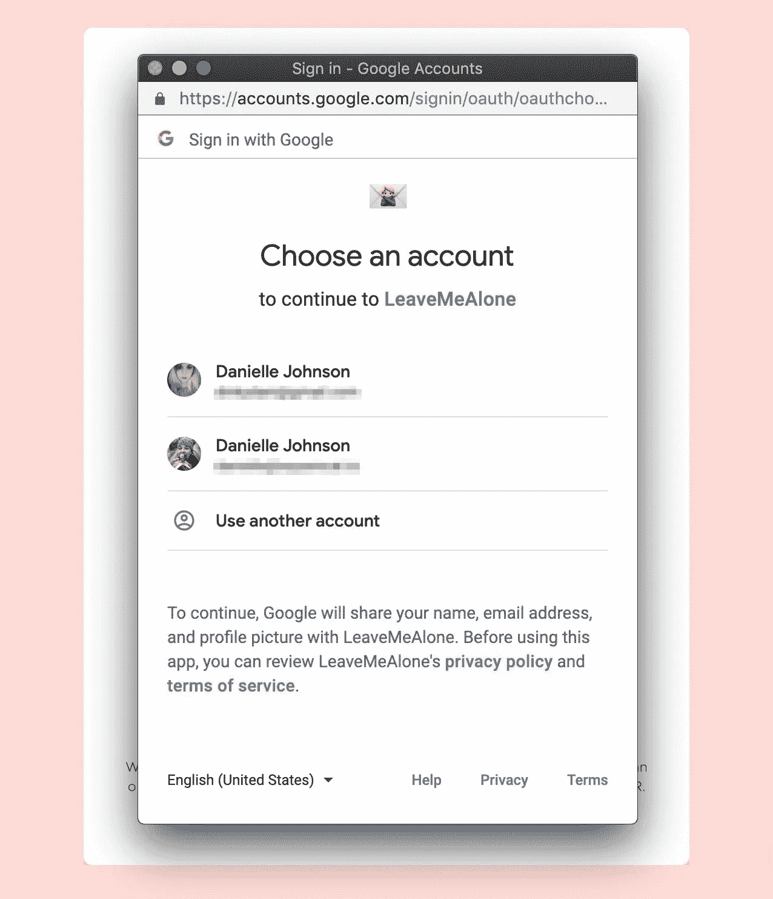
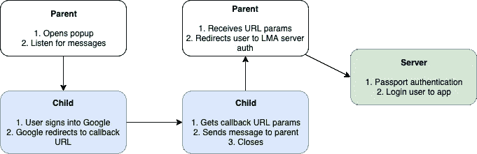

# 我们如何为 Google 和 Outlook OAuth 创建一个帐户创建弹出窗口

> 原文：<https://medium.com/hackernoon/how-we-use-a-popup-for-google-and-outlook-oauth-5d8c03652171>

在[别管我](https://leavemealone.xyz)我们使用谷歌和微软 OAuth 进行用户登录。为此，我们将用户重定向到相关的登录页面，用户输入他们的详细信息，然后被重定向回我们的站点并登录。一个不幸的结果是，我们的分析报告了大量来自“accounts.google.com”和“login.microsoft.com”的推荐流量。

为了解决这个问题，如果我们能为 OAuth 流打开一个新的窗口或弹出窗口，而不是重定向，会更好。此外，对于用户来说，这可能是比被重定向更好的体验。

我们使用[护照](http://www.passportjs.org/)进行身份验证，因此当用户登录后被引导回我们的应用程序时，URL 包含一些我们需要的参数，包括我们用来在服务器上对他们进行身份验证的令牌。

因为我们想要使用弹出窗口，所以在流程中间需要一个额外的步骤来捕获重定向、检索 URL 参数、关闭弹出窗口，并在打开的窗口(不是弹出窗口)中使用令牌。

我们允许用户使用 Google 和 Outlook 登录，两者的实现是相同的。为了便于阅读，这个例子将使用谷歌。

# 步骤 1:打开弹出窗口

为了打开一个新窗口，我们使用 [Window.open()](https://developer.mozilla.org/en-US/docs/Web/API/Window/open) 和 passport 登录 URL(在我们的例子中是/auth/google ),这将在一个新窗口中打开“登录让我和 google 独处”页面。我们还为窗口命名，并传递我们希望它拥有的[请求特性](https://developer.mozilla.org/en-US/docs/Web/API/Window/open#Window_features)。

我们分配窗口引用并记录以前的 URL，这样，如果用户再次尝试单击登录按钮，即使是针对不同的提供商，也会使用或聚焦同一个窗口。我们不希望不同供应商的两个弹出窗口四处浮动，造成混乱。

最后，我们为消息添加了一个事件监听器，因为 popup 将在完成后发送 URL 参数和 auth token。

*为了让窗口作为弹出窗口而不是新标签打开，我们必须请求“menubar=no，toolbar=no”功能。*

# 步骤 2:在弹出窗口中获取 OAuth 回调参数

当 OAuth 流完成时，Google 将用户重定向到一个回调 URL。通常，这将是一个执行 Passport 身份验证的服务器路由。由于验证是在弹出窗口中进行的，我们在应用程序中使用了一个页面，当加载时，该页面会获取搜索参数并将其发送给父页面。

这个回调页面使用一个 [React 使用效果钩子](https://reactjs.org/docs/hooks-effect.html)，它在页面加载时执行。我们获取包含身份验证令牌的 URL 参数，并使用 [Window.postMessage()](https://developer.mozilla.org/en-US/docs/Web/API/Window/postMessage) 将它们发送到打开的窗口(父窗口)。

# 步骤 3:验证用户并重定向到应用程序

OAuth 流几乎完成了，弹出窗口现在关闭了，我们只需要在我们的服务器上验证用户。

为了安全起见，接收消息函数需要检查消息的来源，以确保它来自同一个域。在编写这段代码时，我们意识到几个 Chrome 开发工具使用的 postMessage()来自同一个来源，所以我们在试图提取有效载荷之前也检查了源代码。

一旦我们有了 OAuth 参数，我们就将用户重定向到我们自己的身份验证端点，这样我们就可以使用 Passport 进行身份验证和登录。

# 完了！

这个过程非常简单，我们在这里所做的就是在 OAuth 流中添加一个中间步骤来传递回调参数。

可能有很多实现方式，但对我们来说，使用 [React.js](https://hackernoon.com/tagged/reactjs) 是最快最简单的。

希望这对您有所帮助，或者为您自己的解决方案提供一些灵感。

如果您有任何问题或建议，请告诉我们。

*原载于 2019 年 4 月 25 日*[*https://blog . squarecat . io*](https://blog.squarecat.io/how-to-oauth-popup/)*。*