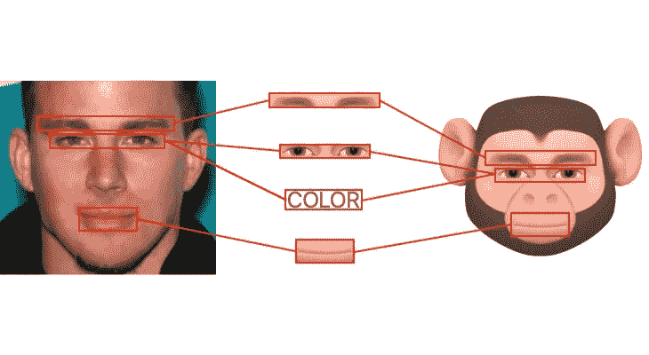
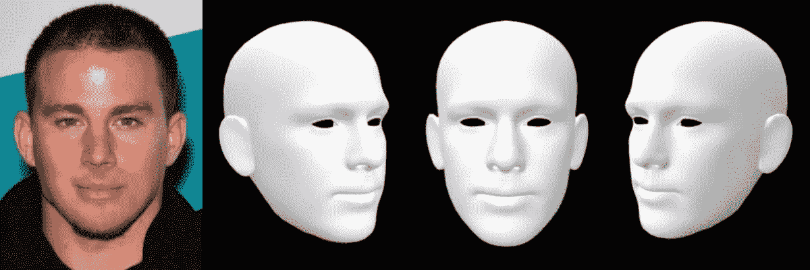
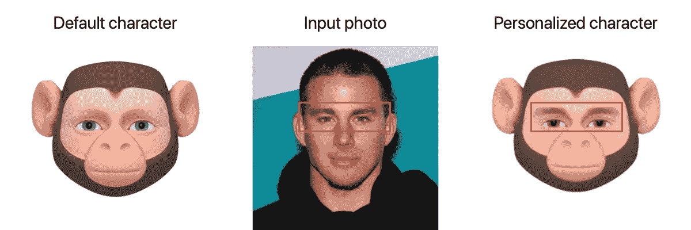
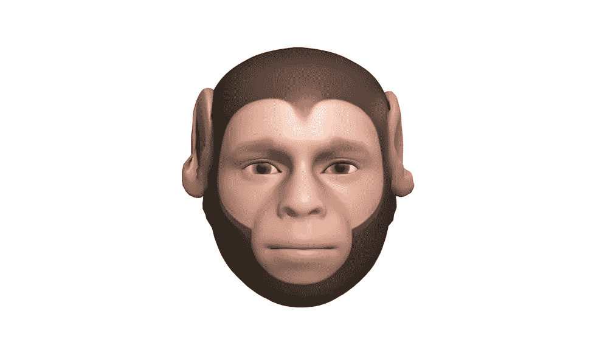
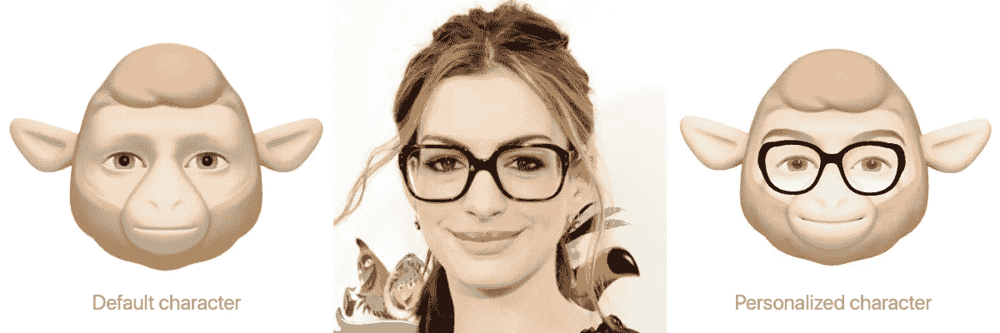
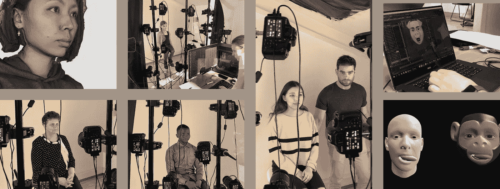
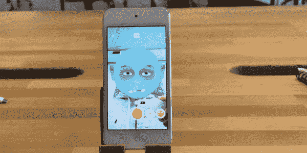
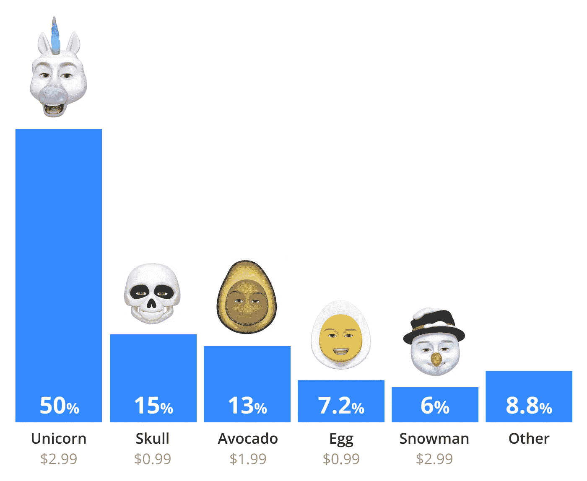

# 我们如何使用人工智能将人类与卡通动物杂交，并以此为业。

> 原文：<https://medium.com/hackernoon/how-we-used-ai-to-hybridize-humans-with-cartoon-animals-and-made-a-business-out-of-it-2d3ec9368ceb>

# 你曾经把自己想象成一个卡通人物吗？好吧，这不仅仅是真的。

我们是一个由 20 名工程师和艺术设计师组成的团队，他们开发了一种[机器学习](https://hackernoon.com/tagged/machine-learning) [技术](https://hackernoon.com/tagged/technology)，可以用动画角色改变人脸。

这个过程首先从一张自拍照片构建用户的 3D 人脸模型开始。重要的是，我们的技术甚至可以与旧的常规智能手机摄像头配合使用。通过这张照片，我们的神经网络构建了用户头部的 3D 网格，如下所示:

The neural network regresses a 3D model from a 2D photo

接下来，另外三个神经网络开始行动。第一个绘制眉毛，第二个检测并匹配眼睛的颜色，第三个检测并绘制用户是否戴着眼镜。当这些元素准备好了，我们用我们的卡通人物来改变用户。这需要几分之一秒的时间。

Each neural network does its job to instantly personalize the character to the user

正如你在红框中看到的，我们只变形了用户脸部的限制区域。

我们这样做是因为**人类和动物有非常不同的面部拓扑**。如果我们试图让角色更像人类，会发生什么呢？

Here’s how avatar would look like if we morphed larger areas

另一个有趣的挑战是如何将眼镜融入动物角色。如果你曾经试图给狗戴上太阳镜，你可能会直接理解这个问题。

将眼镜整合到一个没有类似人类鼻子的动物角色身上并不容易。

# **用 3D 人脸喂养 AI**

我们花了 3 年时间收集了 15，000 张面部扫描的专有数据集。我们确保我们的数据集涵盖了一系列种族、年龄和性别。

We built a special equipment made of 24 cameras to collect dataset

我们用这些数据来训练我们的神经网络。这是我们个性化和面部表情捕捉技术的支柱。

我们的机器学习模型每秒可以处理 60 帧，并实时识别无数数量的微表情组合。

The AI based technology detects emotions in real-time using smartphone

# 神经网络甚至可以在许多方向上跟踪舌头的位置。

相比之下，其他头像应用没有这个功能，只是有两种舌头定位的状态。

Many our users were asking to add this feature

我们将所有这些技术整合到一个名为 [Chudo](https://chu.do/) 的移动消息应用中。几个月前我们启动了它，向世界介绍我们的技术发展。现在，Chudo 的增长速度是早期 Snapchat 的 25 倍。

可访问性是它增长如此迅速的原因之一。与其他只能在昂贵的智能手机上运行的虚拟形象应用不同，我们的技术支持廉价的 Android 设备、旧 iPhones 甚至 iPod。

We made our technology work on iPod

# **虚幻的人物，真实的金钱**

[Chudo](https://chu.do/) 中的大部分角色都是免费的。作为一项实验，我们开始出售一些虚拟形象来帮助支付账单。这是我们最畅销动物的排行榜:

# **用例**

在许多行业中，人们喜欢将自己视为虚构的角色:

*   电脑游戏
*   卡通动画
*   玩具
*   出版
*   沟通

通过 Chudo，我们的团队已经开始接管通信行业。

你知道这项技术可以应用到其他什么行业吗？

请在评论中分享您的想法或给我发邮件至 gabrelyanov@chu.do。