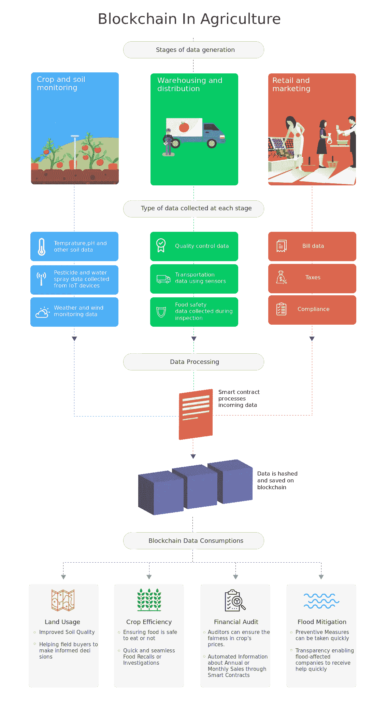

# 区块链农业将如何革新从农场到盘子的食物供应？

> 原文：<https://medium.com/hackernoon/how-will-blockchain-agriculture-revolutionize-the-food-supply-from-farm-to-plate-f8fe488d9bae>

农业部门拥有全球 40%的劳动力，占全球经济生产的 6.4%，全球生产总值为 50，848 亿美元。如果你曾经参观过一个农场，你会看到农民拥有复杂的生态系统，有季节性的融资结构，谨慎的时间安排和许多活动部件。

食品离开农场进入市场后，就成为庞大供应链的一部分，其中涉及许多中间商。每个人都想知道食物在端上盘子之前是在哪里生产的。

如果你能在吃之前检查食物的质量会怎么样？随着区块链系统在透明地执行合同和跟踪信息方面的使用案例的出现，这将成为可能。

区块链农业是一个引人注目的用例，它使种植和供应食物的过程变得更简单。农业供应链可以为所有相关方提供单一的事实来源。

进一步阅读这篇文章，了解区块链农业将如何革新从农场到餐桌的食品供应。

# 将区块链应用于农业

[Image Source LeewayHertz](https://www.leewayhertz.com/blockchain-in-agriculture/?utm_source=medium)

根据 ReportLinker，2018 年食品供应链和农业的区块链估计为 6080 万美元，预计到 2023 年将达到 4.297 亿美元。[荷兰农业、自然和食品质量部资助了第一个研究项目](https://www.wur.nl/upload_mm/d/c/0/b429c891-ab94-49c8-a309-beb9b6bba4df_2017-112%20Ge_def.pdf)“农业食品区块链”，该项目旨在探索区块链对农业食品的影响。[试点研究表明](https://www.cobank.com/-/media/files/ked/general/blockchain-report-may-2018.pdf)区块链技术使食品从农场到杂货店只需几秒钟就能追踪到。

区块链还有助于监控丰富的商品，减少非法收获和运输欺诈案件。联合国披露，由于非法贸易，食品欺诈每年给全球经济造成大约 400 亿美元的损失。

# 以下是区块链农业转型的主要方式:

## **采购跟踪**

农业部门面临的挑战是跟踪和支付食品的交付。如今，该流程依赖于第三方来协调货物交付。卖家通常有一个代理人来确保货物安全交付，买家有一个代理人来建议付款和审核交付。

多个代理的参与增加了系统的高成本，并使得整个过程耗时。有了区块链，整个过程可以简化为一个单一的分布式分类账。

商品购买者可以直接与供应商互动，从而加快流程并缩短付款时间。此外，公司可以节省额外的代理费用，农民可以通过基于区块链的解决方案直接获得更大份额的销售。

凭借可追溯性和可审计性等特性，农民可以直接向餐馆或个人出售作物或食品，而无需中介。

## **农作物和粮食产量**

在智能农业的帮助下，物联网传感器可以获取土壤温度、水位、肥料细节等重要信息，并将其发送到区块链。基于保存在区块链的数据，智能合同可以触发和执行具体的行动。这将有助于提高耕作过程和生产的作物的质量。

## **天气危机控制**

农民一年到头都不得不面对不可预测的天气状况。监测和预测这些因素对于提高作物存活率至关重要。

由于雨水过多，农作物很难承受洪水。消费者永远不知道农作物何时遭遇恶劣天气，以及市场为何面临高价。

由于相关成员可以从区块链解决方案中跟踪天气状况，农民可以通过智能合同快速请求并获得保险索赔。

## **管理农业金融**

信用记录和协议缺乏透明度是小农户和金融普惠之间面临的一些重大问题。如今，金融服务不仅允许小农投资农业，还帮助他们解决流动性限制。

因此，买家很难向农民付款，这限制了小农户以相对较低的价格出售作物。有了区块链，农业融资过程变得更加透明和公平，同时实现了共享控制。

在食品质量检测方面，农业需要做大量的工作来维持和建立消费者的信任。一个基于区块链的农业解决方案为农业综合企业带来了很大的希望，因为它能够带来系统的透明度。