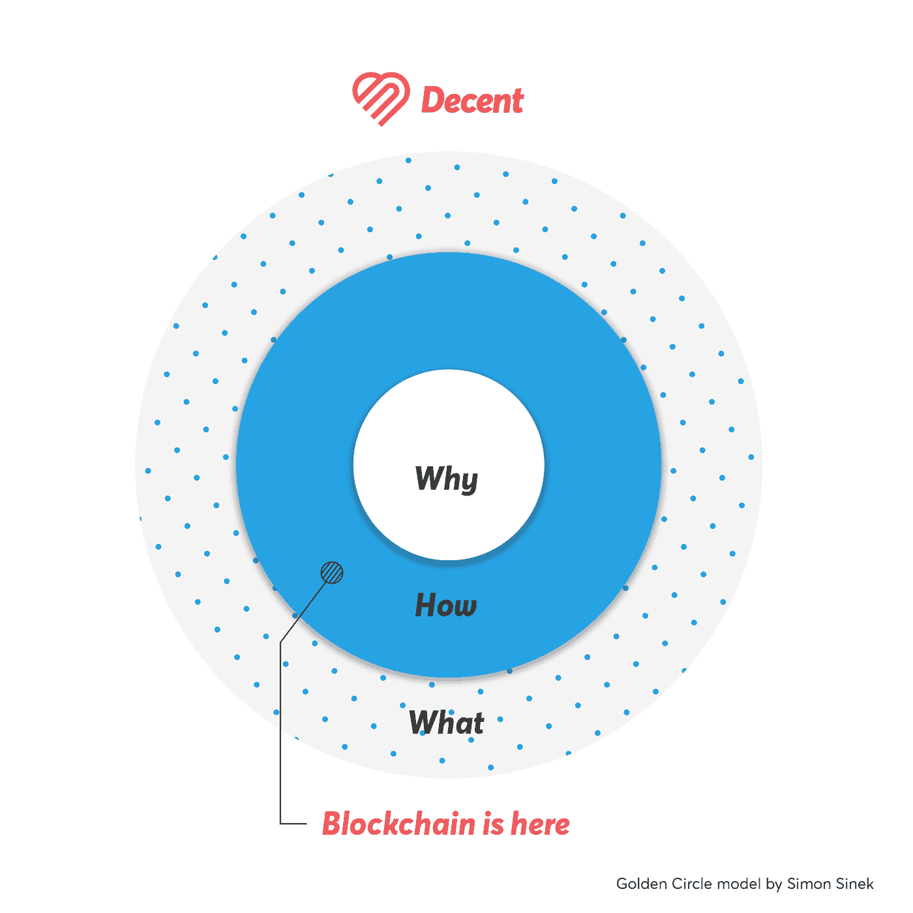
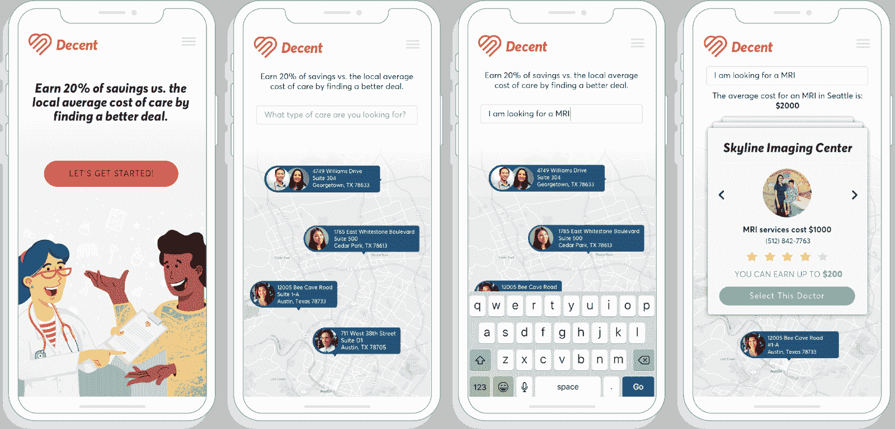

# 体面将如何使用区块链？

> 原文：<https://medium.com/hackernoon/how-will-decent-use-blockchain-16d025dd5942>

## 如果你要重新发明医疗保险，你会怎么做？

也许你和你的朋友会把钱存在一个共享账户里一年。任何需要医疗保健的人都可以拿出一些。如果年底还有钱，你们可以各拿一份，或者留到明年。

现在想象一下，你们中的一些人去滑雪。值得注意的是，你们都摔伤了，需要核磁共振成像。你的朋友去了收费 2000 美元的医院，他们每人从账户中取出 2000 美元。你去了一家只收你 1000 美元的顶级影像中心，更好的是，他们说他们会为你的“保险”提供同样的服务

如果你从账户中取出 1000 美元来支付你的核磁共振成像，并且还保留你为小组节省的一部分——比如 200 美元——用于寻找一个你们将来都可以得到更便宜的核磁共振成像的地方，会怎么样？

每个人都赢了。经济学家称之为激励对齐。你的朋友会说这是一笔好交易。

你将有助于让医疗保健变得更加实惠、透明和公平。

医疗保健不应该是这样吗？

*

今天的美国医疗保健是负担不起的——它是如此昂贵，以至于人们为了保持他们的健康福利而留在他们讨厌的工作岗位上。这是不透明的——在离开你的房子之前，不可能预测你将支付多少。当 47%的美国人无法支付令人吃惊的 400 美元医疗费用时，这是不公平的。难怪[除了康卡斯特](https://hackernoon.com/why-is-health-insurance-in-america-such-a-bad-deal-part-1-8888976900e5)，美国人最讨厌他们的健康保险。

让医疗变得负担得起、透明和公平是**为什么** [体面](https://www.decent.com/)存在的原因。

[截至 2019 年 4 月 1 日，在德克萨斯州奥斯汀](/decent/decent-april-update-e8f158fcf5e)，我们以低于市场的费率管理综合健康保险计划，最初是为为自己购买保险的个体户。设计和管理负担得起的健康保险计划是我们的工作。

区块链是**我们如何做**的重要组成部分。正派是一家使用区块链的医疗保健公司，而不是区块链的医疗保健公司:事实上，会员将能够使用正派，而无需了解或甚至思考区块链。技术只有解决现实问题才有价值。它应该始终是 **how** 的一部分。

现有保险公司的最大问题——信任太少和浪费太多——反映了区块链的自然优势。只有 7%的美国人信任他们的健康保险公司，部分原因是 T2 现有的保险公司对他们服务的成员有严重的不一致的激励。有一万亿美元！)在美国的医疗保健中，每年浪费 100 亿美元，而 [75%的支出通过保险支付者](https://www.cms.gov/Research-Statistics-Data-and-Systems/Statistics-Trends-and-Reports/NationalHealthExpendData/Downloads/PieChartSourcesExpenditures.pdf)——医疗保健的资金转移中间人。

那么，体面将如何使用区块链？调整激励措施，奖励明智的选择；使价格和质量数据透明；减少浪费，取消健康保险中的中间商。

## 短期:调整激励机制，奖励明智的选择。

医疗保健问题的根本原因是，当成本上升时，除了病人以外的所有关键利益相关者都会受益。大多数健康保险公司都受到医疗损失率的制约:他们必须将每一美元保费中的 80%用于医疗保健，最多可以保留 20%用于支付管理费用和利润。这意味着，当医疗总成本上升时，他们实际上赚了更多的钱——他们从不断增长的馅饼中拿走了固定的百分比。他们嘴上说重视价值，但他们的激励措施却鼓励成本上升。

正派不是一家健康保险公司——我们帮助群体团结起来，为更好的费率进行自我保险。我们不受医疗损失率的约束，正因为如此，成本上涨不是我们商业模式的一部分。就像我们服务的会员和直接初级保健(DPC)医生一样，当会员获得负担得起的高质量护理时，我们也会受益。成员将在创造体面工作方面发挥重要作用，他们应该得到报酬。我们将使用区块链代币来奖励明智的健康选择(就像上面的核磁共振成像例子)。当会员获得高价值护理时，节省的费用将被返还，因此每个人都是赢家，并用于扩展到新的地理区域和人口统计，这样我们就可以实现为所有人提供负担得起的医疗保健的愿景。

Illustrative UI

## 中期:使价格和质量数据透明。

一旦你意识到大多数医院和保险公司的激励措施鼓励成本上升，医疗保健中缺乏价格和质量数据就有了意义。他们没有什么经济激励来推广高价值医疗，或者理解成本和结果之间的关系。

在体面，我们希望使价格和质量数据透明，所以所有的病人和医生都可以做出明智的医疗选择。

我们将收集价格和质量数据，并将其发布到分布式分类账中，这样就没有人能够隐藏、篡改或关闭它。

随着我们的扩展，我们将能够绘制价格和去识别结果数据之间的统计显著相关性，以找到最高价值的护理选项。

## 长期目标:减少浪费，从健康保险中剔除中间商。

健康保险公司的运作基本上是一系列简单的决定:这份登记表完整吗？这个索赔该不该赔？这个医生有证书吗？其中一些决策已经自动化，以减少浪费:今天大多数索赔管理是由软件完成的。在需要人的判断的地方，做出这些决定的人需要有资格，他们需要得到补偿。但是在未来，他们不需要为一个集中的保险公司工作。区块链技术会让他们证明自己的资质，获得报酬，独立运营。

正派将使用区块链来简化和自动化核心管理功能，如计费，近实时支付，索赔管理，以削减管理费用，欺诈和人为错误的成本。随着持续发展推动区块链技术向前发展，我们将不懈地减少浪费，为会员提供更多价值。

美国医疗保险寡头垄断更深层次的问题来自其集中化。集中决策让一小群公司决定覆盖谁和什么，世界上最大的[行业游说集团](https://www.opensecrets.org/lobby/top.php?showYear=2018&indexType=i)推行[一刀切的模式](https://www.nytimes.com/2016/12/05/upshot/the-problem-with-one-size-fits-all-health-insurance.html)。这些巨擘通过交易关键的医疗保健数据(从价格和质量到敏感而有价值的医疗记录)来充实自己，并不让患者得到这些数据。他们的集中运营吸走了数千亿美元的利润和管理费用——这些钱本可以更好地用于支付医疗费用。

随着时间的推移，正派将使用区块链负责任地分散核心业务:增加覆盖谁和覆盖什么的灵活性，让您访问关键的医疗数据，并将节省的费用返还给您。所有这些都使用透明的基础设施，所以你可以看到你的钱去了哪里，而不必相信中间人。

你应该能够加入一个涵盖你想要的东西的计划。您应该拥有做出明智选择所需的数据。当你选择高价值护理时，你也应该得到回报。

我们的目标是建立一个日益分散的组织，让世界上任何人都可以建立和管理一个合法的健康保险池，而不需要中间人(包括我们)。

如果您有任何问题，请发邮件至[hello@decent.com](mailto:hello@decent.com)联系我们。

如果这一切听起来很疯狂，请继续关注。