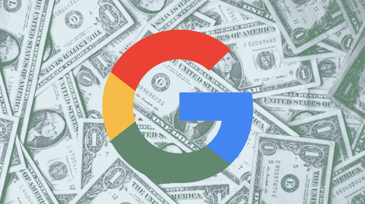
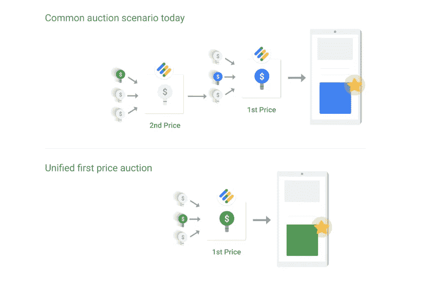

# 谷歌转向首价拍卖会对出版商产生怎样的影响？

> 原文：<https://medium.com/hackernoon/how-will-googles-move-to-first-price-auctions-impact-publishers-e44f2d8d67cd>

为了简化程序化广告[,谷歌宣布](https://www.blog.google/products/admanager/simplifying-programmatic-first-price-auctions-google-ad-manager/)将把他们的出版商库存转变为谷歌广告管理器的“第一价格拍卖”。

全面推广将在接下来的几个月内进行，预计将在今年年底完成，100%的拍卖都使用第一价格拍卖，通过广告管理器销售展示和视频库存。

# 第一价格拍卖和第二价格拍卖的区别是什么？

在目前的系统中，如果一个广告客户出价最高，他们就赢得了广告位，并比第二高的出价多支付**0.01 美元**。在第一价格拍卖中，中标者支付他们出价的全部价格。

许多出版商已经开始与采用第一价格拍卖的 ssp 合作。然而，谷歌企业的规模意味着像这样的结构变化将对行业产生重大影响。

以下是所有已经改变的事情，以及数字出版商需要如何应对。

# 多阶段拍卖的终结

转向[统一的第一价格系统](https://9to5google.com/2019/03/06/google-ad-manager-first-auction/)也消除了多阶段拍卖，在这种拍卖中，广告可能要经过多达 10 种不同的拍卖，然后才能选出中标者。使用多阶段拍卖，出价较高的竞标者可能会吃亏，因为他们在第一次拍卖中出价，而不是在最后一次拍卖中出价。

在第一次拍卖中，一个获胜的出价，比如说 **$5** ，与一个 **$3** 的出价竞争，将以 **$3.01** 成交。这一出价然后被转移到谷歌的交易所竞价拍卖中，在那里它可能会输给一个 3.02 美元的出价。现在所有三个出价将同时竞争，让最高的出价获胜。

# 对投标底纹的需求将会增加

出价阴影是 ssp 和 DSP 之间的一种权衡，以防中标价格过高。之前，中标者和第二名之间的差距并不重要，因为中标者只需比第二高的出价多支付**0.01**美元。第一价格拍卖意味着中标的可能性很大。

使用出价阴影，如果获胜的出价被大大高估，则基于广告技术合作伙伴所做的计算，买方将支付第二价格和第一价格值之间的值。

它分析了出价历史信息、出价的赢价和输价，以及其他变量，如广告位置或拍卖网站的类型。

# “最后一眼”的优势将永远消失

使用第二价格拍卖，谷歌能够给自己在行业中一个有争议的优势。它保留了“最后看一眼”价格的权利，然后以高出 0.01 美元的价格购买被低估的库存，这实际上是在广告商和它自己之间进行套利。

谷歌宣布，这一优势在 2017 年被取消，但转向 first price 被视为透明和公平竞争环境的一个更明确的例子。尽管如此，谷歌仍然[保留忽略【Adsense 回填底价的权利。](https://support.google.com/admanager/answer/9171422)

> *广告交易流量将受到统一定价下限和广告交易定价下限的限制。底价不适用于 AdSense 回填。*

这可能会给谷歌留下一个通过 Adsense 套利的后门。

# 谷歌为什么要做出改变？

谷歌的官方说法是，实施这一改变是为了“帮助我们的合作伙伴简化编程”。首次价格拍卖也将有助于理清出版商、买家和谷歌之间的供应链。他们还加入其他主要交易所，如[指数交易所](https://www.indexexchange.com/)、 [OpenX](https://www.openx.com/publishers/header-bidding/) 和 [Rubicon 项目](https://rubiconproject.com/)的一级竞价。

当然，这一变化也有望改善谷歌已经占据的主导地位。通过降低标题竞价包装器的独特价值，谷歌将希望增加自己的解决方案——交换竞价——的市场份额。

通过降低费用，减少复杂性，并借助谷歌品牌的力量，交易所竞价将旨在减缓其他标题竞价解决方案的统治地位。使用第一价格的统一拍卖将有助于谷歌通过向出版商提供更简单、更透明的解决方案来吸引大部分供应。

# 短期内会有什么影响？

短期内，买家很可能会措手不及。如果买家使用第二价格策略进入第一价格拍卖，他们将为存货支付过高的价格。

并非所有的广告客户都会及时实施诸如[出价阴影](https://digiday.com/media/wtf-bid-shading/)等技术来应对这一变化，并有可能推高长尾存货的广告价格。

然而，对于较大的广告客户来说，在操作上，变化不大。主要的 DSP 已经建立了投标阴影算法，它们将应用于谷歌的拍卖，以减轻这种收入激增的影响。

# 这个改变会破坏我们所知道的标题竞价吗？

诚然，第一价格可以减少标题竞价对谷歌市场份额的负面影响。通过统一所有拍卖和降低成本，谷歌有机会通过单一来源发送所有库存。

通过使过程更加透明和统一拍卖，谷歌似乎希望出版商将默认使用他们的解决方案作为一个简单、有利可图的平台，减少多个平台的管理工作量。

但是，像 [Prebid](http://prebid.org/) 这样的头部竞价包装器有其他价值，并且在第一价格拍卖中具有先发优势。它是开源的，超时是可配置的，交易可以按你认为合适的任何优先级设置，多种形式的横幅被接受(显示，原生& outstream)并允许它们多样化。

亚马逊和脸书也不太可能通过谷歌转移库存。这意味着出版商可能不得不继续使用两种系统的混合模式[。](https://ripplesmith.com/google-is-moving-to-first-price-but-big-questions-remain/)

# 那么，出版商需要做什么呢？

出版商最关心的是他们的底价。买家不能再设定他们的“最高可能”价格。他们被迫研究和估计第二高的出价是多少，并提出一个可行的价格来击败它。

这一点，以及投标底纹可能会看到出版商试图找到尽可能低的价格支付每 eCPM。出版商应该根据买家预期的激进出价策略调整他们的底价。

尽管如此，在所有广告客户适应之前，过渡期可能会使谷歌的收入上升，技术会设法将第一次和第二次出价之间的差额降至一致的最低水平。

在官方公告中，谷歌集团产品经理 Sam Cos 表示，“在此期间，出版商和应用程序开发者需要重新考虑他们如何使用底价，技术合作伙伴需要调整他们如何竞标谷歌广告管理器库存。''

*原载于 2019 年 4 月 16 日*[*https://www.marfeel.com*](https://www.marfeel.com/blog/first-price-auctions/)*。*