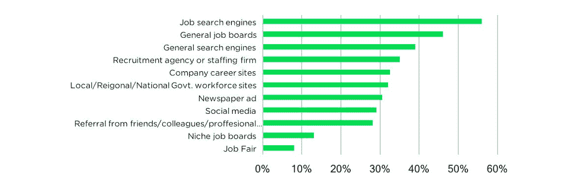
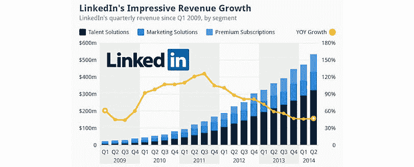
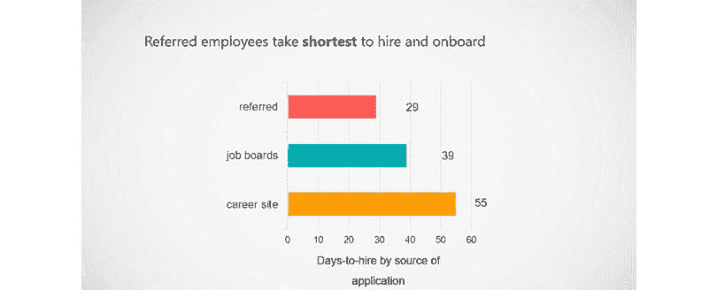

# 大多数人从来没有想过你可以成为他们的私人招聘人员或猎头，并赚取佣金！

> 原文：<https://medium.com/hackernoon/how-you-can-have-a-simple-to-share-and-easy-to-pay-hiring-experience-with-the-blockchain-917b99f07462>

传统的招聘流程需要几天、几周甚至几个月才能完成，而寻找这些“顶级”候选人是一个漫长的过程，公司必须将最近开放的职位传播出去，希望合适的人会得到消息并申请。这是一个胜算很小的游戏。

尽管胜算不大，但大公司正在吸引最优秀的人才，并快速提升他们的价值和声誉。例如，谷歌的员工人数从 2007 年的 16，805 人增加到 2018 年的 98，771 人。这在短短十年内增长了 6 倍多！你认为他们如何能以这样的速度招聘，同时又不损害他们的内部文化？

在当今环境下，像 LinkedIn 这样的专业在线网络在吸引最佳候选人的注意力方面发挥着至关重要的作用，大公司明白推荐和社交招聘的力量。

但展望未来，这些平台看起来像是垫脚石，因为招聘已经准备好被总部位于区块链的项目彻底改变，如 Canlead、Aworker 和 Indorse.io。利用当今社交网络的最佳功能，这些新平台正在塑造“机会共享经济”，用户因成功推荐而直接获得奖励。

# 获得谷歌面试的最快方法是什么？

几乎在每一家大公司，招聘都由一个由几十到几百名专家组成的部门来管理。这些人负责[确定](https://www.process.st/accountability-in-the-workplace/)员工成就、员工满意度、员工责任和员工流动率。

谷歌是我们最好的例子，它拥有一些最负盛名的招聘人员，在就业市场享有声誉，每年收到[100 万份简历](https://www.cvscreen.co.uk/the-google-recruitment-process.html)。这么高的报名人数，如何才能脱颖而出成为候选人？你怎样才能得到想要的面试机会，从而获得一份真正的工作呢？

根据一位前谷歌员工的说法，[内部推荐](https://www.cnbc.com/id/42608205)对于获得面试机会非常重要。此外，他声称，大多数候选人是通过现有员工的推荐获得工作的，即使两者之间没有直接关系。大多数是第二或第三级关系，口碑和一连串的电子邮件将一个人的简历带到了负责人的桌子上。

[https://www.clickiq.co.uk/how-much-should-you-spend-on-aggregator-job-boards/](https://www.clickiq.co.uk/how-much-should-you-spend-on-aggregator-job-boards/)

然而，在判断这种招聘策略之前，试着想想，如果你向你的人际网络提出以下问题，你会得到多少回复:“你认识想在谷歌工作的人吗？”

员工推荐被认为是最有效的招聘策略之一，原因有很多:

*   雇佣时间最短。
*   离职率最低。
*   82%的雇主认为推荐项目在所有招聘渠道中提供了最好的投资回报。

难怪人们试图通过提供激励措施将员工变成“招聘者”。当今的大多数公司都希望为员工创造一个有益的工作场所。将这一点与鼓励推荐的直接过程结合起来，你最终会得到一笔双赢的交易。

# 社交网络如何改变了招聘过程？

在一个技术主宰的时代，招聘流程不应该停止发展。这就是招聘人员如何开发新的解决方案，利用新的在线网络找到合格的申请人。

如今，LinkedIn 是最受认可的筛选和招聘候选人的社交平台。3.5 亿专业人士连接在同一个社交网络下，展示他们的技能、专业知识和求职愿望。

雇主发现这个平台很有用，因为他们甚至可以接触到那些不积极求职但可能对合适的机会感兴趣的人。这是一个双赢的互动。

[https://www.statista.com/chart/2524/linkedin-revenue/](https://www.statista.com/chart/2524/linkedin-revenue/)

LinkedIn 并不是公司用来寻找候选人的唯一社交网络。人力资源经理认为 LinkedIn 是最有效的招聘社交媒体网站(73%)，但紧随其后的是脸书(66%)和 Twitter (53%)。

近年来，招聘人员更愿意利用这些平台来达到他们的目标。不幸的是，社交媒体网站向其他人出售个人和商业数据，而候选人和雇主却得不到任何回报(或有话可说)。

此外，雇主无法利用许多社会推荐网络来寻找人才，因为社会推荐人不在雇主的工资系统之内。这仍然是就业市场需要克服的最大障碍。

[由脸书领导的 Libra](https://libra.org/en-US/) 最近宣布，他们的目标是创造一种可靠的数字货币和基础设施，共同实现“货币互联网”的承诺。这将改变工资系统的工作方式以及未来人们的工资支付方式。

# 招聘平台正在快速崛起

在当今数据驱动的招聘世界中，掠夺信息和计算指标已经成为大多数寻求建立有效招聘平台的公司的首要任务之一，而社交方面几乎被忽略了。谁会想到区块链会深究这个问题呢？有三个项目属于这一类别: [Canlead](https://canlead.io/) 、 [Aworker](https://aworker.io/) 和 [Indorse.io](https://indorse.io/) ，我们将深入探讨他们每一个独特的解决方案。

德勤在一次“全球人力资本趋势”活动中表示:“一家公司的就业品牌必须既高度可见，又具有高度吸引力，因为现在候选人往往会找到雇主，而不是相反。”。

有两个特点导致候选人和雇主的双赢局面；它们是工作机会分享和社会推荐。Canlead 将赌注押在这两者上，雄心勃勃地要创建一个全球性的分散网络，为每个人提供内在的激励。这是一个分散的工作机会共享平台，每个人都可以随时随地成为招聘人员，并通过帮助朋友、同事和陌生人(为什么不呢)与他们未来的雇主建立联系来赚取佣金。这一切都包裹在一个由区块链推动的生态系统中，其目标是让雇主以更低的成本在全球范围内获得更高质量的人才，并让候选人获得独特的机会。

Canlead 认为，招聘将发生在雇主、雇员和推荐人将维持平衡生态系统的平台内。它始于雇主或招聘人员发布工作机会，并邀请他们的潜在客户网络成为候选人的推荐人。当然，雇主和候选人会收到推荐人和推荐信，但他们也可以随时成为推荐人。虽然网络将变得更广更深，但区块链将作为所有机会和推荐的记录，并确保支付和奖励无缝衔接。

除了成本，我们发现当前社交网络的另一个最大问题是缺乏隐私和对参与者数据的控制。一个工人把它反过来，让人们控制自己的信息。建立在其协议之上的招聘平台根据经过验证的数据和信誉分数创建了一个用户网络。可以把它想象成一个人才市场，在区块链上有一个对每份记录(简历、技能、推荐信)进行验证的系统。这种类型的验证系统意味着该信息是不可变的，并且永久存储在网络上。

介于推荐和不可改变的技能之间，Indorse.io 作为一个 LinkedIn 出现，在那里个人因主张和支持而获得奖励。在他们的平台中，“声明”是一种有证据支持的技能，如学位或证书，同样的声明可以通过一种称为 indors Score(SCR)的机制由其他成员“认可”。分数高的人会被认为更值得信赖，更有社交网络，更有就业能力，在招聘过程中有助于公司。

# 就业市场和招聘行业的突破

由于求职者和候选人更信任员工而不是雇主，这些分散的解决方案看起来更像是公司未来吸引人才的方式。

这些平台并不意味着取代当前的招聘流程，例如，Canlead 在求职者、推荐人和雇主共同努力的三方市场中提供简单共享的职位、易于支付的推荐人和快速招聘人才的体验。因此，Canlead 通过在区块链上提供机会共享和推荐平台的最具创新性的应用而脱颖而出。

这是由 Canlead 的创始人兼首席执行官 Michael Quan 创新的“机会共享经济”模式，他正在建立一个“工作机会共享和推荐”平台，以利用互联网货币 Libra。

[https://www.talentlyft.com/en/blog/article/170/a-guide-for-setting-up-an-employee-referral-program](https://www.talentlyft.com/en/blog/article/170/a-guide-for-setting-up-an-employee-referral-program)

去中心化和区块链带来的开放分类账的性质可以很容易地在招聘行业中被利用来加倍其优势。虽然合格的候选人在今天的市场上很难找到，但使用智能合同来保证回报会给所有相关方带来好处。这可能是该行业的重大突破吗？