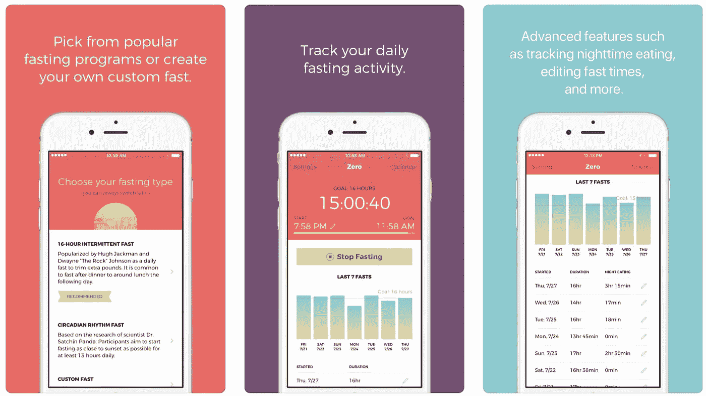
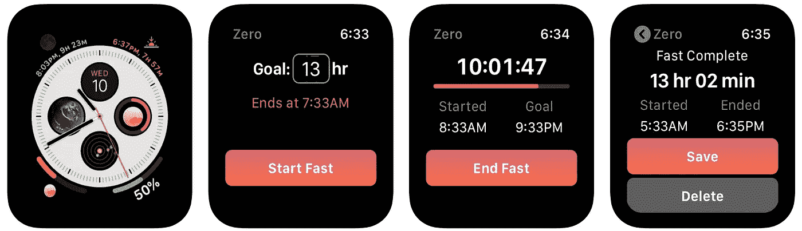
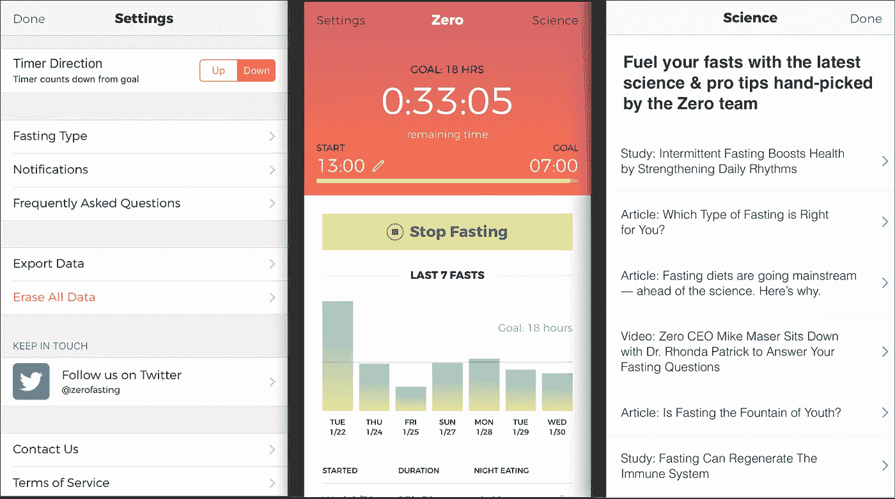
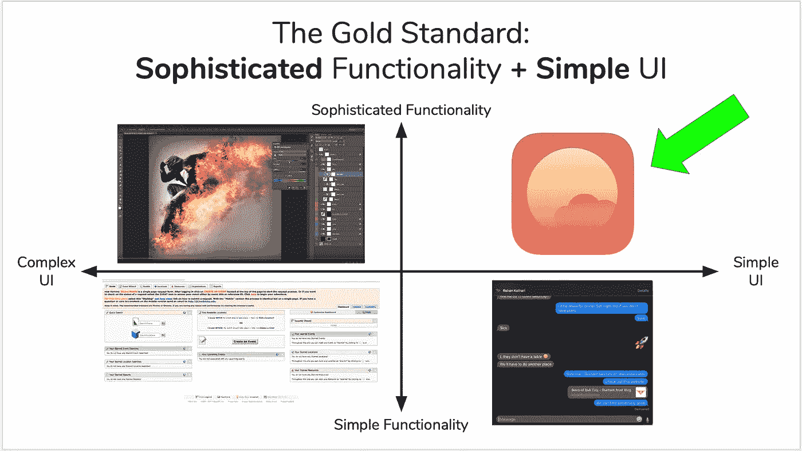
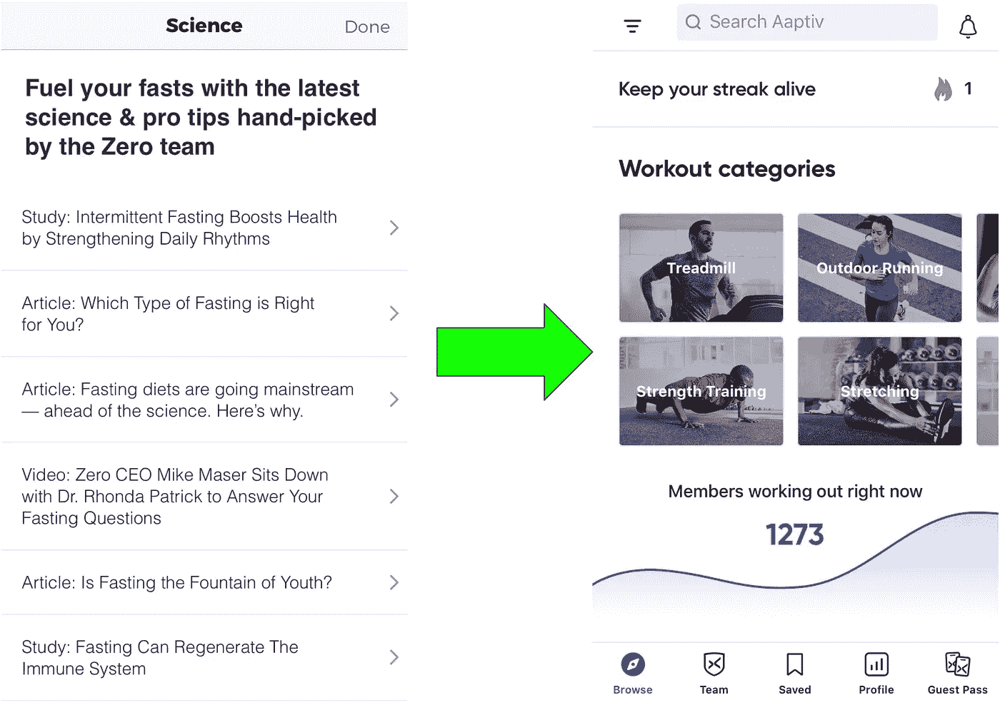
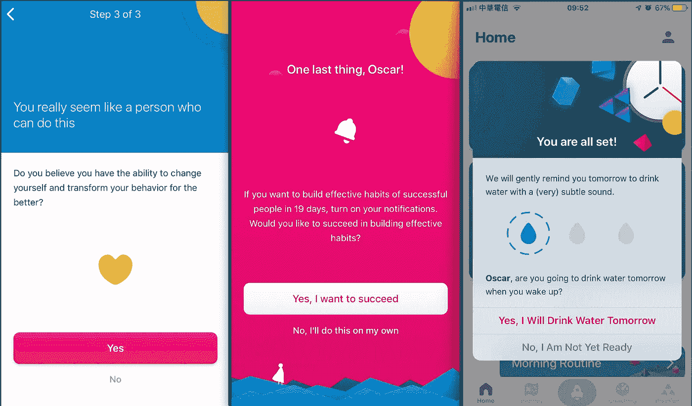
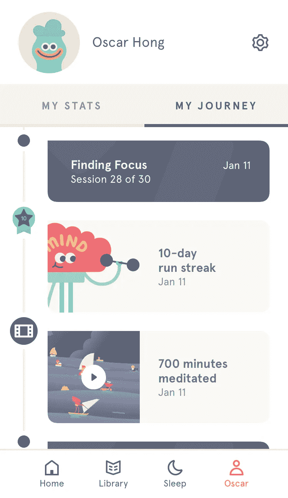
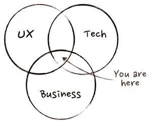
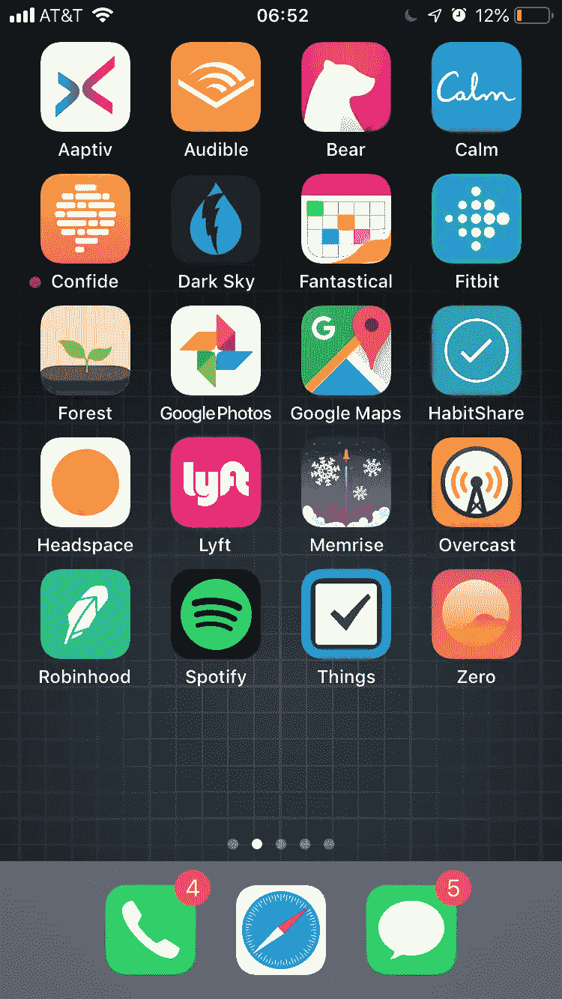

# 零是如何赢的:禁食追踪器的产品分析

> 原文：<https://medium.com/hackernoon/how-zero-wins-product-analysis-of-the-fasting-tracker-d9d915b36977>

Zero (iOS)’s simple yet effective user flow.

接下来的 18 小时内不要吃任何东西。

如果你对这个建议的荒谬感到震惊，甚至不希望它成为对你最大敌人的惩罚，那么你可能没有听说过间歇性禁食。

# 首先，一些背景

间歇性禁食(简称 I.F ),不是一种饮食，而是一种在禁食(最常见的是每天 16 到 18 小时)和非禁食之间循环的饮食模式。礼仪并没有规定*应该吃哪种*食物，而是规定*应该在什么时候*吃。虽然它一直以来都是非正式的，但在 2016 年大隅良典教授因其对自噬(即细胞如何分解和再生)在寿命中的作用的研究而获得诺贝尔医学奖后，人工授精成为了主流。

你可能会问“当食物尝起来如此美味时，为什么还有人会选择这样做呢？“科学界有越来越多的[更有力的证据](https://jamesclear.com/the-beginners-guide-to-intermittent-fasting)表明，人工授精可以降低一个人患二型糖尿病病、神经退行性疾病(如老年痴呆症和帕金森症)和癌症的风险。其他研究表明，胰岛素抵抗甚至可以改善各种认知功能，同时比传统的卡路里限制饮食有更高的依从率。

以下是对 [Zero](https://itunes.apple.com/us/app/zero-fasting-tracker/id1168348542#?platform=iphone) 的产品分析，这是一款免费的 iOS 和 watchOS 应用程序，可以帮助人们跟踪并因此更好地坚持他们的间歇性禁食计划。**我将解释为什么这款应用提供了*令人愉快的*用户体验，建议如何进一步完善它，并提供潜在的盈利机制，这将带来可持续的、对世界有益的业务。**

# 零是什么？

Zero 是由凯文·罗斯(Digg 的创始人)于 2016 年创建的一个个人兼职项目。它只有一个主按钮，用户按下这个按钮就可以在禁食的开始和结束之间切换。它记录并显示用户在过去一周内每天禁食的时间。

*当真？你要写一份完整的产品分析，它的功能和默认时钟应用中的“定时器”标签基本相同？*

绝对的。

在我看来，一个产品的辉煌不仅仅在于它做了什么，更重要的是 T2 如何做。作为一名产品经理，我也看到了 Zero 的巨大商业潜力，因为 I.F .正从“早期采用者”阶段走向“早期多数”(h/t [杰弗里·摩尔，跨越鸿沟](https://en.wikipedia.org/wiki/Crossing_the_Chasm))。

Zero’s interface on watchOS.

# 为什么我喜欢它

以 4.8/5 的平均评分获得 70k+的应用商店评论不是一件容易的事情。大多数评论都包含一些“它只是工作”的变体。正是我所需要的。”他们是由*热情的*用户写来分享他们的成功故事的(例如“减掉了背部手术后增加的 15 磅”，“我感觉好多了，非常感激！”)

*那么，Zero 为什么这么受欢迎呢？*

在我看来，这是因为 Zero 体现了我高度重视的两个产品开发原则:了解你的客户(KYC)和保持简单，愚蠢(亲吻)。

## 1. **Zero 深谙用户之道**

对于每个人来说都没有完美的产品。由于产品经理总是在做权衡(例如，一个功能可能被一些用户高度要求，但被另一些用户厌恶)，所以他们仔细定义零代表谁是至关重要的。根据应用程序中的设计和工程决策，我认为他们心目中的目标客户角色是:

*   年龄在 20 到 40 岁之间，
*   职业人士，
*   生活在注重健康的沿海城市(如纽约、旧金山、洛杉矶、西雅图)，
*   OINK(一份收入，没有孩子)或 DINK(因为在抚养孩子时不吃饭可能是不可接受的/不方便的)

这个通用用户配置文件可以细分为更具体的子组:

*   **“菜鸟”:**刚从“不服气”阵营毕业，不想被错综复杂所困扰，采用了人工授精作为预防措施或为了长寿。
*   **“患者”:**与“菜鸟”相似，但已经患病并根据医生的建议接受人工授精，更有可能长期依从，因为更多的“参与游戏”
*   **“生物黑客”:**深入量化自我的兔子洞，竭尽全力测量生物特征，以优化身体或认知表现。

## **2。零优先考虑简单性，同时仍然完成“要做的工作”**

上述客户发现可能向我们揭示了 Zero 的核心用户:

*   a)过分看重设计(精通技术，对不直观的 UX 毫无耐心)，以及
*   b)愿意付费(收入高，习惯付费订阅软件)。

> “最主要的是保持主要的东西是主要的东西。”

Navigation is simple and only takes the user to one of these 3 views.

Zero 简单而有效的三视图设计(“场景”、“家庭”和“科学”)无疑是这些关键见解的第一个结果。打开应用程序后，有一个明显的地方可供用户点击，那就是“开始/停止禁食”按钮。这使得用户能够立即完成应用程序的主要“工作”(h/t [Clayton Christensen，The Innovator's Dilemma](https://en.wikipedia.org/wiki/The_Innovator%27s_Dilemma) )。

零的配色方案也从橙色变为绿色，以指示用户是否低于或高于他的禁食目标。这是在最精心设计的应用程序中常见的最佳实践(例如，Robinhood 的界面根据股票市场是否开放而由亮变暗)。

“设置”页面只有 3 个可以调整的选项，这限制了决策疲劳(肯定非常受“hangry”用户的欢迎)。最后，包括了“导出数据”功能，但没有强调，因为 Zero 知道它只与前面提到的利基“生物黑客”角色相关。Zero 的设计去除了所有不必要的干扰，将其核心用例放在最前面。

# 零 3.0 的建议

Zero 目前的版本是 2.4.7。我的产品分析的下一部分涉及一个假设:*如果我是产品经理，负责交付下一个备受期待的应用版本，我会开发哪些功能，为什么？我如何把一个已经很棒的产品带到下一个层次？*

首先，我需要一颗“北极星”(即我要去哪里？).用户预设了她计划禁食多长时间的目标(Zero 建议从 16 小时开始)。因此，用户对应用程序的参与程度可以通过关键绩效指标(KPI)来评估，例如“每个用户每月超过目标的天数”。我所做的每一个改变都需要服务于增加这个特定的指标。

Left-top: Photoshop, Left-bottom: Duke’s room reservation system, Right-bottom: iMessage, Right-top: where we’re taking Zero 3.0!

每当我为一个产品指定需求时，我总是提醒自己从 Andrew of stad(Airtable 的 CPO)那里学到的产品课程。如果我们从两个维度来评价产品，从简单到复杂的功能和从简单到复杂的用户界面，我们可以把它们放在一个 2x2 的矩阵中。功能简单但用户界面复杂的产品很糟糕，忘了它们吧。一些产品会牺牲用户界面的简单性来增加功能(例如 Photoshop，这里的产品通常被认为是“专业”工具)，而另一些产品则相反(例如 iMessage，做一件事真的很好)。产品设计的巅峰在于剩下的象限——简单 UI 下的复杂功能。很少有产品能让我放心地放在这里，但是[谷歌地图](https://www.google.com/maps)、 [Airtable](https://airtable.com) 和[概念](https://www.notion.so)就是很好的例子。为了将 Zero 提升到这个金发区，我们必须找到以不引人注目的方式实现以下功能的方法。

## 1.低垂的果实

我已经确定了以下 3 个可能的“易得之果”特性(即每单位开发工作给应用程序带来的最大附加值)。在我看来，这些只是 2019 年消费应用的赌注。

*   **“科学”页面的更多视觉布局:**目前，资源只是由应用内浏览器打开的简单网络链接。Zero 可以通过尽可能用图像或图形替换文本来使其更加美观。

The current layout of Zero’s science page is visually uninviting. [Aaptiv](https://aaptiv.com/)’s image-first approach would be better.

*   **可在应用内查看更长的历史:**仅可查看过去七天的禁食信息。历史数据由 Zero 维护，但查看的唯一方法是导出为。csv 文件，这不是“菜鸟”或“病人”角色会费心去做的事情。简单的解决方案:底部的“查看更多”按钮。
*   **推荐链接:**让邀请他人加入 Zero 变得容易(文字、邮件，或者只是一个链接)。

## 2.实施挂钩原则，最大限度地减少流失

在他的书《上瘾:如何打造形成习惯的产品》中，Nir Eyal 逆向设计了社交媒体应用上瘾的原因，并将其提炼为一个触发(内部或外部)→行动→可变奖励→投资的正向强化循环。以 Instagram 为例，你可能会在相机胶卷中看到一张讨人喜欢的自拍照(触发)，将其发布到 Instagram 上(操作)，当你看到赞数增加时会获得微小的多巴胺点击量(可变奖励)，然后投入更多时间管理你的个人资料(投资)。然后，这个循环以更大的“粘性”重复进行。但是钩子不一定要用来作恶！让我们将同样的框架应用于 Zero:

*   **触发(外部):**在你正常的晚餐结束时间发送推送通知(希望有重复，这个触发以后会内化为一个饭后开零的习惯)。
*   **动作:**用户打开 app，点击“开始禁食”
*   **可变奖励:**这个阶段对 Zero 来说是最大的挑战，因为 I.F .的奖励本来就是长期的。我可能尝试的一件事是展示一个动机肯定或挑战用户“买入”(我们不喜欢在明确承诺某事后让自己失望)。

[The Fabulous](https://thefabulous.co/), a “Life Coach” app designed by Duke professor Dan Ariely’s Behavioral Economics Lab, uses various behavioural psychology techniques to increase the user’s commitment.

*   投资:一个简单的文本日志条目(例如，问“你吃了什么？你感觉怎么样？”)附每快完成。随着时间的推移，用户开始看到他的定性健康模式，从而从零开始获得更多的价值。

## 3.轻度社交化和游戏化

以我的经验，任何好的 app 都很容易被过度的社交化和游戏化毁掉。因此，我会明智地添加以下功能:

*   **条纹:**连续几个国际橄榄球联合会日的标志，在里程碑上有有趣的徽章。

Headspace’s streak interface and playful badges is an example of gamification done right.

*   **私人支持社区支持:**我经常围绕建立特定习惯(如早起、冥想等)建立自我提升群聊。)同样的社会责任机制也适用于 Zero 这样的应用。

So far we’ve covered design and tech, but what about business? [Source](http://www.mindtheproduct.com/2011/10/what-exactly-is-a-product-manager/).

# 盈利能力的顶峰

> “不要再浪费时间去海上[峰会](https://qz.com/768251/the-entrepreneurial-elite-are-preparing-for-a-davos-meets-burning-man-conference-on-a-giant-yacht/)。你应该做的唯一一件事就是实现盈利。”
> 
> ——杰森·卡拉卡尼斯，天使投资人

2018 年，Zero [宣布完成 120 万美元的种子轮](https://techcrunch.com/2018/09/05/zero-fasting/)，标志着它作为罗斯先生的宠物项目的结束。在这里，我们将探索三种潜在的商业模式和一种战略合作伙伴关系，可以证明创业公司转向风险快速通道。

1.  免费增值(free mium):最直接的创收途径是保持免费版的基本功能，并创建一个“专业”层，提供更多高级功能，如食物记录、教育内容以及与可穿戴设备的集成。另一个升级的动机是新的 UI 主题。虽然对于一些人来说，一个纯粹的表面变化看起来像是一件愚蠢的事情，但我们之前已经确定这与 Zero 的目标用户的价值观是一致的。[熊](https://bear.app/)就是一个很好的执行了这个角度的 app。
2.  **B2B2C** : Zero 可以把自己包装成员工健康福利，直接卖给企业。2018 年，每位员工的医疗保险福利总平均成本(包括保费和员工及家属的自付费用)[为 14，156 美元](https://www.cnbc.com/2017/08/09/employers-to-spend-about-10000-on-health-care-for-each-worker.html)(其中雇主支付约 70%)。如果 Zero 可以证明，I.F .减少了一个不平凡的 delta 所需要的医生出诊或药物治疗的次数，他们就可以提供一个令人信服的价值主张。
3.  **保险范围**:与上述类似，FDA 的批准将为 I.F .项目纳入健康保险范围铺平道路。Zero 应该开始寻求美国食品药品监督管理局的批准，成为第一个针对某些慢性病的处方禁食应用程序(例如，研究表明，人工授精可以使化疗更有效，副作用更少)。
4.  **M & A 与领先的健康创业公司&wellness**:在【Headspace 和 calendar 争夺 12 亿美元冥想市场的战斗中，Zero 可能是对双方都有吸引力的收购目标，因为整合 I.F .可以帮助他们从冥想应用程序重新定位为一体化的预防性医疗保健解决方案。

# 最后的想法

> 现任者偷偷摸摸搞新的大东西的原因是下一个大东西总是开始被当作“玩具”而被抛弃。
> 
> —克里斯·狄克逊，a16z

乍一看，Zero 似乎是一个过于简单的产品，不值得进行全面的设计、技术和商业深入研究。然而，通过我的分析，我希望你能对这款应用的设计清晰和专注有所了解。随着肥胖率的上升，食品配送的日益便利，以及我们久坐不动的生活方式，毫不夸张地说，我们正面临着缓慢但致命的健康危机。通过将技术与行为心理学相结合，我真的相信未来版本的 Zero 可以对社会产生巨大的影响，引导我们过上更健康、更幸福的生活。

For this reason, Zero continues to hold a coveted spot on my phone’s home screen.

*免责声明:在尝试间歇性禁食前，请务必咨询您的医生。*