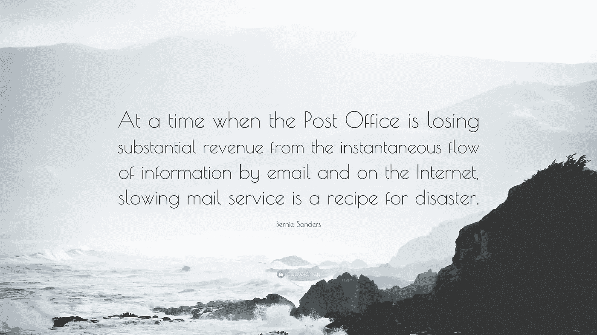

# 堆叠经济学:迈向即时区块链经济的 3 种方式

> 原文：<https://medium.com/hackernoon/https-hackernoon-com-hashstacs-technology-3-ways-towards-an-instant-blockchain-economy-stackonomics-6d3917002856>

> “当邮局因电子邮件和互联网上的即时信息流而损失大量收入时，缓慢的邮件服务会带来灾难。”
> 
> **—伯尼·桑德斯**

充满活力的金融部门是强大经济基础的沃土。银行和金融机构经常依赖陈旧的软件作为交易的经济中心，保管资产，对用户身份有严格的要求。过去金融业一直维持现状，现在却处于崩溃的边缘。

> 引用纳斯达克前首席执行官 ob Greifeld 的话，“我们目前在 T+3 结算。为什么不在 5-10 分钟内解决？”

格雷费尔德提出了一个有效的问题，考虑到在一个充满即时通讯的世界里，结算期仍然很长。这种情况仍然特别令人惊讶，因为人们普遍认为金融机构处于技术采用的前沿。

> 500 多年来，贸易生命周期的基础几乎没有变化。

**什么是理想经济？**

随着创新者正在创造扩大经济价值的新方法，我们设想一种创造了 Stackonomics 的即时经济，实现更高水平的资本准入、流动性和透明度。

**1。即时交易生命周期**

在一天之内，[1500 万张支付订单通过 SWIFT 网络](https://www.swift.com/about-us/swift-fin-traffic-figures)传递，但需要额外的清算和结算时间。

如果这些资金被引入区块链，向即时结算和清算的转变将释放出被困在运输途中的资本。需要实施技术转移，以使即时经济迈向下一阶段的堆栈经济资本主义。

**2。即时 KYC 资格**

自 2008 年金融危机以来，全球范围的监管加大了 KYC 反洗钱和严格合规的压力。根据一份关于[“2018 年反洗钱合规的真实成本”](https://www.ftfnews.com/u-s-securities-industry-spends-25b-on-aml-compliance/22732)的报告，该行业每年面临 253 亿美元的高额成本。

> 区块链为这些挑战提供了一个实用的答案。

在 Stackonomics 环境中，监管限制可以编码到智能合同中，以最大限度地降低合规风险和操作复杂性。

**这是什么意思？**

用外行人的话来说，这些智能合约可以通过编程来检测用户 KYC 文件的有效性，以满足受监管金融生态系统的要求。所以，想象一下 KYC 过程是即时的，简化的，不复杂的在一个堆栈经济环境中。更突出的是，它的内置功能完全符合监管标准。

> USAA 公司发展部主管维克·帕斯库奇说:“使用(区块链)技术可以带来的效率就像互联网一样深远。

**3。即时可审计记录**

审计部门以午夜苦工会议而闻名。

区块链的不变性和即时对账极大地确保了记录的即时可验证性和可审计性。在一个 Stackonomics 的世界里，监管机构将有能力检索记录在区块链上的此类不可撤销的历史数据，而不是在堆满文件柜的文件中寻找可能丢失的文件。

> 想象一下交易周期、审计、KYC 等部门的速度水平和与即时确认的整体集成。商品、信息、价值的流动和交换增加了。运动消除了障碍，以脉动的速度连接了整个生态系统。

Photo by [Clint Adair](https://unsplash.com/photos/BW0vK-FA3eg?utm_source=unsplash&utm_medium=referral&utm_content=creditCopyText) on [Unsplash](https://unsplash.com/search/photos/network?utm_source=unsplash&utm_medium=referral&utm_content=creditCopyText)

**这种破坏怎么可能发生？**

基于对区块链发展势头的坚定信念，我们制定了一项协议，旨在提高金融机构发行、交易、清算和结算数字资产的效率。

非常贴切的称呼是[证券交易资产分类结算(STACS)](http://stacs.io) 。

这些颠覆行业的描述之所以成为可能，是因为潜在的智能合约——聪明的可编程工具——基于一套可定制的规则来触发执行。它由 Hashstacs 建造，设想了一个通过 stacs 技术在区块链安全组装的互联金融世界。

> [Stackonomics:让我们把赌注押在即时经济上。](https://sg.linkedin.com/company/hashstacs)