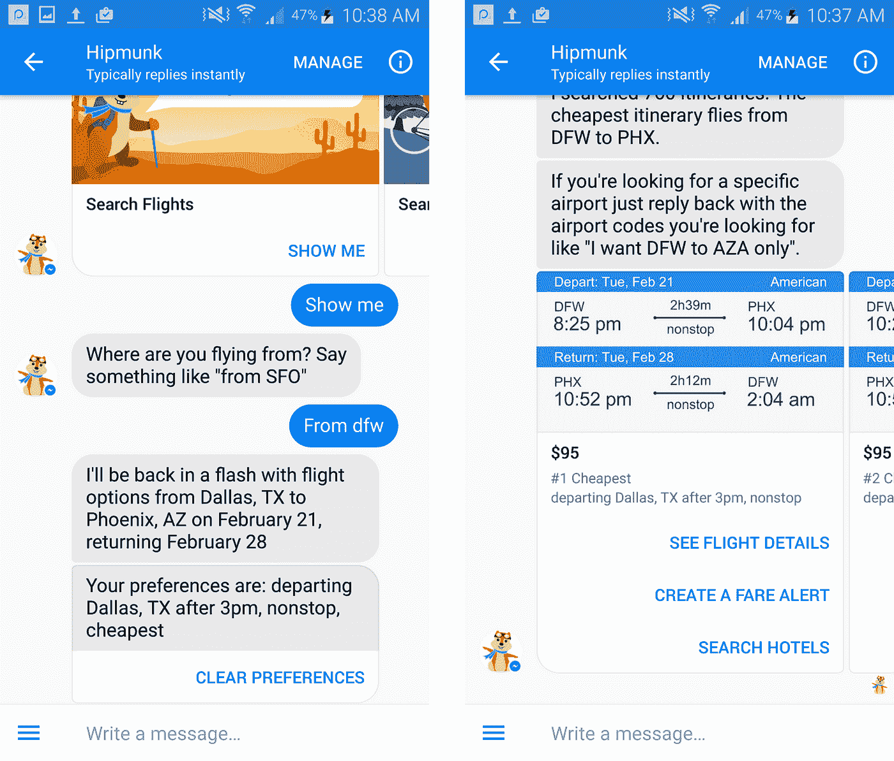
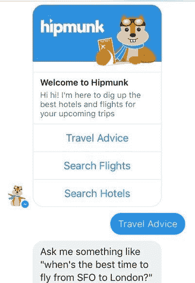
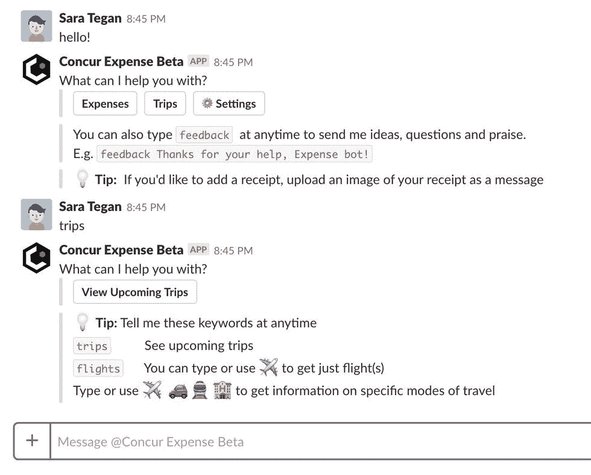
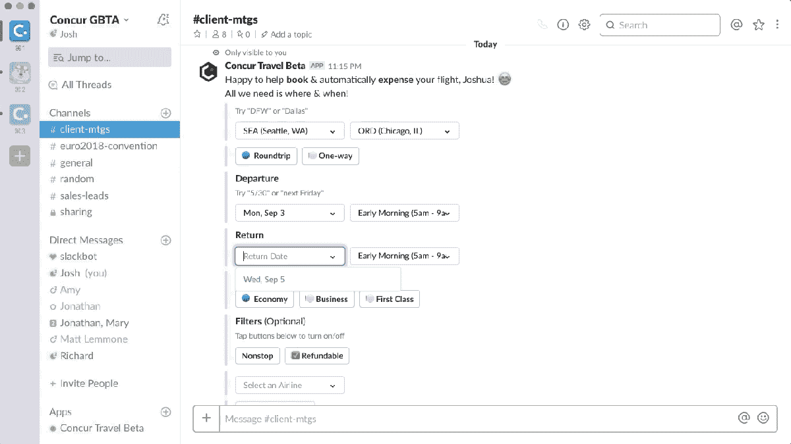
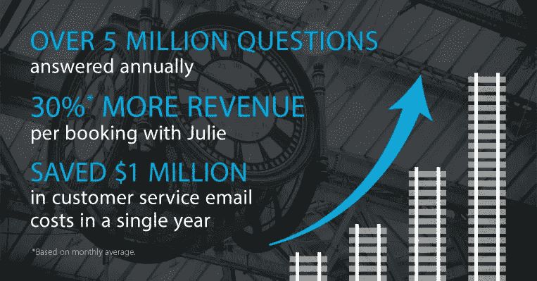
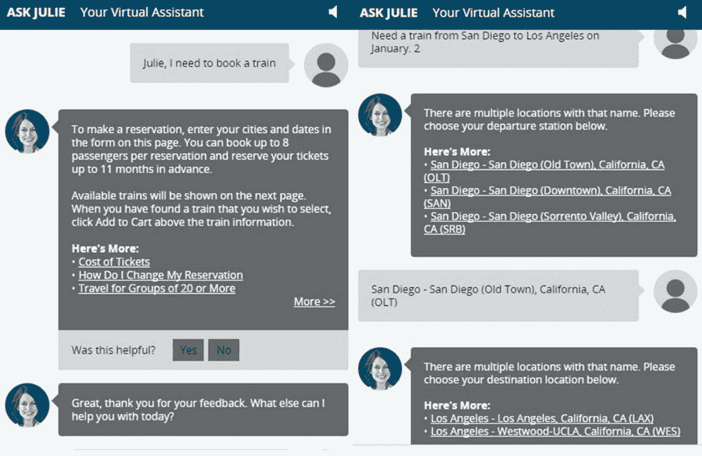

# 顶级旅游品牌 Hipmunk &美国国家铁路客运公司如何利用聊天机器人的力量

> 原文：<https://medium.com/hackernoon/https-hackernoon-com-how-hipmunk-amtrak-leveraging-the-power-of-chatbots-success-story-23691fa3f8ef>

对于一个品牌来说，在投资一种直接与消费者沟通的新方法之前，制定一个合理的策略是有意义的。人工智能技术的出色应用极大地影响了沟通渠道，聊天机器人是人工智能技术发展的最好例子。

今天，人工智能聊天机器人不仅仅是一个为与客户交谈而设计的管道，它们还能够执行自然语言理解和认知服务功能，具有语音到文本转换、说话人识别、语言识别、单词翻译、文本分析以及许多超出您预期的功能。你也可以在业内最好的 [IT 项目外包公司](https://www.valuecoders.com/)的帮助下，为你的网站设计一个智能聊天机器人。

## **在这里分享 Hipmunk 的旅游聊天机器人**的成功故事

Hipmunk Travel Bot

[Hipmunk](https://www.hipmunk.com/) 一个旅游门户网站使用一个对话聊天机器人来确定访问者的位置，然后给他们发送最好的旅游交易。Hipmunk 是有史以来第一个使用友好语言来满足旅行者的航班和酒店预订要求的聊天机器人，并以与人类旅行社相同的方式进行模仿。

Hipmunk 的首席执行官表示，“ *Hello Hipmunk bot 帮助他们了解了许多关于旅行者期望的信息，并为基于 Slack 开发最新的旅游聊天机器人铺平了道路，该机器人名为 SAP Concur Travel bot。”*

他们的新聊天机器人为商务旅行者与同事一起计划、讨论和预订航班开辟了道路。Hipmunk 的团队还通过聊天机器人了解到，他们的用户在计划旅行时会运行大约 20 次搜索。

## **Hipmunk 的团队分析过什么？**

## ***创造最好的聊天机器人，而不是喋喋不休的聊天机器人的想法***

*Hello Hipmunk* bot 使用自然语言处理(NLP)与旅行者交谈，并允许他们询问任何与旅行计划、预订更新、个人偏好等相关的问题。

Hipmunk 的团队就是这样理解用户实际上可以问什么的。此外，他们还发现，在搜索旅行计划时，人们不太可能一次分享或提供旅行预订所需的所有信息。大多数人聊天都很简短，比如:

> **用户:“飞往纽约？”**
> 
> **Hipmunk 的 Bot:“你从哪里飞来的？”**
> 
> **用户:“旧金山”**
> 
> Hipmunk 的机器人:“你想什么时候离开？”
> 
> **用户:“9 月 23 日至 25 日—晚上”**

## **吸取教训了吗？**

用户希望聊天机器人是准确的，并理解他们实际上想要什么，而不仅仅是他们对机器人说了什么。为了改进这一点，Hipmunk 的聊天机器人开发团队增加了 Hello Hipmunk 聊天机器人:

> **可视化界面、按钮、图像和“共享位置”等功能，无需回答“您从哪个机场起飞”**

所有这些新增功能让旅行者可以更自然地进行预订，并在机器人上分享他们的详细信息，而不会出错。

这就是为什么 Hipmunk 的聊天机器人开发团队更强调添加:

> **Concur Travel bot 中的可视化 UI 元素、自我更新消息和菜单使商务旅行者能够轻松快速地找到并预订航班。**

可以访问和使用群聊是 Hipmunk 聊天机器人开发团队做出的另一个重大改变，并应用于 Concur Travel 聊天机器人。该团队通过他们自己的研究、实验和密切观察用户的行为，学到了很多东西。

> **此外，通过键入("/concurtravel ")，用户甚至可以致电 Concur Travel Beta 团队，分享有关他们与同事或业务合作伙伴之间的任何对话的航班和旅行信息。**

## **您在 Concur Travel Beta 版聊天机器人上可以获得哪些好处？**

这个机器人可以让你以公司协商的价格找到航班。你只需输入诸如**“搜索”**或**“飞往纽约的航班”**等词语，聊天机器人就会显示所有航班，并允许你根据出发时间、返回日期、目的地、舱位、票价和航空公司类型来过滤航班。

您可以通过与同事实时交谈来预订航班或搜索航班。Concur Travel bot 允许您共享您的旅行计划，查找航班，并实时进行联合预订。

SAP Concur Travel Bot

一旦您选择了航班，该机器人将允许您使用您的 SAP Concur 用户配置文件为无缝预订付款。聊天机器人还允许您通过 Concur Travel Beta 上的聊天来访问有关即将到来的航班预订和酒店预订的信息。

如果您还运行一个旅游门户或机票预订门户，那么我建议您也应该在您的网站上安装 Concur Travel bot，以便变得更加智能，甚至可以与您的客户进行简单的聊天。

> 要下载 Concur Travel 聊天机器人，只需查看 [Slack 应用程序中心](https://www.concur.com/app-center/listings/5b6e0554a7e7001900d162f4)和 [Slack 应用程序目录](https://slack.com/apps/A9T8VTNNL-concur-travel-beta)。或者，你可以[雇佣聊天机器人开发者](https://www.valuecoders.com/hire-developers/hire-chatbot-developers)为你的旅游门户网站开发人工智能聊天机器人。

## 下面是美国国家铁路客运公司的聊天机器人/虚拟助手“问朱莉”如何节省了 100 万美元

## ***一个伟大的聊天机器人总是预见到不仅仅是自动化***

美国国家铁路客运公司是美国著名的最大的国家铁路公司之一。他们通过使用*“询问朱莉”*这款虚拟助手/聊天机器人在客户服务上节省了 100 万美元，它具有广泛的在线订票功能，还可以用文本语音回答。

> **美国国家铁路客运公司网站平均每天接待 375 万访客，铁路服务每年运送约 3000 万乘客。美国国家铁路客运公司需要一个解决方案来为其客户提供快速的查询解决方案。**

通过在其网站上实施 Julie，美国国家铁路客运公司的预订率提高了 25%，用户参与度和客户服务增加了 50%。朱莉每年平均回答 500 万个问题。

## 美国国家铁路客运公司的朱莉聊天机器人能为你做什么？

美国国家铁路客运公司的聊天机器人带有人工智能功能，并为你的网站访问者提供在线自助服务的选择。Julie 还有一个追加销售功能，允许您的客户预订火车票和酒店房间。

聊天机器人还为您提供所请求目的地的路线图，并把您转到可以预订火车票的页面。Julie 知道您的所有疑问，聊天机器人会以语音形式为您提供最相关的信息以及书面回复。

## **美国国家铁路客运公司的聊天机器人开发团队做了哪些分析和规划？**

美国国家铁路客运公司每天会接到大约 84，000 个乘客打来的电话，询问火车预订时间表、票价、火车状态等等。

> 美国国家铁路客运公司聊天机器人开发团队重新设计了公司的 IVR 应用程序、CTI(计算机电话集成)和 web 服务。

Julie 是一个一体化解决方案，平均每天接听 50，000 个电话，远远超过一个人工代理每年处理的电话数量。

Julie 于 2000 年推出，如今每年处理约 2000 万个电话。2007 年，美国国家铁路客运公司通过使用 intervoice MTC 3.0 语音/XML 浏览器系统将 Julie 现有的 IVR 系统升级到自助服务环境。

今天，美国国家铁路客运公司的开发团队专注于优化目标，即呼叫者可以通过 Julie 轻松访问他们需要的信息。该团队还专注于自动化功能，并为 Julie chatbot 提供所需的智能，以消除预订过程中涉及的步骤。

## **认识你的虚拟助手朱莉**

## **这是朱莉聊天机器人**上的一个聊天示例

一个打电话的人想查询从旧金山到波士顿的火车时刻表。

**朱莉:**“你好，我是朱莉·美国国家铁路客运公司的自动代理。要知道某趟列车是否正点，说“列车状态”或者获取火车时刻表和票价信息，说“时刻表”。来制造…”

**来电:**“日程安排”

朱莉:“太好了，我们来查一下火车的时刻表和票价。如果你找到你想要的东西，我们也可以预订。

朱莉:“你从哪个城市出发？”

**来电:**“旧金山”

朱莉:“到达的城市是哪里？”

**来电:**“波士顿”

朱莉:“我想你说的是波士顿。是这样吗？”

**来电者:**“是”

**朱莉:**“知道了。波士顿有两个火车站。是哪一个？可以从波士顿南站或者后湾站选择。”

**来电:**“后湾站”

朱莉:“如果你知道你想离开的日期，现在就说吧。例如，“星期三”或“5 月 29 日”。你也可以说“我还不确定”。"

**打电话者:**“我不确定。”

朱莉:“那很好。暂时用 5 月 28 号吧，以后可以改。等一下，我去查火车……”

所以，很明显，自助式虚拟助理正在为美国国家铁路客运公司工作，朱莉最有趣的部分是，你永远不会觉得你在和一个机器人说话。感觉像真人一样。

> **根据公司统计，通过 Julie 预订的收入比通过其他方式预订的收入多 30%。**

聊天机器人在旅游行业的普及正处于快速增长模式。许多其他旅游门户和预订服务允许旅行者通过机器人、信使或 Skype 寻求航班和酒店推荐。Booking.com、Skyscanner 和其他品牌正在使用旅行聊天机器人来提供更好、更个性化的客户服务体验。

> ***也读:***[***2019 年最先进的聊天机器人创意业务应该考虑的 5 个***](https://hackernoon.com/5-chatbots-ideas-business-cant-afford-to-miss-in-2019-e59cd41e01f8)

聊天机器人提供了比人类操作员更个性化的用户体验，采纳者正在投资于未来的聊天机器人，在这些机器人中，人工智能对话不仅将成为现实，而且也是预期的。

那么，告诉我们你如何看待聊天机器人在旅游业中的作用。如果你想分享你对这个话题的看法，或者想知道如何在你的旅行聊天机器人中应用人工智能，或者希望了解更多关于聊天机器人开发的信息，请在评论区发表你的看法，以便我可以回复你的问题。

https://upscri.be/hackernoon/