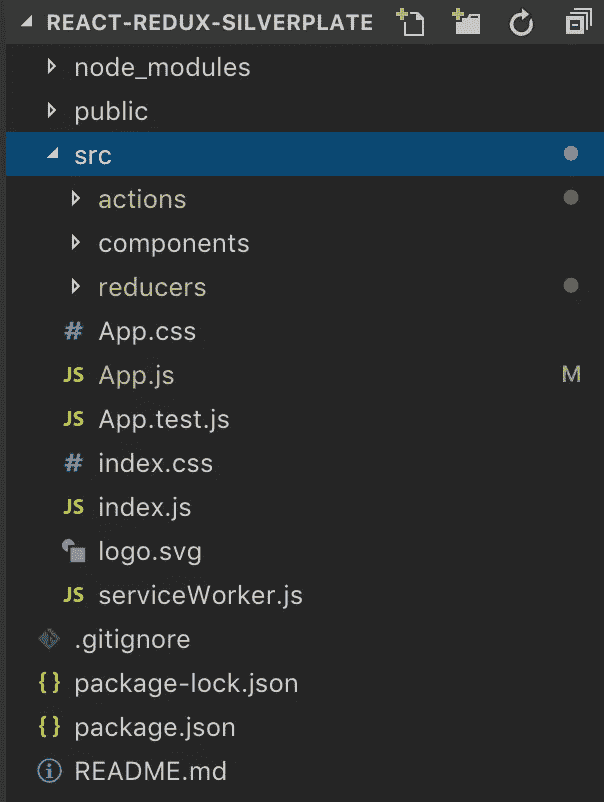
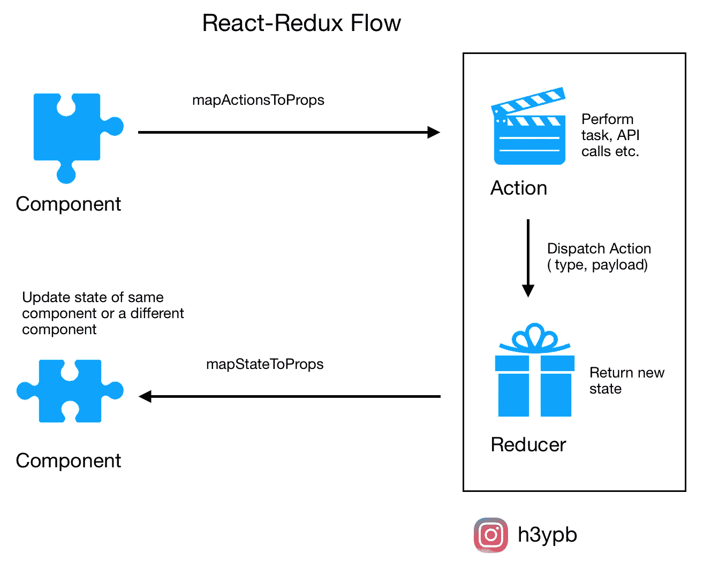
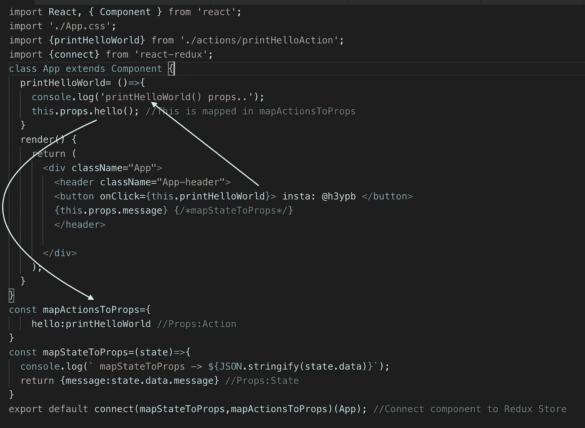
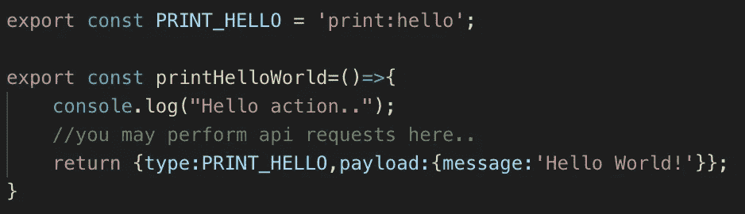
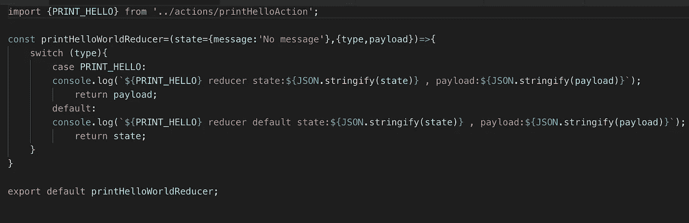
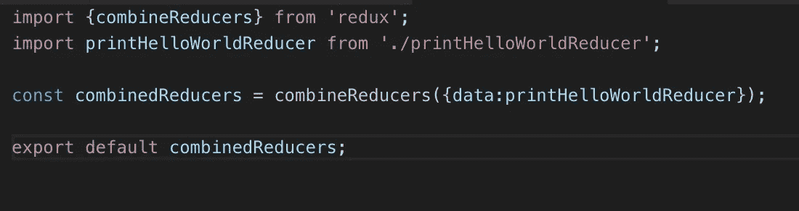
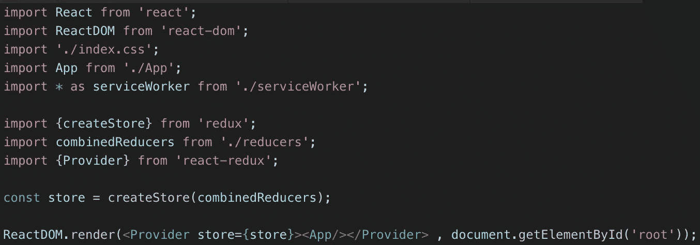
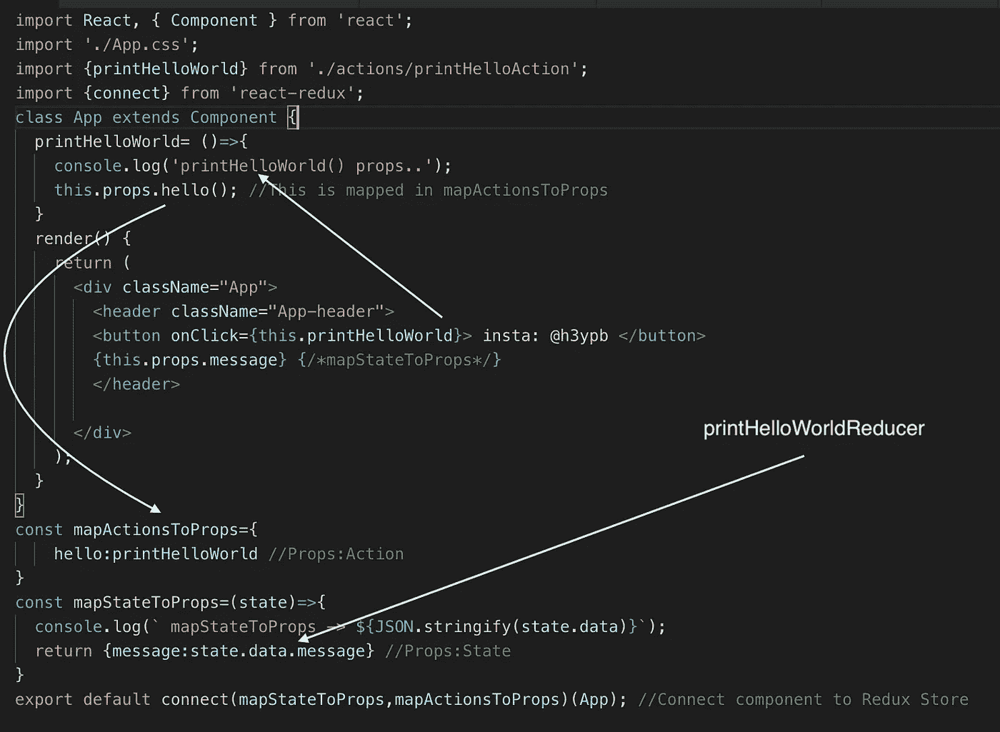
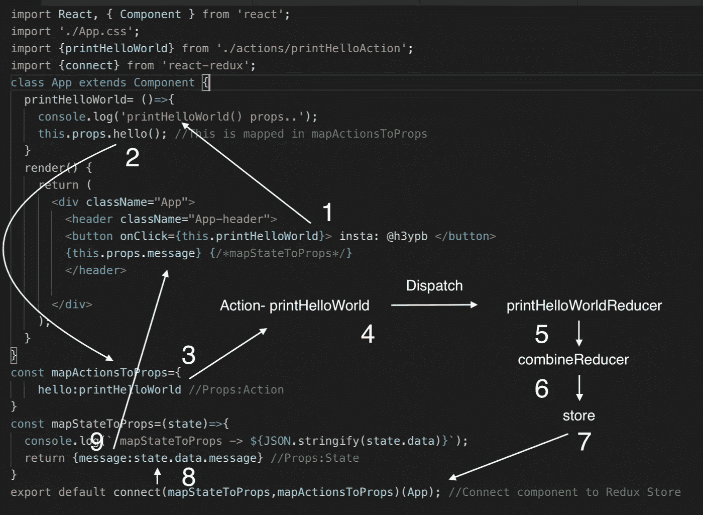

# react—4 步还原工作流程—初学者友好指南

> 原文：<https://medium.com/hackernoon/https-medium-com-heypb-react-redux-workflow-in-4-steps-beginner-friendly-guide-4aea9d56f5bd>

Photo by [Lukas](https://www.pexels.com/@goumbik) at [Pexels.com](http://pexels.com)

[Redux](https://hackernoon.com/tagged/redux) 允许您通过单向流管理应用程序的状态，其中子组件可以直接从 Redux 存储中访问状态，而不是从父组件中获取状态变化。

我假设您对 React 有基本的了解，并且了解 Redux 的用途。事不宜迟，让我们直接开始行动吧。

这是一个理想的 react-redux app 项目结构。

下面是一个 react app 典型的[工作流程](https://hackernoon.com/tagged/workflow)。我们将更详细地介绍下面的每个步骤。

React-Redux in 4 steps — Medium: @heypb , Insta: h3ypb

让我们看看流动将如何发生。

1。用户与前端组件交互。一个道具被用来调用一个函数来启动一个动作。当动作被映射到名为 mapActionsToProps(或者它可以被称为任何东西)的对象中的道具时，使用道具来启动动作，该对象告诉 react 应用程序要使用哪些道具来启动动作。

2。一个动作通常包含一个类型(或标识符)和有效载荷(或数据)。它还可以执行诸如从 API 获取数据之类的任务。下面的代码展示了一个动作可能的样子。

actions/printHelloAction.js

3。一个动作一旦被调度，就被一个 reducer 接收。缩减器的工作是返回改变后的状态。根据操作的类型，reducer 可能会返回组件的更改状态。

reducers/pringHelloWorldReducer.js

一个 react 应用程序的所有 reducer 被组合成一个 redux 存储的参数。

reducers/index.js

redux 存储被提供给根组件中的 react 应用程序。

src/index.js

4。改变后的状态再次用于显示更新后的组件。在 mapStateToProps 函数中，状态被映射到组件的属性。该函数中定义的属性可以相应地用于更新组件。

所以更详细的流程可能是这样的，

react-redux flow

如果你想浏览代码，看看它们是如何组合在一起的，可以在[这里](https://github.com/heypran/react-redux-silverplate)找到上面代码示例的 Gitub。

在 react-redux 中工作时，您应该记住某些事情

1.  减速器必须是纯函数。给定任何输入，输出必须总是相同的。
2.  整个应用程序的[状态](https://redux.js.org/glossary#state)存储在单个[存储](https://redux.js.org/glossary#store)中的对象树中。
3.  状态为只读。改变状态的唯一方法是发出一个[动作](https://redux.js.org/glossary#action)，一个描述发生了什么的对象。
4.  状态的改变是由纯函数(减速器)完成的。

希望您已经了解了基本的 react-redux 应用程序工作流。

干杯！快乐的一天！

欢迎在 [LinkedIn](https://www.linkedin.com/in/pranjal-baweja/) 和 [Instagram](https://www.instagram.com/h3ypb/) 上加我！

有许多重要的概念，你可能想知道，如果你想继续前进，请参考下面的链接

 [## uanders/react-redux-cheatsheet

### React Redux 工作流和概念备忘单。通过创建一个……为 uanders/react-redux-cheatsheet 的开发做出贡献

github.com](https://github.com/uanders/react-redux-cheatsheet/blob/master/article/react-redux-concept-workflow.md)  [## 为什么我们需要 Redux 中的异步流中间件？

### 根据文档，“没有中间件，Redux store 只支持同步数据流”。我不明白为什么…

stackoverflow.com](https://stackoverflow.com/questions/34570758/why-do-we-need-middleware-for-async-flow-in-redux/34599594#34599594)  [## 表示和容器组件

### 你会发现如果你把组件分成两类，你的组件更容易重用和推理。

medium.com](/@dan_abramov/smart-and-dumb-components-7ca2f9a7c7d0)  [## 为什么我们需要 Redux 中的异步流中间件？

### 根据文档，“没有中间件，Redux store 只支持同步数据流”。我不明白为什么…

stackoverflow.com](https://stackoverflow.com/questions/34570758/why-do-we-need-middleware-for-async-flow-in-redux/34599594#34599594)