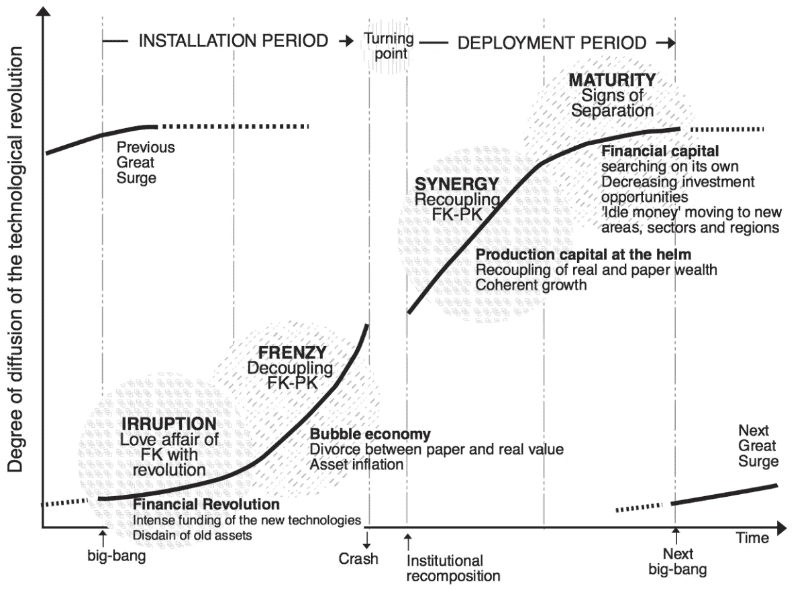
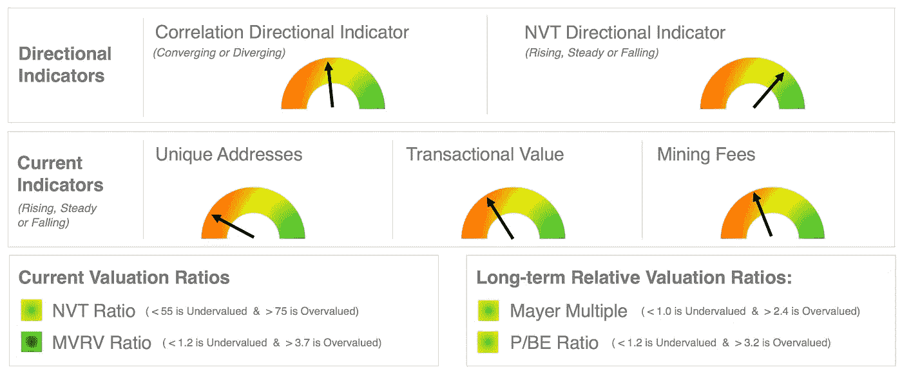
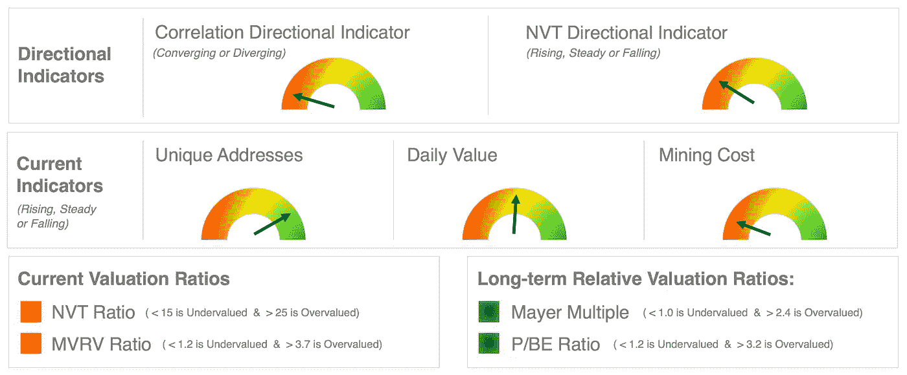
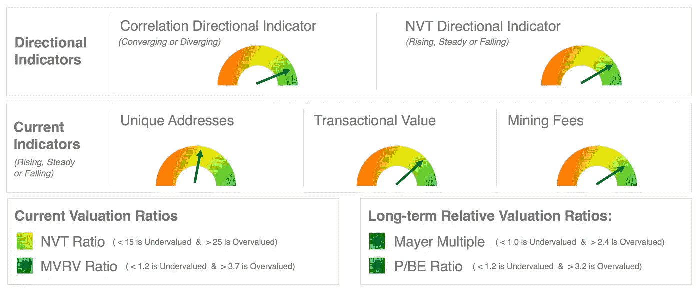
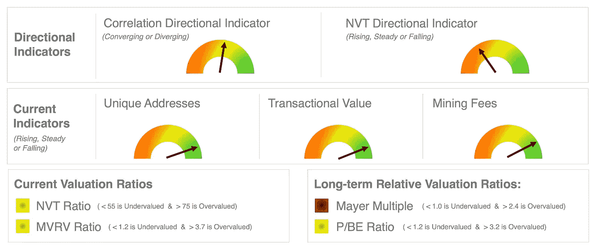
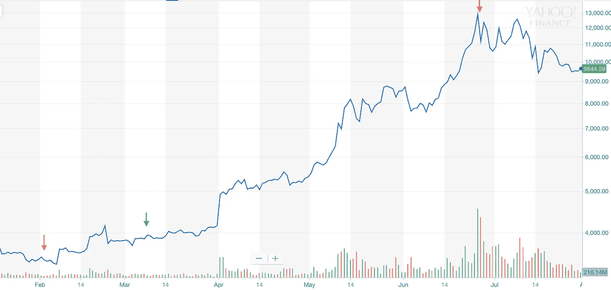

# 加密资产基础分析，第二部分

> 原文：<https://medium.com/hackernoon/https-medium-com-jake-ryan-crypto-fundamental-analysis-part-ii-81a65e01aa1c>

# 介绍

去年我写过一篇文章， [*加密资产基本面分析— 7 个指标&比率看*](/hackernoon/cryptoasset-fundamental-analysis-7-indicators-ratios-to-watch-e905da4b6c5) *，*关于如何在加密资产评估中运用基本面分析。我们希望查看网络使用情况，以根据效用得出相对价值。随着时间的推移，我们作为加密投资者社区需要建立一个框架，向外部投资者展示如何考虑加密资产的基本面估值。我在框架中增加了几个指标，现在使用 5 个指标和 4 个比率来显示加密市场的基本面。目前，我在比特币网络上使用这些指标，并做出一个方向性的论文，告知我的投资计划。

许多人通过使用某种形式的贴现现金流(DCF)模型开始这一过程。我读过一些顶级加密基金的精彩报告，它们根据一个模型和一些假设，对特定加密资产可能产生的收入进行了自下而上的分析。例如，这里有一个关于 EOS 的伟大的[分析和估价模型。我认为，当市场已经成熟，并处于卡洛塔·佩雷斯(Carlota Perez)的技术革命模型(见下文)的协同或成熟阶段时，这是一个很好的方法，她的备受推崇的书*技术革命和金融资本*概述了这一点。然而，在狂热阶段，使用硬数据来计算*相对*值更有利。](https://multicoin.capital/2018/04/24/eos-analysis-and-valuation/)

From “*Technological Revolutions and Financial Capital”* by Perez

我相信我们刚刚完成了一个全新的长波经济周期的突入阶段，并开始了疯狂阶段，我称之为自主时代。你可以在我的文章 [*中读到更多关于这一点的内容，在自主时代*](https://hackernoon.com/cryptos-role-in-the-age-of-autonomization-2bf414ceb5d2) *中，Crypto 扮演的角色。*在狂热阶段，价格和价值存在解耦。这就是为什么他们称这个时代为*镀金时代*，不同于*黄金时代*。

我们中的许多人都经历过 90 年代的互联网繁荣，他们记得曾试图为新经济企业提出一个新的估值模型。在许多情况下，还没有利润，在某些情况下，还没有收入。如果你当时想尝试对一家网络公司进行估值，贴现现金流模型是帮不了你的。在这种情况下，你可以不投资新技术，也可以提出一个新的框架来评估这些资产。我们开始考虑*眼球*和*浏览量*。

在周期的早期阶段，大多数资产还没有收入或利润(或者说没有多少)。由于大多数加密资产是网络，因此基本面分析关注使用和效用是有意义的(见下文)。即使这些加密资产还没有现金流，它们仍然具有潜在的价值。

这个框架使用相对价值，根据比特币这一主要储备加密资产做出方向性决策。投资者通常必须先购买比特币，然后才能投资任何其他加密资产。因此，跟踪储备资产的使用情况将为我们提供关于整个加密市场的信息。由于这些加密资产是网络，我们的模型将关注我们如何评估网络。我们确实有这方面的经验。

## 网络效应&梅特卡夫定律

大多数加密资产都有网络效应。[网络效应](https://en.wikipedia.org/wiki/Network_effect)是一种资产或集合的属性，随着更多人的加入，它对现有用户变得更有价值。[梅特卡夫定律](https://en.wikipedia.org/wiki/Metcalfe%27s_law)指出，网络的价值与连接用户数量的平方成正比。这个基本版本已经被[推翻](https://spectrum.ieee.org/computing/networks/metcalfes-law-is-wrong)，现在[假设](https://multicoin.capital/2018/05/09/on-the-network-effects-of-stores-of-value/)网络价值更可能是 S 曲线而不仅仅是 n2 二次曲线。由于大多数加密资产都是网络并具有网络效应，因此在考虑如何评估资产时，用户和效用成为重要的考虑因素。为此，这一基本分析框架中的大多数指标侧重于用户、使用和效用指标，然后是价格效用比。

# 9 项指标——5 项指标和 4 项比率

以下是两类共 5 个指标——方向指标和当前使用指标。然后，我们还有 4 个比率的 2 个类别—当前估值比率和长期估值比率。

## 方向指示器

这些指标显示了两个主要短期指标的持续方向。这些是 5 个指标中最具时效性和短暂性的。

*   **NVT 方向指标** —该指标显示估值比率的走向，要么增加相对价值，要么减少 NVT 比率中的相对价值。
*   **相关性方向指示器** —这显示加密资产的相关性是增加还是减少。如果加密资产变得越来越相关，这通常意味着一个看跌的趋势，而资产变得越来越不相关，意味着一个更看涨的趋势。

## 当前使用指标

这些指标衡量直接的网络使用和效用。这些指标以下列形式显示当前网络效用:1)每日唯一用户数；2)每日交易金额(美元)；3)采矿费，这是网络产生的收入。如果加密网络每天被更多的人使用，并被用来转移更多的价值，那么它的内在价值正在增加*。*

*   **唯一地址**(每日)—统计每天交易中使用的唯一地址。这个数据被用作一个相对指标。如果独特的地址趋势正在增加，这是对加密市场的利好。
*   **交易金额**(每日)—每日统计估计的美元交易金额。这个数据被用作一个相对指标。如果数量增加，对加密市场来说是利好消息。
*   **采矿成本**(每日)—这是矿工在区块链处理交易产生的平均费用。这与矿工因在区块链促成下一笔交易而获得的大宗报酬不同。如果费用适中，对加密市场来说是利好消息。如果费用非常低，比如低于 20 美分，或者非常高，比如高于 20 美元，这是一个危险信号，表明有问题，需要进一步调查。

## 当前估值比率

这些比率跟踪当前的相对网络价值。NVT 比率类似于股票市场的市盈率，是加密分析的核心估值指标之一。它衡量交易的网络价值(NVT)。 [MVRV 比率](/adaptivecapital/bitcoin-market-value-to-realized-value-mvrv-ratio-3ebc914dbaee)是市场价值与已实现价值之比(MVRV ),与 NVT 比率相似，但更复杂。实现价值跟踪最后一笔交易的交易价格。

*   **NVT 比率** —低估是< 55 &高估是> 75
*   **MVRV 比率** —低估为< 1.2，高估为> 3.2

## 长期估值比率

这些比率是跟踪长期相对网络价值。 [Mayer 倍数](/@sunnyday.james/a-straightforward-guide-to-the-mayer-multiple-2add52e90602)根据 200 天移动平均线计算价格。这给出了相对于时间和过去交易价格的比率。 [P/BE 比率](https://cryptoiscoming.com/bitcoin-price-vs-cost-of-mining/)显示价格与矿商盈亏平衡成本的价值比率。这给出了价格相对于生产成本的比率。

*   **梅耶尔倍数** —看涨是< 1.0，看跌是> 2.4
*   **矿业市盈率** —看涨为< 1.2，看跌为> 3.2

# 解释

学会如何使用这些指标和比率来为你的决策和投资计划提供信息是很重要的。下面，我们将概述一些不同的模式，让您了解如何使用这些度量数据以及如何解释它们。

## 处于下降趋势的网络，具有可能趋势反转的早期指标

Fundamental Analysis of July 28, 2019

上面的仪表板显示网络的使用率正在下降。你可以在当前的指标中看到这一点。然而，它可能接近使用趋势的逆转。你会看到 NVT 方向指标为绿色，这意味着要么使用率上升，要么价格下降到足以使 NVT 比率开始显示更多的相对价值。在比率中，所有比率都是绿色或深绿色，表示存在相对值。除非你处于熊市周期的末期，街上血流成河，否则你的长期相对估值比率不会变成深绿色。今年早些时候，我们看到了深绿色，但在下一个隐秘的冬天到来之前，我们不太可能再看到它。

## 一个在大调整后被高估的网络

*Note: Dashboard showing metrics as of February 10, 2019*

上面的仪表板显示了一个已经崩溃并承受了大量向下定价的市场，但仍被高估，仍处于熊市中，但由于使用量增加，可能会反转。在加密冬天结束时，你将最终开始看到长期比率的深层价值。这种情况可能会持续一段时间，直到估值比率最终通过价格下降或使用量增加发出价值信号。当当前估值比率赶上长期估值比率时，你会知道什么时候进入市场。

## 网络效用和深度价值呈上升趋势

Note: Dashboard showing metrics as of March 11, 2019

上面的仪表板显示了一个已经触底的市场，显示其被低估，网络公用事业在网络中的使用正在增加。这是当一个*隐秘的冬天*已经触底，并且正在为上升趋势的逆转做准备时，仪表盘的样子。价格下降了这么多，所有的比率都显示相对价值。此外，当前的指标显示使用率和效用正在提高。最后，方向指标显示积极的活动。这就是在一个隐秘的冬天后趋势逆转的样子。

## 价格上涨快于使用量的网络趋向于高估

Note: Dashboard with metrics showing June 26, 2019

上面显示了一个市场，这是越来越多的效用，但价格可能已经跑得太远，太快，需要巩固。当前的指标显示使用率和效用正在上升，并且呈积极的上升趋势。然而，目前的估值比率显示，价格上涨的速度快于使用量的增加。你还会注意到 NVT 方向图也向你展示了这一点。

## 用于比较的 2019 年年初至今比特币图表

如果你看看比特币的交易历史，你会发现基本面会对你的交易有所帮助。比特币网络的基本面分析将显示何时存在深度价值(通常来自长期熊市期间的重大调整)，何时使用量增加，或何时价格上涨得太多、太快。查看比特币价格图表上网络指标的日期可以说明这一点。

# 结论

在 Tradecraft Capital，这个 Tradecraft 基本面分析(TFA)框架是我们基本面分析的基础。我们采取多层次的方法进行基本面分析。这是第一层。这些指标仅来自比特币网络，用于制定投资计划的方向性决策。

2019 年，加密资产变得不那么相关，在网络中的使用增加了，价值出现了，这意味着*加密冬天的结束。一轮新的牛市周期已经开始。这一点已经得到了验证，比特币的价格通过几个关键的阻力位强劲上涨，在 Q2 表现强劲。在整个周期中，重要的是使用方向指标作为最具时间敏感性的指标，使用当前使用指标在使用率和效用下降时发出警告，使用估价比率在价格可能被高估时发出警告。有了这些，基本面分析应该给投资者更多的数据点，让他们做出明智的投资决定。*

*免责声明:以上仅代表一种观点，仅供参考。它无意成为投资建议。请自己做作业。*