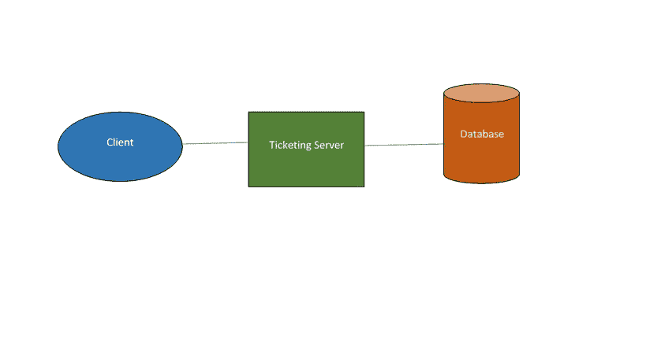

# 无服务器计算的前景和危险

> 原文：<https://medium.com/hackernoon/https-medium-com-krishnansrinath-the-promise-and-perils-of-serverless-computing-498f8516d7f7>

Photo by [Max Bender](https://unsplash.com/@maxwbender?utm_source=medium&utm_medium=referral) on [Unsplash](https://unsplash.com?utm_source=medium&utm_medium=referral)

## 概观

想象一下，作为一名工程师，有一天你可以专注于应用而不是基础设施。听起来好得难以置信？许多富有成效的努力可以被引向正确的方向。事情本该如此。好消息是，通过无服务器计算，这已经成为现实。

无服务器计算是一种执行模式，让工程师专注于应用目标，将基础设施的负担外包给云供应商(亚马逊、微软、谷歌)。用户编写一个服务器端函数，该函数在云供应商托管的无状态容器中运行。功能由云供应商管理的各种事件(例如 HTTP、数据库请求)触发。云供应商管理负责执行一段代码的资源分配，用户只需为运行代码所使用的资源数量付费。[亚马逊 AWS Lambda](https://aws.amazon.com/lambda/) 、[微软 Azure 函数](https://azure.microsoft.com/en-in/services/functions/)、[谷歌云函数](https://cloud.google.com/functions/)是无服务器计算的流行实现。

## 历史

第一个现收现付是 2006 年推出的 Zimki。它在商业上并不成功，已于 2007 年关闭。PiCloud 在 2010 年提供了按需付费服务。亚马逊在 2014 年推出了抽象的无服务器计算产品 AWS Lamda。其次是微软 Azure 功能、谷歌云功能和 IBM 云功能。

## 传统模式

让我们考虑一个传统的客户端-服务器模型，比如一个“电影售票”系统。传统上，该架构看起来类似下图。假设实现了服务器端，客户端在 Javascript 中:

**Traditional Model**

使用这种架构，客户端可能相对不太智能，因为很多逻辑都是在服务器中实现的——身份验证、搜索、预订。

## 无服务器计算

在**传统架构**中，功能、控制和安全性由**中央服务器**应用程序管理。在**无服务器计算架构中，**没有**中央服务器。相反，我们有由 API 网关编排的不同组件。**

**Serverless Computing Model**

这传达了许多重要的变化。

(1)原始应用中的认证逻辑被第三方认证服务(例如，Auth0)
(2)中央服务器被实现为单独的组件(例如，用于“搜索”和“预订”功能)
(3)当使用“无服务器”架构时，将不同的逻辑需求分解成单独部署的组件是常见的方法。

# 承诺

Photo by [Sarah Cervantes](https://unsplash.com/@scaitlin82?utm_source=medium&utm_medium=referral) on [Unsplash](https://unsplash.com?utm_source=medium&utm_medium=referral)

**更快的上市时间**

在丰富的供应商生态系统的支持下，执行(从想法到交付)速度很快。例如，您可以使用 AWS Kinesis 轻松收集、分析和洞察流数据，使用 Azure Bot 服务构建对话体验。

**开发费用**

您关注核心应用程序功能，依赖外部服务实现其他功能，而无需开发它们。它大大降低了开发成本。例如，与 Auth0 集成用于认证功能，而不是构建一个。

**基础设施成本**

无服务器是指在不管理自己的服务器系统的情况下运行代码。它允许你花钱雇人管理服务器、应用程序框架、数据库。您只需为实际运行的功能支付少量费用。

**简单性**

无服务器架构不需要使用特定的框架。学习一个新的框架没有学习曲线。可以用 Java、Javascript、Python、Go 等实现函数。

**自动缩放**

缩放是自动的，由提供商管理。您不再需要考虑处理并发请求**、**性能问题等。

# 危险

Photo by [Markus Spiske](https://unsplash.com/@markusspiske?utm_source=medium&utm_medium=referral) on [Unsplash](https://unsplash.com?utm_source=medium&utm_medium=referral)

**服务蔓延**

与传统应用程序模型相比，无服务器模型中有许多移动部分。创建服务很容易，但很快就会导致服务泛滥。您需要有一个好的服务监控策略来控制这种情况。监控是一个棘手的领域，因为服务的短暂性，供应商提供的产品是基本的。

**安全**

拥抱无服务器架构为您提供了大量具有不同安全实现的服务。这增加了恶意攻击的机会，也增加了攻击的可能性。

**供应商锁定**

您使用的来自一个供应商的无服务器功能将由另一个供应商以不同的方式实现。如果你想换供应商，你需要更新你的工具。

## 结论

无服务器计算提供了显著的优势，包括缩短上市时间、降低工程和基础设施成本。但是，存在服务蔓延、监控和安全性方面的挑战。在你冒险之前，评估一下利弊。无服务器计算正处于青春期，观察它如何从青少年发展到年轻人将会很有趣。