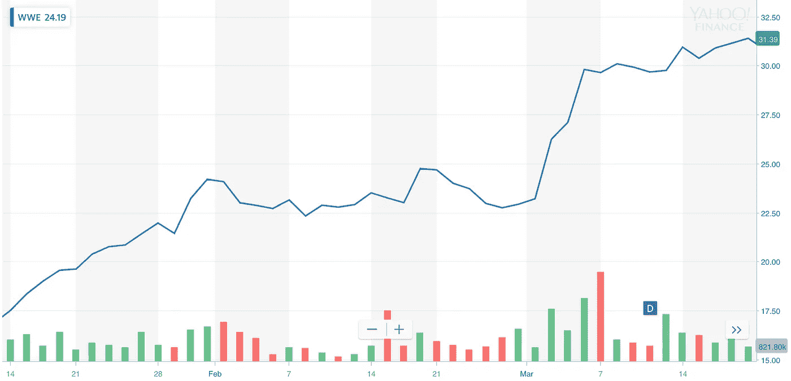
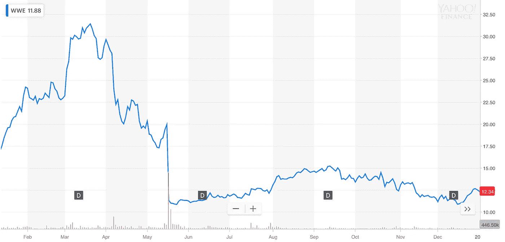
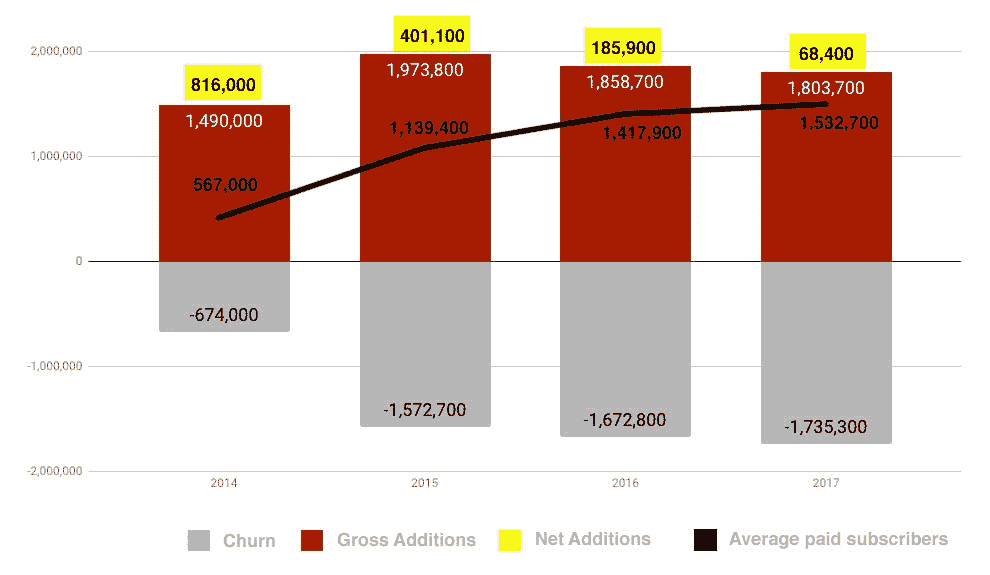
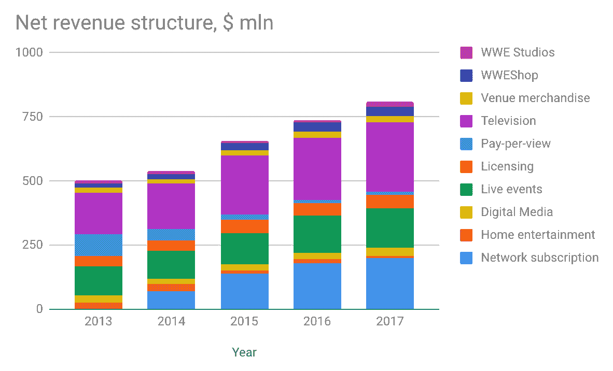
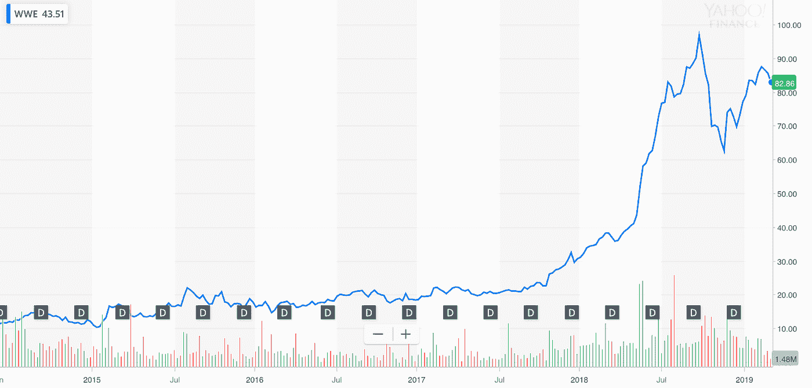

# 假摔跤公司以大胆的网飞风格重塑自我

> 原文：<https://medium.com/hackernoon/https-medium-com-loook-champions-of-innovations-ce66f1781831>

In 2014, WWE transformed its core business by launching WWE Network where customers paid a monthly $9.99 subscription fee for the streaming service | Unsplash

2014 年 2 月 24 日，世界摔跤娱乐公司(WWE)董事长兼首席执行官文森特·麦克曼推出了“网飞式”流媒体服务 WWE Network。为了访问这些内容，该服务的用户直接向 WWE 付费，从而绕过了有线电视或卫星电视提供商。利用像 HDO GO 这样的服务越来越受欢迎的优势，WWE Network 可以在大多数数字平台上使用，包括 WWE.com，也可以作为安卓、苹果等的应用程序。

文森特·麦克曼和他的运营团队做出了大胆的改变，重塑了这家有 20 年历史的娱乐公司，以适应粉丝习惯的变化。因此，WWE 的股价在转型后飙升了 402%以上，该公司被《福布斯》评为 2017 年表现最佳的第 12 只中大型美股，并根据[投票投资分析师](https://money.cnn.com/quote/forecast/forecast.html?symb=WWE)的意见，自 2018 年 2 月以来一直保持“买入”评级。

下图代表了市场对世界摔跤娱乐公司(WWE)所做改变的第一反应:

The transformation drove WWE stock up dramatically to $31.39 per share | Yahoo Finance

2014 年，WWE 通过推出 WWE Network 转变了其核心业务，客户每月支付 9.99 美元订阅流媒体服务。

在发布初期，WWE 网络的付费用户超过了 60 万，远远超出了投资者的预期，取代电视成为 WWE 最大的收入来源。虽然 WWE 一直在过渡到订阅模式，但它有时间重新谈判关键的电视分销协议，该协议从 2014 年到 2018 年增加了约 1 亿美元的转播费。

在那个辉煌的时刻之前，这家公司已经亏损了 17 年。WWE 于 1999 年上市，其股票在 2013 年停滞不前。其 41%的收入来自电视合同和授权。大型有线电视公司充当了粉丝的看门人，限制了公司重新谈判合同的能力。

文森特·麦克曼追随“网飞式”流媒体服务的技术趋势，推动 WWE 业务转型。该策略旨在避开有线电视公司，直接与粉丝联系。

[该公司调查发现](https://www.inc.com/jeff-haden/how-did-wwe-become-a-most-valuable-sports-brand-a-most-innovative-company-by-betting-on-and-disrupting-itself.html)WWE 的粉丝非常愿意观看数字视频内容。他们观看的数字内容数量是平均水平的 5 倍，并且倾向于订阅流媒体服务。

WWE Network 处于一个有吸引力的位置，拥有一个庞大的粉丝群，他们为有线或卫星公司的 WWE 内容付费，WWE Network 对他们来说是一个非常划算的选择。

粉丝可以支付 9.99 美元的月订阅费，而不是支付 45 美元的单次付费选项或有线电视月订阅费。

几乎就在发布之后，最初的需求淹没了他们的系统，网站崩溃了。WWE 技术团队还没有为这样的流量涌入做好准备。

[2014 年年度公开报告](https://corporate.wwe.com/~/media/Files/W/WWE/annual-reports/2014.PDF)宣布 WWE 网络的用户总数增加了约 1，490，000。对于一个成立不到 11 个月的服务来说，这是一个可观的数字。

然而，昂贵的用户获取和流失是转型的负面影响。截至 2014 年底，共有 674，000 名用户，剩余用户约为 567，000 名。这为 2014 年带来了 6950 万美元的新订阅收入。这些数字远远低于投资者的预期。

Speculation had driven WWE stock down dramatically to $12 per share till the end of 2014 | Yahoo Finance

**改造继续**

在内容交付方面的重大成就使得 WWE 能够绕过有线电视公司，直接接触到它的粉丝群。继 WWE 的成就之后，其他主要的娱乐公司如 CBS、HBO 和 Nickelodeon 也宣布了将他们的内容直接带给消费者的计划。这对 WWE 来说是一个信号，表明他们正朝着正确的方向前进。

但事实证明，这种新方法是一种昂贵的冒险，需要新粉丝的不断涌入。投资者对新用户数量的增长很感兴趣，他们甚至对 WWE 这样的品牌抱有巨大的期望。

为了满足这些期望，WWE 制定了发展 WWE 网络的战略计划，该计划将关注以下五点:

*   地理扩张
*   扩展分销平台
*   创建新内容
*   添加新功能
*   积极的用户获取和营销计划。

2014 年年中，公司宣布 WWE 网络的国际扩张。它在超过[“全球 170 个国家和 35 种语言”](https://corporate.wwe.com/~/media/Files/W/WWE/annual-reports/2014.PDF)上线。2015 年，国际收入[达到总净收入的 26%](https://corporate.wwe.com/~/media/Files/W/WWE/annual-reports/annual-report-2017.pdf) 。

下一步更冒险——免费试用。像网飞和 Hulu 这样的服务提供了随时取消订阅的权利。WWE 网络最初的订阅报价有六个月的承诺，但粉丝不喜欢它，这限制了新客户的获取。所以 WWE 最终转向了一个月的免费试用，这成为了一个很好的获取工具。

WWE Network 的用户数量受到这些变化的积极影响，与 2014 年相比，2015 年增加了 32%，如下图所示。但是，主要由于付费用户的流失，净增人数减少了一半，从 816，000 人降至 401，000 人。在接下来的 2 年里，净增人数持续下降，成为公司的主要威胁。

WWE Network Subscribers Growth (subscribers in thousands) | WWE 2014–2017 Earnings Presentations

**数据驱动的采集策略**

WWE Network 必须稳定地获取新用户，以弥补用户流失并实现所需的增长率。财务前景、流动性、业务和经营业绩直接受到公司获取足够数量新用户的能力的影响。

委婉地称之为“流失”，订阅量六位数的下降被证明是 WWE 每年持续存在的问题。2015 年流失率达到 80%(根据[2016 年年报](https://corporate.wwe.com/~/media/Files/W/WWE/annual-reports/2016.PDF)计算)，2016 年和 2017 年分别持续增长至 90%和 96%。摔跤狂热成为一年中最大的事件后，客户流失不断升级。旺季销售增加导致非旺季客户流失严重。

同样，与网飞类似，WWE 开始使用更多的数据来定制营销活动，以留住付费用户并降低流失率。数据收集和使用成为 WWE 根本转变的一部分。

该公司生成了多达[1000 万](https://corporate.wwe.com/~/media/Files/W/WWE/annual-reports/annual-report-2017.pdf)的用户资料，并雇佣了 40 名数据科学家来大幅提高公司利用数据的能力。例如，WWE 开发了一个基于用户观看数据的内容推荐系统。

通过观察网络消费、门票购买和网站活动等变量，WWE 完善了营销工作、制作策略等，以最大限度地提高门票销售和改善粉丝体验。WWE 依靠数据做出投资和开发决策。甚至内容创作也受到数据分析的监督，这被视为一种创新的成功方式。

[2017 年的](https://corporate.wwe.com/~/media/Files/W/WWE/annual-reports/annual-report-2017.pdf)业绩显示 WWE 转型成功。直接面向消费者的转型巩固了公司的市场地位。

WWE Network Subscribers Growth (subscribers in thousands) | WWE 2014–2017 Earnings Presentations

从 2013 年到 2018 年，WWE 收入增长了 61%。电视合同份额与自有媒体收入持平。WWE Network 的适度成功为该公司赢得了重新谈判关键电视分销协议的机会，该协议将 2014 年至 2018 年的转播费增加了约 1 亿美元。该公司的股价在 2018 年大幅上涨。

WWE shares skyrocketed more than 402% during 2014–2018 | Yahoo Finance

## 从 WWE 转型中获得的主要经验

重大改变需要时间、资源和**心理健康**。诚实地评估自己大胆行动的能力是非常重要的。现有业务赚钱越多，创新就越难。

但是，创新是不可避免的，因为保持稳定会受到破坏的威胁。因此，真正的挑战是说服人们从现有的利润丰厚、停滞不前的商业模式转向另一种创新层出不穷的模式。

在转型的过程中，最重要的是你的受众，而受众发现必须是起点。要交付客户想要的产品，就要准备好按照他们的条件去做。

> "这就是让人们成功的原因:穿越恐怖走廊的意愿和能力."——乔治·巴里奥斯， [WWE 的首席战略和财务官](https://variety.com/2015/digital/news/4-key-lessons-wwe-has-learned-from-its-wwe-network-one-year-after-launch-1201440507/)