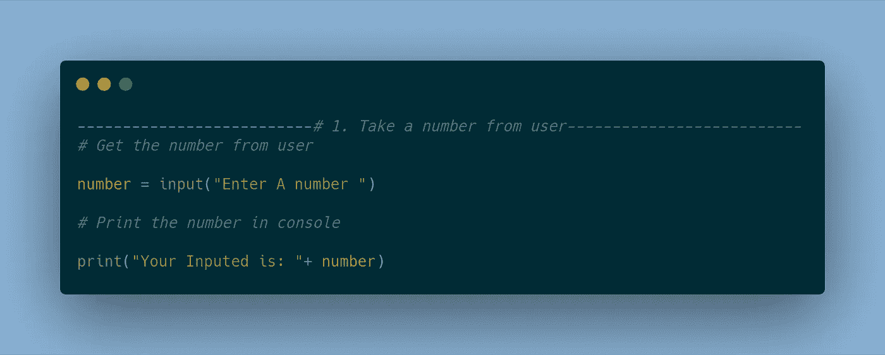
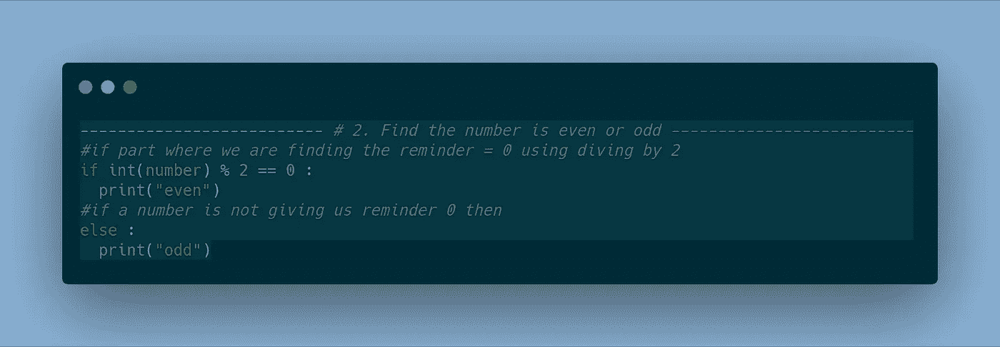
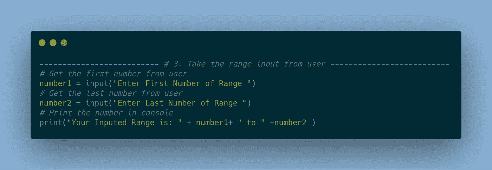
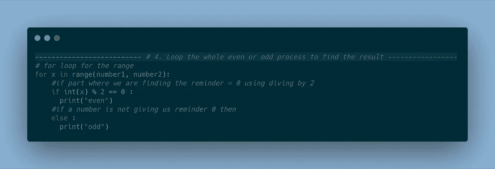
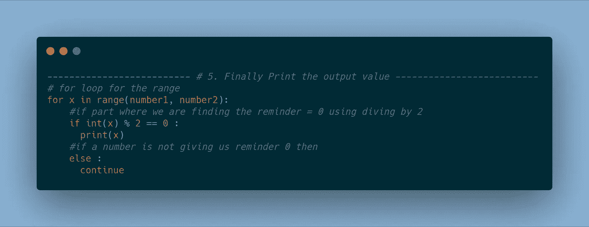
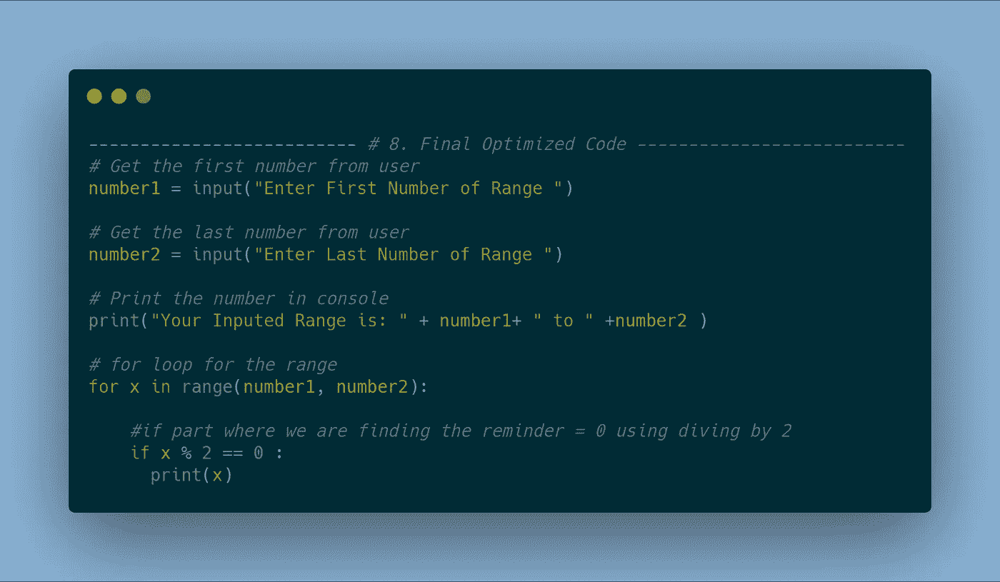

# 如何解决一个编程问题

> 原文：<https://medium.com/hackernoon/https-medium-com-nerdjfpb-https-medium-com-nerdjfpb-solving-a-programming-problem-with-example-fd4471bc2810>

## 没有问题的编码是闻所未闻的。专业编码人员在编码时会面临很多问题。他们经常使用谷歌。在本文中，我们将尝试一起解决一个问题。

假设我们有一个问题，用户将给出数字的范围，我们需要找到所有的偶数并将它们打印到 UI 或控制台窗口中。

Break Down Problems in Your Creative Ideas

解决问题有很多不同的方法。你可以凭直觉行事，也可以制定策略来解决问题。让我们一起想办法解决这个问题。

# 让它模块化

第一种选择是我们把一个问题分成更小的部分。我们可以把我们的问题分成以下几个部分:

1.从用户那里拿一个号码

2.找出它是偶数还是奇数

3.接受用户输入的范围

4.循环整个偶数或奇数过程以找到结果

5.最后，打印输出值

6.检查 bug

7.查看代码

8.优化了最后一个

对于所有的编码，我们需要做最后 3 步。所有其他的都可以根据问题要求进行更改。我们将使用 python 编写代码。

## 1.从用户那里拿一个号码

我们也可以把它分成几个模块。首先，我们接受用户的输入，然后在控制台中打印出来。我们将使用输入从用户那里获得号码。

code for get input from the user and print it on console

## 2.找出这个数字是偶数还是奇数

在这一部分，我们将思考如何找出一个数是偶数。如果一个数除以 2 后余数为 0，那么这个数是偶数，那么其他数就会是奇数。首先，我们将编写一些代码，检查数字是奇数还是偶数，并在控制台中打印出来。这里我们有两个条件，所以我们应该考虑使用一个`if else`或`switch`案例。取决于你更喜欢哪一个——随它去吧。这次我们将选择`if else`。

find out the number is even or odd

## 3.接受用户输入的范围

现在我们需要找到偶数和奇数，但是在我们的需求中，我们需要从用户那里获取更多的数据，所以让我们这样做吧。在第一个输入中，我们将获取第一个数字，最后一个数字将使用另一个输入获取。

Taking The Range Input From The User

## 4.循环整个偶数或奇数过程以找到结果

我们现在需要一个循环，这样我们就可以从这个范围中找到所有的奇数和偶数。我们可以在这里使用许多类型的循环，但我喜欢`for`，所以我用`for`。你喜欢什么就用什么。我们打印偶数和奇数。

Printed Even Odd In The Given Range

## 5.打印输出值

我们的程序完成了，现在我们做什么？我们需要打印用户想要的输出。用户希望我们打印偶数值，我们就这么做吧。我们只需改变它，在`else`中，我们可以使用继续忽略它。

Finally Desire Output Of a User

## 6.检查 bug

Bug 审查真的很重要，因为一个 bug 会把结果搞得一团糟，并且会引发很多问题。测试人员/SQA 不应该在你的代码中发现错误。让你的代码没有 bug，棒极了，这是你的责任！您可以使用不同类型的输入进行测试。

## 7.查看代码

审查代码非常重要。每个人都应该写出整洁干净的代码。正确的注释非常重要，它有助于其他开发人员更容易理解代码——所以要在代码中多加注释。在专业水平上，未记录的代码真的很难学习。

## 8.使最优化

每个人都应该优化他们的代码，有很多方法可以优化代码，但是你不需要知道所有的方法。

Final Optimized Code

所以我觉得我在这篇文章的最后一部分。我们从一个简单的问题开始，我们做了什么？我们把它分成更小的部分，这有助于我们更容易地调试和做正确的事情。将一个大问题分解成多个部分确实有助于更快更准确地编码。如果你是程序员，谷歌是你最好的朋友。

你可以在 twitter [@nerdjfpb](https://twitter.com/nerdjfpb) 找到我，查看我的[作品集](https://nerdjfpb.com)。