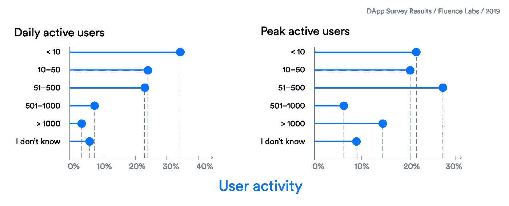
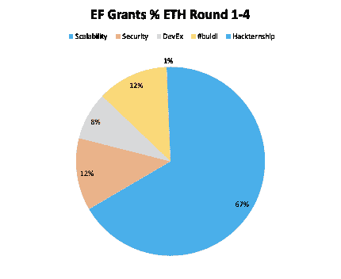
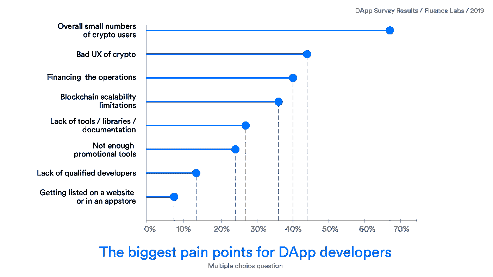
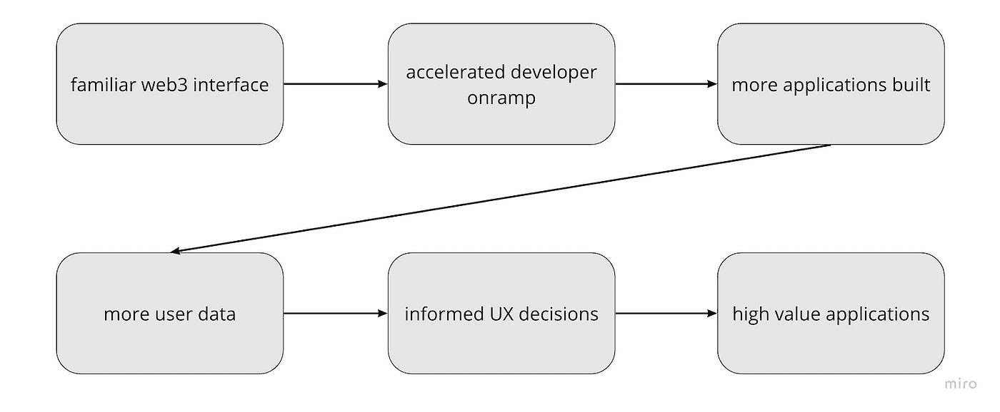

# 研究是不够的

> 原文：<https://medium.com/hackernoon/https-medium-com-okduncan-research-is-not-enough-moreexperiementation-404f69d20e52>

## 虽然后端研究进展迅速，但 UX 仍然是以太坊生态系统中令人头疼的盲点。需要加速应用程序的开发和试验来推动这一进程。

The Wright brothers succeeded in their design due to aggressive experimentation.

一个朋友最近向我推荐罗伯特·格林的《掌握》。这本书回顾了那些凭直觉发现人类创新新水平的人的生活。

莱特兄弟的故事在今天的 web3 开发环境中显得尤为重要。在 1900 年早期，许多团队得到了更好的资助，更多的学术专家竞相成功发射飞行器。作为卑微的自行车工程师，这对兄弟似乎没有机会。那么他们是如何成功的呢？

当大多数团队专注于工程规格(后端)时，威尔伯和奥维尔通过利用现场实验发现了他们的优势，为细微的调整提供信息，从而大大提高了他们在空中控制机器的能力。这些细微的设计调整不是抽象地解决的。它们通过使用出现。Web3 也不例外。

今天，以太坊社区将大部分资源花费在抽象设计上。这是史诗般的，必要的，领头的人做得非常好，但是有一只鸡*和*一个蛋到可伸缩性问题，并且在开发的 UX 方面明显存在盲点。

Dismal number of dApp users from a [survey](/fluence-network/dapp-survey-results-2019-a04373db6452) by Fluence.

尽管以太坊被认为是提供去中心化全球结算层的最强网络，但它将很快面临吸引开发者的真正竞争。为填补这一立足点并培养 web2 开发者而推出的平台将在他们的应用开发潜力中找到竞争优势。除了经济回报，两个主要因素决定了开发人员构建协议的能力 1)可伸缩性和 2)启动能量。更高的开发潜力有助于更快的设计迭代，每一次迭代都提供了一个开发杀手级应用的机会，从而点燃大规模采用。

# 协议可扩展性

以太坊和比特币等领先协议需要更高的交易吞吐量来支持类似于当今 web 的应用性能。以太坊社区的大部分开发集中在研究可扩展架构，通过第一层和第二层解决方案来扩充或更新协议。生态系统发展项目注入了数百万美元来补贴公共论坛([ethreseear . ch](https://ethresear.ch/)……)和学术财团( [Perun](https://www.perun.network/) 、[Pisa](http://hackingdistributed.com/2018/05/22/pisa/)……)中的长式研究提出的设计开发。

The percentage given for each category in the first four rounds of the [EF Grant Program](https://blog.ethereum.org/2018/05/02/announcing-may-2018-cohort-ef-grants/).

# 今日解决方案

*第一层解决方案:*将以太坊协议升级到基于 PoS 的分片区块链。社区开发项目已经向 10 个团队投入了数百万美元来构建新的客户端设计。虽然有人提议设立一个中级的 [Eth 1。x](https://docs.ethhub.io/ethereum-roadmap/ethereum-1.x/)Eth 2.0 完成路线图预计需要 2-5 年时间。

*第二层解决方案:*由将事务脱离链的架构组成。这些解决方案包括所有的血浆、侧链、状态通道和 zk 协议。虽然对广义等离子体和国家通道的研究仍在继续，但第二层支付通道和等离子体链今天在 mainnet 上是可用的。

尽管第二层解决方案可用，但很少有应用程序利用它的功能。最常见的情况是，它们由开发它们的团队在内部使用。推动以太坊发展的开源哲学的一个缺陷导致许多人执行多余的工作。以太坊上有一致用户的应用少之又少。这部分反映了以太坊今天的应用开发潜力。

坦白说，很糟糕。

No users, not usable, no tools, no marketing, no developers, appstore exile… the painful landscape of web3 development.

# 入职激活能量

对应用程序开发潜力至关重要的另一个方面与开发人员和用户的加入有关。在今天的互联网上，开发人员知道如何为信任系统的最终用户构建有价值的应用程序。区块链给这些故事带来了巨大的冲击。开发者必须从事软件开发的新领域，用户需要学习国外财务管理系统的流程。

Fastest way to high value apps comes from accelerating design iteration.

# 今日解决方案

很少有平台能够提供简单、容易的以太坊应用程序开发平台。隐僵尸？街区极客？这些都是很好的教育资源，但是它们仍然可以让开发者快速了解国外的工作流程。更不用说将更高级的功能应用于支付渠道和通用登录等应用程序的[难度了。](/crypto-propulsion-laboratory/an-ethereum-developers-guide-to-user-onboarding-97e107d56fe9)

通过将技术包装在直观的界面中，将双方从这些负担中解放出来，将降低学习曲线并加速开发周期。UX 设计的[原则](/@lyricalpolymath/web3-design-principles-f21db2f240c1)已经流传开来。新的设计模式继续出现。更多可用的[解决方案](/@jamesyoung/layer2-first-design-c136fdb059db)正在路上。

# 赌注

#moreexperimentation

我最近和一个参与各种去中心化社区的朋友交谈，他认为以太坊是一个伟大的 MVP，但仅此而已。她的观点是，由于更好的应用开发潜力、更强的治理结构、更多的博士、更有经验的技术企业家和更多的资金，新网络将超过以太坊。

她完全正确。

将会有许多高能量的连锁店来吃以太坊的午餐(既有[新](https://polkadot.network/) [分散](https://blog.cosmos.network/cosmos-launch-schedule-eaf963385aac) [网络](https://dfinity.org/)和[拥有现任开发者大军的大规模](https://www.ccn.com/binance-cfo-facebook-blockchain-mark-zuckerberg-centralized-hub)公司)。

尽管这些项目有强大的后盾，我怀疑以太坊将很难被超越。虽然治理可能无效，但去中心化的程度(仅次于比特币)允许真正的巴扎式创新。以太坊的秘方是其[庞大的](https://www.quora.com/Who-has-a-better-developer-community-Bitcoin-or-Ethereum)、[内在激励的](http://www.thenextevolution.com/2015/06/15/intrinsic-motivation-no-6-reason-ecosystems-are-the-future/)，以及[不断增长的](https://sludgefeed.com/ethereum-the-fifth-fastest-growing-project-on-github/)开发者社区。没有 40 亿美元的战争基金。这些人在业余时间一直在从事黑客活动。以太坊是最符合开放源码、去中心化理念的应用层协议。**

虽然我很欣赏区块链不可知论的观点，但在这个领域会有“赢家”和“输家”，就像飞行竞赛中有赢家和输家一样。今天我想指出以太坊发展道路上的盲点，并提出更高的运费率应该导致更详细的调整…就像莱特兄弟一样。

存在可扩展的解决方案。为什么他们没有被整合？***

**随意在评论中加入比以太坊更去中心化的链。*

我肯定会收到一些反对意见。

** * *主要是因为难以实现规格。*

***注意:*** *我深深地卷入了以太坊社区，并且有看到项目成功的既得利益。目前正在构建* [*产品*](https://abridged.github.io/splash/) *来帮助加速应用层的开发。*

*此外，如果您参与第 2 层开发，请在* [*调查*](https://l2design.typeform.com/to/vgicxX) *中输入您的信息。*

所有的想法都源于通过公共论坛和个人谈话所见证的模式。非常感谢那些关心理解今天发展的全部状态的人。继续为拼图贡献力量。