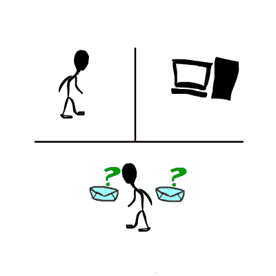

# 人工智能是由什么构成的？是图灵测试吗？

> 原文：<https://medium.com/hackernoon/https-medium-com-salilsethi-what-constitutes-artificial-intelligence-is-it-the-turing-test-8b70bad50c95>

一套汗湿的服装

“是的，夫人，滚-哦，滚，”机器人说，它去厨房准备晚餐，打开一罐食物，吹火蜡烛。

Roll-Oh 笨拙地走着，可疑地像一个穿着不舒服服装的人。尽管如此，它巧妙地将家庭主妇从所有日常琐事中解放出来，只需简单地按一下按钮。这是机器人技术的承诺，1940 年在纽约世界博览会上放映的短片《让它滚吧——哦》,展示了这一点。[机械机器人](https://www.turingtribe.com/story/ai-robot-uses-deep-learning-and-vr-to-make-salad-and-fold-clothes-7PHHDcaSBRXzieNNY)这部电影认为，我们的生活已经自动化了很多，我们期待个人的四肢金属人成为现成的仆人只是时间问题:给我们的植物浇水，问候我们的邮递员，帮助做饭。

当时，这个想法似乎并不遥远。投在广岛和长崎的核弹展示了科学的能力之广，超乎我们最疯狂的想象。蓬勃发展的经济刺激了技术创新和全新的产业，如家庭电视。

正是在这种情况下，艾伦·图灵，一个在计算机科学领域已经广受赞誉的天才，开始考虑这样一个问题: [**人工智能是由什么组成的？**](https://www.turingtribe.com/question/what-does-artificial-intelligence-mean-MtjDp3wNrbh6fNeH6)

**笨机器**

那么构成人工智能的是什么*？*

今天，就像 20 世纪 40 年代一样，这件事被虚假营销蒙上了阴影。《让它滚吧——哦》的叙述者带着极大的敬畏描述了“一些机器人甚至学会了飞行”。巨型客机上的微型自动大脑……”。正如这部电影夸大了航空力学，暗示飞机在某种程度上有自己的思维大脑，今天的许多科技公司也在用“智能”和“基于人工智能”等词来推销他们原本非常普通的编程软件。

最后也不能怪你疑惑:我的“智能家居”真的智能吗？Siri 智能吗？当我在我的区域要求“拉面”时，她似乎不太聪明，她返回了“小狮子狗”的谷歌图像搜索。

1950 年，艾伦·图灵发表了一篇名为《计算机械与智能》的论文。在这篇文章中，他提出了一个假设情况下的问题:你正在与两个人进行文本对话，两个人都在视野之外，其中一个是人，另一个是机器。你必须确定哪个是人，哪个是机器，而机器尽可能地模仿正常人的对话行为。如果机器成功了——要么是因为你不能确定，要么是因为你猜错了谁是真正的人——这是否意味着机器本身是有意识的？

**答错题**

自从第一次构思以来，所谓的[图灵测试](https://www.turingtribe.com/question/what-is-the-turing-test-7NavJ4aLzQZTPChuA)已经被重新解释了。如今，它最常被视为编程挑战。基于图灵测试的著名竞赛，如罗布纳奖，要求评委选出其程序最能模仿真人的参赛者。过去这类奖项的获得者已经证明了从字面上理解图灵假设的一些错误。“尤金·古斯特曼”是一个聊天机器人，由三名俄罗斯人编程，在一次图灵竞赛中，它成功说服了 33%的评委，认为它是一个人。怎么会？它被赋予了一个以英语为第二语言的男孩的个性。

尤金出轨了吗？严格来说，不是。也许这里的问题是前提。图灵测试并不一定是字面上的意思。也许根本就不是关于机器人的。图灵假设的情况真正做的是向我们展示我们自己。它回避了深刻的问题。我们如何定义意识思维？我们如何理解非动物智能？我们人类真的有什么特殊的东西不能在程序中复制吗？

**真正的考验**

图灵测试是一个假设，旨在为我们如何定义机器中的感知提供一些框架。而且，与普遍的看法相反，它不仅仅是我们可以说的一个标准:如果一台机器通过了这个测试，那么它就有能力思考。相反，图灵让我们做的只是思考他提出的问题。

> 能够像人类一样对话的机器本身是否可以构成一个思考实体？

这不是一个技术问题，而是一个哲学问题。不过，在你想出自己的答案之前，先看看下面的视频。

虽然我们从来没有得到我们的滚动式机器人，但艾伦·图灵在近 70 年前想象的对话机器人现在就在这里。新的人工智能软件 Google Duplex 可以像你我一样令人信服地接听电话，它已经赢得了现实生活中的图灵游戏。面对现实吧:没有先验知识，你根本无法通过电话区分谷歌 Duplex 是非人类。它不仅对上下文和对话方向的意外变化做出反应，而且说话时还带有随意人声的抑扬顿挫，甚至在适用的地方插入“mhm”、“gotcha”和其他不必要但令人信服的即兴表演。

所以我们终于到了图灵让我们准备好的时刻。我们能说 Google Duplex 和其他类似的、即将出现的人工智能本身就是思维实体吗？在这一点上，很可能不是。

也许是时候进行更新的图灵测试了。