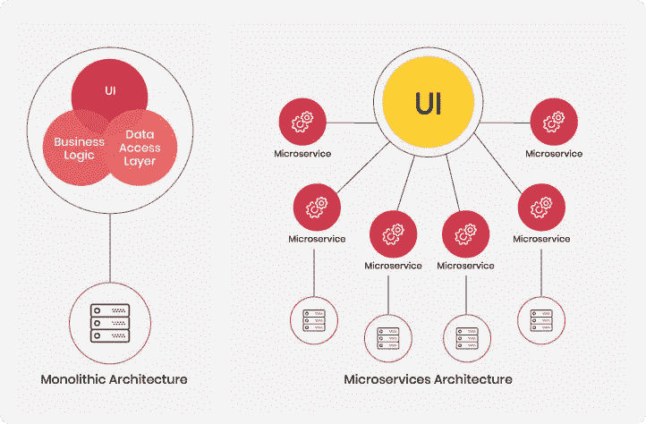

# 微服务和容器

> 原文：<https://medium.com/hackernoon/https-medium-com-spruha-pandya-of-microservices-containers-6f0ea25dac3>

## *企业连续交货指南*

现代企业在很大程度上依赖软件应用程序来满足众多的业务需求。在大多数企业中，一个软件应用程序提供了数百种功能——所有功能都集成在一个单一的应用程序中。例如，ERP 和 CRM 平台具有整体架构，并且高效地服务于数百种功能。但是，随着多个依赖项重叠并创建一个集群，对它们进行故障排除、扩展和升级的任务变成了一场噩梦。有时，企业为了方便而尝试调整这种庞大的应用程序，以至于它们陷入时间的漩涡，不再服务于任何真正的目的。这时，企业开始寻找现代化应用程序和采用灵活架构的方法。

# 微服务的崛起

企业对微服务架构的[需求](https://dzone.com/articles/new-research-shows-63-percent-of-enterprises-are-a)日益增长，以实现向现代交付的过渡。在这种架构中，功能被设计为独立的微服务，这些微服务松散耦合以创建一个可以进行多任务处理的应用程序。这种方法有助于大规模构建应用程序，在组件级别进行更改变得很容易，而不会干扰应用程序的其他部分。

**Monolithic architecture vs microservices architecture** ([ref](https://dev.to/alex_barashkov/microservices-vs-monolith-architecture-4l1m))

网飞是基于应用从整体架构过渡到微服务架构的最大和最有趣的成功案例之一。这家媒体服务提供商永远不会忘记 2008 年的那一天，一个分号的丢失导致了严重的数据库损坏，并使整个平台瘫痪了几个小时。网飞意识到他们必须改变他们的架构方法，这导致他们考虑从 monolith one 转向微服务架构。

尽管网飞在 2009 年开始转向微服务架构，并在 2011 年成功运行基于云的微服务架构，但微服务一词在 2012 年之前并未出现。直到 2014 年，马丁·福勒和其他业内领袖开始在[谈论这个](https://martinfowler.com/articles/microservices.html)，它才开始流行起来。

> 网飞首席云工程师阿德里安·科克罗夫特是一位有远见的人，他在架构格局的改变中发挥了重要作用，[将](https://www.slideshare.net/adriancockcroft/microservices-workshop-all-topics-deck-2016?ref=https://www.slideshare.net/adriancockcroft/slideshelf)微服务解释为“具有有限上下文的松散耦合的面向服务的架构”。

凭借转向微服务的大胆决策，网飞得以在可扩展性方面实现巨大飞跃。2016 年初，他们[宣布](https://media.netflix.com/en/press-releases/netflix-is-now-available-around-the-world)将服务扩展到 130 多个新国家。

# 微服务如何让企业应用受益

从整体架构过渡到微服务可以为企业带来无限可能，例如:

*   **创建支持服务并独立运行的组件的能力**
    这样，每个组件本身都是独立的，但所有组件都通过 API 耦合在一起，作为一个应用程序以统一的方式工作。
*   **独立测试和运行组件**
    人们可以轻松地运行测试，并对一个组件进行更改，而无需更改任何其他组件。
*   **相互连接的组件同步工作** 组件使用简单的通信信道和协议作为一个单元共存和协同工作。
*   **一个去中心化的应用**
    每个组件都是独立的，可以单独开发和部署。因此，消除了由于一个小缺陷而导致整个应用程序崩溃的风险。
*   **分散数据管理** 每个组件都有自己独立的数据库。因此，防止数据泄露接管整个应用程序，并将其限制在一个组件上。这增强了应用程序的安全性。
*   **灵活且可扩展的应用程序**
    无需对现有组件进行任何更改即可升级或扩展其任何部分的应用程序。

尽管微服务架构有诸多优势，但它也有自己的局限性。微服务面临的最大挑战之一仍然是大规模交付微服务的问题。这种分段应用的持续集成和交付变得复杂，因为它需要大量协调来同步集成和部署一组微服务。只有非常高效的 DevOps 团队才能实现这一壮举。关键是在微服务和它们运行所依赖的资产之间有无缝的通信渠道。为了充分利用微服务的价值，有必要将它们作为可自我维持的便携式单元来提供，这可以通过容器来实现。

# 为什么选择微服务容器

“容器简化了微服务的持续部署”——这是技术专家经常重复的一句话。但是，软件容器到底是什么，它们如何简化微服务的交付？

IT 容器做的和物理容器完全一样，只是数字化了。简而言之，容器让你把你的微服务放在专用的盒子里。这个想法是将“类似的”服务及其所需的资产打包成一个单一的包。容器在虚拟化操作系统中提供了一个隔离的工作负载环境。通过在单独的容器中运行您的微服务，它们都可以独立部署。由于容器在隔离的环境中运行，因此它们可以用于部署微服务，而不用考虑用于创建每个微服务的代码语言。因此，容器化消除了语言、库或框架之间任何摩擦或冲突的风险，从而使它们兼容。

由于容器的重量非常轻，便于携带，因此可以用来快速部署微服务。通常，一个应用程序由小型的、独立的微服务组成，每个微服务充当一个功能应用程序，通过不依赖于特定语言的 API 协同工作。在这种情况下，容器提供了所需的隔离，从而支持组件共存。

> docker [报告称](https://blog.docker.com/2016/04/the-modern-software-supply-chain-runs-on-docker/%5C)通过使用 docker 容器，软件发布的频率增加了 46%,这支持了将容器用于微服务的好处。

这些容器可以通过[容器编排平台](https://www.g2crowd.com/categories/container-orchestration)进行编排，如 Kubernetes、Docker Swarm、Helios 等。这些平台有助于根据需要创建多个容器，并使它们随时可用于应用程序的顺利部署。编排还控制如何连接容器，以从多个微服务构建复杂的应用程序。

# 前方的路

虽然容器和编排器是今天的热门话题，但更大的问题是企业如何以及何时可以开始在生产中使用它们？这两种技术都为应用交付的速度、规模和频率设定了新的基准，如果没有自动化和流程标准化，这将很难实现。这可以通过选择一个高效的[应用交付平台](https://www.hyscale.io/)来实现，该平台能够通过为现有应用和未来的云原生应用提供容器化，并将它们无缝地传输到 Kubernetes 来实现应用交付流程的自动化。通过这种方式，用户可以简单地标准化应用交付流程，并加速容器原生交付的关键方面，从而实现微服务的持续交付。