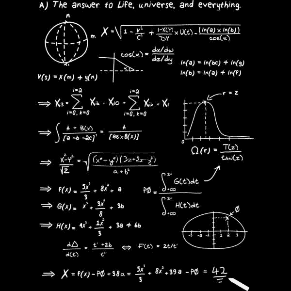
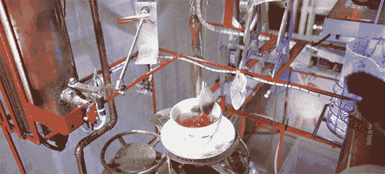
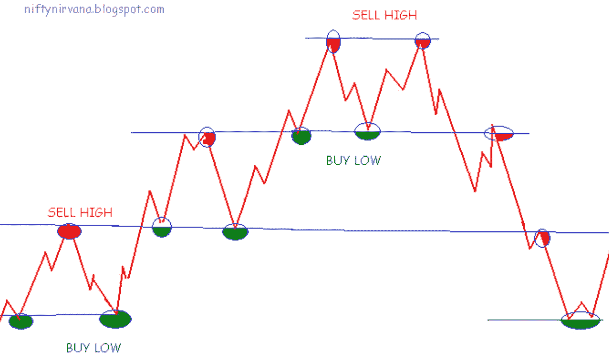
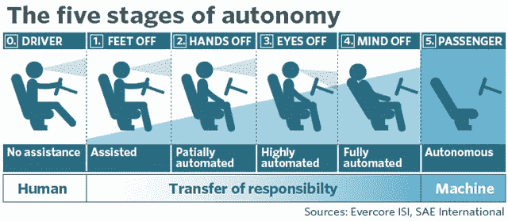
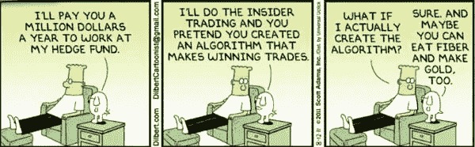

# 没人想告诉你人工智能交易的真相

> 原文：<https://medium.com/hackernoon/https-medium-com-supernova-the-truth-nobody-wants-to-tell-you-about-ai-for-trading-5d29a297ee93>

## 圣杯还是有毒的圣杯？

Are you positive about your backtest results?

**TL；没人能破解它。句号。***

T2:机器学习总是助长华尔街的幻想。毕竟，AI 可以检测人脸，驾驶汽车，击败国际象棋，围棋和现在的星际争霸 2 的世界冠军。它在交易中的应用似乎很自然，不是吗？

> 完全同意。如果我们可以向人工智能扔一个数据宝库，让它预测未来的市场价格，会怎么样？

不要为此烦恼…

价格是无法预测的，它们大多是随机的。一般来说，它们是不可预测的，只是偶尔发生，但没人知道什么时候发生。

神奇的“黑盒”自动化 alpha 的时代还没有到来。

# **还没有人利用**基于机器学习的预测破解过自动化交易**。**

没错。抱歉让你失望了。没有人知道他们的机器人下个月是否会表现良好。

> 等一下……一定有某个爱因斯坦般聪明的人发现了这个问题。
> 
> 文艺复兴和两个西格玛的世界怎么样？凭借他们数十亿的 AUM 和博士大军，他们肯定已经敲定了这笔交易。

他们没有确凿的证据。那些家伙养成了保守秘密的习惯，让外人去猜测。毕竟这是他们的品牌，在 FOMO 的游戏中，这是一个相当有利可图的举动。

不要误解我，量化交易策略是存在的，从套利到高频交易，根据摩根士丹利的数据，他们管理着价值 1.5 万亿美元的资产。但从整体来看，它们仍然相对简单。他们利用一系列可预测的行为和偏见。

仍然没有证据表明我们已经达到了**算法交易奇点**，其中**是一个端到端的自动化黑箱** **持续**产生 alpha。

这也是为什么尝试更复杂策略的基金会在执行和安全措施上花费大量金钱来保护自己:交叉信号确认、警告、止损、崩溃恢复、回滚…

Dad, I have a good feeling about that one.

> 你告诉我这东西是终极全垒打，从来没有人破解过它…我加入！

我知道你在想什么。如果你是例外，缺失的一环，被选中的那一个呢？

> 对！有人必须实现预言，并带来原力的平衡。

别急，阿纳金……在你得意忘形之前，让我们来谈谈我们都会陷入的最常见的陷阱。

## 1–答案是 42

你读过 [*银河系漫游指南*](https://www.amazon.com/Hitchhikers-Guide-Galaxy-Douglas-Adams-ebook/dp/B000XUBC2C/ref=tmm_kin_swatch_0?_encoding=UTF8&qid=&sr=) 吗？

> 太好了！
> 
> 由一台名为 Deep think 的巨型超级计算机在 750 万年的时间里计算出的“生命、宇宙和万物的终极问题的答案”是… 42。
> 
> 爆笑！:')

Finally, the one and only truth.

对，深思指出这个答案是没有意义的，因为指导它的人从来不知道这个问题实际上是什么。

有趣的是，定量分析师一直都这么做。他们设置 GPU，连续几天训练复杂的算法，询问明天的价格。

> 这有什么不好？你不能输入历史价格来预测未来的价格？

别忘了，市场是不可预测的，你违反了最基本的交易规则之一:

> 过去的表现并不代表未来的结果。

还不信服？

这是一个很好的现实检验，你可以用 LSTM 预测比特币的[价格。网络上充满了幻想破灭的交易者，他们尝试基于 ML 的价格预测。](https://hackernoon.com/dont-be-fooled-deceptive-cryptocurrency-price-predictions-using-deep-learning-bf27e4837151)

> 哎哟！有回溯测试的派对，有现场交易的宿醉…

> *当某件事看起来好得难以置信时，它很可能是真的。*

现在，让我们讨论一下定量分析师第二常犯的错误。

## 2-鲁布·戈德堡综合征

你听说过 [*鲁贝戈德堡机*](https://en.wikipedia.org/wiki/Rube_Goldberg_machine) 吗？

> 利用复杂的事件连锁反应来实现最终的琐碎目标的机器？

正确。或者打个比喻，过度设计的无用机器的故事。

Quant: “I think we’re getting really close!”

过来…你能大声给我读一下我跟你说过的那个长达一年的实验的笔记吗？

> 当然可以。让我想想…
> 
> “使数据正常化。检查。
> 
> 消除噪音。完成了。
> 
> 减少过度配合…我几乎为此失眠，但我认为我们的状态非常好。
> 
> 使用梯度下降寻找全局最小值。诶诶！就是这样…我是天才。
> 
> …
> 
> 等一下…为什么真人特工的表现还是不像回测里的？
> 
> 要么我疯了，要么我错过了什么。"

我们挖得很深，但始终没有找到金矿。

> 你能使用更多的功能，运行更好的数据清理，或进一步调整超参数吗？

聪明的建议…但是你现在得了鲁布·戈德堡综合症！

最终，很明显我们从错误的角度接近它。

您的机器将实现其设计目标。你不是想让月球车登陆月球，所以没必要建造火箭飞船。

> 在生活中，少即是多。

最后但同样重要的是，让我们解开欺骗我们所有人的最隐秘的误解。

## 他们说，低买高卖

> 啊，我知道那个！这一定是投资中最著名的格言。

从算法的角度来看，这条定律是误导性的。低点和高点只有在回顾时才变得清晰，某一天看起来很高的东西可能在另一天看起来很低。

而我们人类，善于锻炼‘常识’。我们以普遍的方式运用我们的判断，而不需要扩展思考或者需要大的数据集。在这个领域，机器还处于相对初级阶段。

以市场价格为例。

> 对，只是一个数字。

号码是个壳。但在外壳之下，是潜在业务、资本结构、宏观经济基本面以及人类情感和买家/卖家意图的复杂**衍生品。**

因此，机器精确预测市场价格的唯一方法是，你需要输入所有可能影响价格的因素。这实际上是不可能获得和训练算法的。

> 抓住你了。如果你只输入价格历史，你的算法会遗漏很多关于影响价格的潜在因素的信息。

> 价格是市场上发生的一切的结果，而不是原因。

> 好吧，莫斐斯，你启发了我。我不会吃蓝色药丸。
> 
> 但是你对使用 AI 进行交易有什么建议？

## 1-问正确的问题

用不同的方式提问变得很重要。不要在知道价格变动是随机游走的情况下问“价格会是多少”，而要问这样的问题:

*   还有哪些独立信息来源明显推动着市场动态？
*   什么样的指标、趋势和过去事件的组合能最准确地产生正确的信号？

> 我明白了！你需要转变思维，专注于推动成功的因素。

没错。关键在于**从数据事件和相应的市场反应**之间的**相关性** **中开发经验证据**，然后要求机器学习模型在该交易之前的数据中找到模式。

简而言之，ML 是为了增强我们感知过去证明成功的模式的能力。

> 你必须利用已证明的相关性，将游戏设定为“可赢”的游戏。

要发现真正的相关性，你需要精通许多独立的学科。让我们来看看如何培养这些技能。

## 2-发展横向思维

你看过十项全能比赛吗？

Run, Throw, Jump — Decathletes are considered the ‘World’s greatest athletes’.

> 据我所知，十项全能运动员不一定要在任何特定的学科上是世界上最好的，但要在十个学科上保持一致。

没错。

**在算法交易中，你需要精通技术，对机器学习有久经考验的理解，破译时间序列数据的古怪本质，掌握市场、金融和交易的基本面。**

> 有道理。具有横向思维能力的均衡的定量分析师将把奖金带回家。

在人工智能达到更高的智能并理解每个人的复杂性之前，你将不得不中途满足它并理解机器的逻辑。

> 这是个好消息！这种技能组合一定非常稀缺。我知道它是如何有机发展的。

> 全新的学科带来了全新的机遇。

不幸的是，发展横向思维来发现正确的市场相关性是不够的。在创新的世界里，有一个外部因素是不可避免的，你也需要这个因素:时机。

## 3-时机就是一切

你听说过最近出版的[自动驾驶汽车自主的五个阶段](/iotforall/the-5-autonomous-driving-levels-explained-b92a5e834928)吗？

> 迷人的东西！第五级自动驾驶是指驾驶员只需输入目的地，其余的由车辆自己决定。

在自主交易领域，我们可以现实地估计**的交易执行**已经达到**的 3 到 4 级**，而**产生的有利可图且可靠的交易信号**仍保持在**的 1 级和 2 级**之间。

> 让我们面对现实吧，全自动交易引擎还很遥远。我们仍然不知道拐点会在什么时候？

在当前时间点，人类和机器互补，擅长不同类型的技能。**人体扩增就是此时此地。**

> “有一天，是的，我们会有会飞的汽车。这并不意味着我们现在需要建造飞行停车场。”—斯科特·贝尔斯基

## **结论**

你注意到我们的对话有什么特别之处吗？

> 嗯…

我用了一系列的隐喻，用简单的类比来说明复杂的概念。这是为什么呢？

> 更容易阅读？:)

因为它直接和人脑的核心力量对话。通过联想在已知和未知之间搭建桥梁。学习新事物很少是从一张白纸开始的。为了更新我们的大脑图表，神经元不得不解除连线。我们自己的神经网络是基于经验的规则的活地图(无论是有意识的还是无意识的)。

> 我想，基于 ML 的交易也是如此。
> 
> 你不能从一张白纸开始，希望神经网络会得出一些合乎逻辑的东西。

完全正确！

你必须从一张简单的、基于证据的规则图开始，这些规则是精心制作的，并且经受住了时间的考验。

那是 90%的工作，就在那里。

> 然后将大量数据输入到 ML 系统，让它评估、权衡并抛出信息，得出 Alpha！

*' ***没人破解过基于人工智能的交易*** ':现在你应该明白这个最初的断言是故意挑衅的。现实总是反差更大。有很多杰出的人在探索这个领域，他们的工作不应该被低估。一些项目揭示了有希望的结果，但量化指标仍然是盈利信号的头号负责人。AI 第二。

我希望这篇文章有助于揭开基于人工智能的交易的神秘面纱，并重新调整我们对残酷和不可预测的市场现实的中短期预期。

*如果你发现它有帮助，请鼓掌(最多 50 次)并分享给像你一样聪明的人。*

如果你正在开发自己的模型，寻求外部专家来指导你的正确方向，或者只是想对量化策略感到厌烦，来打个招呼吧！**。**

**在*[*Supernova*](http://www.gosupernova.co)*，我们还为主动管理的加密基金提供以下服务包:自动化再平衡、回溯测试、alpha 创建、自动化执行。在 services@gosupernova.co**与* [*取得联系。*](http://services@gosupernova.co)*