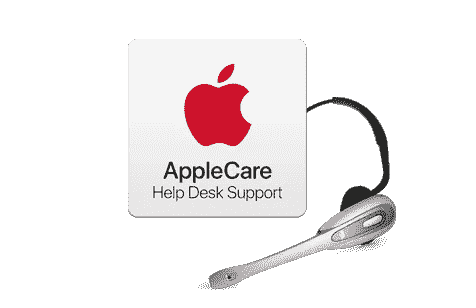

# 华为关怀还是 Applecare？

> 原文：<https://medium.com/hackernoon/huawei-cares-or-applecare-c7ea2d40c8f>

几乎每个人都知道 Applecare 服务，但华为 care 服务是一种新的尝试。我想比较两种服务；苹果在客户服务方面表现出色:尤其是售后服务。该公司对每个地区都有独特的服务质量。iPhone 在硬件和软件之间有一个平衡。

自苹果成为大型科技公司以来，华为一直在利用所有优势。有一个子品牌叫 Honor。公司的销售额几乎达到了顶峰。特朗普政府的决定让情况在短期内变得更加艰难。政府的最新解释是积极的。“美国公司可能会与中国合作。声明对中国的耐心来说是一个巨大的成功。然而，世界各地都不会有和平。

huawei̇保健与苹果保健

华为被特朗普政府封杀。大多数美国科技公司支持这一决定。每条新闻都让情况变得比昨天更糟:这一时期随着 20 国集团特朗普政府的官方声明而结束。华为关怀可以成为当前形势的答案。让我提供更多关于服务的信息:
-7 月 10 日至 27 日期间在欧元区购买 P30 和 p30 pro 型号的每位客户。
-公司调查消费者购买产品时害怕什么。物理损伤是主要原因。
-产品有 1-2 年的支持，包括屏幕划伤、液体损坏。
-标准情况下，技术服务流程缩短至一小时。i̇n 是个例外，这个时期可能会改变。
——无论去官方维修服务还是第三方服务，都应该有一个标准的服务。

Applecare 一直是售后服务的好模式。该公司可能会针对华为增加额外的功能。我还应该给出一些关于 Applecare 的细节:
——如果你因为某个原因去 Apple store，genius 会开始以亲切、真诚的态度与你交谈。无论你的情况如何，或者有多糟糕，都可以改变:这可能会改变你的想法。
-您可以使用 iOS 专用工具(如电池性能)查看设备的当前状态。
-由于有第三方技术服务，技术服务质量可能会有变化:视服务而定。

当经济出现严重衰退时，完美的智能手机在任何时候都是不够的。技术服务支持使大的技术公司比对手更好。让消费者来决定吧。