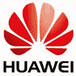
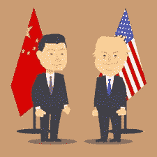

# 华为管理其安全的能力越来越令人担忧

> 原文：<https://medium.com/hackernoon/huaweis-ability-to-manage-its-security-a-growing-concern-338891658dd1>

## 网络安全就像我们在 2000 年一样: ***随着西方媒体不断谈论中国的网络安全威胁(这是一个重要问题)，科技巨头华为如果想在英国电信市场保持重要地位，就需要整顿好自己的事务***

Photo by [Timothy Paul Smith](https://unsplash.com/photos/BlEErEpGdPA?utm_source=unsplash&utm_medium=referral&utm_content=creditCopyText) on [Unsplash](https://unsplash.com/search/photos/chinese-writing?utm_source=unsplash&utm_medium=referral&utm_content=creditCopyText)

# 安全顾虑

对电信巨头华为来说，这是一个坏消息——美国国家网络安全中心技术总监伊恩·利维博士公开表示，这家中国公司的工程实践方法充其量只是“粗制滥造”。他告诉 BBC Panorama，这一披露意味着英国政府十有八九会禁止该公司在敏感地理区域(如威斯敏斯特和军事基地周围)的移动设备，并禁止其进入英国的 5G 网络，他认为这太敏感了。

对在英国运营的公司实施限制——甚至全面禁止——的计划将于下月公布，尽管迄今为止还没有关于该决定的细节被泄露。

华为在回应 Levy 提出的担忧时重申，它将致力于解决其网络和技术方面的任何问题。

忧虑深藏。最近，在 GCHQ 的支持下，对华为的产品和技术进行了一次安全审查，证实了人们的担忧，即在其网络安全操作的缺陷得到解决之前，很难控制这家中国公司任何产品的风险管理。

源自软件开发的问题已经被发现，这些问题反过来在当前产品中产生了缺陷。尽管该公司声明这些问题已经在过去的软件版本中得到解决，但事实显然并非如此。

# 中国视角

华为运营商业务集团首席执行官丁彦在最近的一次采访中表示:

> “我们希望将这一挑战转化为前进的机遇。我相信，如果我们能够按计划实施这一计划，华为将成为电信行业在安全性和可靠性方面最强的参与者。”

他还补充说，该公司承诺拨款 20 多亿美元用于一项“转型计划”,该计划将解决外国政府对其安全系统漏洞日益增长的担忧。

# 反诉

In response to Ding’s position, Levy has said he does not believe the claims. **“The security in Huawei is like nothing else — it’s like it’s back in the year 2000 — it’s very, very shoddy.”** He then added: **“We’ve seen nothing to give us any confidence that the transformation programme is going to do what they say it’s going to do.”**

*The Technical Director of the National Cyber Security Centre also asserted “geographic restrictions — maybe there’s no Huawei radio [equipment] in Westminster”*

**In spite of all the fallout, when it comes to sales the Chinese company’s figures have been impressive, with in excess of** [**$100 billion in revenue**](https://www.msn.com/en-gb/money/technology/huawei-says-expects-2018-revenue-at-109-billion-up-21-percent-chairman/ar-BBRtMsF) **claimed for last year.**

Many though, think stopping Huawei in its tracks would see a setback in the implementation of 5G technology in the UK. Dangers also lie if Huawei’s hardware is used at the core of companies networks, which do such functions as checking IDs on devices and the more sensitive issues of encrypted code. Huawei’s equipment was previously used by EE for its 3G and 4G core until the network provider’s takeover by BT. Now, the telecom giant is slowly removing it from its infrastructure because of the ongoing cybersecurity issues.

# Efficacy

Yet, Huawei’s existing infrastructure is not without its clear benefits, especially regarding its base stations and antennae, as these radio access networks are seen in the industry to be essential in permitting mobile devices to connect wirelessly to the network through radio signals which are sent over the airwaves.

# Secret Service

In Washington, too, the fires of doubt have been stoked about the potential threat of Huawei’s products on the market. Many in the White House see one of the world’s biggest tech firms as a proxy secret service to Beijing. US Secretary of State Mike Pompeo, though not issuing this belief outright, has said:

> “Huawei is owned by the state of China and has deep connections to their intelligence service. That should send off flares for everybody who understands what the Chinese military and Chinese intelligence services do. We have to take that threat seriously.”

**The US worries that Huawei follows Xi Jinping’s every word, and that its actions — though covertly — are always first and foremost for the benefit of the Communist Party.**

Source: freepik.com

特朗普总统去年签署的《国防授权法案》在法律上禁止任何公司或美国政府机构使用包括中兴和华为在内的任何中国通信公司生产的设备和部件。

由于华为和其他中国公司及其美国电信合作伙伴之间的业务损失，中国政府目前希望起诉美国政府，因为他们认为该法律违宪。

# 友谊

C [美国众议院情报常设特别委员会成员、被选为调查俄罗斯干涉 2016 年美国选举的负责人之一的国会议员迈克·科纳韦](https://conaway.house.gov/)在接受 BBC Panorama 采访时说:

> “显然，英国和美国——英语国家——之间的良好关系非常重要。”

他接着补充道

> “但作为其中的一部分，我们将不得不评估我们在分享……华为设备、华为网络上的秘密时会有什么样的风险。”

Photo by [Chris Liverani](https://unsplash.com/photos/9cd8qOgeNIY?utm_source=unsplash&utm_medium=referral&utm_content=creditCopyText) on [Unsplash](https://unsplash.com/search/photos/handshake?utm_source=unsplash&utm_medium=referral&utm_content=creditCopyText)

**支持英国的话语。但很明显，特朗普和他的美国同胞对中国人的信任超过了他们可以扔给他们的程度**

> “我们总是可以用老方法分享东西，你知道，来回用纸。但是，就能够通过华为设备、华为网络进行电子通信而言，充其量也是有风险的。”

也许英国需要重新思考它的战略。

# 贸易战

与英国和美国其他盟友的团结秩序，但这对华盛顿和北京之间正在进行的贸易战来说不是一个好兆头。由于两党都不太可能让步，事情看起来只会变得更糟。

在英国退出欧盟问题仍悬而未决之际，英国正在欧洲兄弟会(European brotherhood)之外寻找朋友，在唐宁街的许多人看来，听取大西洋彼岸最大盟友的意见可能是一个不错的选择。

与华为和中兴这样的公司做生意，如果在网络安全问题上出现任何问题，其影响可能会在非常非常长的时间内对英国产生巨大而深远的影响。