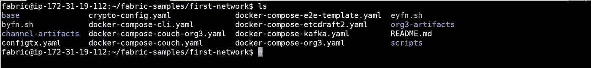
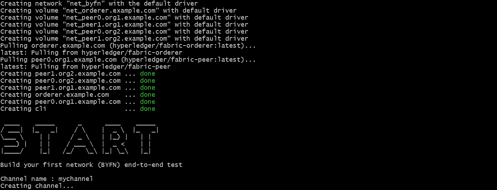
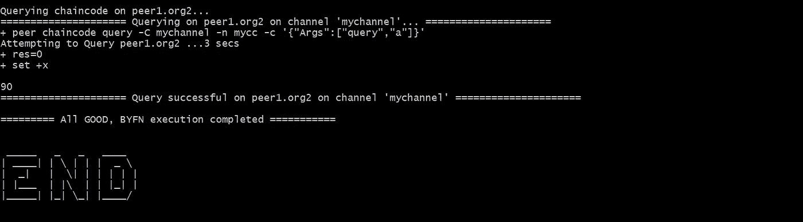
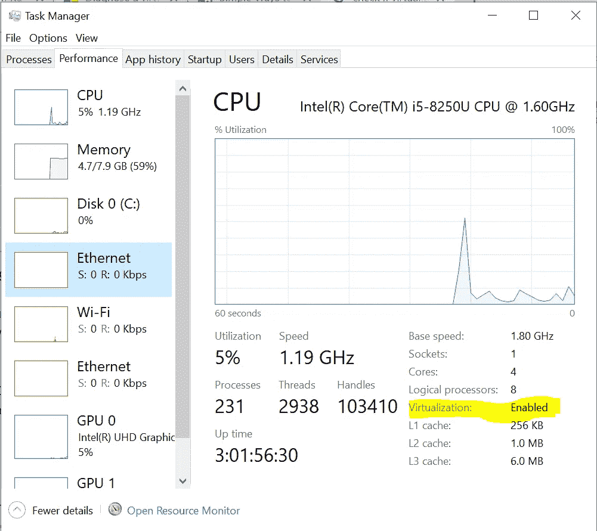
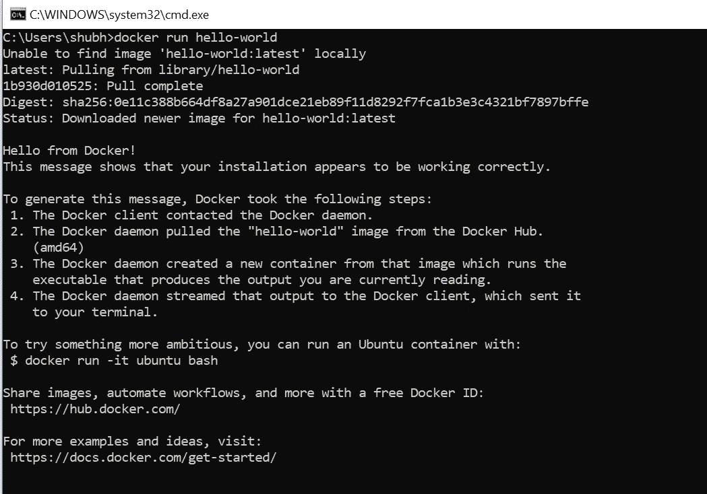
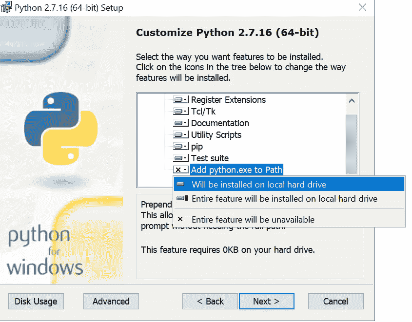
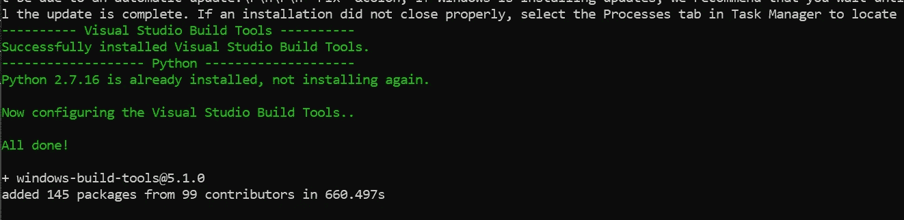
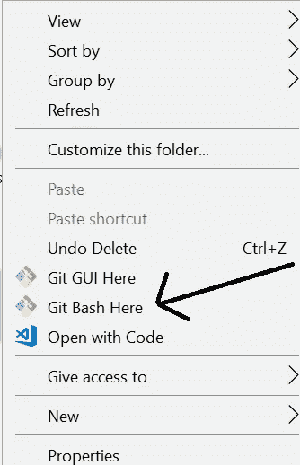
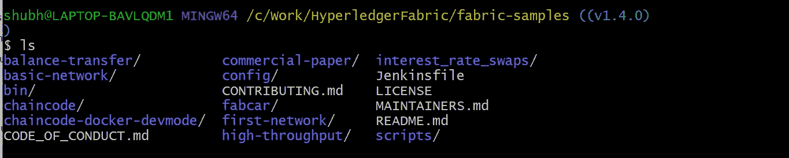
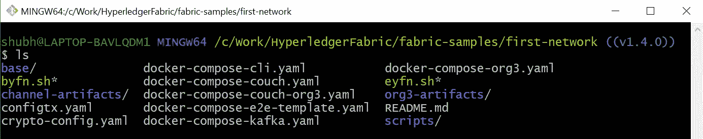

# Hyperledger Fabric 安装指南！

> 原文：<https://medium.com/hackernoon/hyperledger-fabric-installation-guide-74065855eca9>

## 在本指南中，我们将在 Linux 机器和 Windows 机器上安装 **Hyperledger Fabric v1.4** 。


Google sources

当我开始学习 Hyperledger Fabric 时，安装它真的是一件痛苦的事情，当我使用 Windows 时，它变得很糟糕。

本文的目的是将所有的说明放在一个地方，以设置 Hyperledger 结构网络，而不管您使用的是 Windows 还是 Linux。

我为 macOS 的读者道歉，因为我没有 macOS 的说明书，所以不包括在内。

> 查看我在 [schadokar.dev](http://schadokar.dev/) 上的其他教程

## **内容:**

1.  先决条件
2.  [Linux 安装](/p/74065855eca9#c566)
3.  [Windows 安装](/p/74065855eca9#30f8)

# **先决条件**

1.  cURL —最新版本
2.  Docker 版本 17.06.2-ce 或更高版本
3.  Docker Compose —版本 1.14.0 或更高版本
4.  Golang —版本 1.11.x
5.  Nodejs —版本 8.x(尚不支持其他版本)
6.  NPM —版本 5.x
7.  Python 2.7

这些先决条件的版本符合 fabric v1.4 [文档](https://hyperledger-fabric.readthedocs.io/en/release-1.4/prereqs.html)。

# **Linux 安装**

与 windows 相比，Linux 的安装非常简单。几个命令和结构都准备好了。

我为本文提供了一个来自 AWS 的 Linux 16.04 VM。所有的指令都将在终端中运行。我没有在 Hyperledger 文档中找到任何系统需求信息。请评论，如果你有一个系统要求的参考。

## **第一步:创建一个新的 sudo 用户**

建议不要以 root 用户身份安装 Hyperledger Fabric。打开终端。

*   添加新用户“fabric”

```
sudo adduser fabric
```

*   将用户“fabric”添加到 Sudo 组

```
sudo usermod -aG sudo newuser
```

*   登录到“结构”用户

```
su fabric
```

*   测试 sudo 访问

```
sudo ls
```

如果您得到任何错误，那么用户不会被添加到 sudo 组。点击此[链接](https://www.digitalocean.com/community/tutorials/how-to-add-and-delete-users-on-ubuntu-16-04)了解更多信息。

## **第二步:卷曲**

检查你的 Linux 是否安装了 curl。`curl --version`

如果没有，请按照以下说明进行安装:

```
sudo apt-get update
sudo apt-get install curl
curl --version
```

## **第三步:Docker 和 Docker 组合**

以下是安装 Docker 和 Docker-compose 的方法。

1.  **根据文档**

*   从官方 Docker 库安装最新版本的 Docker。

```
curl -fsSL [https://download.docker.com/linux/ubuntu/gpg](https://download.docker.com/linux/ubuntu/gpg) | sudo apt-key add -
```

*   将 Docker 存储库添加到 APT 源

```
sudo add-apt-repository “deb [arch=amd64] [https://download.docker.com/linux/ubuntu](https://download.docker.com/linux/ubuntu) $(lsb_release -cs) stable”
```

*   更新包数据库

```
sudo apt-get update
```

*   安装 Docker

```
sudo apt-get install -y docker-ce
```

**2。使用命令**安装

这个命令将用一个命令安装 docker 和 docker-compose。感谢[链接](https://medium.com/u/32dec75e8ca9#step-1-%E2%80%94-installing-docker)。

## **第三步:Golang**

*   安装 golang 包

```
curl -O https://storage.googleapis.com/golang/go1.11.linux-amd64.tar.gz
```

*   提取包

```
tar xvf go1.11.linux-amd64.tar.gz
```

*   设置 GOPATH

```
export GOPATH=$HOME/go
export PATH=$PATH:$GOPATH/bin
```

*   检查 go 版本

```
go version
```

更多安装信息请点击此[链接](https://www.digitalocean.com/community/tutorials/how-to-install-go-1-6-on-ubuntu-16-04)，GOPATH 请点击此[链接](https://hyperledger-fabric.readthedocs.io/en/release-1.4/prereqs.html#go-programming-language)。

## **第四步:Nodejs 和 npm**

*   使用 curl 下载安装脚本

```
curl -sL https://deb.nodesource.com/setup_8.x -o nodesource_setup.sh
```

*   在 sudo 下运行脚本

```
sudo bash nodesource_setup.sh
```

*   安装节点

```
sudo apt-get install nodejs
```

有了 nodejs，npm 也得到了安装。检查他们的版本

```
node -v
Output
v8.16.0npm -v
v6.4.1
```

**第五步:Python 2.7**

默认情况下，ubuntu 16.04 将 Python 3.5.1 作为 Python 3 二进制文件安装。

*   安装`python 2.7`

```
sudo apt-get install python
```

*   检查 python 版本:

```
python --version
Python 2.7.12
```

所有先决条件都已安装。现在，让我们安装 Hyperledger Fabric v1.4 版。

## **步骤 6:安装示例、二进制文件和 Docker 映像**

确定要下载结构样本的目录。在终端中打开目录并运行下面的命令。

```
curl **-**sSL http:**//**bit**.**ly**/**2ysbOFE **|** bash **-**s
```

它将下载最新的生产版本。

如果您想要 ex 的特定版本。1.4.1 版，遵循以下命令。

```
curl **-**sSL http:**//**bit**.**ly**/**2ysbOFE **|** bash **-**s **--** **<**fabric_version**>** **<**fabric**-**ca_version**>** **<**thirdparty_version**>**curl **-**sSL http:**//**bit**.**ly**/**2ysbOFE **|** bash **-**s **--** 1.4**.**1 1.4**.**1 0.4**.**15
```

这需要一些时间，一旦完成，你可以看到一个新的目录**“织物样本”。**

**“Fabric-samples”**附带示例从 Hyperledger Fabric 开始。在织物样品中有许多很好的例子。


fabric-samples

## **步骤 7:测试光纤网络**

我们已经成功完成了 Fabric 环境的设置，现在让我们测试一下。为了进行测试，我们将使用织物样本中的****第一网络**样本。**

**打开**织物样品**并进入**第一网络**。**

```
cd fabric-samples/first-network
```

****

**first-network**

**要测试它，运行`byfn.sh`。这是一个测试脚本，它首先用两个组织`org1`和`org2`建立网络，每个组织有两个`peers`和一个`orderer`。**

```
./byfn.sh up
```

****

**first-network start**

**成功执行后，您将看到以下消息。**

****

**first-network end**

**如果您达到了这一点，这意味着您已经成功地建立了结构网络。**

**现在，我们已经完成了**首网、**清网的测试。**

```
./byfn down
```

**恭喜，我们已经在 **Linux 机器上完成了 Hyperledger Fabric 的安装。****

# **Windows 安装**

**对于 windows 安装，你应该为一些障碍做好准备，因为在 Windows 上安装并不容易。**

**让我们开始安装 windows。**

**我使用 Windows 10 Pro 进行 Fabric v1.4 版安装。**

## ****第一步:卷曲****

**请检查您的电脑中是否已经安装了 cURL。**

```
curl --help
```

**如果你没有得到任何错误，这意味着你的电脑上安装了 cURL，你可以进入下一步。对于其他人，请遵循以下步骤。**

*   **要安装 cURL，请从这个[链接](https://curl.haxx.se/download.html)下载符合您的 Windows 32/64 位的软件包。提取包并运行`bin`文件夹中的`curl.exe`。**
*   **在环境变量中添加`curl`。**
*   **打开`cmd`并检查`curl --help`。**

**如果你没有得到任何错误，这意味着你的 curl 安装成功。**

**按照此[链接](https://stackoverflow.com/questions/9507353/how-do-i-install-and-use-curl-on-windows)进行故障排除。**

## ****第二步:Docker 和 Docker 构成****

**在安装 docker 之前，请检查您的电脑是否启用了虚拟化。要检查它，打开`Task Manager >> Performance Tab >> CPU`**

****

**virtualization**

**从 BIOS 设置中，可以启用虚拟化。进入 BIOS 设置的说明因电脑制造商而异。请检查此[链接](https://www.wikihow.tech/Enable-Hardware-Virtualization)以获取说明。**

**虚拟化启用后，我们可以开始下载 docker。**

**安装 Docker 之前，请确定您使用的是哪个窗口。Docker for Windows 有两个版本。**

**Docker 工具箱— Windows 8、Windows 10 主页**

**Docker 桌面— Windows 10 专业版，企业版— 64 位**

**您首先需要在 DockerHub 中拥有一个帐户才能下载 docker 桌面。如果没有，请注册。**

**从这个[链接](https://hub.docker.com/editions/community/docker-ce-desktop-windows)下载 docker。**

*****注意:安装时保持默认设置，不要做任何改变。*****

****测试安装****

*   **打开 cmd 窗口**
*   **运行`docker --version`和`docker-compose --version`**

```
docker --version
Docker version 18.09.2, build 6247962docker-compose --version
docker-compose version 1.23.2, build 1110ad01
```

*   **从 Docker Hub 中拉出 [hello-world 图像](https://hub.docker.com/r/library/hello-world/)并运行一个容器:**

```
docker run hello-world
```

****

**docker hello-world**

**如果您收到此消息，则 Docker 已成功安装在您的机器上。**

**要了解更多关于 Docker 的信息，请查阅官方文件。**

## ****第三步:戈朗****

**从[官网](https://golang.org/dl/)下载 Golang 包。**

**一旦安装完毕，打开`command prompt`并运行**

```
go versionOutput
go version go1.11.5 windows/amd64
```

## ****第四步:Nodejs 和 npm****

**从这个[链接](https://nodejs.org/dist/latest-v8.x/node-v8.16.0-x64.msi)下载节点 v8.x 并安装。**

**检查它是否安装正确。**

```
node -v
v8.16.0npm -v 
6.4.1
```

## ****第五步:Python 2.7****

**从[官方网站](https://www.python.org/downloads/windows/)下载`python 2.7`。**

**安装时，将 python 添加到系统路径变量中。这允许您在命令提示符中键入“python ”,而不需要完整的路径。**

**将`Add python.exe to Path`改为`Will be installed on the local hard drive`**

****

**python-path**

**检查`python`安装是否正确。**

```
python --version
Python 2.7.16
```

**已安装 Hyperledger 结构先决条件。现在，是时候安装额外的 windows 依赖项了。**

## ****Windows Extras****

****第六步:安装 windows 构建工具和 grpc****

**使用`npm`整体安装`windows-build-tools`。**

**打开`command prompt`并运行以下命令。**

```
npm install **--global** windows**-**build**-**tools
```

**大约需要 15 分钟或更长时间。一旦它将完成，你会得到以下信息。**

****

**windows-build-tools**

**完成后，您还应该使用以下命令安装 NPM GRPC 模块:**

```
npm install **--global** grpc
```

****步骤 7:安装 git 来运行 bash 命令****

**要运行 bash 命令，我们必须安装`git`。**

> **Git 是一组命令行实用程序，设计用于在 Unix 风格的命令行环境中执行。— [亚特兰蒂斯](https://www.atlassian.com/git/tutorials/git-bash)**
> 
> **Git Bash 是一个用于 Microsoft Windows 环境的应用程序，它为 Git 命令行体验提供了一个仿真层。— [亚特兰大人](https://www.atlassian.com/git/tutorials/git-bash)**

**从这个[链接](https://git-scm.com/)下载`git`。**

**等等，我们已经完成了一些先决条件，现在是安装 Hyperledger Fabric 的最后一步。**

****步骤 8:** **安装示例、二进制文件和 Docker 镜像****

**转到您想要下载结构样本的目录。**

**一旦你在目录中打开`git bash`。右击并选择`Git Bash Here`。**

****

**git bash**

**运行以下命令安装示例、二进制文件和 Docker 映像**

```
curl **-**sSL http:**//**bit**.**ly**/**2ysbOFE **|** bash **-**s
```

**它将下载最新的生产版本。**

**如果您想要 ex 的特定版本。1.4.1 版，遵循以下命令。**

```
curl **-**sSL [http:**//**bit**.**ly**/**2ysbOFE](http://bit.ly/2ysbOFE) **|** bash **-**s **--** **<**fabric_version**>** **<**fabric**-**ca_version**>** **<**thirdparty_version**>**curl **-**sSL [http:**//**bit**.**ly**/**2ysbOFE](http://bit.ly/2ysbOFE) **|** bash **-**s **--** 1.4**.**1 1.4**.**1 0.4**.**15
```

**这需要一些时间，一旦完成，你可以看到一个新的目录“织物样本”。**

****

**fabric-samples**

**“fabric-samples”附带示例，从 Hyperledger Fabric 开始。在织物样品中有许多很好的例子。**

****第七步:测试光纤网络****

**我们已经成功完成了 Fabric 环境的设置，现在是测试的时候了。我们将使用织物样本中的****第一网络**样本。****

****打开**织物样品**并进入**第一网络**。****

```
**cd fabric-samples/first-network**
```

********

****first-network****

****要测试它，运行`byfn.sh`。这是一个测试脚本，它首先用 2 个组织`org1`和`org2`设置网络，每个组织有 2 个`peers`和一个`orderer`。****

```
**./byfn.sh up**
```

********

****first-network start****

****成功执行后，您将看到以下消息。****

********

****first-network end****

****如果您达到了这一点，这意味着您已经成功地设置了结构网络。****

****现在，我们已经完成了**首网、**清网的测试。****

```
**./byfn down**
```

****这里，我们已经在 **Windows 机器中完成了 Hyperledger Fabric 的安装。******

****是的，我们成功地在 Windows 上安装了 Fabric。****

****希望，你喜欢这篇文章，并节省你一些时间。****