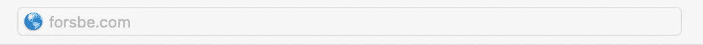
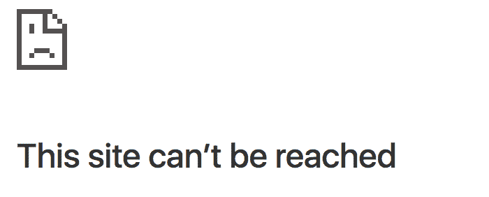
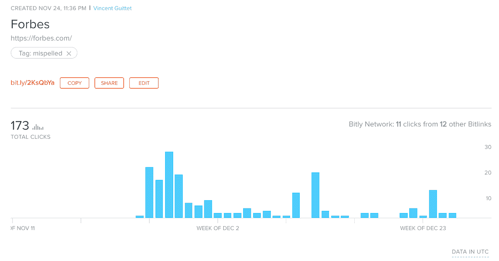

# 我买了 Forsbe.com

> 原文：<https://medium.com/hackernoon/i-bought-forbse-com-61227f0cd886>

这是接下来发生的事情。

Photo by [Bruce Mars](https://www.pexels.com/@olly) on [Pexels](https://www.pexels.com/)

它发生在一个寒冷干燥的夜晚，在伦敦的一家咖啡馆里，咖啡和饼干的味道与科学和艺术相遇，创造力与生产力相遇。我坐在火炉旁，一边喝着新煮的咖啡一边看新闻。周围都是忙着做他们最喜欢的项目的**企业家。在我思考的时候，我决定阅读 Forbe 关于人工智能和大数据的创新文章。**

> 如果你不知道的话。福布斯是一本位于新泽西州的美国商业杂志，最著名的是它的列表和排名，如**福布斯 400** :最富有的美国人，或世界顶级公司:**福布斯全球 2000** 和**福布斯 40 岁以下 40 人**，表彰了 40 位在各个行业成名的男女商人。该杂志还提供各种类别的原创文章，如金融、技术、政治和许多其他内容。

因此，我继续阅读我关于人工智能和大数据的标题，并在浏览器中键入:

结果我在浏览器上收到了这个回答。

是的，我拼错了名字。是的，谷歌浏览器不喜欢它。当注入创造力的咖啡击中我的大脑时，我开始纠正我的错别字。 [**尤里卡**](https://en.wikipedia.org/wiki/Eureka_effect) ！

by [Giphy](https://giphy.com/gifs/reaction-idea-3o7WIMXk4MgSgWF1xC)

***为什么*** 这个地址不重定向到福布斯？福布斯有没有想过收购 forsbe.com？

> 正如史蒂夫·乔布斯所说，“想法除非付诸实施，否则一文不值。他们只是一个乘数。行刑价值百万。”

所以我执行了。

肾上腺素充满了我的血液。我喝了一口天才咖啡。又上了一个 [**域名注册商**](https://en.wikipedia.org/wiki/Domain_name_registrar) 。**以每年 10 英镑的价格购买域名**。非常便宜。注册了一个网址缩写。**把 Forsbe.com 重定向到 Forbes.com**(不客气[福布斯](https://medium.com/u/3126f7dd42c1?source=post_page-----61227f0cd886--------------------------------))。咽下一口咖啡。检查链接和跟踪工作。设置警报以监控第二天的指标。喝下我的咖啡，带着我今天的收获快乐地离开了！

几天后，这个拼错的链接带来了超过 170 次对 Forbes.com 的访问(那只是因为我很好)。

> *🔢*因此，一年后，它将接待超过 2050 人次的访问。

如果你考虑每次点击的成本或每次访问的成本，我今年的 **10 投资**将使每次访问的成本为 ***0.005。***如果你通常每次点击谷歌广告的费用是 2.00 美元，这比**便宜 400 倍！**

# ✋坚持住。

我能在屏幕的另一边看到你的感受。

by [Giphy](https://giphy.com/gifs/robert-downey-jr-sigh-confused-116a8zosxwA0SI)

> **你:**《福布斯》不需要这个流量。用户会改正他们的错别字。就像你在想太多之前要做的一样！*🤦‍*

你说得对，如果我把这个流量重定向到❤黑客日会怎么样？福布斯的竞争对手？或者，我自己的全新科技博客？那岂不是给我带来 ***【免费】*流量**，远离福布斯？

虽然他们可能会从网站上反弹，因为它不是福布斯，如果我有一个设计良好的特定登录页面呢？有一个很棒的标题:

> 《商业杂志 2019——比福布斯更好》

我还可以添加标签来建立一个观众群，然后用合适的创意以更低的价格重新定位这些用户。此时一切皆有可能。请注意你所在国家关于域名抢注的法律。

by [Giphy](https://giphy.com/gifs/reaction-confused-will-smith-y3QOvy7xxMwKI)

我可能会把他们重定向到这个黑客午间帖子。这将是一个伟大的方式来为这篇文章带来一些交通和意见！😉

总之，正如贝比·鲁斯所鼓励的:

> "永远不要让对出局的恐惧阻止你玩游戏."

很好奇想听听大家的想法！😊留下你的评论，如果你喜欢，请点击👏为了好运和帮助别人找到好运，按十几次按钮！这对我意义重大。

PS:如果你是通过键入:**Forsbe.com**看到这篇文章的，并且正在阅读这篇文章……感谢你走了这么远！现在你可以去 Forbes.com 的➡了😉