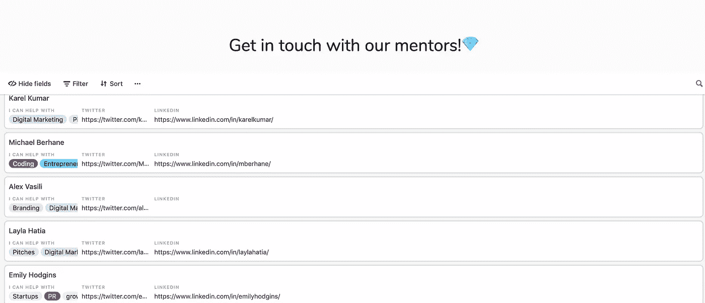

# 我讨厌编码，但我喜欢制作

> 原文：<https://medium.com/hackernoon/i-hate-coding-but-i-love-making-9f3387d3b20d>

像许多其他技术人员一样，我从小就学习编码，我特别记得学习 HTML、CSS 和 PHP 之类的东西，以便实现我长期以来的梦想，运营我自己成功的企鹅俱乐部(rip)博客。当时我完全依赖 W3school 的教导，虽然我对代码非常尊重，并且每次打印“Hello World！”在我的屏幕上，这是非常令人沮丧的。

你看，我不想编码。我讨厌编码的概念。对我来说，编码是达到目的的手段，而不是激情。我意识到我想要某样东西，并意识到我能得到它的唯一方法是自己动手制作，而这需要代码。我讨厌做任何东西，因为我知道我必须编码。

## 我成为创造者的那一天。

快进到 2018 年，我正在构建一个简单的基于众包的网络应用程序，我偶然发现了一个名为 WebFlow 的所见即所得编辑器，从过去的经验中吸取教训，我非常怀疑，但我尝试了一下。不到两个小时，我就有了一个动态 CMS 的网站，并完全运行。然后，我遇到了 Airtable，并意识到我可以将我的应用程序提交表单连接到数据库，然后看，我不用编写一行代码，就构建了一个自动更新记录并在前端显示用户输入的应用程序。

I was building a thing

我很快意识到这比我想象的要大得多。我没有偶然发现一个不知名的应用程序。我偶然发现了整个运动。

在那段时间，我还偶然发现了另一个网站 Product Hunt(我后来为其工作),并发现人们在一天之内不用代码就能制作完整的应用程序。产品如:

*   [**Kith 元素**](https://www.producthunt.com/posts/kith-elements)

*将可重用的元素复制粘贴到你的泡泡项目中🚧*

Kiths 可重复使用的元素帮助您快速开始使用 Bubble。您可以轻松地将所需的元素拖放到项目中。然后随心所欲地定制它们。

*   [**成长列表**](https://www.producthunt.com/posts/growthlist-2)

*众包增长秘诀列表*

GrowthList 是一个众包列表，列出了由社区提供的可操作的、经过验证的增长技巧

*   [**MakerPad**](https://www.producthunt.com/posts/makerpad)

*免费程序，学习建立没有代码的小型创业公司*

这里的概念是教任何人和每个人如何在几分钟内建立，并通过定制的计划与真正的付费客户进行验证。

如果我要构建所有的产品，都需要我启动一个代码编辑器，工作几个小时来构建一个原型。所有的产品，老实说，我可能不会完成。不用说，我的心灵被彻底击垮了。

那天对我来说很重要，因为它彻底改变了我对制作的看法。它不再像是为严肃的代码争论者保留的精英俱乐部，但现在似乎任何人都可以成为创造者，只要你有想法，你就可以实现它。

## 我意识到任何人都可以成为创造者

无代码运动正在打破许多潜在制造商此前面临的障碍；代码的壁垒。

在新工具的可获得性和不断增长的相互支持的开发者社区的推动下，构建应用程序从未如此容易获得。任何人都可以成为创造者。在不到一天的时间内，您可以构建:

*   由 [Airtable](https://www.google.com/aclk?sa=l&ai=DChcSEwih3PDPxI7hAhUKnO0KHcweDsEYABAAGgJkZw&sig=AOD64_2MRq3e2lpBXIImyBD5-n9WDyFMVA&q=&ved=2ahUKEwirzezPxI7hAhUEUBUIHYt4BMAQ0Qx6BAgMEAE&adurl=) 提供支持的众包、以数据为中心的应用
*   用[尾波](https://coda.io/welcome)开更好会议的工具包
*   一个动态的，CMS 驱动的博客与 [Webflow](https://webflow.com)
*   使用[语音流](https://www.getvoiceflow.com/?ref=producthunt)的完整 Alexa 技能
*   任何使用 [Sheet2Site](https://www.sheet2site.com/) 的网站/应用分类
*   使用 [Glide](http://glideapps.com) 的手机应用

这些产品为制造者提供了制造的手段。它们消除了代码的障碍，让开发者专注于真正重要的东西:想法。

## 创造的庆典

正如我之前提到的，我现在为 Product Hunt 工作，创客社区是我们所做一切背后的面包和黄油。我的日常生活发生了翻天覆地的变化，仅仅是因为制造商在产品搜索上推出的产品，我们想庆祝这种创造的天才。

去年，我们举办了首届创客节，来自各行各业的 2，000 多名创客通过打造、修补和破解，打造出一款向世界展示的产品。

今年我们与 [Coda](http://coda.io/) 合作制作了创客节无代码版。我们希望展示无代码社区和支持它的应用程序的真正潜力。如果你对构建充满热情，并且想要发现更多关于无代码的东西，那么[在这里注册](https://producthunt.com/makers-festival-2019)。报名截止到 3 月 24 日周日。我们对每个类别都有奖励，如果你用 Coda 构建，还有一个特别的大奖。

我们有一些主题和下面的系列，可以在你的创客之旅中激发你的灵感:

*   [团队工具](https://www.producthunt.com/@aaronoleary/collections/tools-for-teams)
*   [生活窍门](https://www.producthunt.com/@aaronoleary/collections/life-hacks)
*   [社会影响](https://www.producthunt.com/@aaronoleary/collections/social-impact-1)
*   [健康&养生](https://www.producthunt.com/@aaronoleary/collections/health-and-wellness)
*   [微型应用](https://www.producthunt.com/@aaronoleary/collections/tiny-apps)

我们正处于一个独特的时期，在这个时期，一个想法是开始制作的唯一要求。我真的相信每个人都可以成为创造者，社区每天都在证明这一点。

没有哪种代码还处于婴儿期，但它是一种不断发展的运动，有着改变事物的巨大潜力。我很高兴能成为其中的一员。

Me now when I go to make something