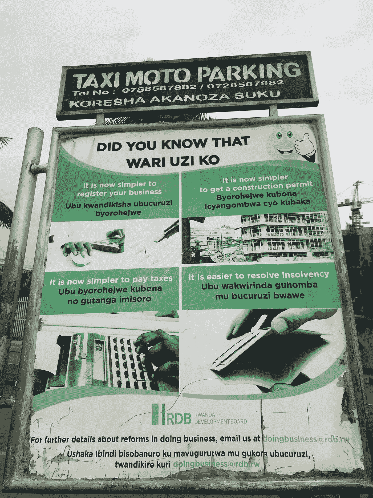

# 我讨厌谈论“下一个硅谷”，但是…

> 原文：<https://medium.com/hackernoon/i-hate-to-talk-about-the-next-silicon-valley-but-1c3106fa6def>

## **我想我见过:基加利！**

Photo by [maxime niyomwungeri](https://unsplash.com/photos/6v-senpTTLI?utm_source=unsplash&utm_medium=referral&utm_content=creditCopyText) on [Unsplash](https://unsplash.com/search/photos/kigali?utm_source=unsplash&utm_medium=referral&utm_content=creditCopyText)

我很幸运有机会去世界各地许多迷人和令人兴奋的地方旅行。

这一周我一直在卢旺达的基加利。

无论我走到哪里，创业、创新和颠覆都是讨论最多的话题。“下一个硅谷”这句话经常被使用。

我讨厌这个短语。

现在每个人都应该知道硅谷是不可复制的。这是一种独特的生态系统、心态，或者——有些人甚至称之为——宗教。

每当我访问硅谷时，你都能感受到“企业家精神”但我也看到硅谷的光芒开始消退(正如最近许多媒体报道所描述的那样)。它变得越来越“公司化”，利润驱动，许多“改变世界”的创新开始在其他地方发生。

然而，仍然很难想象一个生态系统是强大的或有影响力的。谈到“硅谷”的成功和影响，特拉维夫、柏林、伦敦、多伦多、阿姆斯特丹、斯德哥尔摩、东京等通常被怀疑的城市都相形见绌。

不要误解我。这些地区的初创企业和投资数量正在增加。是的，你可以看到(并衡量)创新对商业和就业创造的影响。但企业家精神没有我在硅谷经历的那么显著或明显。

所以，当我上周抵达卢旺达基加利时，我没有任何期望。我真的不知道会发生什么。

但是来了一个星期，经历了一个又一个惊喜。

这是否意味着基加利和硅谷可以在生态系统架构方面进行比较？不，当然不是，这些“生态系统”彼此相距数光年。两者比较没有意义。

但我在基加利感受到的兴奋和活力与我第一次访问硅谷非常相似。

我没有说基加利会成为下一个硅谷，但我经历了一些令人兴奋的、独特的、潜在的变革。

在这一周里，我可以看到一个独特的创新和创业生态系统正在形成。基加利生态系统有潜力对投资者(国内外)极具吸引力，吸引区域人才，并对当地社会和环境产生巨大影响。

基加利的重点是在联合国称为可持续发展目标的关键领域进行“有益的技术创新”，而不是点击广告、电子商务交易或尽快吸引尽可能多的订阅。

所以这里有三个因素让我感到惊讶，并让我相信我们都应该密切关注这个特定生态系统的进化。

# **社区思维和合作创新**

当我到达时，我从来没有想到 2018 年世界经济论坛将基加利称为“地球上最干净的城市”，这可能是准确的。但是现在我可以证明，在没有垃圾和绿色倡议方面，基加利看起来很像新加坡。但是，很明显，没有必要对乱扔垃圾制定严格的(刑事)法律。

在与居民交谈后，我发现政府的举措使公共交通系统、道路和通信基础设施得到了良好的维护。

但人们反复提到，基加利清洁的主要贡献者是居民自己，他们每月进行一次名为" *umuganda* "的社区工作。这一“要求”主要是通过提高认识来“强制执行”的，通过为清洁工、垃圾收集工和园丁创造报酬相对较高的工作，以及通过与当地企业建立和建立伙伴关系(在郊区建立垃圾收集站和安装公共厕所)，将居民从非正规经济带到正规经济。

这种社区意识和承诺也体现在更具颠覆性的创新和创业活动中。许多人提到了快速而简单的企业注册流程(注意世界银行营商便利度排名中的第 29 位，高于法国、荷兰和以色列)。还有一个为早期科技初创企业、孵化器和免费合作空间建立的社区。

这个社区已经吸引了外国企业家。例如，当我在酒店大厅等候时，我看到硅谷公司 Zipline 的两名员工。Zipline(根据他们的网站)已经建造了世界上最快、最可靠的送货无人机。该公司在卢旺达发现了一个“类似实验室”的环境，可以通过无人机进行血液和药物输送。这种合作创新(具有社会和环境影响)在基加利随处可见。

可以预期的是，我们将很快看到智能城市计划、自主机器和其他新兴技术的进一步发展。

# **年轻一代**

当我漫步在基加利的街道上时，我对年轻人的数量感到震惊。更多的研究(回到酒店)表明，40%的卢旺达人口年龄在 14 至 35 岁之间。

这些精通技术的“千禧一代”将有助于从农业驱动的手工业经济向知识经济和数字经济转型。我们经常听到数字技术如何帮助农业经济“跨越”工业化的谈论，但在基加利的实地，我看到这种谈论可能是非常真实的。

在这方面更为关键的是，年轻一代给老牌和传统公司带来了巨大的压力。例如，在我的一次研讨会上，有一点变得非常明显，那就是年轻一代不再信任传统银行。这一趋势使得创新公司、产品和服务更容易蓬勃发展。

此外，人们似乎愿意辞掉工作去尝试，并且不怕开始新的东西。例如，在一次晚宴上，一位发展金融机构的成员告诉我，他下午会见了两位年轻企业家，他们成功创办了一家专门面向年轻一代的人力资源管理公司。

# **有序混沌**

我对基加利的潜力充满信心和兴奋。

这并不是说一切都高效运转。当然，在这个相对年轻的城市(1962 年只有 6000 名居民)仍然存在一定程度的“混乱”,显然它最近经历了一段动荡的历史。而且，外国人(被称为“Mzungu”)仍然受到一些怀疑。

但问题是。这座城市似乎没有被传统或历史所吞噬。它庆祝自己没有官僚作风。它拥抱未来和数字时代的可能性。

这个城市最好被描述为处于一种“有序混乱”的状态。这提供了创业和创新的自由(在过度有序的社会中并非如此)，但也有足够的结构和基础设施让这种创新和创业有机会繁荣和成功。

主权财富基金和开发银行等外国投资者已经认识到了这种综合素质。

上周，在我与一位外国投资者的一次谈话中，有人提到了“新西部”这个词。不是贬义，而是令人兴奋的、新的和未知的机会。

我迫不及待地想回到基加利，看看新兴技术如何帮助这个国家(或许还有世界)变得更好。

*感谢您的阅读！请点击*👏*下面，还是留下评论吧。*

每周都有新的故事。因此，如果你关注我，你不会错过我关于数字时代如何改变我们生活、工作和学习方式的最新见解。