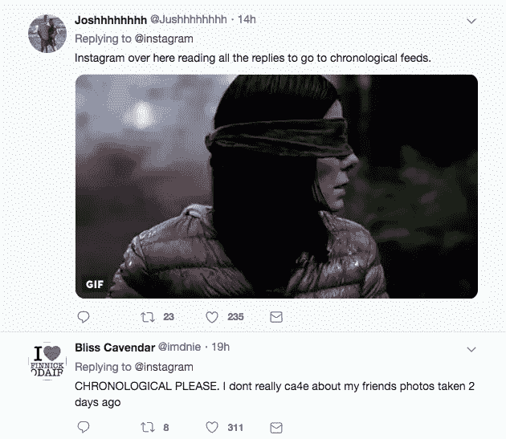
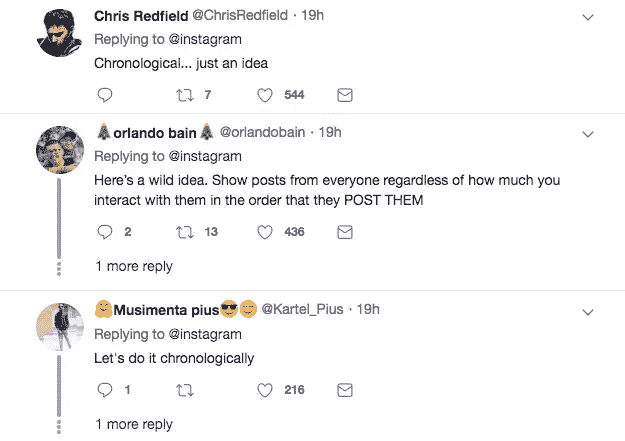
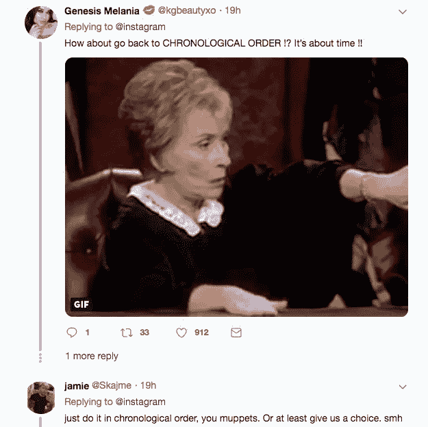
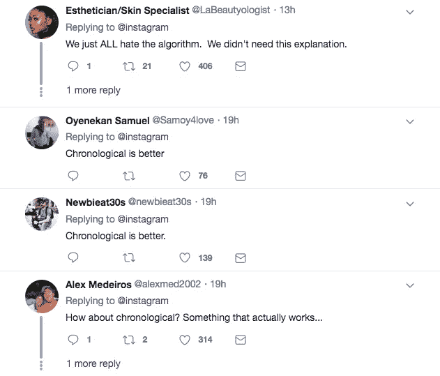
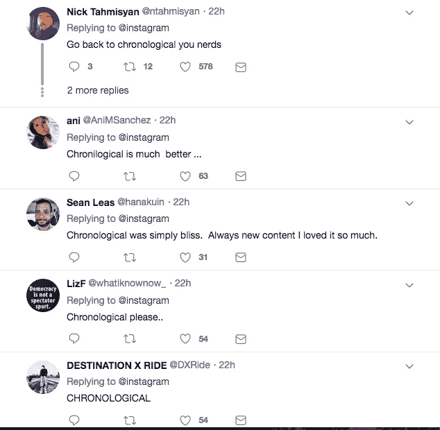

# 我想念按时间顺序排列的 Instagram

> 原文：<https://medium.com/hackernoon/i-miss-chronological-instagram-6e960126e93>

## Instagram 排名系统的 UX 分析

[https://twitter.com/instagram/status/1087853297036275712](https://twitter.com/instagram/status/1087853297036275712)

2016 年，Instagram [宣布](https://later.com/blog/new-instagram-algorithm/)将把它的 feed 从按时间顺序排列照片改为新的排名系统。

我立刻变得紧张起来。算法是[固有的混乱和偏见](https://www.independent.co.uk/life-style/gadgets-and-tech/news/instagram-feed-algorithm-reach-posts-chronological-seven-percent-a8743391.html)。我不太相信 Instagram 可以在不损害诚实和透明度的情况下预测我想在我的 feed 上看到什么。

尽管我承认，我明白为什么 Instagram 想朝这个方向发展。一个伟大的算法提要的*潜力*想想就令人兴奋:

它可以为用户提供更加精心策划的体验，提供更高质量的内容，并逐步消除按时间顺序排列的时间线的奇怪副作用。例如，在特定的*时间*发布一张照片会大大增加/减少有效性，这有点令人失望。

实际上，每家社交媒体公司都将算法集成到了他们的 feed 中，并取得了不同程度的成功。

> **无** **虽然**，**已经比 Instagram 的排名系统更让人痛恨。**

人们厌恶 Instagram 的排名系统。我来解释一下原因。

## Instagram 的排名系统垄断了参与度、互动度和喜欢度

如果你的 Instagram 照片收到了很多赞，它们的评级会更高，那么你的照片会被“精选”并收到*甚至*更多的赞。

如果你的照片只有少数人喜欢，它们的评价会更低，可能会被“埋没”,你的照片得到的喜欢会更少。

这是富人越来越富，穷人越来越穷的典型例子。

通过 Instagram 的排名系统，一些有影响力的人正在蚕食 Instagram 上所有的。对于一个普通用户来说，在这个平台上发帖变得越来越难，因为他们的帖子将永远排在金·卡戴珊的照片之后。

这糟透了。如果我想上传照片并且不让任何人看到，我会用脸书或 VSCO。或许还可以用电子邮件发给我奶奶。

Instagram 按年代排序的时候，做一个临时的*制作人*更可行。你可以张贴一些低质量的照片(但对你和你的朋友网络有意义)，并让它们出现在影响者的高质量照片旁边。

这变得越来越困难。影响者总是会发布比普通人更高质量的内容——Joe 和 Instagram 为影响者提供了一个平台，让他们获得“喜欢”和“关注”。

作为消费者，我们都喜欢高质量的内容。但是作为临时制作人，我们希望我们的内容被看到。这是 Instagram 曾经大放异彩的地方。现在它动摇了。

## 排名对我们的消费方式有着不可估量的副作用

我朋友的一些内容我从来没有看到过。我必须滚动几分钟才能看到他们的帖子。

相反，我有其他朋友内容我*总是*看到。我看到他们的内容令人毛骨悚然。他们的帖子总是在我订阅的第一位。他们的故事总是放在故事栏的第一位。

这两种情况是由偏差算法导致的极端情况。如果我想要一个更适中的时间线，现在我必须手动避免这两种情况。

当 Instagram 按时间顺序排列时，我对自己如何与内容互动是如此无忧无虑。我喜欢东西，评论东西，无忧无虑地跳过东西。

但是现在，喜欢一张照片和不喜欢一张照片之间有了一定的权重。

我不得不问自己，“我想看到更多的用户内容吗？尽管我*喜欢*这张特别的照片，但我是否喜欢到足以让用户在下个月出现在我的 feed 的顶部？如果我不喜欢某张照片，我可以不再看到该用户的内容吗？”

Language Warning

上面的视频是一个关于社交媒体算法的搞笑藤蔓。虽然这是讽刺，但在社交媒体算法看来，不喜欢一张照片确实会“将用户驱逐到地狱”。

## 信任在哪里？

Instagram 排名系统最大的问题可能就是它到底有多怪异。

多年来，科技界一直要求 Instagram 详细解释他们的排名系统，他们的回应总是像这样神奇的挥手:

这实际上能说明什么吗？不完全是。

关于 Instagram 的#fakeNews 阴谋论已经很多了。[最近](https://www.independent.co.uk/life-style/gadgets-and-tech/news/instagram-feed-algorithm-reach-posts-chronological-seven-percent-a8743391.html)人们想知道 Instagram 是否会将照片出现的次数限制在 7%的粉丝基础上。Instagram 否认了这一指控。

这些 Instagram 算法阴谋论经常发生*，每次它们发生时，技术社区都会对阴谋论者传播假新闻感到愤怒。*

*不过在这一点上，我开始责怪 Instagram。他们几乎没有采取任何措施来保持他们的服务对公众透明。难怪那么多人对自己的照片是如何被排名的感到困惑和苦涩。*

*Instagram 以最邪恶的方式处理了他们排名系统的推出:神秘的帖子，几乎没有信息，以及对批评的忽视。*

*按时间顺序排列的 Instagram 帖子并不完美。远非如此。他们展示不完美的内容，使影响者更难成为趋势，并激励影响者在一天的特定时间发布帖子，而不是专注于优质内容。我赞扬 Instagram 想要挑战极限并解决这些问题。*

*但最终，按时间顺序排列的帖子有一个 Instagram 的排名系统从未有过的竞争优势:它是可以理解的。*

*按时间顺序排列的帖子是公平的。人们知道时间顺序的含义以及如何使用它。*

**

*排名系统则相反。他们很怪异，他们不公平，他们垄断喜欢，他们强迫用户错过特定内容，他们强迫用户看到其他特定内容，他们天生就有*偏见*。*

*多一点透明度将对解决这个问题大有帮助。在 Instagram 发现这一点之前，他们会一直强烈反对这项可能是善意的服务。*

**感谢大家的阅读！请关注我的* [*推特*](https://twitter.com/maxvwalbert) *和*[*insta gram*](https://www.instagram.com/max.albert1/)*查看更多我的内容！**

**(是的我还是爱 Instagram，客观上讨厌他们的排名算法。我可以两样都做。我是成年人了。)**