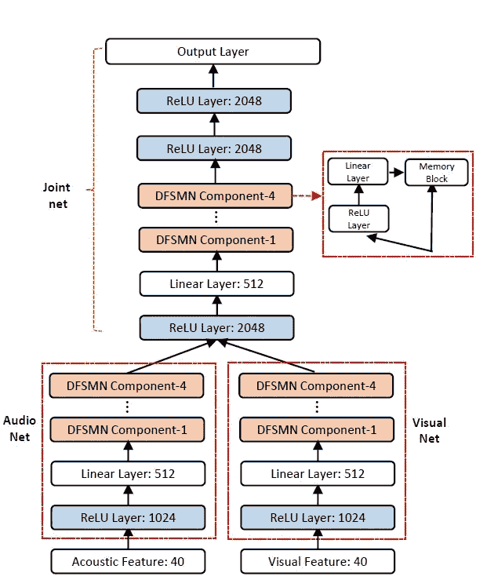
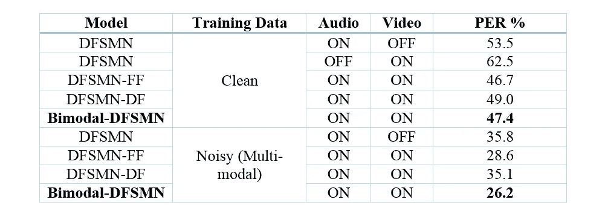
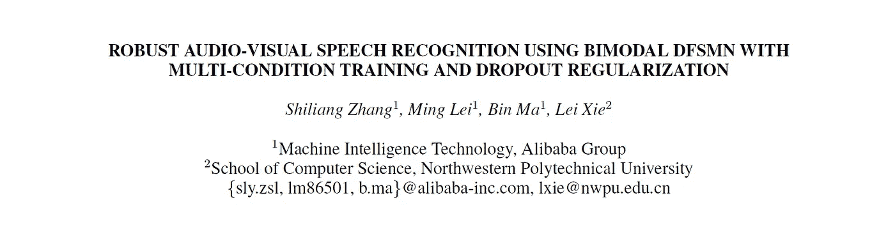

# 我明白你的意思:从纯音频到视听语音识别

> 原文：<https://medium.com/hackernoon/i-see-what-youre-saying-from-audio-only-to-audio-visual-speech-recognition-25ab6e0f0b4a>

*本文是*[***Academic Alibaba***](/@alitech_2017/academic-alibaba-b56f4176a838)*系列的一部分，摘自 ICASSP 的论文，题为“使用具有多条件训练和退出正则化的双峰 DFSMN 的鲁棒视听语音识别”，作者是张世良、雷明、马斌和谢磊。全文可以在这里阅读***。**

*自动语音识别(ASR)是一个近年来取得巨大进展的领域——现在可用的大量语音操作智能手机助手就是这一事实的证明。然而，在嘈杂环境中理解语音的能力是机器仍然远远落后于人类的一个领域。*

*为什么？首先，传统的纯音频语音识别模型没有视觉信息的优势来帮助破译所说的内容。(换句话说，与人类不同，它们不能读唇语。)这种识别促使研究人员探索视听语音识别(AVSR)的方法，但这仍然是一个相对较新的领域。一方面，由于缺乏公开可用的视听语料库来训练和测试新系统，另一方面，由于先进的神经网络模型的采用缓慢，进展受到了阻碍。*

*现在，随着近年来新 AVSR 语料库的出现，阿里巴巴科技团队与西北工业大学合作，提出了一种新的方法。*

# *睁大眼睛，竖起耳朵*

*该团队方法的一个关键方面是采用纯音频语音识别领域的最佳实践，并将其应用于 AVSR。*

*虽然现有的 ASVR 模型使用相对简单的深度神经网络，但最新的纯音频模型使用更强大的神经网络，能够对语音信号中的长期依赖性进行建模。例子包括长短期记忆递归神经网络(LSTM-RNNs)、时间延迟神经网络和前馈顺序记忆网络(FSMNs)。*

*该团队采用了一种称为深度 FSMN (DFSMN)的 FSMN 变体，并复制了该架构来处理音频和视觉信息。*

**

*Bimodal DFSMN offers an optimal approach to integrating audio and visual information*

*称为双峰 DFSMN 的新模型通过音频网络和视觉网络独立地捕获音频和视觉信号的深度表示，然后将它们连接在一个联合网络中。通过这种方式，该模型实现了声音和视觉信息的最佳整合。*

# *提高噪音*

*该模型的进一步改进是引入了多条件训练；即在训练数据中使用各种各样的背景噪声。*

*最新推出的 ASVR NTCD-蒂米特语料库包含了 56 名爱尔兰人的视听记录，除了原始的“干净”记录外，它还包含了每位发言者的 36 个“嘈杂”版本。这些有噪声的版本是通过六种噪声类型(白噪声、牙牙学语、汽车、客厅、咖啡馆、街道)和六种信噪比(SNR)的组合产生的。为了产生多条件训练数据，该团队使用了来自 30 个嘈杂场景的 150 个小时的记录。*

# *弥补盲点*

*该模型相对于其前身改进的最后一个方面是在面对不完整的视觉数据时提供稳健的性能。*

*实际上，ASVR 模型在视频的某些片段中很难捕捉到说话者的嘴部区域。为了解决这一问题，该团队在训练数据中加入了每帧的丢失，以模拟丢失视觉信息的影响，从而提高了模型的泛化能力。*

# *真机唇读？(用于命令)等待下面发表的消息*

*实验结果表明，与以前的模型相比，双峰 DSFMN 取得了显著的性能改善。*

**

*如上表所示，测试中的平均电话错误率(PER)在干净测试和多模态测试期间的所有测试模型中是最低的，甚至前身模型也受益于多模态训练的引入。独立测试证实，每帧丢失可提高高信噪比水平(10%及以上)的性能。*

*但测试也证实，在最纯粹意义上的机器唇读成为可能之前，机器还有很长的路要走:所有模型在纯视频语音识别方面的表现都很差。该团队的结论是，希望该领域的进一步研究将集中在更强大的视觉前端处理和建模上，以提高该领域的性能。*

**

**全文可在此阅读***。***

# **阿里巴巴科技**

**关于阿里巴巴最新技术的第一手深度资料→脸书: [**【阿里巴巴科技】**](http://www.facebook.com/AlibabaTechnology) 。Twitter:[**【AlibabaTech】**](https://twitter.com/AliTech2017)。**