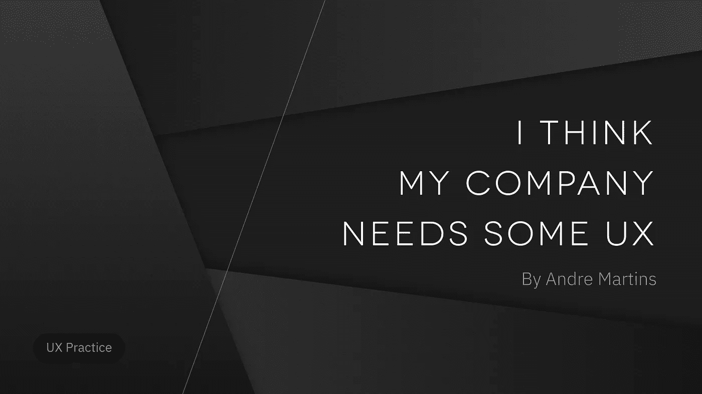
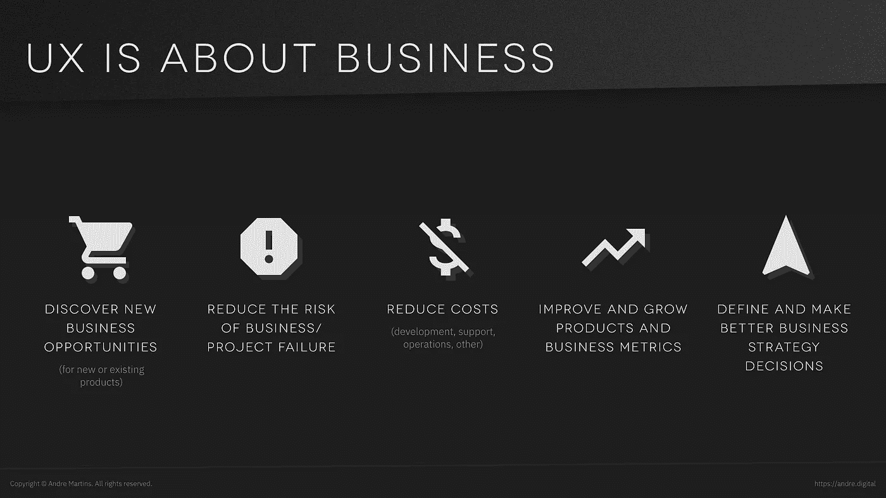

# 我想我的公司需要一些 UX

> 原文：<https://medium.com/hackernoon/i-think-my-company-needs-some-ux-9768d0e9172d>

## 总有一天，一个团队、公司或领导者会开始考虑用户体验(UX)是否会派上用场。

*   有些人从未听说过。
*   有人看到有人在之前的公司做过。
*   有些人的生意就像一颗着火的彗星，他们的产品让顾客吐着岩浆，没人知道该怎么办。

如果这些符合你的情况，我很高兴你在这里。

现在，这不是一个如何成为 UX 设计师的指南。此外，我不打算定义 UX 或解释每个过程的细节。

**这是关于*如何*:如何在公司内部开始做这件事，**通过了解何时做每一个流程以及接近它的方法。

# 让所有人都上船

如果你或团队中的任何人还不知道 UX 的预期结果，我们需要澄清一下。

UX 通过这些**过程**来工作:

*   发现问题、愿望和行为
*   探索问题、愿望和行为的可能解决方案
*   验证这些是否是好的解决方案

所有这些都是遵循**以用户为中心的设计**原则完成的，这意味着用户将是定义产品和业务发展方向的核心要素。

从商业角度来看，UX 可以提供帮助:

*   发现**新的商机**(针对新产品或现有产品)
*   降低**业务/项目失败的风险**
*   降低**成本**(开发、支持、运营、其他)
*   改善和**增长产品和业务**指标
*   定义并做出**更好的商业战略**决策

UX 不一定只是数码产品，但这是采用数码产品的最大市场。

正如我们在这里看到的， **UX 不是为了让事情变得漂亮。**有更多的深度。

# 成功的策略

根据我在公司内部实施以用户为中心的文化的经验，这 4 个原则可以帮助更快地实施 UX 改进:

*   **宝贝步骤:**从小做起。你不需要在第一天就带一个完整的设计团队。做一个流程。一次。看结果。
*   速赢:做一些你能展示成果的事情。快！
*   **唾手可得的果实:**有没有失败风险低、付出的努力/成本低的改进？我们可以采取哪些最简单的行动来改善现状？有什么问题是我们现在就可以开始采取行动的吗？
*   **优先排序:**链条最薄弱的环节是什么？企业最突出的风险是什么？最大的抱怨是什么？每个问题和欲望有多频繁和强烈？什么能为用户和企业创造最大价值？让我们先关注这一点。

# 先有问题，后有解决方案

在深入研究解决方案及其是否有效之前:

*   我们是否清楚用户的问题、需求和行为？
*   是否有一个**书面列表**列出已解决和未解决的问题/愿望？

否则，继续探索解决方案将会产生更多的浪费(时间、资源、金钱)。

这不仅仅是总结产品愿景的核心价值。**我们需要知道*所有*每个*问题的细节。***如果我们真的知道这一点，制作解决方案就会变得简单 10 倍。

这些策略可能比其他策略花费更多的时间，但我不建议公司跳过它，尤其是初创公司。没有什么比建造没人想要的东西更贵的了。

要了解问题:

*   **用户访谈、调查、分析**

之后:

*   **用户故事、人物角色、要做的工作、客户旅程图**

# 我们知道什么，我们不知道什么

在公司内部就我们对现实的确信和假设达成共识是很重要的。

这适用于行为、问题、愿望、解决方案和特征。KWHL 图表将所有事情组织成一个简单的行动列表。

谦虚地接受我们并不知道所有的事情，并使用科学的方法进入探索的心态，我们将在学习过程中快速前进。

为此:

*   **千瓦时图表**

# 对我们产品的健康检查

我们把脉，看血压，得到所有科技能提供给我们的数据。然而，有时我们需要与病人交谈，以发现什么是疾病。

分析能告诉我们*正在发生什么。然而，他们并不总是告诉我们为什么。*

可用性测试是我最喜欢的策略之一。这是我在许多客户那里首先采用的策略之一，因为它适用于所有成功的策略(见上文)。而**它总会产生洞见**，无一例外。

你可以做一个广泛的调查，检查你的全部产品，做一个特定功能的调查(或者更好，特定问题的调查)，甚至检查客户如何使用你的竞争对手的产品。

永远不要执着于自己做出的解决方案。如果失败了，太好了，我们刚刚发现了原因。如果成功了，太棒了，我们进入下一个挑战。

为此:

*   **分析、可用性测试:有节制、无节制、远程**

# 他们正在做！我们开始吧！

> 我们应该看看竞争对手的 UX 吗？

有些公司从不这样做。其他人一直这么做。我个人几乎总是去争取。

UX 试探法为评估带来了一套标准，但是在这样做的时候，**从用户的角度来看。这是最终的裁决。**

*   这项功能/产品是否解决了我的用户的问题和愿望？
*   我的用户关心这个特性/产品潜在的问题/需求吗？

不要只是抄袭。这几乎在所有情况下都失败了，我们永远也不会领导市场。对市场上提供的所有功能进行平均会使我们变得脆弱而不是稳定。同样，我们不应该天真地认为市场领导者是完美的。没有产品是。

为此:

*   **启发式分析、竞争对手分析、可用性测试**

# 探索解决方案

当我们谈论产品时，没有单一的方法来解决用户的问题。所以**在决定选择之前，探索不同的解决方案**很重要。

看待产品也有许多不同的方式。每一种策略都将更侧重于一个方面:线框(屏幕)、用户流(序列)和网站地图(结构)。

人们可以很容易地看到一个线框并理解它，这使它成为一个伟大的开发工具。尽管如此，我还是想说，用户不会看到屏幕的所有细节。他们通常更像用户流一样思考:

> 我有一个想解决的问题(场景)，我将探索解决问题的方法(流程)。

每种产品都将受益于这样或那样的选择。所以，永远把这些都放在你的工具箱里。

为此:

*   **用户流、网站地图、低/高保真线框、原型**

# 结论

我希望这篇文章能帮助你以一种好的方式开始了解 UX。

我们简要介绍了可能的第一步行动以及我们可能面临的风险。UX 幅员辽阔，有许多其他的战略可以探索。

**做产品是一个迭代的过程。**过了一段时间，公司开始注意到这是一条漫长的道路，但在旅程中会有很多进步。UX 可以通过阐明产品的位置和发展方向来帮助定义路线图。

与你拥有的团队、资源和时间一起工作。
今天开始。试试看。看结果。

并迭代。

**希望对你的旅途有所帮助！**希望 UX 能让你更多地了解你的顾客，以及如何为他们制造更好的产品。

# 然后

如果你想提高你的 **UX 技能**或者**成为一名 UX 设计师** :
我推荐你去 Springboard.com 大学学习 UX 课程。这里有一个[的折扣](https://www.springboard.com/invite/3SDL6)。

如果你想看看像这样的 :
的酷**内容，请在[媒体](/@andre_martins)、 [LinkedIn](https://www.linkedin.com/in/andremartinslinkedin/) 或 [Twitter](https://twitter.com/andretweeting) 上关注我。**

**如果你在产品的研究/UX/用户界面/管理方面需要实际帮助:** 在 [LinkedIn](https://www.linkedin.com/in/andremartinslinkedin/) 上添加我并给我发消息。
让我们做出伟大的产品。

您对 LTQ、用户访谈或用户研究有疑问吗？
在下面发评论吧！