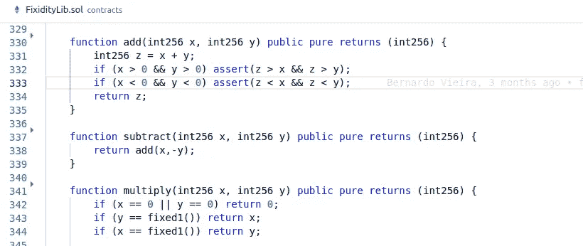
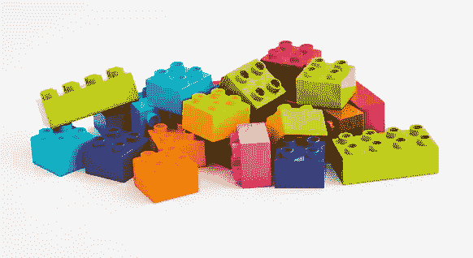

# 我是十几个项目的区块链架构师，这是我学到的东西。

> 原文：<https://medium.com/hackernoon/i-was-the-blockchain-architect-for-a-dozen-projects-and-this-is-what-i-learnt-7a17b36bad02>

## 这真是一次地狱之旅。

Photo by [Stas Knop](https://www.pexels.com/@stasknop?utm_content=attributionCopyText&utm_medium=referral&utm_source=pexels) from [Pexels](https://www.pexels.com/photo/roller-coaster-ride-1172687/?utm_content=attributionCopyText&utm_medium=referral&utm_source=pexels)

> *成功不是终点，失败也不是致命的:重要的是继续下去的勇气。——温斯顿·丘吉尔*

自从我开始担任[技术总部](https://www.techhq.io/)的首席架构师以来，我已经设计了至少十几个区块链应用程序。

我被雇佣后的第一个任务是写一篇关于如何作为一名建筑师开始在区块链工作的文章。迄今为止，它仍然是我最受欢迎的文章，但现在是时候写第二部分了。第一篇文章浓缩了 80 个小时的经验，这一篇超过 1000 个小时。

请继续阅读，找出我认为最有用的技能，因为我把商业想法转化为技术解决方案，在项目中从概念阶段到实施。

# **作为区块链架构师，我实际上是做什么的**

有许多不同类型的[软件架构角色](/@nvashanin/the-path-to-becoming-a-software-architect-de53f1cb310a)，但是我将我的角色描述为:

“我是商业和技术之间的桥梁。我与业务部门沟通，了解他们需要什么，与技术部门沟通，了解什么是可能的。然后，我提出建议，用可用的技术交付给企业，并不断重复，直到我们找到一个可接受的解决方案。在实施过程中，随着挑战的出现，我不断完善这个想法。”

一些人认为架构师的定义特征是他们对技术了解很多，并且有一些领导角色。知道很多关于技术或商业的知识总是有帮助的，但是架构师实际上做的是**理解**和**交流**。我的解决方案设计流程如下:

1.  向双方专家学习。
2.  向另一边的利益相关者解释你学到的东西。
3.  提出解决方案。
4.  回到 1。

Photo by [rawpixel.com](https://www.pexels.com/@rawpixel?utm_content=attributionCopyText&utm_medium=referral&utm_source=pexels) from [Pexels](https://www.pexels.com/photo/person-holding-twist-pen-sitting-on-chair-near-laptop-and-notebook-1451449/?utm_content=attributionCopyText&utm_medium=referral&utm_source=pexels) — I think I get it… You want to sell party hats… On the blockchain…

作为 TechHQ 的架构师，我碰巧知道很多关于区块链的事情，但是对于每个项目，我都必须学习一些新概念。例如，这个月我学习了联合国开发计划署如何为穷人提供服务，以及如何进行原子互换。

*知道很多关于技术或者关于业务的知识总是有帮助的，但是一个架构师实际上做的是* ***理解*******沟通*** *。**

*这种不断学习和提议的过程也意味着大多数时候是错误的。只有在犯了几次错误之后，你才能学到足够的知识，提出一个真正合适的解决方案。*

*如果你想成为一名成功的建筑师，你必须专注于能够学习广泛的学科，理解任何人，并让自己被任何人理解。*

# ***过去一年我学到了什么***

*在过去的一年里，我对区块链了解了很多，但我也学会了如何在任何新的领域成为一名更好的建筑师。如果在某个时候我决定成为一名机器学习架构师，我会遵循同样的道路。我的重点是五个方面:*

*   *获得源源不断的挑战。*
*   *让你周围都是技术专家。*
*   *获取与业务最密切相关的技术的实践知识。*
*   *从每个项目中抽象出高级模式。*
*   *写下你所学到的一切。*

## ***获得源源不断的挑战***

*这可能不是你的运气，但这是我的。我在 TechHQ 的合作伙伴在会议和企业界非常忙碌，这意味着我要不断充实项目。从遥远复杂的“这些家伙想为人工智能建模建立自己的区块链平台和共识算法”，到明确的“这些家伙想用自己的加密货币建立一个在线食品市场”。*

**

*Photo by [Leon Martinez](https://www.pexels.com/@leon-martinez-714926?utm_content=attributionCopyText&utm_medium=referral&utm_source=pexels) from [Pexels](https://www.pexels.com/photo/shirtless-man-lifting-barbell-1552103/?utm_content=attributionCopyText&utm_medium=referral&utm_source=pexels) — How I feel when you tell me you have your own consensus algorithm.*

*这些项目中有许多从未经过概念阶段，但它们都对我有用。我是一个很有效率的书呆子，总是记录我做的每一项任务的时间。我花了 24 小时完成的第一个项目，几个月后我只用了 4 个小时就完成了。*

*我必须制作的材料主要是带有一些图表的文本，有时还有一个代码示例。文本范围从学术解决方案描述到营销宣言。说有时我超出了我的联盟是一种轻描淡写，但无论如何，每个人在大多数时间都超出了他们的联盟。甚至维塔利克。有才华的人不会呆在自己的舒适区。*

*这种广泛的关注是我的训练中发生的最好的事情。*

*   *我了解了在区块链有意义的业务用例与没有意义的业务用例。*
*   *我了解到区块链的技术在哪些领域已经足够成熟，而在哪些领域还不够成熟。*
*   *我学会了识别[模式](https://hackernoon.com/design-patterns-for-cryptocurrencies-10fa92e1dda7)，并利用它们快速提出解决方案。*
*   *我学会了什么时候写作要有说服力，什么时候要精确。*
*   *我遇到了很多人，我可以带着我没有学到的问题去问他们。*

*如果你很幸运，有一大堆挑战等着你，你应该欣然接受。如果你的工作是负责一个单一的产品，你将需要付出额外的努力来引入额外的知识来源。*

## ***让你周围都是技术专家***

*当我加入 TechHQ 时，我意识到区块链的环境是如此不成熟，以至于我可以在几个月内到达学习曲线的顶端。虽然这仍然是真的，但我发现已经不可能了解**关于区块链的一切**。在任何项目中，都需要有人知道这些事情:*

**

*Photo by Pixabay  from [Pexels](https://www.pexels.com/photo/shirtless-man-lifting-barbell-1552103/?utm_content=attributionCopyText&utm_medium=referral&utm_source=pexels) — “Then you do truffle migrate — reset and on the other terminal tab yarn start…”*

***区块链基础设施:**我从了解区块链的基础设施开始。比特币、以太坊、Hyperledger、Quorum、Corda 等很多项目都在这个空间。然而，去年大部分时间我都在做[以太坊](https://www.ethereum.org/)或[法定人数](https://www.goquorum.com/)，偶尔做[超级账本](https://www.hyperledger.org/projects/fabric)项目。现在，我认为对其他平台有一个简单的了解，并在基础设施层面上与人交流就足够了。在接下来的几年里，这里会发生很多事情，所以你需要为最终的重大发展做好准备。*

***区块链开发工具:**在这里，我学会了如何在基本水平上使用 metamask、ganache 和 truffle，仅此而已。在一个项目中，你需要的远不止这些，我很感激我有 [**贝尔纳多·维埃拉**](https://www.linkedin.com/in/obernardovieira/) 似乎知道一切是如何运作的，并且从未停止提供酷的东西([索尔维兹](https://github.com/obernardovieira/solviz)，[索尔多克](https://github.com/HQ20/soldoc))。如果你要编码，你需要以某种方式填补这个空白，由于工具变化的速度太快，这是一个困难的问题。*

*智能合同开发:我学会了编写智能合同，这让我对区块链的机会和发展模式有了更深入的了解。软件开发比开发工具或基础设施更接近于业务方面，所以如果你必须选择哪一个来学习更多，我会把重点放在这一个上。*

***其他技术领域:**云架构、网络、DevOps、测试、前端开发、用户体验、平面设计。有时候你会需要一些帮助，但是大多数时候你最好让别人来做那些非常必要的工作。关注你增加价值的地方。*

***其他项目角色:**如果你在项目管理或团队领导方面做得很差(像我一样)，让别人来做这些角色。初创公司总是缺乏资源，你会发现自己被这些角色拉向架构师角色。如果我必须帮助一个非技术角色，我总是会选择业务分析师，因为它让我更好地理解业务。*

## ***获取实践知识***

*六个月前，Bernardo 让我帮他解决一些困扰他的数学问题，并花了几个小时帮我开发了一个区块链开发环境。当我在专业环境中学习使用 git 时，他会花更多的时间来纠正我的错误。我最终疯狂地为可靠性编写了一个定点数学库，同时我学会了可靠性。*

**

*Still not sure about those asserts.*

*智能契约开发的一个特点是，它迫使你产生简单的代码，至少在以太坊中是这样。在大多数区块链解决方案中，智能合约将少于代码的 10%。我发现，这使得编写智能合约比编写普通软件更容易，因为一旦你编写了一个小内核，其余的就被卸载到前端。*

*作为一名架构师，这对我来说很棒，因为我可以编写概念的紧凑证明，实现解决方案的商业思想，并且在产品中基本保持不变。编码还是很费时间的，所以我只在有时间的时候，项目需要的时候做。作为一名架构师，你的时薪相当高，你需要注意为它提供价值。然而，编码有时是向技术方展示你的意思的最佳方式。*

*智能合同开发让我深入了解了[赌注模式](https://hackernoon.com/implementing-staking-in-solidity-1687302a82cf)、[令牌化](https://hackernoon.com/implementing-asset-ownership-without-tokens-1d5ae0238590)、货币兑换、支付分配和[访问控制](https://hackernoon.com/role-based-access-control-for-the-ethereum-blockchain-bcc9dfbcfe5c)，这些模式在尝试提出商业想法的解决方案时会反复出现。*

## ***从一切事物中抽象出高级模式***

*当我为我的上一个雇主做解决方案架构的时候，我并不重视设计模式。我的大部分时间都花在协商如何将数据从一个地方传到另一个地方，以对抗一百万个相互冲突的利益。我们被指示生产模式，但是从一个项目到下一个项目几乎没有什么可以重用的。*

*创造新产品的时候就是模式变得有用的时候。“你的智能电表公司想和区块链合作吗？物联网数据收集、数据注册、支付流程和控制模块将允许您根据支付情况打开和关闭计量表，我们为 X、Y 和 Z 做了这方面的工作。“你想要一个密码驱动的食品市场？你需要自己的加密货币，但你有分散和集中市场的选择，让我们看看”。*

**

*I do blockchain. With blocks.*

*将解决方案分解成[通用模式](https://hackernoon.com/design-patterns-for-cryptocurrencies-10fa92e1dda7)可以让您快速思考特定用例的技术机会，并引导您与业务所有者的讨论。这对架构师来说非常重要，你需要向业务方解释你的提议是什么，用他们能理解的术语，分解它对每个人都有帮助。*

## ***写下你学到的一切***

*我过去常常在架构师角色描述中读到我需要展示思想领导力。不知道那到底是什么意思。我也一直想写东西，但没有太多的话要说。这两件事是如何结合在一起成为我工作的支柱的，真是令人惊讶。*

**

*I would be kicked off to the street if I would write my articles with this.*

*作为一名架构师，你被认为是一名领导者，但在项目的开始阶段，情况并非如此。对于最初的几次迭代，您将从业务和技术方面学习，以便您可以提出解决方案。当那些迭代没有让每个人都满意就结束时，你需要成为领导者，你需要在涉众之间达成妥协..*

*通过频繁地写作，你不仅可以提炼出自己的想法和论点，而且这些文章也可以证明你知道自己在说什么。你不希望人们盲目地跟随你，你肯定不希望使用你知道你的东西和其他人应该闭嘴的论点，但第一印象很重要，往往你写的就是那些第一印象。*

*作为一名建筑师，学习写作的另一个好处是，我所有的项目都是以书面形式交付的。可能会有代码，会有很多很多的讨论，但最终，总会有一些文本被带到很远的地方。它被写进白皮书，被提炼成两页纸和一段话。[我现在写了很多](https://hackernoon.com/@albertocuestacanada)，变得越来越容易。这绝对是我今天的主要技能之一。*

# ***结论***

*作为一家新兴软件开发公司的架构师，我已经设计了几十个区块链解决方案，它们都有不同程度的细节和成功。我花了 [80 个小时](https://hackernoon.com/becoming-a-blockchain-architect-in-10-steps-b5945701e9cd)才觉得自己对区块链有了一个想法，并开始设计解决方案。在接下来的一千个小时里，学习的速度越来越快。*

*如果你想听我关于如何成为一名更好的区块链建筑师的建议，我建议你做以下事情:*

*   *确保你有一个**稳定的项目流**进来。每个项目都是一个学习的机会。付费客户、开源合作和你自己的项目都是可以接受的选择。试着不要像以前发生在我身上的那样，一年陷入 3 个项目中。*
*   *和比你更有能力的人在一起**。如果你是一个团队的一部分，或者是许多团队的一部分，你将能够专攻架构，并获得更广阔的视野。***
*   ***如果你想变得书呆子，选择**智能合同开发**而不是其他技术技能。所有技能都很重要，但对区块链来说，智能合同是最接近商业逻辑的技术组成部分，也最有可能有助于缩小商业计划和技术机会之间的差距。***
*   ***试着把事情搞清楚。我尝试开发一个[记号经济学框架](https://hackernoon.com/designing-a-token-economy-how-to-choose-an-economic-goal-224b2643576a)。我尝试过创建设计模式。每天，试着**找到分类信息的新方法**和你做的事情。高水平的愿景是关键。***
*   *****把你学到的东西写出来**，不管有没有人看。你需要能够在许多不同的场合清楚地表达自己，这取决于你的听众是谁。你需要对有很多页的文本要写感到舒服。***

***这是一次地狱之旅。感谢您阅读这一切，请随意评论并继续对话。我总是乐意帮忙。***