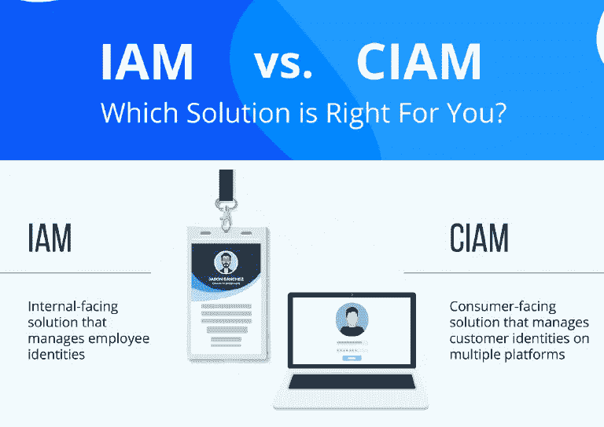
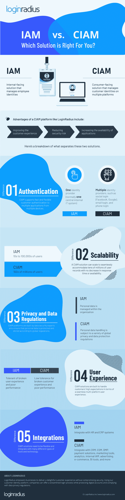

# IAM 和 IAM 信息图]——哪一个更适合你的企业？

> 原文：<https://medium.com/hackernoon/iam-vs-ciam-infographic-which-one-is-better-for-your-enterprise-6fa32d70c176>

Source: LoginRadius

身份管理发展如此之快，以至于它不仅服务于您的内部员工，也服务于您的客户。

传统的身份访问管理(IAM)系统旨在管理员工及其在工作场所的身份。然而，IAM 系统不能很好地确保良好的用户体验或客户期望。随着消费者的需求年复一年地不断增长和发展，需要一个系统来满足需求变得比以往任何时候都更加重要，而当前的 [IAM 系统](/@laura.nutt088/top-8-identity-and-access-management-solutions-in-australia-dfd399791ce9)并不是为满足消费者的需求而设计的。

如今，消费者期望在所有设备和平台上获得无缝、简单的体验，如果没有这种体验，客户就不太可能使用你的产品和服务。

传统的[身份和访问管理解决方案](https://hackernoon.com/5-steps-to-choose-the-best-iam-solution-for-your-organisation-be29244a888e)用于管理内部员工身份、跨平台和内部程序的员工权限、报告、审批工作流以及组织内的所有其他安全功能。

然而，组织似乎认为尝试使用 IAM 系统来管理客户身份同样有效，但是我们了解到，这些 IAM 系统不具备在面向消费者的平台上正确管理数千甚至数百万用户的能力。

因此，需要一个[客户身份和访问管理](https://www.loginradius.com/blog/2019/06/customer-identity-and-access-management/)系统。CIAM 解决方案旨在专门管理面向客户的一切。这包括全球范围内的客户身份验证、隐私和数据法规等功能。

因此，当您将 CIAM 与 IAM 解决方案进行比较，并考虑实施解决方案来管理您的客户身份的投资回报时，您可以看到它在多大程度上增强了客户体验、增加了客户参与度并降低了安全风险。

在此信息图中，我们看一下 IAM 和 CIAM 解决方案之间的区别:

*   证明
*   可量测性
*   隐私和数据法规
*   用户体验
*   集成

如需了解更多信息，请查看由企业客户身份和访问管理平台 [LoginRadius](https://www.loginradius.com/blog/2019/03/iam-vs-ciam/) 分享的信息图。

Source: LoginRadius