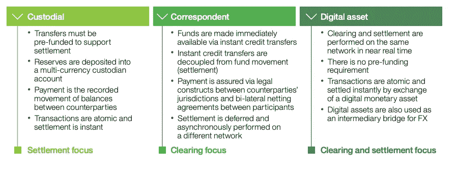
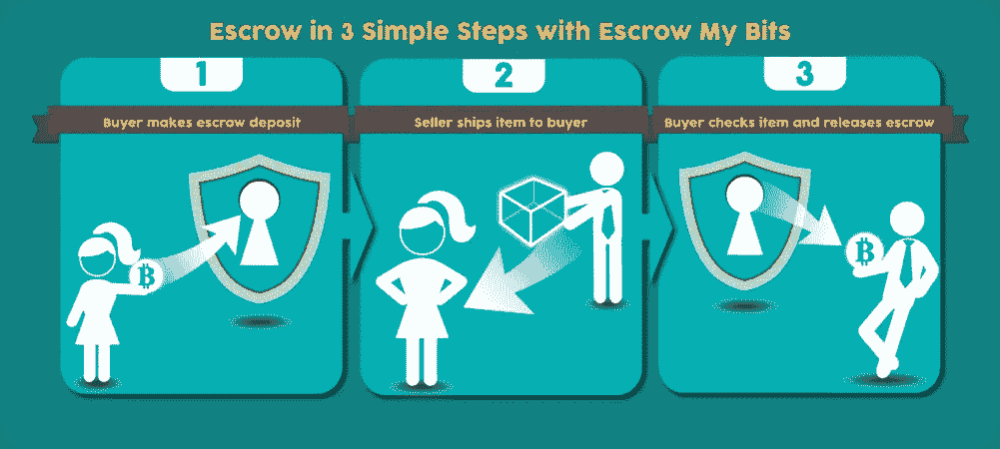
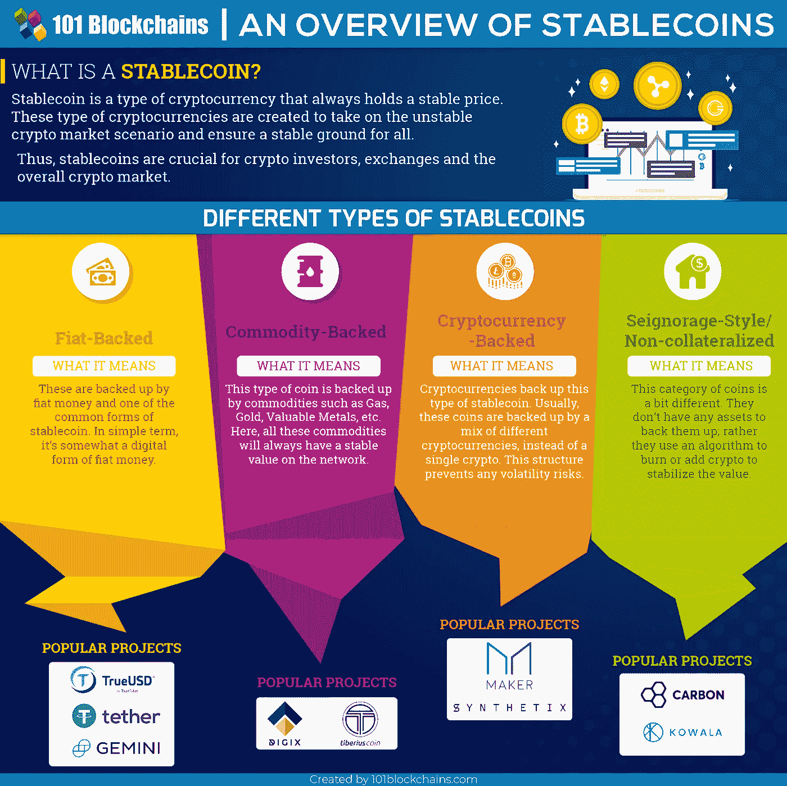
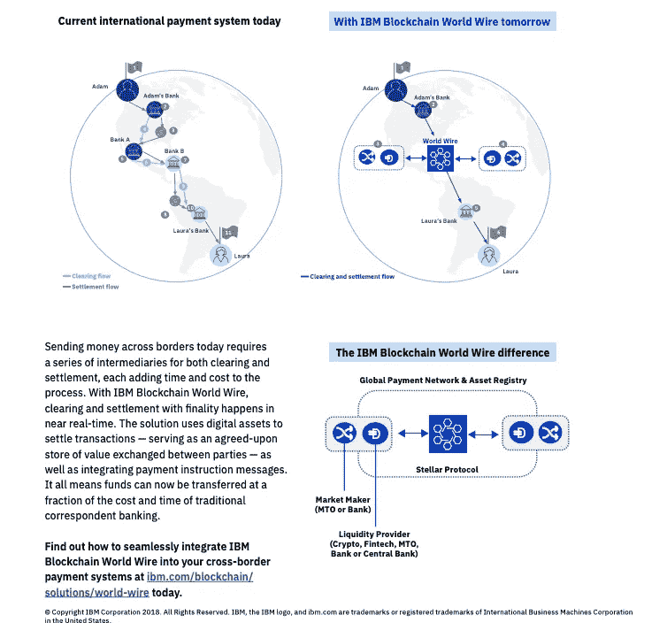
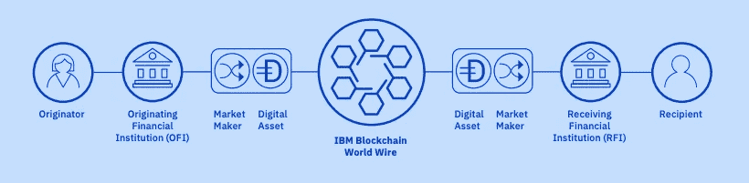

# IBM World Wire:值得大肆宣传还是仅仅是区块链上的 PayPal？

> 原文：<https://medium.com/hackernoon/ibm-world-wire-worth-the-hype-or-simply-paypal-on-blockchain-8c5bc2c42f9d>

(Source: Albello)

当 IBM 宣布其基于“区块链”的解决方案——World Wire，一个基于 Stellar 的国际支付解决方案时，几千人失望地呻吟着。你看， [Stellar 不是区块链](https://hackernoon.com/a-simple-guide-to-understanding-the-stellar-blockchain-network-3609d728e9a7)，是去中心化账本技术(DLT)。简单来说，如果交易不是放在“块”里，就不是区块链。

也许 IBM 的人在推出“基于信任”的以中介为中心的解决方案时忽略了这个小细节。看一下[的介绍视频](https://www.youtube.com/watch?v=fXgwpfvDm5E)，试着数一数信任和集权抬头的次数。

# 什么是 IBM World Wire？

基本上，IBM 已经在两家交易银行之间建立了一个全球网上银行协议。众所周知，如果澳大利亚的 A 想给津巴布韦的 Z 汇款，目前的系统又慢又麻烦，因此，我们都使用贝宝。速度更快，但没有区块链快(如果算上结算的话)。在国际结算中，有三个关键因素:

1.  **消息** —通知发送方和接收方交易状态
2.  **清算** —导致结算的所有中介活动
3.  **结算** —资金到达收款人账户

(Source: IBM Analysis)

PayPal 将上述三个功能集成到一个界面中，而 IBM 的 World Wire 则更进一步，将它们更完整地集成在一起，而不仅仅是通过前端。

由于 IBM World Wire 基本上将所有内容编码成数据位，并将其放在统一的分类账上，因此它面临着密码学中最常见的问题:在不夸大资产价值的情况下进行资产转移。这么想吧。如果我想通过区块链给你发送一幅毕加索的画，我只能转移所有权，而不是实际的资产本身。

(Source: Escrowmybits)

这就是加密令牌发挥作用的地方。我现在可以把这幅画交给第三方托管，而你要把一笔钱(或加密货币)转到第三方托管。现在我们都需要信任契约来促进交易，而不是带着你的钱和我的画逃跑。这听起来可能有些牵强，但埃斯克鲁在战争和冲突时期的这种行为已经臭名昭著。

在 IBM World Wire 生态系统中，它将托管的角色留给了自己，并提高了进入门槛，只允许最知名的金融机构进入。因此，你和我被我们各自的银行所取代，众所周知，它们比其他任何人都精明。

# 为什么 IBM World Wire 需要一个稳定的硬币？

由于这幅画的价格实时波动，正如你我决定用来促进交易的货币的价格一样，IBM World Wire 允许两家银行机构在 Stellar 协议上开发一种稳定的货币，并将其用作中间货币。

(Source: [101Blockchains](https://101blockchains.com/stablecoins/))

例如，如果一家银行，比如我的祖国印度的 A 银行，想把钱汇到海外墨西哥的 B 银行，两家银行都会创造一种新的稳定的币加密货币，叫做‘ABIndico’。印度银行将通过向 World Wire-Stellar 区块链接口支付印度卢比来购买 ABIndico，并在大约 2-7 秒内将其发送到墨西哥。在那里，银行 B 将收到可以转换成预先确定的墨西哥比索(因此是稳定币)价值的 ABIndico。

抛开其他一切因素，该解决方案专注于转移速度和创建资产的便利性(在 Stellar 上创建的加密货币被称为资产)。然而，如果 IBM 能够让各国央行坐到谈判桌前，这种可能性微乎其微，那么，至少对银行而言，世界电讯可以解决一个问题。

(Source: IBM)

# IBM World Wire 如何优于 PayPal？

现在，与贝宝相比，贝宝允许我只用一个电子邮件 ID 就能把钱汇往世界上几乎任何地方。这是对等交易，就其表述而言。IBM World Wire 不是为这种用户对用户的交易而设计的。相反，它一举两得:

1.  通过迎合银行的需求，它已经有了大量用户的基础
2.  通过提高准入门槛，他们避免了对错误交易的补救

此外，由于用户数量相对较少，而转移的资金量要高得多，Stellar 的 100 英镑固定交易费对 IBM 来说是非常小的，足以让 IBM 向银行收取费用，使他们能够节省资金的时间价值。

(Source: IBM)

Stellar 的信用额度概念可以确保没有银行能够将他们的稳定账户发送到错误的账户。PayPal 的情况并非如此，如果错误的交易没有被 PayPal 传奇的欺诈交易捕捉算法捕捉到，就必须通过拨打热线取消交易。

# 世界有线与贝宝的比较公平吗？

诚然，世界电信服务于大型金融机构，而贝宝则被自由职业者用来为他们的商品和服务收取资金。最突出的是对 Stellar 的使用，这是一个 DLT，它诞生于消除集权的愿望——这是 Ripple 的一个关键特征，Ripple 是 Stellar 的思想母公司。就在 IBM World Wire 推出的同时，Stellar 的[价格跃升超过 7%](https://cryptoslate.com/stellar-lumens-jumps-7-3-following-ibm-world-wire-announcement/) 。

IBM World Wire 未说明的成就是将数以千计的清算和结算分类账统一成一个全球分类账。这将进一步减少处理时间，消除潜在的错误。

看看 IBM 的 Jesse Lund 谈论全球支付系统的可能性

(Source: IBM)

另一方面，PayPal 的核心受众是零售客户和小企业主。在这里，交易量高得多，价值却低得多。这又把我们带回了集中化与可扩展性的争论，这个争论不会很快得到解决。

在那之前，让我们享受一下具有讽刺意味的是，基于区块链的解决方案正在实现更大的集中化，而传统公司已经在点对点交易方面取得了长足的进步。

现在，如果贝宝推出自己的加密货币就好了…

如果你喜欢这篇文章，给它几个掌声，在 [LinkedIn](https://www.linkedin.com/in/utsavjaiswal/) 上加我，在 [Twitter](https://twitter.com/utsav_jaiswal1) 上关注我。